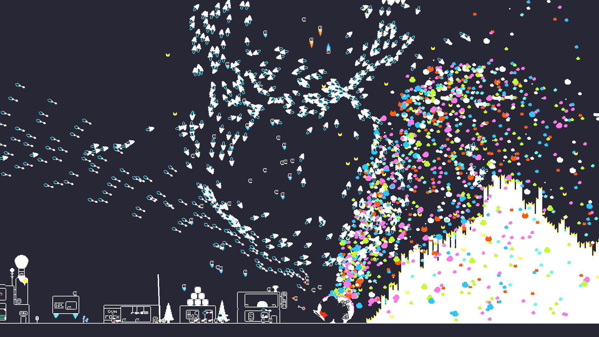
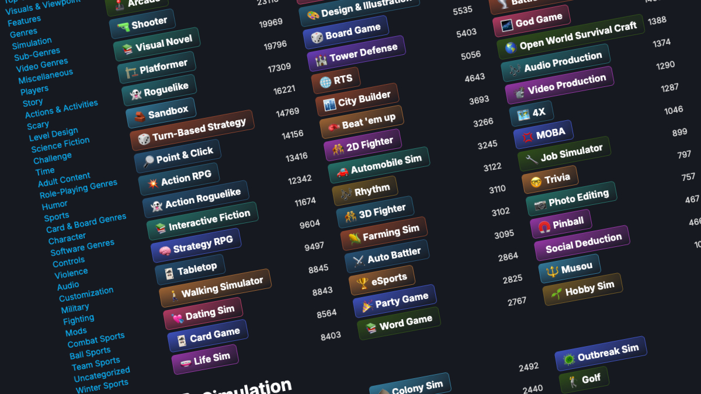

# Cours 4

## Concevoir : la boucle, le scope, le GDD

Tu viens de fabriquer un jeu sans l'avoir conçu. Aujourd'hui, l'inverse : on conçoit avant de construire. C'est la séance la plus « papier » de la session - et probablement celle qui décidera si ton jeu de session sera **fini** en décembre.

Tu as maintenant l'argument qui manque à la plupart des débutants : **tu sais ce que coûte une porte**. Deux séances dans Unity t'ont donné une intuition de la charge de travail. C'est exactement ce qu'il faut pour concevoir quelque chose de réalisable.

<!-- ## Déroulement de la séance

| Temps | Activité |
|---|---|
| 0h00 – 0h20 | Remise et retour de groupe sur les jeux express |
| 0h20 – 0h50 | Retour sur les analyses de jeux : ce qu'on a appris des autres |
| 0h50 – 1h30 | Théorie : la boucle, le scope, la victoire programmable |
| 1h30 – 1h45 | Pause |
| 1h45 – 2h15 | Théorie : les 5 pièges classiques du GDD |
| 2h15 – 3h25 | Atelier : rédaction du GDD de TON jeu, en classe, avec moi dans la salle |
| 3h25 – 3h35 | Devoirs | -->

!!! important "Remise aujourd'hui"
    Le [jeu express](./devoirs/jeu-express.md) (**Évaluation 1 - acquis Unity, 10 %**) se remet au **début de la séance** : lien itch.io + build.

## Retour : ce que vos analyses de jeux ont montré

Vous avez chacun décortiqué un jeu existant ([devoir formatif](./devoirs/gdd.md)). On met en commun 20 minutes - et vous allez constater trois choses, systématiquement :

1. Les jeux que vous aimez ont des boucles **courtes et répétables**, pas des scénarios
2. Leur condition de victoire tient en une phrase
3. Les meilleurs font **peu de choses**, très bien

Ces trois constats sont exactement le programme du reste de la séance.

## Théorie

### La boucle de jeu : des verbes, pas une ambiance

Une **boucle de jeu** (*core loop*) est la séquence d'actions que le joueur répète tout au long de la partie. C'est le cœur battant de ton concept - et c'est ce qui se programme.

> ❌ *« Le joueur explore une forêt mystérieuse et découvre ses secrets »*

C'est une ambiance, pas une boucle. Où sont les **verbes**?

> ✅ *« Le joueur cherche 3 offrandes cachées, les rapporte à l'autel en évitant les zones de brume, et déverrouille le portail »*

!!! tip "Le test des 30 secondes"
    Décris ce que le joueur **fait** pendant les 30 premières secondes de jeu. S'il te faut plus d'une phrase de verbes concrets, la boucle n'est pas encore trouvée.

### La condition de victoire : littéralement une ligne de code

« On gagne quand on a fini » ne se programme pas. Une bonne condition de victoire se traduit directement :

| Formulation vague | Formulation programmable |
|---|---|
| « Explorer le niveau » | « Atteindre la zone de sortie » → `OnTriggerEnter` |
| « Ramasser des objets » | « Ramasser LES 3 gemmes » → `if (gemmes >= 3)` |
| « Survivre » | « Survivre 60 secondes » → `if (chrono >= 60)` |

Même exercice pour la **défaite** : sans possibilité d'échec, il n'y a pas de tension - et le devis du cours demande explicitement la mesure de la réussite **et** de l'échec.

Si tu ne peux pas remplir la colonne de droite pour ton jeu, on le règle ensemble pendant l'atelier.

### Le scope : faisons le calcul ensemble

À partir du cours 5, il te reste **11 séances**, soit environ **22 h en classe + 11 h de devoirs = ~33 heures de production totale**. Pas de quoi faire *Elden Ring*.

Ton avantage sur un studio professionnel : tu peux faire un jeu **petit et fini**. Eux ne peuvent plus.

{data-zoom-image}

[(the) Gnorp Apologue (2023)](https://store.steampowered.com/app/1473350/the_Gnorp_Apologue/) : un développeur **seul**, un seul écran, une seule idée poussée à fond - un succès critique et commercial. Le scope réduit n'est pas un compromis, c'est une stratégie.

!!! important "Les contraintes dures du cours"
    **1 mécanique principale · 1 niveau · assets Synty (POLYGON Sampler Pack) seulement.**

    Ce ne sont pas des limites arbitraires : ce sont les trois décisions qui font qu'un projet étudiant se termine. Le thème et l'univers, eux, sont **entièrement libres**.

### Les 5 pièges classiques du GDD

Chaque cohorte tombe dans les mêmes pièges. Les voici **avant** que tu écrives, pas après.

#### Piège 1 : le jeu trop grand

« Un monde ouvert avec 3 biomes, un système de craft et des donjons. » Relis le calcul ci-dessus. Un studio met des *années-personnes* sur un monde ouvert.

#### Piège 2 : la boucle vague

Le test des 30 secondes, encore. Si ta boucle contient les mots « ambiance », « atmosphère » ou « découvrir » sans un seul verbe d'action, elle n'existe pas.

#### Piège 3 : la victoire implicite

Voir le tableau plus haut. Si ta condition de victoire ne se transforme pas en `if`, ce n'est pas une condition de victoire.

#### Piège 4 : le jeu-film

Un GDD où tout est cinématique, dialogue et retournement narratif… mais où l'interacteur ne fait que marcher entre les moments scriptés. Rappel du cours 1 : la **narration** est un ingrédient du ludisme - mais le devis exige des **actions à accomplir** avec réussite, échec et progression. L'histoire habille la boucle; elle ne la remplace pas.

#### Piège 5 : l'ambiance sans mécanique (ou l'inverse)

Certains GDD ont un moodboard superbe et aucune mécanique; d'autres, une mécanique béton dans un univers générique « château avec des squelettes ». Les deux moitiés doivent se répondre : ta mécanique de lumière appelle un univers sombre; ton univers de plage appelle des mécaniques de marée. Le mariage des deux, c'est ça, un concept.

!!! tip "Le filtre à cinq minutes"
    Les cinq pièges se détectent avec [six questions](./extra/heuristiques.md#les-6-questions-du-gdd) tirées de la grille d'heuristiques qu'on utilisera aux jalons. Passe-les sur ton GDD **avant** de le remettre : si tu bloques sur une seule d'entre elles, on en parle en priorité à ta validation du cours 5.

### Le cahier des charges commun

Ton thème est libre, mais ton jeu devra contenir ceci - et ton GDD doit déjà en tenir compte :

* Environnement navigable construit avec les assets Synty
* Personnage contrôlable
* Système de progression type **clé/porte**
* HUD et indications **visuelles et sonores** des réussites et des échecs
* Échantillons sonores déclenchés par les événements du jeu
* États du personnage détectés et animés
* Menu (titre → jeu → fin)
* Build compilé et **publié en ligne** (itch.io, WebGL) avec README et crédits

Lis cette liste comme un **cadeau**, pas comme une contrainte : c'est la table des matières de ton jeu, déjà écrite.

## Atelier

Rédiger le GDD de ton jeu de session, en classe, pendant que je circule. Sortir d'ici avec un concept qui tient debout.

[Atelier - Le GDD de ton jeu :material-arrow-right:](./exercices/cours04-atelier-gdd.md){ .md-button .md-button--primary }

## Devoirs

  {.aspect-4-3}

  <small>Travail 1 - Conception (10 %)</small> 
  **[GDD de ton jeu de session](./devoirs/gdd-jeu.md){.stretched-link .back}**

* Termine ton [GDD](./devoirs/gdd-jeu.md) - 11 éléments, dont le croquis, le moodboard et les médias cités - **remise au début du cours 5**
* Passe-le au [filtre des six questions](./extra/heuristiques.md#les-6-questions-du-gdd) avant de le remettre
* Repère les prefabs Synty dont tu auras besoin : ouvre le pack et note leurs noms. Si ce que tu imagines n'existe pas dans le pack, mieux vaut le savoir **maintenant**

## Ressources

* [Fill Out a Game Design Document (Unity Learn)](https://learn.unity.com/tutorial/fill-out-a-game-design-document)
* [Writing modern game design documents (Codecks)](https://www.codecks.io/blog/writing-modern-game-design-documents/)
* [Designing the core gameplay loop : a beginner's guide](https://gamedesignskills.com/game-design/core-loops-in-gameplay/)
* [Le pitch de *Diablo* (1994), 8 pages](https://www.graybeardgames.com/download/diablo_pitch.pdf) - le document qui a lancé un des plus gros jeux de l'histoire

## Savoirs essentiels touchés

Notions d'interaction (interacteur, engagement), présentation d'actions à accomplir, mesure de la réussite et de l'échec, progression en fonction de la réussite d'une action - au stade de la conception.
