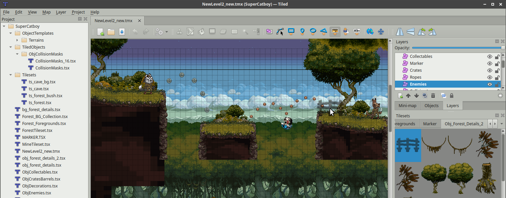
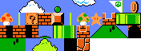
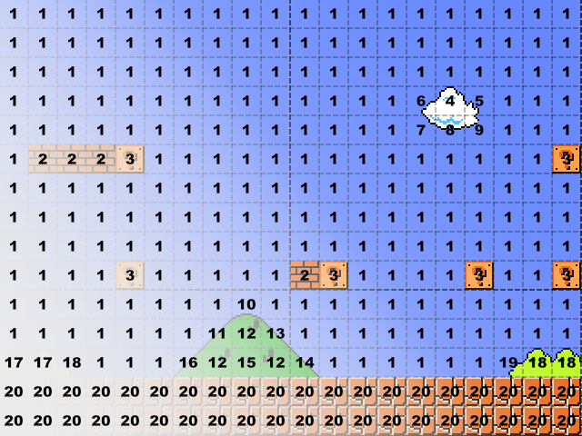
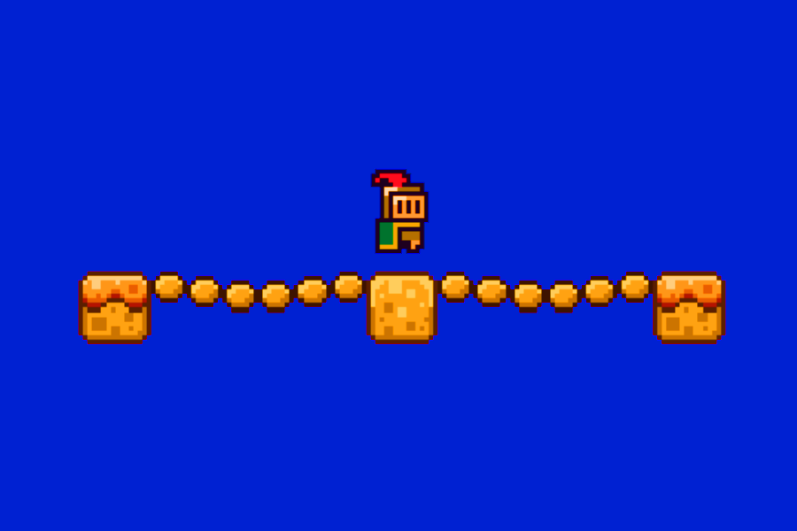
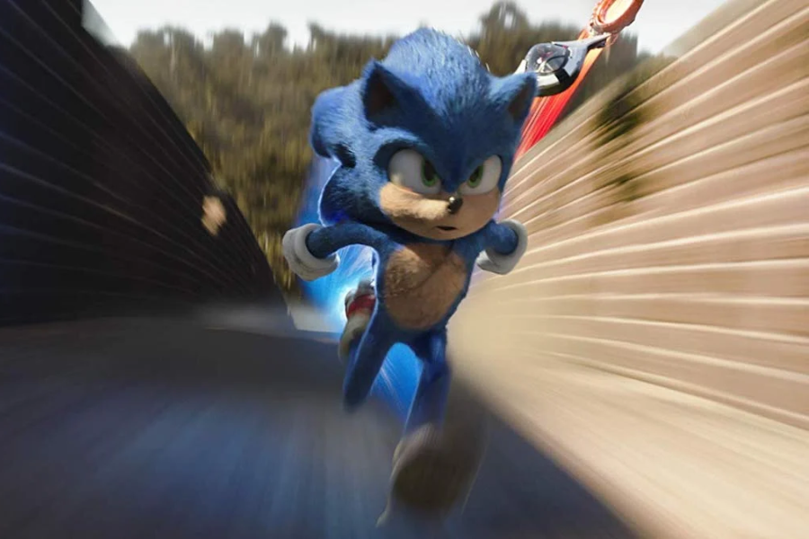

---
tags:
  - Cours 5
  - Mardi 24 septembre
---

# Déplacements 2/2

**Dimensions du jeu vidéo** : Je suggère d'utiliser une résolution maximale de 1280x720 (HD), idéalement **960x600** (WebGL). C'est le bon compromis entre qualité visuelle et performance. De plus, ca doit entrer dans l'interace itch.io.

Variables dans Phaser : `this.ma_variable` ou `let ma_variable` ?

Github :man_shrugging:

## Saut simple

Changement de la zone de collision.

<iframe class="aspect-2-1" height="300" style="width: 100%;" scrolling="no" title="Phaser - Saut" src="https://codepen.io/tim-momo/embed/qBeWxwo?default-tab=result&editable=true&theme-id=50173" frameborder="no" loading="lazy" allowtransparency="true" allowfullscreen="true">
  See the Pen <a href="https://codepen.io/tim-momo/pen/qBeWxwo">
  Phaser - Saut</a> by TIM Montmorency (<a href="https://codepen.io/tim-momo">@tim-momo</a>)
  on <a href="https://codepen.io">CodePen</a>.
</iframe>

```js title="Aperçu"
class Example extends Phaser.Scene {
  preload() {
    // ...
  }

  create() {
    // Plateformes
    this.platforms = this.physics.add.staticGroup();
    this.platforms.create(600, 300, "ground");

    // Joueur
    this.player = this.physics.add.sprite(config.width / 2, 200, "dude");
    this.player.setBounce(0);
    this.player.body.setGravityY(1000);
    this.physics.add.collider(this.player, this.platforms);

    // Contrôles
    this.cursors = this.input.keyboard.createCursorKeys();
  }

  update() {
    // Saut
    if (this.cursors.up.isDown && this.player.body.blocked.down) {
      this.player.setVelocityY(-500);
    }
    // ...
  }
}

const config = {
  // ...
  physics: {
    default: "arcade"
  }
};
```

!!! info "blocked vs. touching"

    `this.monBonhomme.body.blocked.down` est spécifique aux collisions avec des objets statiques ou les bordures du monde (par exemple, le sol ou un mur solide).

    `this.monBonhomme.body.touching.down` détecte toute collision dans la direction bas, que ce soit avec un objet mobile ou statique.

## Double saut

<iframe class="aspect-2-1" height="300" style="width: 100%;" scrolling="no" title="Phaser - Saut double" src="https://codepen.io/tim-momo/embed/xxvKWLa?default-tab=result&editable=true&theme-id=50173" frameborder="no" loading="lazy" allowtransparency="true" allowfullscreen="true">
  See the Pen <a href="https://codepen.io/tim-momo/pen/xxvKWLa">
  Phaser - Saut double</a> by TIM Montmorency (<a href="https://codepen.io/tim-momo">@tim-momo</a>)
  on <a href="https://codepen.io">CodePen</a>.
</iframe>

Si le joueur (this.player) entre en collision avec this.platforms (par exemple, en atterrissant sur une plateforme), une fonction de rappel (callback) sera exécutée.

```js title="create()"
this.jumpCount = 0;
this.jumpKeyReleased = true;

this.physics.add.collider(this.player, this.platforms, () => {
    this.jumpCount = 0;
    this.jumpKeyReleased = true;
});
```

```js title="update()"
// Vérifie si la touche de saut est relâchée
if (this.keys.jump.isUp) {
  this.jumpKeyReleased = true;
}

// Le joueur peut sauter si :
//   - la touche de saut est enfoncée
//     ET
//   - la touche de saut a été relâchée
//     ET
//   - il est au sol OU le nombre de sauts est inférieur à 2
if (this.keys.jump.isDown && this.jumpKeyReleased && (this.player.body.touching.down || this.jumpCount < 2)) {
  this.player.setVelocityY(-500);
  this.jumpCount++;
  this.jumpKeyReleased = false; // Empêche de maintenir la touche pour continuer à sauter
}
```

## Tomber d'une plateforme

<iframe class="aspect-2-1" height="300" style="width: 100%;" scrolling="no" title="Phaser - Tomber d'une plateforme" src="https://codepen.io/tim-momo/embed/XWvrqaw?default-tab=result&editable=true&theme-id=50173" frameborder="no" loading="lazy" allowtransparency="true" allowfullscreen="true">
  See the Pen <a href="https://codepen.io/tim-momo/pen/XWvrqaw">
  Phaser - Tomber d'une plateforme</a> by TIM Montmorency (<a href="https://codepen.io/tim-momo">@tim-momo</a>)
  on <a href="https://codepen.io">CodePen</a>.
</iframe>

Il est possible de désactiver la collision entre deux objets ou ensemble d'objets. C'est exactement ce que nous devons faire pour passer à travers une plateforme.

Lorsqu'on clique sur la touche du saut en même temps que la touche vers le bas, on peut, à ce moment précis, déclencher la désactivation de la collision. Voici comment faire.

```js title="create()"
// Mettre la collision dans une variable
this.playerCollider = this.physics.add.collider(
  this.player,
  this.platforms
);
```

```js title="update()"
// Saut
if (this.cursors.jump.isDown && this.player.body.blocked.down) {
  this.player.setVelocityY(-500);
}

// Tomber à travers la plateforme
if (
  this.cursors.down.isDown &&
  this.cursors.jump.isDown &&
  this.player.body.touching.down
) {
  // Désactivation de la collision et changement de direction
  this.playerCollider.active = false;
  this.player.setVelocityY(300);
} else {
  this.playerCollider.active = true;
}
```

## Collision uni-directionnelle

<iframe class="aspect-2-1" height="300" style="width: 100%;" scrolling="no" title="Phaser - Traverser une plateforme (one-way platforms)" src="https://codepen.io/tim-momo/embed/JjgPvZY?default-tab=result&editable=true&theme-id=50173" frameborder="no" loading="lazy" allowtransparency="true" allowfullscreen="true">
  See the Pen <a href="https://codepen.io/tim-momo/pen/JjgPvZY">
  Phaser - Traverser une plateforme (one-way platforms)</a> by TIM Montmorency (<a href="https://codepen.io/tim-momo">@tim-momo</a>)
  on <a href="https://codepen.io">CodePen</a>.
</iframe>

Parfois, on souhaite que seule la surface du dessus d’une forme détecte une collision. Ça peut rendre l’expérience utilisateur plus fluide et moins restrictive. Pour ce faire, il suffit d’utiliser les propriétés (up, down, right, left) de l’objet `checkCollision`.

```js title="create()"
// Plateformes
this.platforms = this.physics.add.staticGroup();
this.platforms.create(400, 400, "ground");
this.platforms.create(400, 200, "ground");
this.platforms.create(200, 300, "ground");

this.platforms.children.iterate((platform) => {
  platform.body.checkCollision.up = true;
  platform.body.checkCollision.down = false;
  platform.body.checkCollision.right = false;
  platform.body.checkCollision.left = false;
});
```

## Course

<iframe class="aspect-2-1" height="300" style="width: 100%;" scrolling="no" title="Phaser - Course A-D-Shift" src="https://codepen.io/tim-momo/embed/WNVeJgg?default-tab=result&editable=true&theme-id=50173" frameborder="no" loading="lazy" allowtransparency="true" allowfullscreen="true">
  See the Pen <a href="https://codepen.io/tim-momo/pen/WNVeJgg">
  Phaser - Course A-D-Shift</a> by TIM Montmorency (<a href="https://codepen.io/tim-momo">@tim-momo</a>)
  on <a href="https://codepen.io">CodePen</a>.
</iframe>

Pour courir, c’est assez simple : lorsque vous appuyez sur une touche de déplacement, puis simultanément sur la touche Shift, la vélocité du personnage est augmentée. Tout simplement.

```js title="create()"
this.walkSpeed = 150;
this.runSpeed = 400;
```

```js title="update()"
let velocity = this.walkSpeed;

// Si Shift est pressé, on court
if (this.cursors.shift.isDown) {
  velocity = this.runSpeed;
}

// Déplacement
if (this.cursors.left.isDown) {
  this.player.setVelocityX(-velocity);
} else if (this.cursors.right.isDown) {
  this.player.setVelocityX(velocity);
} else {
  this.player.setVelocityX(0);
}
```

## Caméra (introduction)

<iframe height="300" style="width: 100%;" scrolling="no" title="Phaser - Déplacement Physique 1" src="https://codepen.io/tim-momo/embed/LYwYmqp?default-tab=result&editable=true&theme-id=50173" frameborder="no" loading="lazy" allowtransparency="true" allowfullscreen="true">
  See the Pen <a href="https://codepen.io/tim-momo/pen/LYwYmqp">
  Phaser - Déplacement Physique 1</a> by TIM Montmorency (<a href="https://codepen.io/tim-momo">@tim-momo</a>)
  on <a href="https://codepen.io">CodePen</a>.
</iframe>

Si la taille de votre scène dépasse celle de la caméra, vous voudrez sans doute déplacer la caméra en même temps que votre personnage.

Pour ce faire, vous pouvez configurer la caméra pour qu’elle suive le joueur, tout en ajustant les limites X et Y pour empêcher la caméra de sortir de la scène.

```js
// Talonner
this.cameras.main.startFollow(this.player);
this.cameras.main.setZoom(1);
this.cameras.main.setBounds(0, 0, mapWidth, mapHeight); // limites de la caméra

// Limites du monde
this.physics.world.setBounds(0, 0, config.width, config.height);
```

!!! info "Le texte suit aussi la caméra ?"

    En appliquant la fonction `.setScrollFactor(0);` au texte, il n'est pas influencé par le déplacement de la caméra. Très utile un votre HUD :wink::wink::wink:

## Déplacement d'objet

<iframe class="aspect-2-1" height="300" style="width: 100%;" scrolling="no" title="Phaser - Pousser" src="https://codepen.io/tim-momo/embed/wvVvdXN?default-tab=result&editable=true&theme-id=50173" frameborder="no" loading="lazy" allowtransparency="true" allowfullscreen="true">
  See the Pen <a href="https://codepen.io/tim-momo/pen/wvVvdXN">
  Phaser - Pousser</a> by TIM Montmorency (<a href="https://codepen.io/tim-momo">@tim-momo</a>)
  on <a href="https://codepen.io">CodePen</a>.
</iframe>

Pour déplacer des objets, il faut simplement ne pas les assigner en tant qu'élément statique. Voici un exemple.

```js
//...

this.cubes = this.physics.add.group();
const cube1 = this.cubes.create(150, 200, "cube");
const cube2 = this.cubes.create(300, 200, "cube");
const cube3 = this.cubes.create(450, 300, "cube");

this.cubes.children.iterate((cube) => {
  cube.setMaxVelocity(50, 500);
  cube.setDragX(500);
  cube.setGravityY(3000);
});

// Collision de tout avec tout
const allObjects = [this.player, this.cubes, this.platforms];
this.physics.add.collider(allObjects, allObjects);
```

## Tiled :partying_face:



[Tiled](https://www.mapeditor.org/) est un éditeur de niveaux gratuit et open source. Il nous permettera de contruire nos niveau avec une logique de tileset et de tilemap dans Phaser[^tiledphaser].

[^tiledphaser]: Tutoriel d'intégration Tiled dans Phaser : <https://gamedevacademy.org/html5-phaser-tutorial-top-down-games-with-tiled/>

<div class="grid cards align-items-top" markdown>
- **Tileset**

    ---

    Un tileset est une collection d’images, souvent regroupées dans une seule image (spritesheet), contenant de petites images appelées tuiles (tiles).

    

- **Tilemap**

    ---

    Un tilemap est une carte constituée d’un agencement de tiles provenant d’un ou plusieurs tilesets. C’est comme une grille où chaque cellule fait référence à un tile spécifique.

    

</div>

### Perspectives

Jeu de plateforme de type *side-scroller*

<iframe class="aspect-5-3" height="300" style="width: 100%;" scrolling="no" title="Phaser - Tilemap SUite WIP" src="https://codepen.io/tim-momo/embed/vYoYdXJ?default-tab=result&editable=true&theme-id=50173" frameborder="no" loading="lazy" allowtransparency="true" allowfullscreen="true">
  See the Pen <a href="https://codepen.io/tim-momo/pen/vYoYdXJ">
  Phaser - Tilemap SUite WIP</a> by TIM Montmorency (<a href="https://codepen.io/tim-momo">@tim-momo</a>)
  on <a href="https://codepen.io">CodePen</a>.
</iframe>

Jeu en vue de dessus (*top-down*)

<iframe class="aspect-5-3" height="300" style="width: 100%;" scrolling="no" title="Phaser - Tilemap (Side-scroller)" src="https://codepen.io/tim-momo/embed/jOgOzPP?default-tab=result&editable=true&theme-id=50173" frameborder="no" loading="lazy" allowtransparency="true" allowfullscreen="true">
  See the Pen <a href="https://codepen.io/tim-momo/pen/jOgOzPP">
  Phaser - Tilemap (Side-scroller)</a> by TIM Montmorency (<a href="https://codepen.io/tim-momo">@tim-momo</a>)
  on <a href="https://codepen.io">CodePen</a>.
</iframe>

Parmi les perspectives, on compte également la vue **isométrique**, la vue à la **première personne** et la vue à la **troisième personne**, mais ce sont des cas plus rares en 2D.

### Application en Phaser

```js title="preload()"
this.load.tilemapTiledJSON("clefDuTilemap", "./destination/de/votre/export.json");
this.load.image("imageDuTileset", "./destination/de/votre/image.png");
```

```js title="create()"
// Tilemap
const maCarte = this.make.tilemap({ key: "clefDuTilemap" });

// Tileset
const tileset = maCarte.addTilesetImage("nomDuTilesetDansTiles", "imageDuTileset");

// Calques
const bgLayer = maCarte.createLayer("nomDuCalque1", [tileset], 0, 0);
const collisionLayer = maCarte.createLayer("nomDuCalque2", [tileset], 0, 0);
// Si un calque contien des zones de collision (variable custom dans Tiled)
collisionLayer.setCollisionByProperty({ collision: true });

// Par la suite on peut appliquer une collision avec le layer
// Ex: this.physics.add.collider(this.player, collisionLayer);
```

### Demo

## Exercice

<div class="grid grid-1-2" markdown>
  

  <small>Exercice - Phaser</small><br>
  **[Les ponts de la mort](./exercices/bridges.md){.stretched-link}**
</div>

## Devoir

<div class="grid grid-1-2" markdown>
  

  <small>Devoir - Phaser</small><br>
  **[Mouvement](./devoirs/movements.md){.stretched-link}**
</div>
