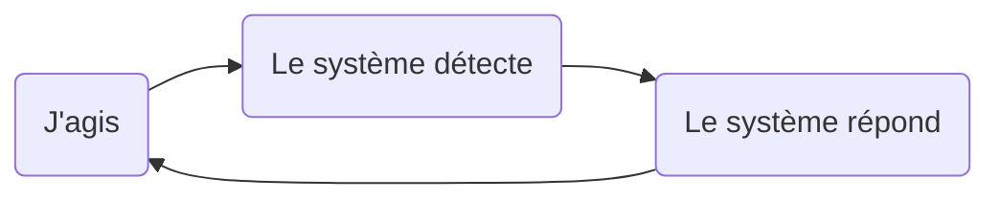
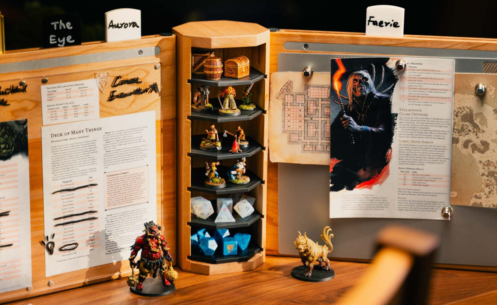
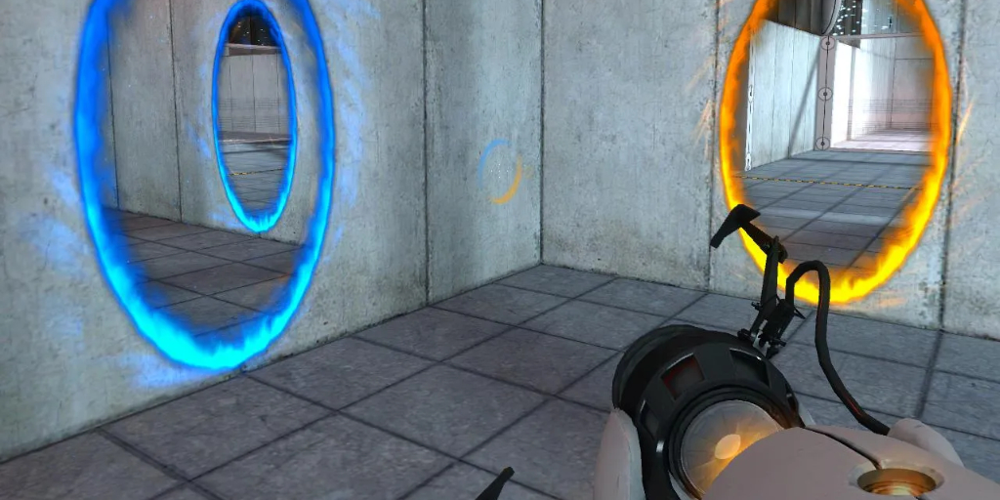
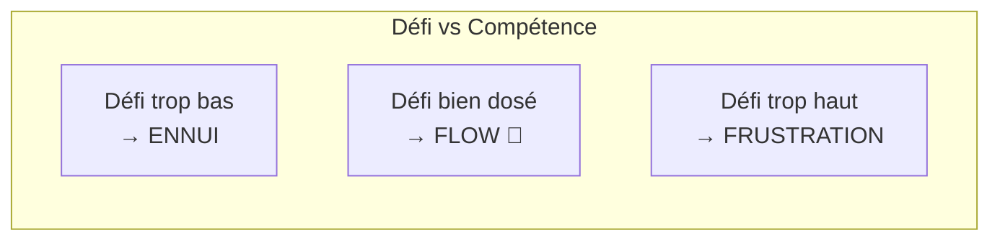
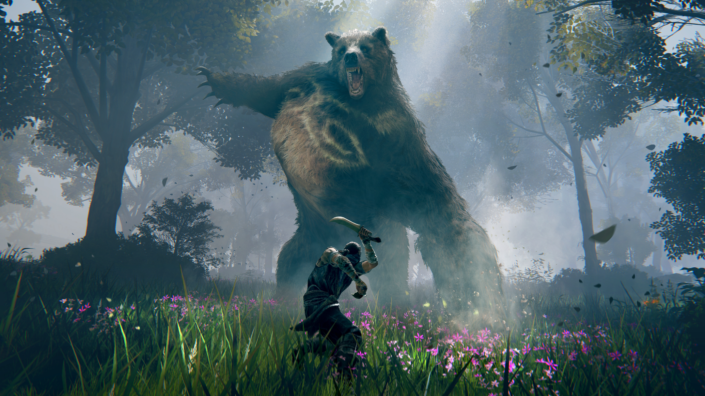
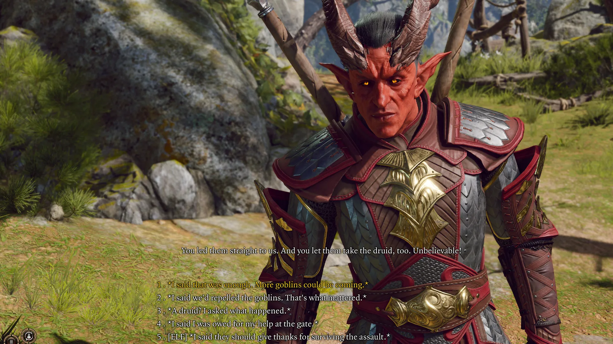
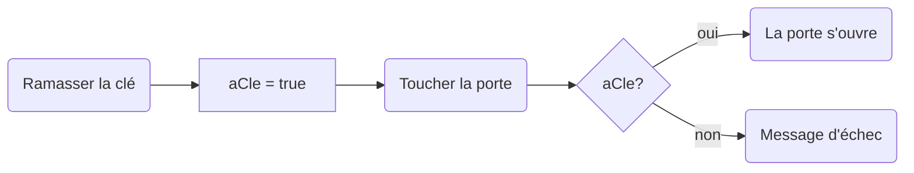

# Cours 5

## Interactions et progression

Le cœur du devis - et du cours : **présenter une action à accomplir, détecter sa réussite, faire progresser l'interacteur**. Aujourd'hui, on comprend ce qui rend une interaction *bonne* (les 4 notions), puis on programme la brique de base de toute progression : le **clé/porte** - par rétro-ingénierie.

<!-- ## Déroulement de la séance

| Temps | Activité |
|---|---|
| 0h00 – 0h15 | Retour : les Debug.Log du devoir, questions |
| 0h15 – 1h30 | Théorie : les 4 notions d'interaction, la détection, le patron clé/porte |
| 1h30 – 1h45 | Pause |
| 1h45 – 3h20 | Pratique : rétro-ingénierie et détournement du clé/porte |
| 3h20 – 3h35 | Rituel de commit + devoirs | -->

## Qu'est-ce qu'une interaction?

Une interaction, c'est une boucle complète entre l'interacteur et le système :

```mermaid
graph LR
    A(J'agis) --> B(Le système détecte)
    B --> C(Le système répond)
    C --> A
```

Si un des trois maillons manque, il n'y a **pas** d'interaction :

* J'appuie sur un bouton et rien ne se passe → pas de réponse : frustration
* Le jeu répond sans que j'aie agi → cinématique, pas interaction
* J'agis, le jeu a détecté, mais ne me le montre pas → le pire cas : l'interacteur croit que ça n'a pas marché

!!! question "Discussion de groupe (5 min)"
    Quel est le plus **petit** jeu possible? Un bouton qui allume une lumière, est-ce un jeu? Qu'est-ce qui manque pour que ça le devienne? *(Indice : un objectif, une possibilité d'échec…)*

## Les 4 notions d'interaction

Ces quatre termes sont ceux du devis ministériel - mais surtout, ce sont quatre **outils de conception**. Pour chacun, demande-toi : « et dans MON jeu? »

### 1. L'interacteur

> La personne qui **agit** dans l'expérience - pas celle qui la regarde.

Au cinéma, on est spectateur : l'œuvre se déroule identiquement qu'on soit là ou non. Dans un jeu, l'œuvre **n'existe pas sans nous** : personne n'appuie sur les touches, rien ne se passe. C'est le renversement fondamental : concevoir un jeu, ce n'est pas raconter des scènes, c'est **concevoir des actions**.

{data-zoom-image}

Dans [Donjons & Dragons](https://fr.wikipedia.org/wiki/Donjons_et_Dragons), le maître de jeu prépare un monde - mais ce sont les joueurs qui décident où aller. Le MJ conçoit des **possibilités d'action**, pas un scénario fixe. C'est exactement ton travail de designer.

**Conséquence pratique pour ton GDD :** relis ta boucle de jeu. Chaque élément doit être un **verbe que l'interacteur exécute** (ramasser, sauter, activer, éviter), pas un événement qu'il subit (« le pont s'effondre », « la musique devient inquiétante »). Les événements existent, mais ils *répondent* aux verbes.

### 2. L'affordance

> Ce qu'un objet **suggère** qu'on peut faire avec lui - avant toute explication.

Le concept vient de la psychologie de la perception (Gibson) et du design d'objets (Norman) : une poignée ronde *appelle* la rotation, une barre horizontale *appelle* la poussée. Quand une porte a une poignée qu'il faut pousser, le design a échoué - on appelle ça une « porte de Norman ».

📺 *À regarder :* [It's not you. Bad doors are everywhere. (Vox, 5 min)](https://www.youtube.com/watch?v=yY96hTb8WgI) - le meilleur résumé du concept en vidéo.

Le jeu vidéo a bâti tout un **langage d'affordances**, que tes joueurs connaissent déjà sans le savoir :

| Convention | Signification apprise |
|---|---|
| Bloc « ? » brillant (*Super Mario*) | Frappe-moi |
| Baril rouge (*à peu près tous les FPS*) | J'explose, tire dessus |
| Objet qui flotte et tourne | Ramasse-moi |
| Rebord peint en jaune (*Uncharted*, *The Last of Us*) | Grimpable |
| Fissure dans un mur (*Zelda*) | Il y a un secret derrière |
| Lumière au bout d'un couloir | Le chemin est par là |

Ce langage est si codifié que la « peinture jaune » fait débat chez les designers : trop d'affordance tue l'immersion, pas assez perd le joueur. Ton curseur à toi : un **petit jeu de 5 minutes n'a pas le temps de perdre son joueur** - assume des affordances claires.

{data-zoom-image}

Dans [Portal (2007)](https://store.steampowered.com/app/400/Portal/), tout le design est une leçon d'affordance : surfaces blanches = portail possible, surfaces sombres = impossible. Le joueur l'apprend en 2 minutes, sans un mot de tutoriel.

!!! example "Mini-activité (5 min)"
    Regarde autour de toi dans le local : trouve **3 affordances physiques** (des objets qui te « disent » comment les utiliser). Puis, dans ta tête, applique le filtre à ton GDD : qu'est-ce qui, dans ton niveau, dira au joueur « viens ici, ramasse-moi, méfie-toi »?

**Dans ton jeu, l'affordance se fabrique avec :** la couleur (contraste avec le décor), la lumière (éclaire ce qui compte), le mouvement (au cours 9, on fera flotter et tourner tes collectables - l'œil est attiré par ce qui bouge), et la position (au centre du chemin = important).

### 3. L'engagement

> Ce qui **retient** l'interacteur dans l'expérience - ce qui fait qu'il continue.

Le modèle classique est celui du *flow* (Csikszentmihalyi) : l'engagement vit dans le couloir entre l'ennui et l'anxiété.

```mermaid
graph LR
    subgraph "Défi vs Compétence"
    A["Défi trop bas<br>→ ENNUI"]
    B["Défi bien dosé<br>→ FLOW 🎯"]
    C["Défi trop haut<br>→ FRUSTRATION"]
    end
```

{data-zoom-image}

[Elden Ring (2022)](https://store.steampowered.com/app/1245620/ELDEN_RING/) vit volontairement à la frontière de la frustration - et le dosage est si précis que surmonter un boss procure une joie qu'aucun jeu facile ne donne. Le défi n'est pas l'ennemi de l'engagement : le défi **mal dosé** l'est.

L'engagement se nourrit aussi de **curiosité** (qu'y a-t-il derrière cette porte?) et de **récompense** (le détour qui contient un trésor). Retiens le principe pour le cours 11 (level design) : *toute curiosité provoquée doit être récompensée*.

**Dans ton jeu :** ta mécanique unique doit avoir une courbe - sa première utilisation est un tutoriel, sa dernière un petit défi. Si ramasser la clé n° 1 et la clé n° 3 sont exactement pareils, l'engagement s'érode.

### 4. L'agentivité

> Le sentiment que ses actions **comptent** - que le monde répond et se souvient.

{data-zoom-image}

Dans [Baldur's Gate 3 (2023)](https://store.steampowered.com/app/1086940/Baldurs_Gate_3/), l'agentivité est reine : les choix modifient l'histoire, les relations, l'issue des quêtes. Mais l'agentivité n'exige pas cette échelle…

L'agentivité existe à deux niveaux :

* **Micro** : chaque action reçoit une réponse immédiate - le bouton s'enfonce, le son confirme, la porte s'ouvre parce que **j'ai** trouvé la clé. C'est l'agentivité que TON jeu doit maîtriser, et elle recoupe le feedback (cours 8).
* **Macro** : mes choix changent la suite (fins multiples, chemins alternatifs). Luxueux, optionnel, hors scope pour cette session.

L'ennemi de l'agentivité, c'est le **faux choix** : deux portes qui mènent au même endroit, un dialogue dont toutes les réponses donnent la même suite. Le joueur le sent - et se désengage.

!!! question "Discussion de groupe (5 min)"
    Une cinématique interrompt-elle l'agentivité? Et un *quick time event* (« appuie sur X pour ne pas mourir »)? Où passe la ligne entre « j'agis » et « j'obéis »?

### Les 4 notions en une phrase

> Un **interacteur** perçoit ce qu'il peut faire (**affordance**), a envie de le faire (**engagement**), et constate que ça compte (**agentivité**).

Ton système clé/porte d'aujourd'hui va cocher les quatre cases. Vraiment.

## Des notions au code : détecter une action

### Rappel et approfondissement : les triggers

Au cours 2, tu as utilisé un trigger sans tout comprendre. Maintenant, le tour complet. Unity t'offre **trois événements** par trigger :

| Événement | Se déclenche… | Analogie |
|---|---|---|
| `OnTriggerEnter` | à l'instant où un objet **entre** | la sonnette |
| `OnTriggerStay` | à **chaque image** tant qu'il est dedans | le détecteur de présence |
| `OnTriggerExit` | à l'instant où il **sort** | le « au revoir » du commerce |

Aujourd'hui on n'utilise que `Enter` - mais garde `Exit` en tête : c'est lui qui permettra « la lumière s'éteint quand je quitte la pièce ».

### Les conditions techniques (à connaître, sinon rien ne marche)

1. Les deux objets ont un **Collider**
2. Celui qui détecte a **Is Trigger** coché
3. Au moins un des deux doit **bouger physiquement** : un Rigidbody ou un CharacterController (ton personnage Starter Assets en a un - c'est pour ça que ça marche!)
4. Le filtre `CompareTag("Player")` évite qu'un ennemi ou un objet qui roule déclenche ta porte

!!! tip "Démonstration en direct"
    Je monte le système devant vous avec un `Debug.Log` dans chaque événement (`Enter`, `Stay`, `Exit`) - regardez la Console : `Stay` spamme des dizaines de messages par seconde. C'est la démonstration physique de `Update()` vs « une fois ».

### Tags et layers : identifier et filtrer

Deux systèmes d'étiquetage que tout projet Unity utilise - et qu'on confond toujours :

| | **Tag** | **Layer** |
|---|---|---|
| Répond à | « Qui es-tu? » | « Avec qui interagis-tu? » |
| Par objet | Un seul | Un seul |
| Usage principal | Identifier dans le code (`CompareTag`) | Filtrer la **physique** (qui collisionne avec qui) et la **caméra** (qui est visible) |
| Exemples | `Player`, `Collectable` | `Ground`, `IgnoreRaycast` |

Créer un tag : Inspector → menu **Tag** → **Add Tag…** → **+** → nomme-le → reviens sur l'objet et **assigne-le** (l'oubli d'assignation est le piège : créer ne suffit pas!).

Les layers, tu les utilises déjà sans le savoir : le champ **Ground Layers** de ton personnage Starter Assets dit au raycast de détection du sol « seul ce qui est sur le layer Ground compte comme un sol ». On y revient au cours 9.

### Le patron clé/porte : la brique de toute progression

Derrière **presque tout système de progression de presque tous les jeux** se cache la même logique :

```mermaid
graph LR
    A(Ramasser la clé) --> B["aCle = true"]
    B --> C(Toucher la porte)
    C --> D{"aCle?"}
    D -- oui --> E(La porte s'ouvre)
    D -- non --> F(Message d'échec)
```

La ligne `aCle = true`, c'est ta première rencontre avec **l'état du jeu** (*game state*) : une variable qui **se souvient** de ce que l'interacteur a accompli. Toute la progression d'un jeu, du plus petit au plus grand, est une collection de variables comme celle-là.

« Clé » et « porte » sont des métaphores. Regarde n'importe quel jeu avec cette lunette :

| « Clé » | « Porte » | Jeu type |
|---|---|---|
| La clé du donjon | La porte du boss | *Zelda* (le patron à l'état pur) |
| Le double saut débloqué | La corniche trop haute | Metroidvania (*Hollow Knight*) - la capacité EST une clé |
| 3 emblèmes ramassés | La statue qui pivote | *Resident Evil* |
| Le boss vaincu | Le pont qui apparaît | à peu près tout |
| L'indice trouvé | Le cadenas à code | *Escape room* |

{data-zoom-image}

Dans [Hollow Knight (2017)](https://store.steampowered.com/app/367520/Hollow_Knight/), la carte entière est un réseau de portes (corniches, murs, abîmes) dont les clés sont des **capacités**. Quand tu obtiens le dash, des dizaines de « portes » s'ouvrent d'un coup, partout. Même patron, échelle géniale.

📺 *Pour aller plus loin :* la série [Boss Keys (Game Maker's Toolkit)](https://www.youtube.com/playlist?list=PLc38fcMFcV_ul4D6OChdWhsNsYY3NA5B2) décortique les donjons de Zelda uniquement sous l'angle clés/portes. Fascinant - et exactement notre sujet.

!!! question "À toi (2 min, dans ta tête)"
    Dans TON jeu : quelle est ta clé? Quelle est ta porte? Si tu ne peux pas répondre en une phrase chacune, on le règle ensemble pendant la pratique.

## Pratique

Faire fonctionner un système de progression fourni, le lire jusqu'à le comprendre, puis le détourner pour ton jeu.

[Exercice - Rétro-ingénierie du clé/porte :material-arrow-right:](./exercices/cours05-cle-porte.md){ .md-button .md-button--primary }

## Devoir

* Ajoute une **deuxième** interaction à ton jeu (le patron est le même - c'est un copier-adapter, pas un recommencer)
* Test d'affordance maison : montre ton écran à quelqu'un 5 secondes et demande « qu'est-ce qui a l'air interactif? ». S'il ne nomme pas ta clé, augmente son contraste

## Ressources

* [Boss Keys - la série sur le design clés/portes (GMTK)](https://www.youtube.com/playlist?list=PLc38fcMFcV_ul4D6OChdWhsNsYY3NA5B2)
* [It's not you. Bad doors are everywhere. (Vox)](https://www.youtube.com/watch?v=yY96hTb8WgI) - l'affordance en 5 minutes
* [Documentation Unity : Collider.OnTriggerEnter](https://docs.unity3d.com/ScriptReference/Collider.OnTriggerEnter.html)

## Savoirs essentiels touchés

Notions d'interaction (interacteur, affordance, engagement, agentivité), interactions virtuelles, détection de collisions pour le déclenchement d'événements, programmation d'un système de clé et de porte, progression en fonction de la réussite d'une action.
