# Cours 5

*[HUD]: Head-up display
*[MVP]: Minimum Viable Product
*[CES]: Collider Event System
*[MSBAF]: Make Something Bad As Fast (as possible)
*[N2H]: Nice 2 Have

## Retour sur Protolude

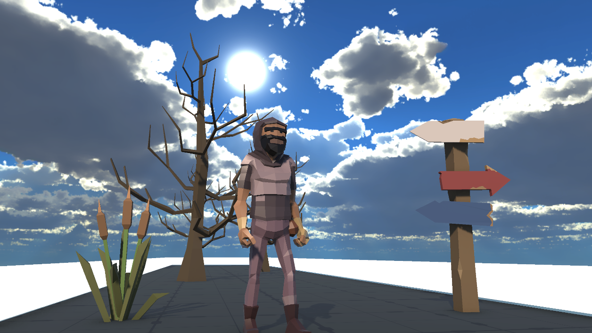{.w-100}

- **Scènes** : Bien nommer les scènes et supprimer/déplacer les scènes qui ne font pas parti du projet.

  > Exemple : Menu, Level 1, Level 2, Game Over, Level Select, etc.

- **Build settings** : Ne pas oublier d'ajouter les scènes dans les Build Settings pour que les transitions fonctionnent.

  - **File > Build profile**
  - Cliquer sur **Scene List**
  - Glisser les scènes de votre jeu dans la section **Scene List**

- **Structure de fichier** : Bien structurer vos dossiers et fichiers de projet sous **_**

  ```txt 
    📂 Assets
    ├── 📂 _
    │    ├── 📁 Animations
    │    ├── 📁 Audio
    │    ├── 📁 Fonts
    │    ├── 📁 Materials
    │    ├── 📁 Prefabs
    │    ├── 📂 Scenes
    │    └── 📁 Scripts
    └── ...
  ```

- **Murs invisibles** : N'utiliser les murs invisibles qu'en dernier recours. Prioriser l'utilisation d'assets (montagnes, bâtiments, etc.) pour délimiter le monde.
- **Homogénéité** : Maintenir une constance visuelle, un contraste trop fort entre une zone très travaillée et une zone vide donne une impression d'inachèvement. Faire plus petit, mais mieux.
- **Principes de design** 
  - Gérer l'espace dans votre Level Design pour laisser le niveau « respirer ».
  {.w-33 data-zoom-image}
  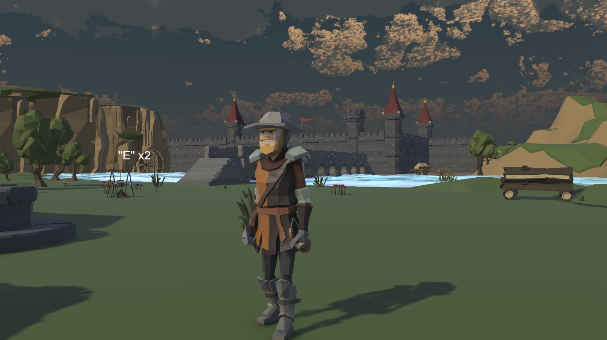{.w-33 data-zoom-image}
  
- **Affordance** : Assurer une motivation claire pour le joueur : il ne suffit pas de placer des objets et d'espérer qu'il devine quoi en faire.
  
  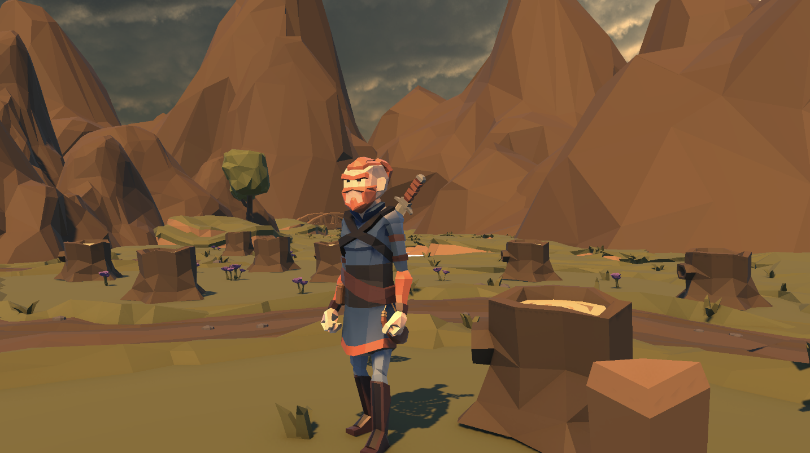{.w-33 data-zoom-image}
  
- **Langue** : Rédiger les textes en français, à moins d'avoir spécifiquement prévu un jeu multilingue.
- **Qualité** : Bien placer le personnage au niveau du sol au démarrage de la scène.
- **Créativité**
  
  {.w-33 .h-auto}

- **Concernant l'IA et les CES** ...

## Greyboxing

{.h-auto}

Équivalent au _wireframe_ en Web, le _greyboxing_ (ou _blockout_) sert à créer une version simplifiée d'un environnement en utilisant des formes géométriques. Ainsi, on peut tester rapidement : 

- **L'agencement spatial** (_Layout_) : Placement des murs, des portes, des points d'apparition des ennemis et des zones de couverture.
- **L'échelle et les proportions** (_Scale_) : C'est le rapport de taille entre le personnage et l'environnement.
- **L'orientation et le déplacement** (_Navigation_) : C'est la façon dont le joueur lit l'espace et s'y déplace. On teste si le chemin principal est intuitif sans avoir besoin de panneaux indicateurs, si les joueurs se perdent ou tournent en rond et si les déplacements sont fluides sans se coincer dans les angles du décor.
- **Le rythme et la fluidité** (_Gameplay Flow_) : On évalue le temps de trajet entre deux points d'intérêt. On s'assure qu'il n'y a pas de temps morts ennuyeux.

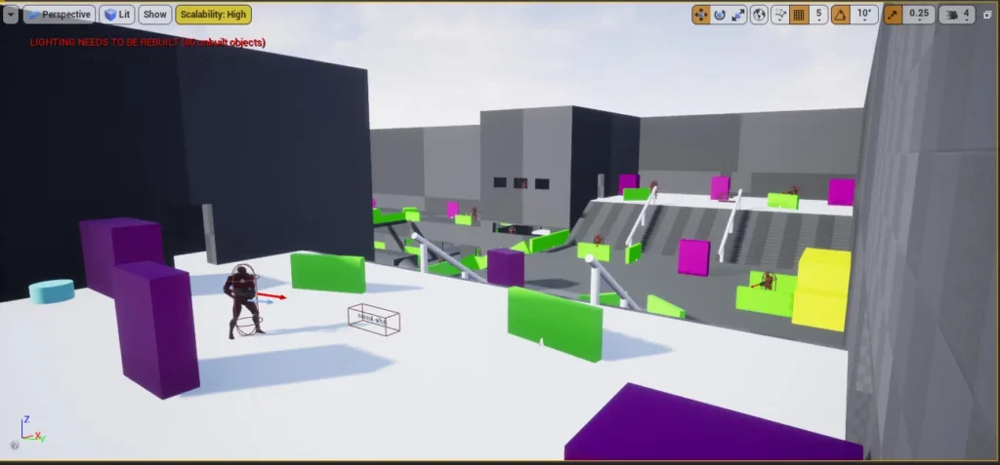{data-zoom-image .w-25}
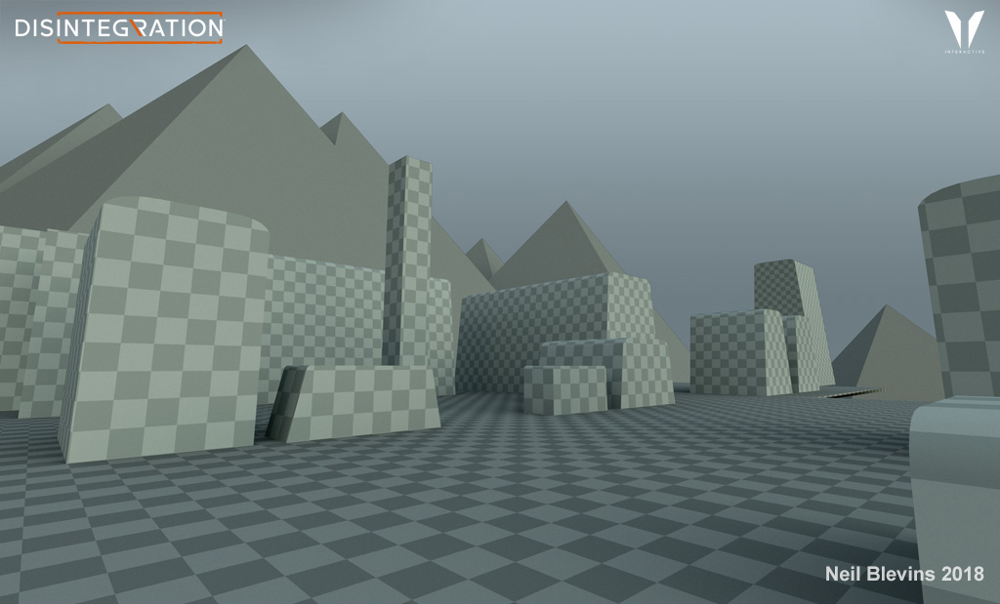{data-zoom-image .w-10}
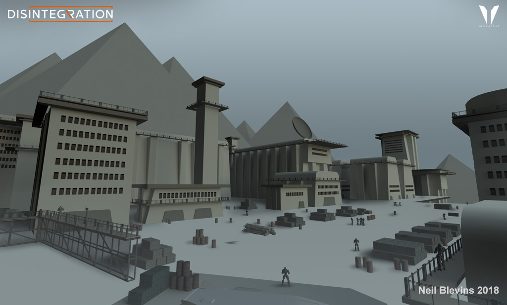{data-zoom-image .w-10}
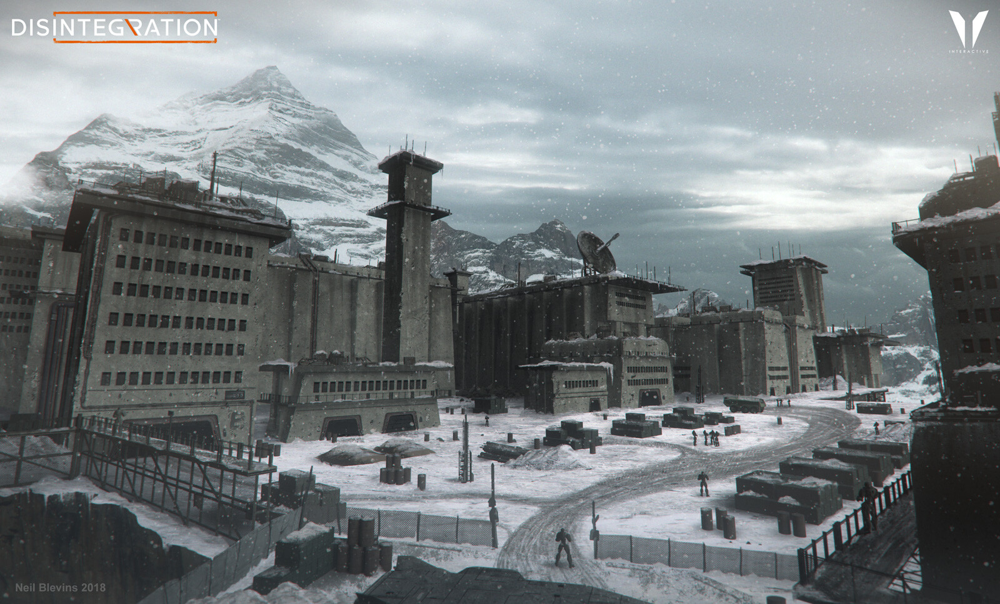{data-zoom-image .w-10}

### ProBuilder

<figure markdown>
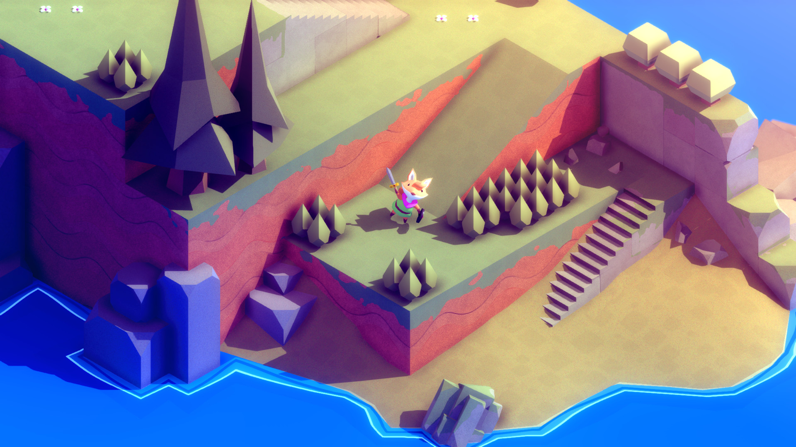{data-zoom-image .w-66}
<figcaption markdown>[Tunic](https://www.gamedeveloper.com/business/how-tunic-weaves-wondrous-unknowable-worlds-inspired-by-inscrutable-nes-manuals)</figcaption>
</figure>

- Dans **Package Manager** cliquer sur **Unity Registry**
- Chercher **ProBuilder** et cliquer sur **Install**
- Il est possible ensuite de créer une forme libre (CP pour Create Polyshape) ou une forme prédéfinie, mais programmable <br>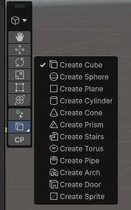{data-zoom-image .w-10}
- On peut exporter les formes en format `.obj`<br>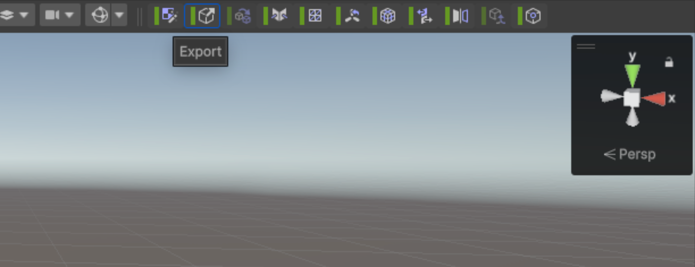{data-zoom-image .w-10}

### Material et shader

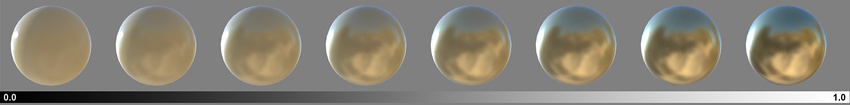

1. Dans le panneau **Project > Assets > _ > Materials**, clic-droit **Create > Material**
1. Configurer (roughness / metallic) et renommer le Material pour le reconnaitre facilement
  - Pour activer la transparence, configurer le **Surface Type** à **Transparent**.
1. Appliquer finalement sur un Mesh Renderer <br>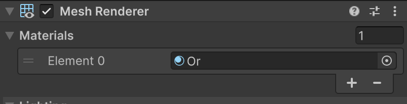{data-zoom-image .w-10}

<!-- Nous aurons l'occasion d'élaborer davantage sur cet aspect au cours de la session. -->

## HUD et menu

<figure markdown>
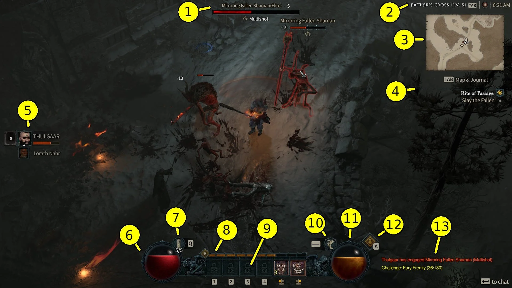{data-zoom-image .w-100}
<figcaption class="small">1-Enemy Information, 2-Location and Time, 3-Minimap, 4-Objectives, 5-Party, 6-Health, 7-Potion Charges, 8-Experience Bar, 9-Hotbar, 10-Dodge Charges, 11-Resource Bar, 12-Unspent Skill Points, 13-Chat Window</figcaption>
</figure>

Ressources : 

- [Itch.io](https://itch.io/game-assets/free/tag-user-interface)
- [Kenney.nl](https://kenney.nl/assets/tag:interface) 🤌
- [Unity Asset Store](https://assetstore.unity.com/)

!!! warning "Assets en anglais 🇬🇧"

    Certains assets viennent avec du texte sur les images. Dans le cadre du cours, il sera demandé de soit trouver des assets sans mots, soit de les franciser.

### Canvas

Dans la **Hierarchy**, clic-droit puis **UI (Canvas) > Canvas**.

Deux objets apparaissent :

- **Canvas** c'est le panneau où vivent tous les éléments d'interface. Pour voir son contour, ne pas oublier d'activer les options : , puis affichez les **Gizmos** 
- **EventSystem** : créé automatiquement, c'est lui qui détecte les clics. Ne jamais le supprimer.

  !!! info "Éditer confortablement"

      Le Canvas est immense par rapport à la scène 3D. Basculer la vue en **2D** : 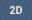

!!! tip "Bonne pratique « Responsive »"

    Sur le Canvas, dans le composant **Canvas Scaler** :

    - **UI Scale Mode > Scale With Screen Size**
    - **Reference Resolution > 2560 × 1440** (écran 2k)

### Panel

Un **Panel** c'est simplement une couche (layer) qui comprend soit une image, soit une couleur. 

Ça peut aussi être simplement un conteneur pour des éléments du UI.

Par défaut, ça utilise une image qu'on peut facilement retirer en choisissant **None** au champ **Source Image**.

### TextMeshPro

Dans la **Hierarchy**, clic-droit sur **Canvas > UI > Text - TextMeshPro**.

À la première utilisation dans le projet, la fenêtre **TMP Importer** s'affiche. 

Cliquer sur **Import TMP Essentials**, puis fermer la fenêtre. (_Examples and Extras_ ne sont pas nécessaires.)<br>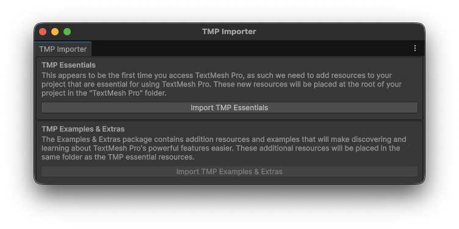{data-zoom-image }

#### Utiliser sa propre police

1. Glisser le fichier `.ttf` dans **Project**, sous **Assets > _ > Fonts**
2. **Window > TextMeshPro > Font Asset Creator**
3. Glisser la police dans le champ **Source Font**
4. **Character Set > Extended ASCII** (nécessaire pour les accents)
5. **Render Mode > SDFAA** (simule une police vectorielle)
6. Cliquer sur **Generate Font Atlas**, puis **Save** dans **Assets > _ > Fonts**
7. Glisser le nouveau **font asset** (le F bleu {.rounded-0}) dans le champ **Font Asset** du texte

!!! warning "Licences"

    Une police téléchargée n'est pas forcément libre de distribution. [Google Fonts](https://fonts.google.com/) est sûr, mais ailleurs (ex. : [Dafont](https://www.dafont.com/)), il faudra vérifier la licence et la citer dans les crédits.

<!-- !!! tip "Réglages utiles"

    Dans le panneau **Inspector** du texte :
     
    - **Auto Size** : le texte s'adapte au cadre
    - Alignement horizontal et vertical
    - **Outline**/**Underlay** si par exemple un texte blanc sur un ciel clair est illisible sans contour -->

#### À propos du cadre

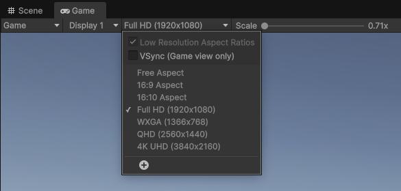{data-zoom-image .w-33}

Dans le panneau **Game**, on peut sélectionner la résolution dans laquelle on planifie faire notre jeu. L'option **Free Aspect** est un peu l'équivalent responsive, mais pour un jeu vidéo, c'est rarement pertinent.

### _Rect Transform_    

Les enfants du canvas n'ont pas de **Transform** comme les autres game objects, ils ont un **Rect Transform** avec un concept d'ancrage qu'il faudra maitriser. 

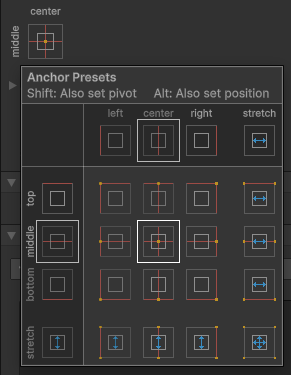{data-zoom-image .w-25}

<p class="codepen aspect-16-9" data-theme-id="50173" data-height="300" data-pen-title="Unity Rect Transform" data-version="2" data-default-tab="result" data-slug-hash="YPZZgKm" data-user="tim-momo" style="height: 300px; box-sizing: border-box; display: flex; align-items: center; justify-content: center; border: 2px solid; margin: 1em 0; padding: 1em;">
  <span>See the Pen <a href="https://codepen.io/editor/tim-momo/pen/01a0c9e6-2f02-7668-b2ed-e184dceceb90">
  Unity Rect Transform</a> by TIM Montmorency (<a href="https://codepen.io/tim-momo">@tim-momo</a>)
  on <a href="https://codepen.io">CodePen</a>.</span>
</p>
<script async src="https://public.codepenassets.com/embed/index.js"></script>

[Ouvrir dans le navigateur](https://es-d-72058649520260925-01a0c9e6-2f02-7668-b2ed-e184dceceb90.codepen.dev)

### Image

1. Dans la **Hierarchy**, clic-droit > **UI (Canvas) > Image**.
1. Glisser une image dans **Assets > _ > Sprites**
1. Cliquer sur l'image
1. **Texture type** = **Sprite (2D and UI)**
1. Clic **Apply**

### Le bouton

Le bouton c'est essentiellement un panel qui contient un textmesh pro, mais il permet en plus de déclencher des actions.

Dans la **Hierarchy**, clic-droit sur **Canvas > UI > Button - TextMeshPro**.

Dans le composant **Button** du bouton : 

1. Cliquer sur le plus **+** sous **On Click ()**
1. Glisser n'importe quel GameObject
1. Choisir **GameObject > SetActive (bool)**. Ça fait l'équivalent du CES quand on active/désactive un Game Object.<br>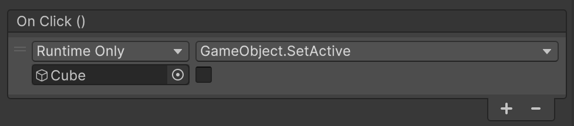{data-zoom-image .w-10}

<!-- !!! quote "Psst. On peut aussi déclencher des scripts custom ;)" -->

#### _9 slicing sprite_
 
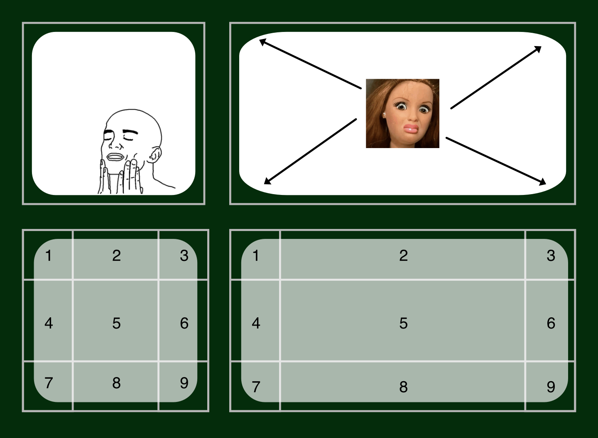{data-zoom-image .w-50}

<!-- https://en.wikipedia.org/wiki/9-slice_scaling -->

1. Trouver une image de bouton carré<br>{data-zoom-image .w-10}
1. Glisser l'image dans **Assets > _ > Sprites**
1. Cliquer sur l'image
  > Cliquer sur **Install 2D Sprite Package** si ce n'est pas déjà installé
1. **Texture type** = **Sprite (2D and UI)**
  - Si l'image est en pixelart, **Filter Mode** = **Point (no filter)**
1. **Sprite Mode** = **Single**
1. Clic sur **Apply**
1. Clic sur **Open Sprite Editor**
1. Glisser les 4 lignes vertes vers le centre de sorte à avoir un centre uni<br>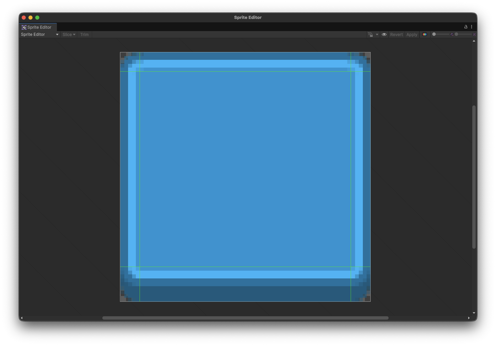{data-zoom-image .w-10}
1. Clic sur **Apply** et ferme le **Sprite Editor**

Dans le panneau **Hierarchy** : 

1. Clic sur un bouton dans le canvas
1. Drag le sprite du panneau **Project** vers **Image > Source Image**
1. **Image type** = **Sliced**

## Scripts

{.w-100}

Les scripts en Unity s'écrivent avec le langage de programmation C# (prononcé «See Sharp»).

Les scripts ont une extension `.cs` et doivent toujours être nommés pareil que le nom donné à la classe : 

```c# title="NomDeMonScript.cs"
using UnityEngine;

public class NomDeMonScript : MonoBehaviour
{

    void Start()
    {
    // (facultatif)
    // La méthode Start est appelée une seule fois avant la méthode Update 
    }

    void Update()
    {
    // (facultatif)
    // La méthode Update est appelée à chaque frame !
    }
}
```

### Variables

En C#, on n'écrit pas de `let` avant une variable. On spécifie son type : 

| Type     | Déclaration          | Assignation               |
| :------- | :------------------- | :------------------------ |
| `int`    | `int age;`           | `age = 25;`               |
| `float`  | `float vitesse;`     | `vitesse = 5.5f;`         |
| `bool`   | `bool estActif;`     | `estActif = true;`        |
| `string` | `string nom;`        | `nom = "Montmorency";`    |
| `Vector2` | `Vector2 vec2;` | `vec2 = new Vector2(1f, 2f);` |
| `Vector3` | `Vector3 vec3;`| `vec3 = new Vector3(4f, 22f, 1f);` |

!!! note "Un `f` après le nombre désigne un float"

Exemple : 

```c#
using UnityEngine;

public class Exemple : MonoBehaviour
{
    bool estActif;

    void Start()
    {
        estActif = true;
    }
}
```

### Ajouter un script

99.99% du temps, vous ajouterez un composant script sur un GameObject.

1. Dans le panneau **Hierarchy**, clic-droit puis **Create Empty**
1. Renommer le GameObject **Exemple**
1. Dans **Inspector**, **Add Component > New Script**, nommer `MonScript`
1. Sauvegarder le fichier `MonScript.cs` dans **Assets > _ > Scripts**

### Éditer un script

1. Double cliquer sur `MonScript.cs` dans **Inspector**<br>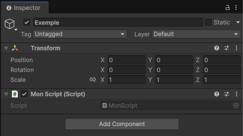{.w-10 data-zoom-image} (Un logiciel d'édition de code devrait s'ouvrir, Visual Studio ou VsCode)
1. Supprimer la méthode `Start()` et déclarer à sa place une variable `int`
1. Dans `Update()` incrémenter la variable de `1`.
1. Afficher le résultat de la variable dans la console avec la commande :<div markdown> 
```c#
Debug.Log("Texte ou autre chose ;)");
```
</div>
1. Play et observe la console Unity !

  ??? quote "Solution"

      ```c#
      using UnityEngine;

      public class MonScript : MonoBehaviour
      {

          int myVariable = 0;

          // Update is called once per frame
          void Update()
          {
              myVariable++;
              Debug.Log(myVariable);
          }
      }
      ```

### Déclencher un script | Button

1. Modifier le script en changeant `void Update()` par `public void TimMomo()`. Cette méthode, n'étant pas reconnue par Unity, ne s'activera que lorsqu'on la déclenchera. Déclenchons-la au clic du bouton dans un canvas.
1. Clic sur le bouton du **Canvas**
1. Dans **Inspector**, sous **Button**, clic sur **+** sous **On Click ()**
1. Glisse le Game Object **Exemple** dans le champs **None (Object)**
1. Clic sur **No Function** > `MonScript` > `TimMomo ()`
1. Play, clic sur le bouton et regarde dans la console

!!! warning "Character controller 💔 Button"

    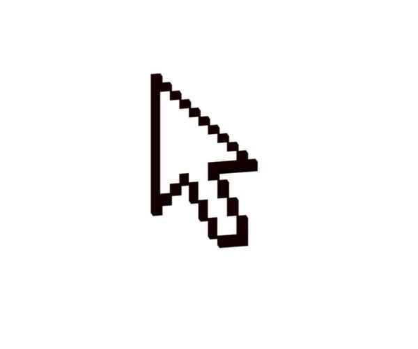{.w-10}

    Quand on utilise un Character controller (première et troisième personne), ça bloque la souris au centre de l'écran et cache le curseur. Ce qui ne permet pas d'interagir avec le canvas.

    À la troisième personne, on peut désactiver le controle de la caméra avec la souris :

    1. Sous **PlayerArmature**, dans la composante **Starter Assets Inputs**, décocher les cases **Cursor Locked** et **Cursor Input For Look**

    Maintenant on peut cliquer sur les boutons du UI

### Changer de scène

Assurez-vous d'abord que la scène en question est dans la **Scene List**.

```c#
using UnityEngine;
using UnityEngine.SceneManagement;

public class MonScript : MonoBehaviour
{
    public string nomDeLaScene = "Niveau2"; // Nom exact ☝️

    public void ChangeLaScene()
    {
        SceneManager.LoadScene(nomDeLaScene);
    }
}
```

## Trello

{.w-100}

Kanban, sprint et 🎉

* Semaine 5 | 24 septembre
* Semaine 6 | 1 octobre
* Semaine 7 | 8 octobre 🏃🏻‍♂️ Sprint 1 : Prototype (MVP)
* Semaine 8 | 22 octobre  
* Semaine 9 | 29 octobre 🏃🏻‍♂️ Sprint 2 : Tranche verticale
* Semaine 10 | 5 novembre  
* Semaine 11 | 12 novembre  
* Semaine 12 | 19 novembre 🏃🏻‍♂️ Sprint 3 : Alpha
* Semaine 13 | 26 novembre  
* Semaine 14 | 3 décembre 🏃🏻‍♂️ Sprint 4 : Beta
* Semaine 15 | 10 décembre 🏃🏻‍♂️ Sprint 5 : Oral

!!! tip "2h max"

    Une tâche qui ne se termine pas en deux heures est trop grosse. Il faut la découper. 
    
    « Faire la zone 2 » n'est pas une tâche. Il faut être précis. Exemple : 

    - « Greyboxing | Zone 2 »
    - « Positionner les assets de végétation dans la forêt | Zone 2 »
    - « Programmer le point d'apparition des 3 ennemis | Zone 2 »
    - « Configurer l'éclairage de la grotte | Zone 3 »

!!! tip "Chemin critique (MVP)"

    [MSBAF](https://might-could.com/essays/the-5-types-of-creative-block-and-how-to-break-through/)

    - Ajouter dans le planning les tâches critiques
    - Catégoriser les souhaits (N2H)

### Sprint 1

Objectifs du prototype (8 oct) : 

- 3 zones parcourables en *greybox*
- Passage entre les scènes : accueil, niveau 1-2-3, gameover
  - Usage du CES

Exemples de cartes : 

- Configurer un repertoire GitHub avec le bon `.gitignore`
- Créer les scènes Accueil, Niveau 1, Niveau 2, Niveau 3 et Game Over, puis les ajouter à la Scene List
- Greyboxing | Zone 1
- Greyboxing | Zone 2 
- Greyboxing | Zone 3 
- Placer le personnage et la caméra dans les 3 niveaux (idéalement faire un prefab pour le réutiliser !)
- Monter le menu d'accueil : bouton Jouer vers le Niveau 1 
- Configurer les conditions de sortie (CES) | Zone 1 
- Configurer les conditions de sortie (CES) | Zone 2 
- Configurer les conditions de sortie (CES) | Zone 3 
- Monter l'écran Game Over (ex. : boutons Recommencer et retour à l'Accueil)
- Tester le parcours complet : Accueil → Niveaux 1-2-3 → fin 

<!-- - Monter le menu pause -->
 <!-- Pause : Time.timeScale, boutons Reprendre et Accueil  -->
<!-- 
!!! success "Prochain cours"

    L'énoncé du travail final sera remis -->