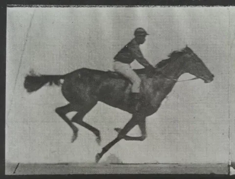
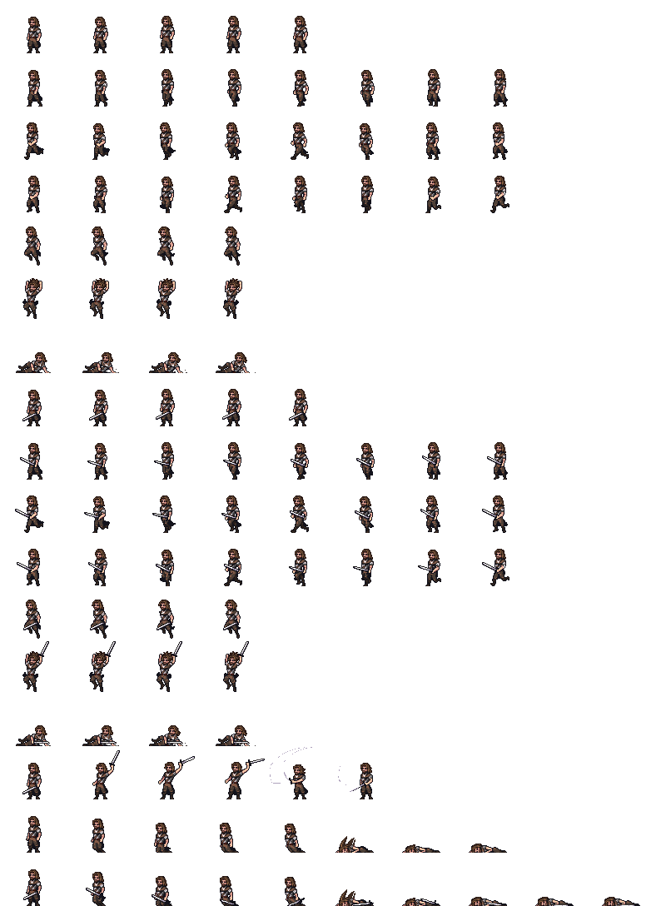
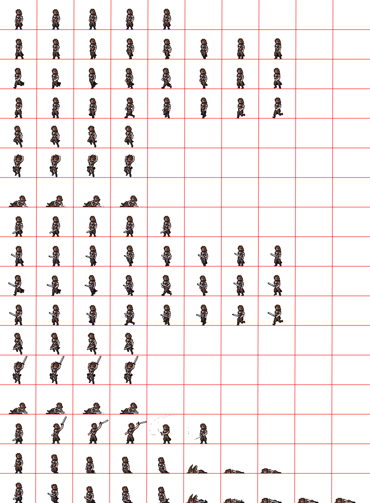
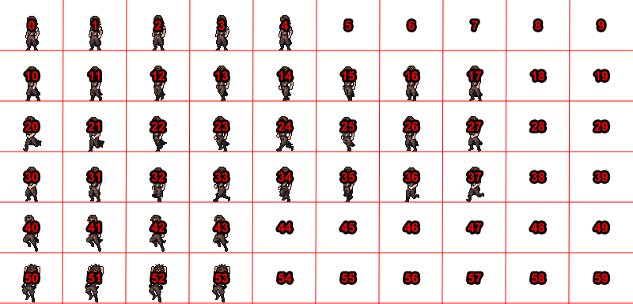
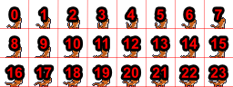
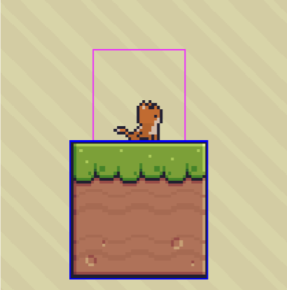
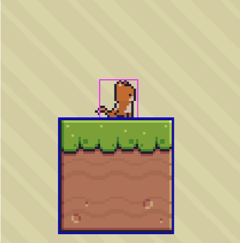
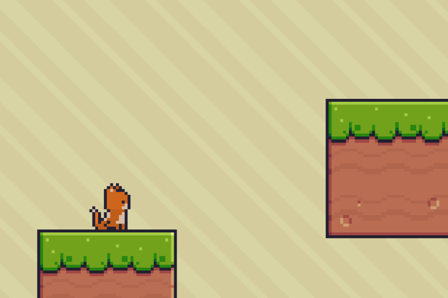

---
tags:
  - Cours 6
  - Mardi 1er octobre
---

# Matrice d'images & états

## Annonces

Devoirs corrigés et commentaires attribués.

Nouvelle directive : Le jeu doit être en fançais. Dans la majorité des cas observés lors de la correction, l'anglais n'est jamais justifié. Francisez tous vos éléments graphiques. Le titre serait idéalement en français, mais je ne l'obligerai pas.

## Caméra

### Position

Pour déplacer la caméra manuellement :

```js
this.cameras.main.setPosition(x, y);
```

Ou pour recentrer sur un point spécifique :

```js
this.cameras.main.centerOn(x, y);
```

### Suivi d’objets

Un des concepts les plus importants est la capacité de la caméra à suivre un objet, comme le joueur dans un jeu de plateforme.

```js
this.cameras.main.startFollow(player);
```

Vous pouvez également personnaliser le comportement de suivi pour donner [plus de contrôle](https://newdocs.phaser.io/docs/3.60.0/focus/Phaser.Cameras.Scene2D.Camera-startFollow) :

```js
this.cameras.main.startFollow(player, true, 0.1, 0.1);
```

Les paramètres 0.1, 0.1 correspondent à la lenteur (lerp) du suivi en X et Y, ce qui permet d’obtenir un effet de retard.

<iframe class="aspect-2-1" height="300" style="width: 100%;" scrolling="no" title="Phaser - Camera setBounds" src="https://codepen.io/tim-momo/embed/QWejoPe?default-tab=result&editable=true&theme-id=50173" frameborder="no" loading="lazy" allowtransparency="true" allowfullscreen="true">
  See the Pen <a href="https://codepen.io/tim-momo/pen/QWejoPe">
  Phaser - Camera setBounds</a> by TIM Montmorency (<a href="https://codepen.io/tim-momo">@tim-momo</a>)
  on <a href="https://codepen.io">CodePen</a>.
</iframe>

### Zoom

Le zoom permet de rapprocher ou d’éloigner la vue de la caméra, ce qui peut être utile lorsque vos tileset sont trop petits.

```js
this.cameras.main.setZoom(2);
```

<iframe class="aspect-2-1" height="300" style="width: 100%;" scrolling="no" title="Phaser - Camera rotate" src="https://codepen.io/tim-momo/embed/zYgrOPe?default-tab=result&editable=true&theme-id=50173" frameborder="no" loading="lazy" allowtransparency="true" allowfullscreen="true">
  See the Pen <a href="https://codepen.io/tim-momo/pen/zYgrOPe">
  Phaser - Camera rotate</a> by TIM Montmorency (<a href="https://codepen.io/tim-momo">@tim-momo</a>)
  on <a href="https://codepen.io">CodePen</a>.
</iframe>

### Rotation

La caméra peut être pivotée, bien que ce soit rarement nécessaire pour les jeux 2D traditionnels, cela peut donner des effets intéressants.

```js
this.cameras.main.setRotation(Phaser.Math.DegToRad(45));
```

<iframe class="aspect-2-1" height="300" style="width: 100%;" scrolling="no" title="Phaser - Camera deadzone" src="https://codepen.io/tim-momo/embed/jOgWNGY?default-tab=result&editable=true&theme-id=50173" frameborder="no" loading="lazy" allowtransparency="true" allowfullscreen="true">
  See the Pen <a href="https://codepen.io/tim-momo/pen/jOgWNGY">
  Phaser - Camera deadzone</a> by TIM Montmorency (<a href="https://codepen.io/tim-momo">@tim-momo</a>)
  on <a href="https://codepen.io">CodePen</a>.
</iframe>

### Zone morte (deadzone)

La deadzone est une zone immobile au centre de l’écran.

Tant que l’objet suivi (par exemple un joueur) reste dans cette zone, la caméra ne bougera pas. Dès que l’objet quitte cette zone, la caméra commence à le suivre à nouveau. Cela permet d’éviter un suivi de la caméra trop “réactif” lorsque le joueur effectue de petits mouvements.

```js
this.cameras.main.setDeadzone(200, 150);
```

<iframe class="aspect-2-1" height="300" style="width: 100%;" scrolling="no" title="Phaser - Camera deadzone" src="https://codepen.io/tim-momo/embed/dyxGbWb?default-tab=result&editable=true&theme-id=50173" frameborder="no" loading="lazy" allowtransparency="true" allowfullscreen="true">
  See the Pen <a href="https://codepen.io/tim-momo/pen/dyxGbWb">
  Phaser - Camera deadzone</a> by TIM Montmorency (<a href="https://codepen.io/tim-momo">@tim-momo</a>)
  on <a href="https://codepen.io">CodePen</a>.
</iframe>

### Limites du mouvement de la caméra

Pour éviter que la caméra ne montre des zones en dehors des limites du monde du jeu, vous pouvez définir une limite au mouvement de la caméra.

Celle limite est souvent déterminée en même temps que la limite du monde, mais les deux notions sont indépendantes.

```js
this.worldWidth = config.width * 2;
this.worldHeight = config.height * 2;
this.physics.world.setBounds(
  this.worldWidth / -2,
  this.worldHeight / -2,
  this.worldWidth,
  this.worldHeight
);

this.cameras.main.setBounds(0, 0, this.worldWidth, this.worldHeight)
```

## Animation sprite

### Qu’est-ce qu’une animation sprite ?

Une **animation sprite** consiste à afficher une série d’images (ou **frames**) dans un ordre spécifique pour donner l’illusion de mouvement. Chaque image représente une étape de l’animation, et lorsqu’elles sont montrées rapidement les unes après les autres, cela crée une animation fluide.

<figure markdown>
  {.w-100}
  <figcaption>Eadweard Muybridge - 1872</figcaption>
</figure>

### Spritesheet

Une spritesheet est une image contenant plusieurs frames.

<div class="grid" markdown>
  {data-zoom-image}

  {data-zoom-image}
</div>

!!! info "Taille d'une image"

    Pour trouver la taille d'un frame, j'ai d'abord trouvé la taille de l'image entière (**800 x 1088**). Vous pouvez rapidement la connaître en sélectionnant l'image dans vscode, puis en bas complètement, dans la barre d'information, vous verrez la taille.

    Ensuite, je compte manuellement la quantité de frame sur l'axe des X et Y.

    L'animation la plus longue fait **10 frames**.

    Il y a **17 animations**.

    Donc, 800 / 10 = 80px de large et 1088 / 17 = 64px de haut; **80 x 64**, voilà la taille d'un frame!

### États d'un personnage

Voici une liste des états typiques d’un personnage dans un jeu vidéo :

* Idle (en attente) :fontawesome-regular-hand-point-left:{ .horizontal-anim .valign-bottom }
* Walking (marche) :fontawesome-regular-hand-point-left:{ .horizontal-anim .valign-bottom }
* Running (course)
* Jumping (saut)
* Falling (chute)
* Attacking (attaque)
* Taking Damage (prendre des dégâts)
* Dying (mort)
* Crouching (accroupissement)
* Swimming (nage)
* Climbing (escalade)
* Blocking (blocage)
* Dodging (esquive)
* Interacting (interaction)
* Casting Spell (lancer un sort)
* Sliding (glisser)
* Stunned (étourdi)
* Celebrating (célébration)
* Using Item (utiliser un objet)
* Sneaking (furtivité)

## Animation sprite avec Phaser

Pour charger une image spritesheet, on doit le spécifier de la manière suivante :

```js
preload(){
  this.load.spritesheet('key', 'path/to/spritesheet.png', {
    frameWidth: 32,
    frameHeight: 32
  })
}
```

* **key** : Identifiant unique
* **path** : Chemin vers l’image du spritesheet
* **frameWidth** : Largeur de chaque frame
* **frameHeight** : Hauteur de chaque frame

### Identifiants des frames

De manière classique, les frames sont numérotés à partir de 0, puis la lecture s'effectue de gauche à droite, puis de haut en bas.

<div class="grid" markdown>
  {data-zoom-image}

  {data-zoom-image}
</div>

Pour sélectionner et afficher un frame spécifique sans animation, on peut le faire de la manière suivante :

```js
this.player.setFrame(3);
```

### Créer une animation à partir du spritesheet

```js
create() {
  this.anims.create({
    key: 'walk',
    frames: this.anims.generateFrameNumbers('player', { start: 0, end: 3 }),
    frameRate: 10,
    repeat: -1
  })

  let player = this.add.sprite(100, 100, 'player')
  player.anims.play('walk')
}
```

* **key** : Nom de l’animation.
* **frames** : Génère une séquence de frames de la spritesheet
* **frameRate** : 10 = frames par seconde.
* **repeat** : -1  pour une animation en boucle.

### Détection de la fin d'une animation

```js
player.on('animationcomplete', function(animation, frame) {
  if (animation.key === 'attack') {
    console.log("L’animation d’attaque est terminée.")
  }
})
```

### Contrôler les animations

* `player.anims.play('walk', true)` : Démarre l’animation “walk”. Le true répond au paramêtre ignoreIfPlaying. Si une animation est déjà en cours d’exécution, cette option permet d’ignorer la demande de rejouer l’animation
* `player.anims.stop()` : Arrête l’animation
* `player.anims.pause()` : Met en pause l’animation
* `player.anims.resume()` : Relance l’animation après une pause

Chaine d’animation : <https://phaser.io/sandbox/?src=src\animation\chained%20animation.js>

### Recâdrer la collision au besoin

On peut redimensionner et de repositionner la zone de collision d’un sprite indépendamment de la taille réelle de son image ou de son animation. Cela peut être utile si l’image contient des éléments qui ne doivent pas affecter la détection de collision.

La méthode `setSize()` permet de définir les dimensions de la zone de collision pour le sprite, sans modifier la taille de l’image.

```js
this.player.setSize(16, 46);
```

La méthode `setOffset()` permet de repositionner la zone de collision du sprite par rapport à l’origine de l’image (généralement le coin supérieur gauche).

```js
this.player.setOffset(32, 18);
```

<div class="grid" markdown>
<figure markdown>
  <figcaption>Collision par défaut</figcaption>
  
</figure>

<figure markdown>
  <figcaption>Collision modifiée</figcaption>
  
</figure>
</div>

## Exercice

<div class="grid grid-1-2" markdown>
  

  <small>Exercice - Phaser</small><br>
  **[Ti chat](./exercices/tichat.md){.stretched-link}**
</div>

## Devoir

Vous devez ajouter toutes les animations sprite à votre jeu.

Ce devoir compte pour **10%** de votre note finale.

### Remise

7 octobre à 23h59

Identifiez votre travail avec la nomenclature suivante :

> [nom de famille]-[prenom]_devoir_05_582-301MO.zip

Déposez votre dossier en format `.zip` sur Teams
