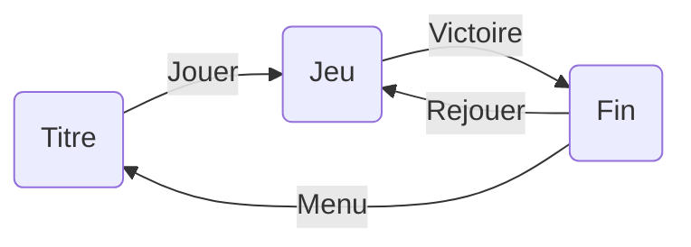

# Cours 6

## Caméra, scènes et menu

Comment le joueur **voit** ton jeu, et comment il y **entre et en sort**. La caméra n'est pas un détail technique : c'est elle qui décide de ce que le joueur sait, ressent et comprend. Et le menu n'est pas de la décoration : c'est la poignée de main de ton jeu.

<!-- ## Déroulement de la séance

| Temps | Activité |
|---|---|
| 0h00 – 0h15 | Retour : les deuxièmes interactions, questions |
| 0h15 – 1h30 | Théorie : la caméra comme choix de design, scènes, interface |
| 1h30 – 1h45 | Pause |
| 1h45 – 3h20 | Pratique : caméra raffinée + flux titre → jeu → fin |
| 3h20 – 3h35 | Rituel de commit + devoirs | -->


## Théorie

### La caméra est un choix de design, pas un réglage

Change la caméra d'un jeu et tu changes le jeu. Le même labyrinthe vu du dessus est un puzzle (je vois le plan), vu à la première personne est un jeu d'horreur (je ne vois rien venir). Chaque genre a son alliance caméra-gameplay :

| Point de vue | Ce que le joueur sait | Genres types |
|---|---|---|
| **Vue de dessus** (top-down) | Le plan complet : stratégie | Zelda classique, jeux de gestion |
| **Vue de côté** (side-scroller) | La trajectoire : précision | Plateformers, *Hollow Knight* |
| **3ᵉ personne** | Son corps dans l'espace | Aventure, action |
| **1ʳᵉ personne** | Seulement ce qui est devant : immersion, tension | FPS, horreur |

<div class="grid grid-1-2" markdown>
{data-zoom-image}

[Hollow Knight (2017)](https://store.steampowered.com/app/367520/Hollow_Knight/) : caméra de côté, orthographique - parce que le jeu EST une affaire de trajectoires et de plateformes. La caméra sert la mécanique.
</div>

<div class="grid grid-1-2" markdown>
{data-zoom-image}

[God of War (2018)](https://store.steampowered.com/app/1593500/God_of_War/) : caméra 3ᵉ personne très rapprochée, à l'épaule - un choix radical pour un jeu d'action, fait pour l'intimité avec les personnages. La caméra sert l'émotion.
</div>

**Et ton jeu?** Ta caméra Starter Assets est en 3ᵉ personne par défaut - mais sa distance et sa hauteur changent tout : proche = tendu et intime, loin = vue d'ensemble et sécurité. C'est le réglage du jour.

### Orthographique vs perspective : les deux projections

| | **Perspective** | **Orthographique** |
|---|---|---|
| Profondeur | Loin = petit (comme l'œil) | Tout à la même échelle |
| Paramètre clé | **Field of View** (angle, en °) | **Size** (demi-hauteur du cadre) |
| Sensation | Espace, immersion | Lisibilité, précision, style graphique |
| Usages | La plupart des jeux 3D | 2D, pixel art, top-down, puzzle, stratégie |

Le devis du cours demande la configuration de la **caméra virtuelle 2D** - c'est la caméra orthographique. Dans Unity, c'est le même composant Camera : un menu **Projection** les sépare. Tu configureras les deux aujourd'hui, et tu garderas celle qui sert ton jeu.

!!! question "Discussion (3 min)"
    *Dixit* du cours 1, *Monument Valley*, *Age of Empires* : pourquoi tant de jeux de réflexion et de stratégie choisissent-ils l'orthographique? *(Indice : que perd-on avec la perspective quand on veut comparer des distances?)*

### Cinemachine : la caméra qui se règle au lieu de se programmer

Une bonne caméra de suivi est étonnamment difficile à programmer (lissage, obstacles, anticipation…). **Cinemachine** est la réponse de Unity : des « caméras virtuelles » qu'on **règle** dans l'Inspector.

Les trois concepts :

* **Virtual Camera (vcam)** : un point de vue configuré - la vraie caméra obéit à la vcam active
* **Follow / Look At** : la cible à suivre / à regarder (ton personnage)
* **Damping** : le lissage - 0 = caméra rigide collée au personnage; élevé = caméra « molle » qui traîne derrière. C'est LE paramètre de feel de caméra

### Les scènes et leur flux

Une **scène** est un contenant : ton niveau en est une, ton écran titre en sera une autre. Un jeu complet, c'est un **flux** :


```mermaid
graph LR
    A(Titre) -->|Jouer| B(Jeu)
    B -->|Victoire| C(Fin)
    C -->|Rejouer| B
    C -->|Menu| A
```

Pourquoi un écran titre, même pour un petit jeu? (1) Le joueur choisit quand commencer - pas de jeu qui démarre pendant qu'on regarde ailleurs; (2) c'est la **première impression** : titre, ambiance, promesse; (3) le devis demande une interface virtuelle (menu) - la voici.

Techniquement : `SceneManager.LoadScene("NomDeLaScene")` - la ligne exacte de ton jeu express. Et la **Build Profiles list** : seules les scènes inscrites peuvent être chargées; la position 0 démarre en premier.

### L'interface : Canvas, EventSystem, boutons

* **Canvas** : le panneau invisible où vivent TOUS les éléments d'interface. Réglage à faire systématiquement : **Canvas Scaler → Scale With Screen Size → 1920 × 1080** - sinon ton interface change de taille d'un écran à l'autre
* **EventSystem** : créé automatiquement avec le Canvas, c'est lui qui détecte les clics. **Ne le supprime jamais** - un menu qui ne répond pas, c'est presque toujours lui qui manque
* **Button** : un bouton a un événement **On Click ()** dans l'Inspector : on y branche une méthode `public` d'un script. Pas de code de détection de clic à écrire - on **branche**, littéralement
* **Événements sans code** : On Click () ne branche pas que des scripts! Glisse n'importe quel GameObject et choisis **GameObject → SetActive** : le bouton peut afficher/masquer un panneau **sans une ligne de code**. Beaucoup de comportements simples (panneau de crédits, aide, image qui apparaît) se font entièrement dans l'Inspector


## Pratique

### 1. Raffiner la caméra de TON jeu

- [ ] Sélectionne la caméra virtuelle Cinemachine de ton personnage (cherche « vcam » ou « PlayerFollowCamera » dans la Hierarchy)
- [ ] Règle la **distance** et la **hauteur** - vise le feel de ton GDD (proche = tension, loin = contemplation). Une valeur à la fois, teste en Play
- [ ] Joue avec le **damping** : essaie 0 (rigide), puis une valeur élevée (flottante). Garde ce qui sert ton ambiance
- [ ] Vérifie dans TON niveau : la caméra passe-t-elle à travers des murs? entre-t-elle dans des espaces serrés? Ajuste ou élargis les passages (métriques!)

### 2. Configuration 2D orthographique (exploration obligatoire - devis!)

- [ ] Crée une nouvelle caméra : clic droit Hierarchy → **Camera**, nomme-la `Camera2D`, désactive temporairement l'autre
- [ ] Dans l'Inspector : **Projection → Orthographic**
- [ ] Place-la au-dessus de ton niveau, pointée vers le bas (Rotation X = 90)
- [ ] Joue avec **Size** : petit = zoom serré, grand = plan large. C'est la configuration caméra 2D du devis
- [ ] Ton jeu serait-il meilleur en vue de dessus? Sérieusement - certains concepts oui! Sinon, supprime `Camera2D` et réactive ta caméra 3ᵉ personne

**Images 2D : sprites et spritesheets.** Si ton jeu est en vue 2D (ou pour tes images d'interface) :

- [ ] Importe une image dans `_Project/Art` → Inspector → **Texture Type → Sprite (2D and UI)** → Apply. Elle devient utilisable dans le monde 2D et dans les Canvas
- [ ] Une **spritesheet** (plusieurs images dans un seul fichier - tu connais le principe du web!) : **Sprite Mode → Multiple** → **Open Sprite Editor** → **Slice → Grid by Cell Size** → Apply. Chaque case devient un sprite individuel (et peut nourrir une animation image par image au cours 9)


### 3. La scène Titre

- [ ] **File → New Scene** → sauvegarde sous `Titre` dans `_Project/Scenes`
- [ ] **UI → Canvas** → **Canvas Scaler → Scale With Screen Size → 1920 × 1080**
- [ ] **UI → Text - TextMeshPro** : le titre de ton jeu - gros, centré
- [ ] **Ta propre police (Google Fonts)** - la police par défaut crie « projet étudiant »; la tienne porte ton ambiance :
    1. [fonts.google.com](https://fonts.google.com) → choisis une police accordée à ton moodboard → **Download** → extrais le `.ttf`
    2. Importe le `.ttf` dans `_Project/Art/Fonts`
    3. **Window → TextMeshPro → Font Asset Creator** → **Source Font File** : ton `.ttf` → **Generate Font Atlas** → **Save** dans le même dossier
    4. Sélectionne ton texte TMP → **Font Asset** : ta nouvelle police
    5. Note la police dans tes **crédits** (les polices ont aussi des licences - celles de Google Fonts sont libres)
- [ ] **UI → Button - TextMeshPro** : texte « Jouer »
- [ ] Habillage : un **Panel** de fond aux couleurs de ton moodboard, ou une capture de ton niveau en image de fond

### 4. Le script de menu (fourni)

- [ ] Crée `MenuManager.cs` dans `_Project/Scripts` :

```csharp
using UnityEngine;
using UnityEngine.SceneManagement;

public class MenuManager : MonoBehaviour
{
    // "public" : pour que les boutons puissent appeler ces méthodes
    public void AllerAuJeu()
    {
        SceneManager.LoadScene("Jeu");
    }

    public void AllerAuTitre()
    {
        SceneManager.LoadScene("Titre");
    }

    public void Quitter()
    {
        Application.Quit();     // Ne fonctionne que dans un build...
        Debug.Log("Quitter!");  // ...d'où ce Log pour tester dans l'éditeur
    }
}
```

**Lecture rapide :** trois méthodes `public void` - aucune magie, chacune une action de menu. Remarque `Application.Quit()` : dans l'éditeur, impossible de « quitter le jeu » - le Log est notre preuve que le bouton marche. Réflexe de pro : toujours un moyen de vérifier.

- [ ] GameObject vide `Menu` dans la scène Titre → attache le script
- [ ] Sélectionne le bouton « Jouer » → Inspector → **On Click ()** → **+** → glisse l'objet `Menu` → menu déroulant → **MenuManager → AllerAuJeu()**
- [ ] ▶️ Teste (le clic doit lancer une erreur « scène pas dans le build » - normal, on la règle à l'étape 6!)

!!! warning "Bouton qui ne réagit pas? Diagnostic en 3 points"
    1. La scène contient-elle un **EventSystem**? (il vient avec le Canvas - si tu l'as supprimé, recrée-le : UI → Event System)
    2. La méthode est-elle branchée dans **On Click ()** (pas « No Function »)?
    3. Un autre élément UI (Panel plein écran!) bloque-t-il le clic? Coche/décoche **Raycast Target** sur les éléments décoratifs

### 5. La scène Fin

- [ ] Nouvelle scène `Fin` : message de victoire + deux boutons - « Rejouer » (`AllerAuJeu`) et « Menu » (`AllerAuTitre`) - même recette, même `MenuManager`
- [ ] Dans ta scène `Jeu` : ta condition de victoire charge maintenant `Fin` (adapte ta ZoneVictoire/porte finale)

### 6. Bonus sans code : le panneau Crédits

- [ ] Dans la scène Titre : **UI → Panel**, nomme-le `PanneauCredits`, écris tes crédits dedans (TMP) → **désactive-le**
- [ ] Bouton « Crédits » → **On Click ()** → glisse `PanneauCredits` → **GameObject → SetActive** → coche la case (= true)
- [ ] Dans le panneau, un bouton « Fermer » → même recette, case décochée (= false)
- [ ] ▶️ Ouvre, ferme. **Zéro script.** Retiens le patron : événement → objet → action, tout dans l'Inspector

### 7. Relier et tester le flux complet

- [ ] **File → Build Profiles** → ajoute les 3 scènes : `Titre` (position 0!), `Jeu`, `Fin`
- [ ] ▶️ Depuis `Titre` : Jouer → gagner → Rejouer → gagner → Menu. Le tour complet, deux fois, sans accroc
- [ ] Bonus : un bouton « Quitter » au titre (il ne fera rien dans l'éditeur - c'est prévu, tu sais pourquoi)

### 8. Le rituel

- [ ] Commit : `Flux de scenes complet : titre, jeu, fin` → Push

## Devoir

- [ ] Habille tes écrans Titre et Fin selon ton moodboard (couleurs, typo, image de fond)
- [ ] **Apporte tes écouteurs au prochain cours : on sonorise!**

## Ressources

* [Documentation Cinemachine](https://docs.unity3d.com/Packages/com.unity.cinemachine@3.1/manual/index.html)
* [Documentation Unity : Canvas Scaler](https://docs.unity3d.com/Packages/com.unity.ugui@2.0/manual/script-CanvasScaler.html)

## Savoirs essentiels touchés

Configuration de la caméra virtuelle 2D, fonctionnement d'une interface virtuelle (menu), transitions de scènes.
