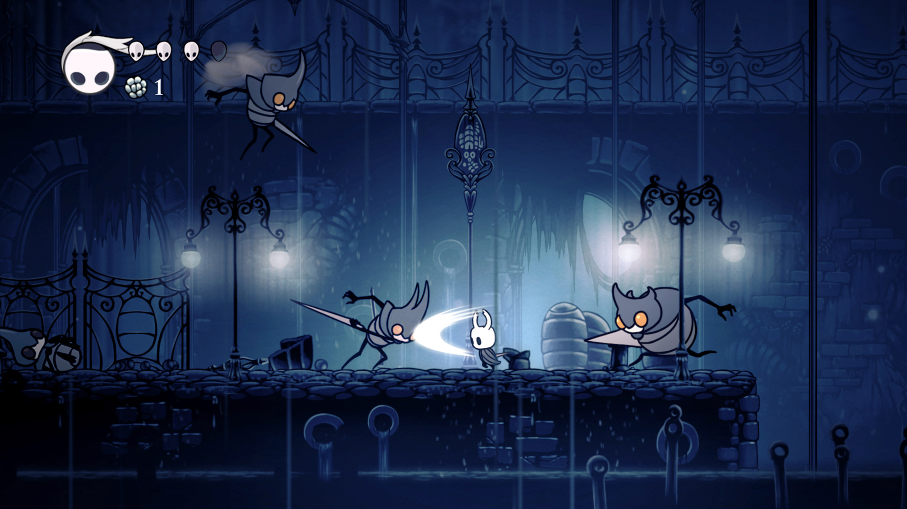
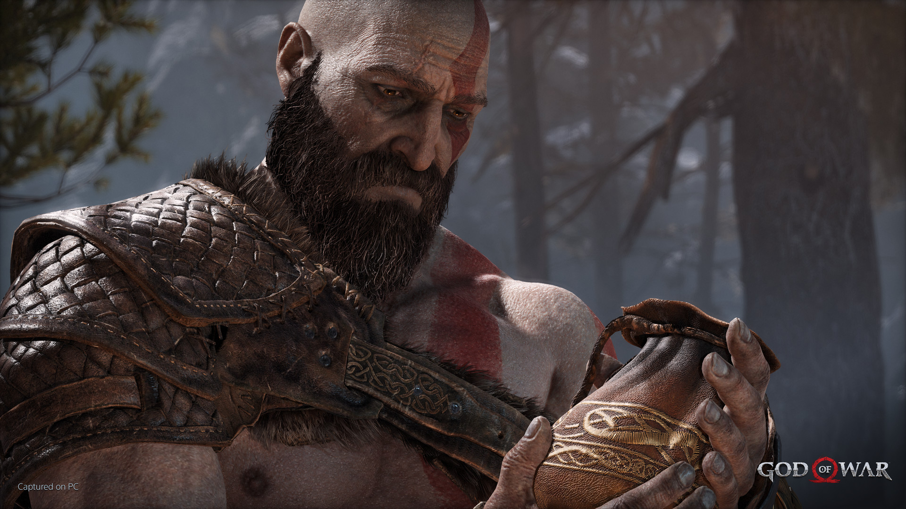
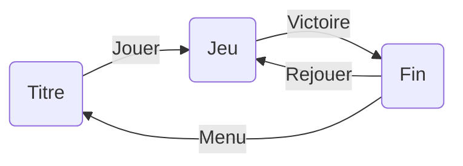

# Cours 6

## Caméra, scènes et menu

Comment le joueur **voit** ton jeu, et comment il y **entre et en sort**. La caméra n'est pas un détail technique : c'est elle qui décide de ce que le joueur sait, ressent et comprend. Et le menu n'est pas de la décoration : c'est la poignée de main de ton jeu.

<!-- ## Déroulement de la séance

| Temps | Activité |
|---|---|
| 0h00 – 0h15 | Retour : les deuxièmes interactions, questions |
| 0h15 – 1h30 | Théorie : la caméra comme choix de design, scènes, interface |
| 1h30 – 1h45 | Pause |
| 1h45 – 3h20 | Pratique : caméra raffinée + flux titre → jeu → fin |
| 3h20 – 3h35 | Rituel de commit + devoirs | -->

## Théorie

### La caméra est un choix de design, pas un réglage

Change la caméra d'un jeu et tu changes le jeu. Le même labyrinthe vu du dessus est un puzzle (je vois le plan), vu à la première personne est un jeu d'horreur (je ne vois rien venir). Chaque genre a son alliance caméra-gameplay :

| Point de vue | Ce que le joueur sait | Genres types |
|---|---|---|
| **Vue de dessus** (top-down) | Le plan complet : stratégie | Zelda classique, jeux de gestion |
| **Vue de côté** (side-scroller) | La trajectoire : précision | Plateformers, *Hollow Knight* |
| **3ᵉ personne** | Son corps dans l'espace | Aventure, action |
| **1ʳᵉ personne** | Seulement ce qui est devant : immersion, tension | FPS, horreur |

{data-zoom-image}

[Hollow Knight (2017)](https://store.steampowered.com/app/367520/Hollow_Knight/) : caméra de côté, orthographique - parce que le jeu EST une affaire de trajectoires et de plateformes. La caméra sert la mécanique.

{data-zoom-image}

[God of War (2018)](https://store.steampowered.com/app/1593500/God_of_War/) : caméra 3ᵉ personne très rapprochée, à l'épaule - un choix radical pour un jeu d'action, fait pour l'intimité avec les personnages. La caméra sert l'émotion.

**Et ton jeu?** Ta caméra Starter Assets est en 3ᵉ personne par défaut - mais sa distance et sa hauteur changent tout : proche = tendu et intime, loin = vue d'ensemble et sécurité. C'est le réglage du jour.

### Orthographique vs perspective : les deux projections

| | **Perspective** | **Orthographique** |
|---|---|---|
| Profondeur | Loin = petit (comme l'œil) | Tout à la même échelle |
| Paramètre clé | **Field of View** (angle, en °) | **Size** (demi-hauteur du cadre) |
| Sensation | Espace, immersion | Lisibilité, précision, style graphique |
| Usages | La plupart des jeux 3D | 2D, pixel art, top-down, puzzle, stratégie |

Le devis du cours demande la configuration de la **caméra virtuelle 2D** - c'est la caméra orthographique. Dans Unity, c'est le même composant Camera : un menu **Projection** les sépare. Tu configureras les deux aujourd'hui, et tu garderas celle qui sert ton jeu.

!!! question "Discussion (3 min)"
    *Dixit* du cours 1, *Monument Valley*, *Age of Empires* : pourquoi tant de jeux de réflexion et de stratégie choisissent-ils l'orthographique? *(Indice : que perd-on avec la perspective quand on veut comparer des distances?)*

### Cinemachine : la caméra qui se règle au lieu de se programmer

Une bonne caméra de suivi est étonnamment difficile à programmer (lissage, obstacles, anticipation…). **Cinemachine** est la réponse de Unity : des « caméras virtuelles » qu'on **règle** dans l'Inspector.

Les trois concepts :

* **Virtual Camera (vcam)** : un point de vue configuré - la vraie caméra obéit à la vcam active
* **Follow / Look At** : la cible à suivre / à regarder (ton personnage)
* **Damping** : le lissage - 0 = caméra rigide collée au personnage; élevé = caméra « molle » qui traîne derrière. C'est LE paramètre de feel de caméra

### Les scènes et leur flux

Une **scène** est un contenant : ton niveau en est une, ton écran titre en sera une autre. Un jeu complet, c'est un **flux** :

```mermaid
graph LR
    A(Titre) -->|Jouer| B(Jeu)
    B -->|Victoire| C(Fin)
    C -->|Rejouer| B
    C -->|Menu| A
```

Pourquoi un écran titre, même pour un petit jeu? (1) Le joueur choisit quand commencer - pas de jeu qui démarre pendant qu'on regarde ailleurs; (2) c'est la **première impression** : titre, ambiance, promesse; (3) le devis demande une interface virtuelle (menu) - la voici.

Techniquement : `SceneManager.LoadScene("NomDeLaScene")` - la ligne exacte de ton jeu express. Et la **Build Profiles list** : seules les scènes inscrites peuvent être chargées; la position 0 démarre en premier.

### L'interface : Canvas, EventSystem, boutons

* **Canvas** : le panneau invisible où vivent TOUS les éléments d'interface. Réglage à faire systématiquement : **Canvas Scaler → Scale With Screen Size → 1920 × 1080** - sinon ton interface change de taille d'un écran à l'autre
* **EventSystem** : créé automatiquement avec le Canvas, c'est lui qui détecte les clics. **Ne le supprime jamais** - un menu qui ne répond pas, c'est presque toujours lui qui manque
* **Button** : un bouton a un événement **On Click ()** dans l'Inspector : on y branche une méthode `public` d'un script. Pas de code de détection de clic à écrire - on **branche**, littéralement
* **Événements sans code** : On Click () ne branche pas que des scripts! Glisse n'importe quel GameObject et choisis **GameObject → SetActive** : le bouton peut afficher/masquer un panneau **sans une ligne de code**. Beaucoup de comportements simples (panneau de crédits, aide, image qui apparaît) se font entièrement dans l'Inspector

## Pratique

Raffiner la caméra, explorer la 2D orthographique, construire les scènes Titre et Fin et relier le flux complet.

[Exercice - Caméra, scènes et menu :material-arrow-right:](./exercices/cours06-camera-scenes-menu.md){ .md-button .md-button--primary }

## Devoir

* Habille tes écrans Titre et Fin selon ton moodboard (couleurs, typo, image de fond)
* **Apporte tes écouteurs au prochain cours : on sonorise!**

## Ressources

* [Documentation Cinemachine](https://docs.unity3d.com/Packages/com.unity.cinemachine@3.1/manual/index.html)
* [Documentation Unity : Canvas Scaler](https://docs.unity3d.com/Packages/com.unity.ugui@2.0/manual/script-CanvasScaler.html)

## Savoirs essentiels touchés

Configuration de la caméra virtuelle 2D, fonctionnement d'une interface virtuelle (menu), transitions de scènes.
