# Cours 6

*[FOV]: Field Of View
*[CAQ]: Coalition Avenir Québec
*[PLQ]: Parti libéral du Québec
*[QS]: Québec solidaire 
*[PQ]: Parti québécois
*[PCQ]: Parti conservateur du Québec
*[FPS]: First Person Shooter
*[TPS]: Third Person Shooter
*[CES]: Collider Event System

## Élections Québec 2026

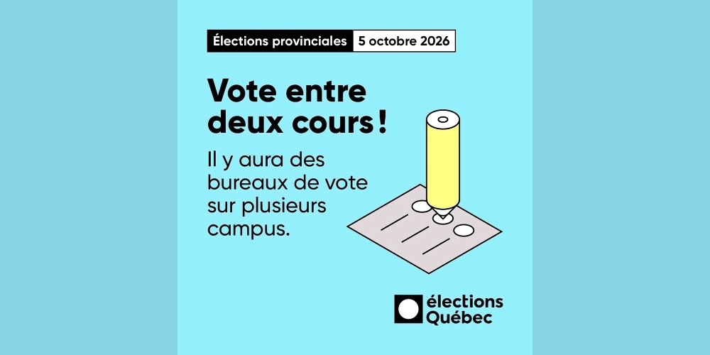{.w-100}

<figure markdown>
{ data-zoom-image }
<figcaption class="small" markdown>Christine Fréchette (CAQ) (première ministre sortante), Charles Milliard (PLQ), Ruba Ghazal (QS), Paul St-Pierre Plamondon (PQ), Éric Duhaime (PCQ)</figcaption>
</figure>

[:simple-youtube: C’est votre première élection provinciale? Voici ce qu’il faut savoir | Élections Québec 2026](https://youtube.com/shorts/zBaIvM0QPx8?si=FQUmcdKig23fpSo3)

### La Boussole électorale

La [Boussole électorale](https://boussole.radio-canada.ca/) est un outil développé par des politologues pour vous aider à comparer vos opinions avec celles des partis.

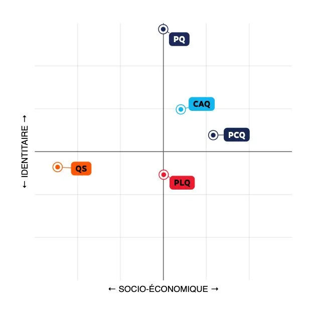{ data-zoom-image .w-33}

[{.w-75}](https://boussole.radio-canada.ca/)

### Où quand comment ?

Le lundi 5 octobre 2026

Vous devriez avoir reçu votre carte d’information de l’électeur pour savoir où voter. Sinon, [trouvez votre bureau de vote](https://www.electionsquebec.qc.ca/voter/ou-et-quand-voter/).

Pour savoir qui se présente dans votre circonscription et connaître ses enjeux spécifiques, [cherchez votre circonscription](https://www.electionsquebec.qc.ca/cartes-electorales/circonscriptions-provinciales/).

## Asset Store et Git


Avant d'installer un asset que vous testez pour la première fois, faites **toujours** un commit et un push. Certains assets peuvent corrompre un projet !

Pour éviter de devoir recommencer inutilement depuis une vieille version, assurez-vous de faire des commit/push régulièrement.

## Character controller

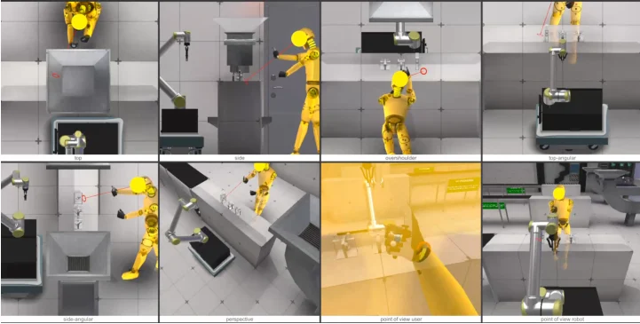{ .w-100 data-zoom-image } 

!!! tip "Ajuster les options en mode Play permet de tester sans briser les configurations"

### Effet humain 💃

{.w-50 .h-auto}

Par défaut, il y a un petit effet de respiration qui déplace légèrement la caméra pour un effet plus humain.

Pour le désactiver, dans **PlayerFollowCamera**, dans **Cinemachine Camera** > **Procedural Components** > **Noise**, choisir None.

### Ajustements généraux

{.w-50 .h-auto}

PlayerArmature (TPS) ou PlayerCapsule (FPS) :

- **Move Speed**
- **Sprint Speed**
- **Jump Height**
- **Gravity**

Autres options à regarder dans **PlayerFollowCamera** > **Cinemachine Third Person Follow** :

- **Damping** : La vitesse de réponse de la caméra quand on est en mouvement
- **Shoulder Offset** : Repositionne la caméra à partir du personnage

### Champ de vision (FOV) 👀

-DDOS-Field-Of-View-Ranges.avif){.w-50 data-zoom-image}

PlayerFollowCamera : 

- **Cinemachine Camera** > **Lens** > **Field Of View** : changer la valeur

### 2.5D

{.h-auto .w-50}

Reculer la caméra : **PlayerFollowCamera** > **Cinemachine Third Person Follow** > **Camera Distance**

Retirer la perspective : sur **MainCamera**, dans **Camera** > **Projection**, changer **Perspective** pour **Orthographic**

Désactiver :arrow_up: et :arrow_down: : sur **PlayerArmature**, ajouter ce script : 

```c# title="Controles25D.cs"
using UnityEngine;
using StarterAssets;

[DefaultExecutionOrder(-100)]
public class Controles25D : MonoBehaviour
{
    StarterAssetsInputs input;
    void Start() { 
        input = GetComponent<StarterAssetsInputs>(); 
    }

    void Update() { 
        input.move.y = 0; 
    }
}
```

### Vue d'oiseau

{.w-50 .h-auto}

PlayerArmature : 

- **Camera Angle Override** = `65`
- Cocher **Lock Camera Position** (désactive la gestion de la caméra par la souris)

### Vue isométrique

{.w-50 .h-auto}

Une vue isométrique c'est quand la caméra suit le personnage d'un angle d'environ 35° vers le bas (35.264° exactement) et 45° en diagonale, sans perspective.

- Retirer la perspective : sur **MainCamera**, dans **Camera** > **Projection**, changer **Perspective** pour **Orthographic**

PlayerArmature : 

- **Rotation** Y = `45`
- Cocher **Lock Camera Position**
- **Camera Angle Override** = `35.264`

PlayerFollowCamera : 

- **Lens** > **Orthographic Size** = `6`
- **Cinemachine Camera** > **Procedural Components** > **Noise** = **None**
- **Shoulder Offset** = `0, 0, 0`
- **Vertical Arm Length** = `0`
- **Camera Distance** = `20`
- Décocher **Avoid Obstacles**

### Saut multiple

{.w-50 .h-auto}

- En TPS, ajouter le script [ExtraJumpsTPS.cs](./extra/ExtraJumpsTPS.cs) sur **PlayerArmature**
- En FPS, ajouter le script [ExtraJumpsFPS.cs](./extra/ExtraJumpsFPS.cs) sur **PlayerCapsule**.

!!! question "Et si on branchait le CES 🤔 !?"

    Woah ! Bonne idée !

    - Dans un Trigger Cube, ajoute une Action de type Invoke Events.
    - Ensuite, glisse le PlayerArmature (en TPS) ou le PlayerCapsule (en FPS) dedans
    - Comme fonction, choisis ExtraJumpsTPS (ou ExtraJumpsFPS), puis AjouterSaut
    - Entre la hauteur du saut ajouté (ex. : `3`) : ça ajoutera un saut de plus !

### S'accroupir en FPS

{.h-auto .w-50}

- Ajouter le script [CrouchFPS.cs](./extra/CrouchFPS.cs) sur **PlayerCapsule**.

## Tir

{data-zoom-image}

```c# title="Tir.cs"
using UnityEngine;
using UnityEngine.InputSystem;

public class Tir : MonoBehaviour
{
    public GameObject bulletPrefab;
    public Transform fireStartingPoint;
    public Camera cam;
    public float speed = 60f;

    void Update()
    {
        if (Mouse.current.leftButton.wasPressedThisFrame)
        {
            Quaternion direction = Quaternion.Euler(cam.transform.eulerAngles.x, transform.eulerAngles.y, 0);
            GameObject bullet = Instantiate(bulletPrefab, fireStartingPoint.position, direction * bulletPrefab.transform.rotation);
            bullet.GetComponentInChildren<Rigidbody>().AddForce(direction * Vector3.forward * speed, ForceMode.VelocityChange);
            Destroy(bullet, 3f);
        }
    }
}

```

1. Dans **Assets > _ > Scripts**, ajouter le script ci-dessus (**Create > Scripting > MonoBehaviour Script**)
1. Créer un prefab pour le projectile
  - Créer un Empty Object et le renommer « Bullet »
  - Créer une Sphere (**GameObject > 3D Object > Sphere**) comme enfant de « Bullet »
  - Réduire l'échelle de la sphère (ex. : `0.2`)
  - Sur « Bullet » (l'Empty Object, pas la sphère), ajouter un Rigidbody : 
    - **Collision Detection** = **Continuous Dynamic**
    - Mass = Environ `0.1`
  - Glisser « Bullet » dans le dossier **Assets > _ > Prefabs** pour en faire un prefab
  - Supprimer « Bullet » du panneau _Hierarchy_
  - Appliquer un nouveau Tag au prefab (ex. : Projectile)
1. Créer le départ du projectile
  - En FPS, créer un **Empty Object** comme enfant de **PlayerCameraRoot**
  - En TPS, créer un **Empty Object** comme enfant de **PlayerArmature**
  - Le renommer « ShootStart »
  - Le déplacer de sorte qu'il soit un peu **devant** le personnage
1. Appliquer le script
  - Ajouter sur **PlayerCapsule** (FPS) ou **PlayerArmature** (TPS)
  - Glisser le prefab Bullet, le ShootStart et la **MainCamera** dans les champs du panneau _Inspector_

{.h-auto .w-50}

!!! tip "Ajustement"

    En TPS, ajouter un peu de **Shoulder Offset** (X) sur **PlayerFollowCamera** aide à mieux voir la trajectoire du projectile.

### Tir en TPS

Le script `Tir.cs` utilise l'orientation horizontale du personnage et l'inclinaison verticale de la caméra. En FPS, le personnage tourne avec la caméra, donc le projectile part là où l'on regarde. En TPS, par contre, le personnage se tourne dans sa direction de déplacement : le projectile part donc devant le personnage, pas nécessairement là où la caméra regarde.

Pour un effet plus "normal", il est préférable de faire tourner le personnage en même temps que la caméra : 

- Appliquer le script [MatchCameraYaw.cs](./extra/MatchCameraYaw.cs) sur PlayerArmature
- Glisser **PlayerCameraRoot** dans le champ **Player Camera Root** du script

L'inconvénient est que l'animation de déplacement sera moins fluide lors des déplacements latéraux.

## Viseur

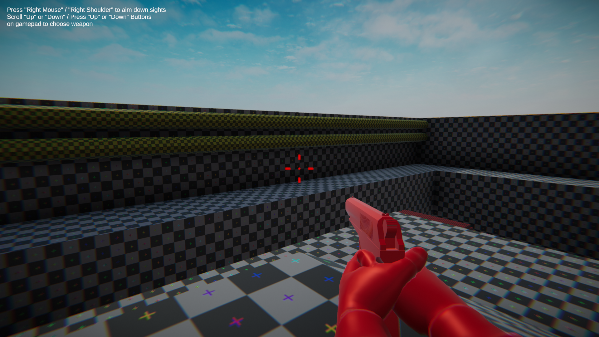

Qui dit tir, dit Viseur (_Crosshair_) ! Même sans tir, ça aide à orienter le regard.

Pour un FPS, rien de nouveau. Il suffit d'ajouter un canvas avec au centre, ledit crosshair ! Voici plein d'images utiles pour cela : <https://kenney.nl/assets/crosshair-pack>.

Pour un TPS, le crosshair est effectivement une option, mais il est alors préférable d'utiliser le script [MatchCameraYaw.cs](./extra/MatchCameraYaw.cs) pour que le personnage soit toujours orienté dans la même direction que la caméra.

## Retour sur les UI

### Technique _9 slicing sprite_
 
<div class="grid" markdown>
<div markdown>{.w-100 .h-auto}</div>

<div markdown>{.w-100 .h-auto}</div>
</div>

La technique du [_9-slice scaling_](https://en.wikipedia.org/wiki/9-slice_scaling) permet d'étirer une image matricielle sans la déformer ni la pixelliser. Elle est principalement utilisée pour les éléments d'interface (UI) comme les boutons ou les boîtes de dialogue.
 
1. Trouver une image de bouton carré sur [Kenney.nl](https://kenney.nl/assets/tag:interface)<br>{data-zoom-image .w-10}
1. Glisser l'image dans **Assets > _ > Sprites**
1. Cliquer sur l'image
  > Cliquer sur **Install 2D Sprite Package** si ce n'est pas déjà installé
1. **Texture type** = **Sprite (2D and UI)**
  - Si l'image est en pixelart, **Filter Mode** = **Point (no filter)**
1. **Sprite Mode** = **Single**
1. Cliquer sur **Apply**
1. Cliquer sur **Open Sprite Editor**
1. Glisser les 4 lignes vertes vers le centre de sorte à avoir un centre uni<br>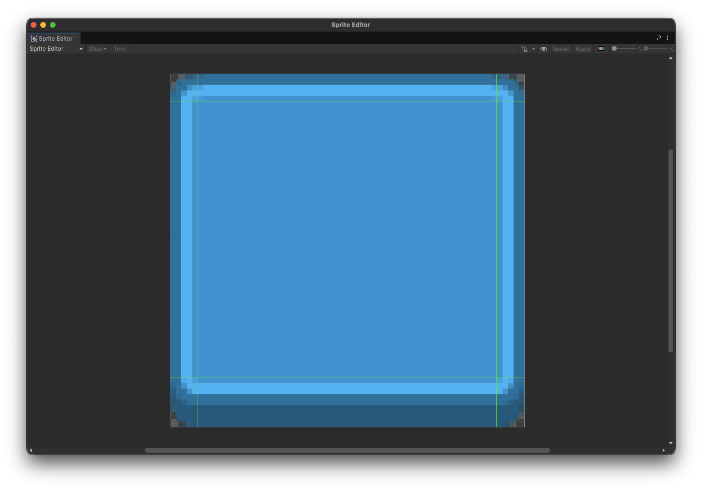{data-zoom-image .w-10}
1. Cliquer sur **Apply** et fermer le **Sprite Editor**

Dans le panneau **Hierarchy** : 

1. Cliquer sur un **bouton** dans le canvas
1. Dans le panneau **Inspector**, glisser le sprite du panneau **Project** vers **Image > Source Image**
1. **Image Type** = **Sliced**

## Événement déclenché par le clavier

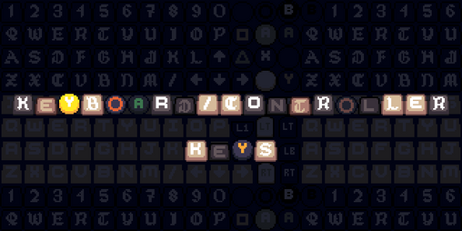{.w-100}

- Créer un Empty Object
- Ajouter le composant **Condition Watcher** (fourni par le CES)

Ça se configure de la même manière qu'avec un prefab Trigger. On peut ainsi déclencher des actions quand la condition est respectée.

## Animation par _keyframe_

{.w-100 .h-auto .rounded}

### Créer un clip

1. Ajouter la fenêtre Animation à votre interface (placez-la idéalement au même endroit que la console).<br>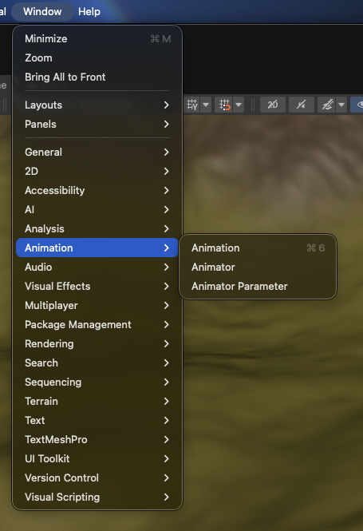{data-zoom-image .w-10} 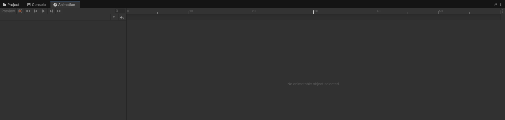{data-zoom-image .w-10} 
1. Cliquer sur l'élément à animer
1. Dans le panneau Animation, cliquer sur **Create**
1. Nommer l'animation (ex. : `AvionAnimation.anim`) et l'enregistrer sous **Assets > _ > Animations**

### Configurer l'animation (_Dopesheet_)

1. Pour faciliter la gestion de l'animation, cliquer sur le bouton d'enregistrement rouge <br>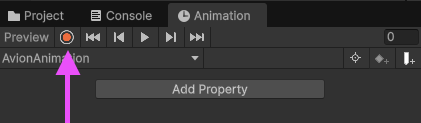{data-zoom-image .w-10}
1. Appliquer une modification sur l'objet dans le panneau Scene (ex. : position, rotation et scale)
1. Déplacer le curseur sur la ligne du temps
1. Appliquer d'autres modifications
1. Déplacer le curseur sur la ligne du temps 
1. Appliquer d'autres modifications et ainsi de suite.
1. Cliquer sur le bouton d'enregistrement à nouveau pour arrêter d'enregistrer
1. Ajuster l'animation avec les curves au besoin 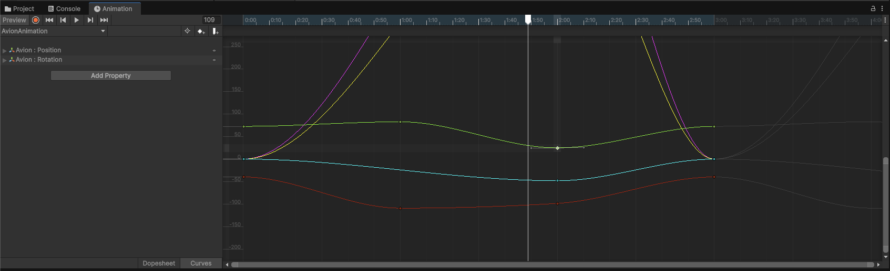{data-zoom-image .w-10}

### Animator

1. Un nouveau panneau devrait apparaitre à côté de Scene et Game. S'il n'y est pas, Window > Animation > Animator
1. Cliquer sur l'animation pour changer sa vitesse (**Speed**) dans l'**Inspector** au besoin
1. Double-cliquer sur l'animation, puis cocher ou décocher **Loop Time** dans l'**Inspector**

[:simple-youtube: How to create animations in Unity | Synty Studios](https://www.youtube.com/watch?v=78IrmMtByAU)


## Splines

{.w-100}

1. Dans **Package Manager** cliquer sur **Unity Registry**
1. Chercher **Splines** et cliquer sur **Install** (il se peut que ce soit déjà installé)

### Création du Spline

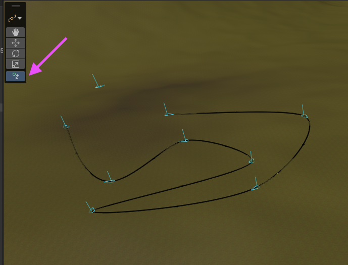{.w-50 data-zoom-image}

Dans le panneau Scene, utiliser l'option "Create Spline" situé dans la barre d'outils de gauche.

### Loft Road Behaviour

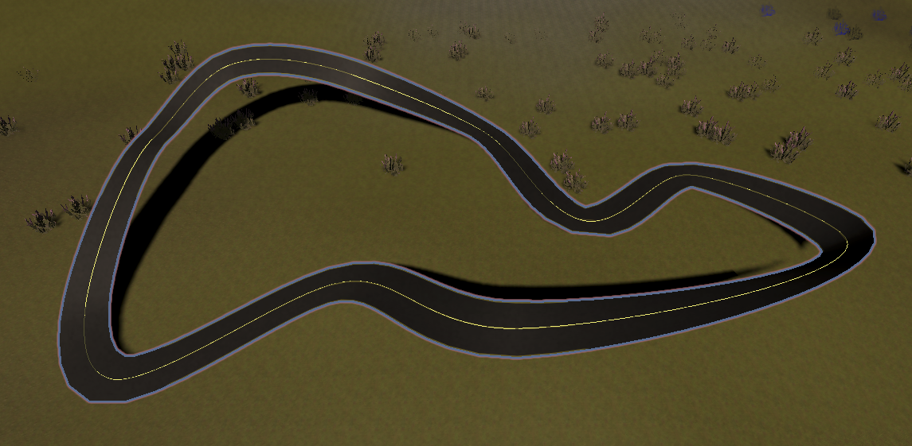{.w-50 data-zoom-image}

Pour afficher un Spline sous forme de route : 

1. Importer les exemples du package : **Package Manager** > **Splines** > **Samples** > **Import**
1. Créer un Spline
1. Ajouter le composant "Loft Road Behaviour" sur le Spline

Pour augmenter la largeur : 

- Ajouter un élément dans Widths
- Utiliser l'outil Width dans la barre d'outil :<br>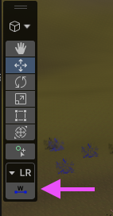{data-zoom-image .w-10}

!!! question "Pas de Collider ?"

    Non par défaut il n'y a pas de collider.
    
    Pour en ajouter un, ajoutez [SplineRoadBehaviour.cs](./extra/SplineRoadBehaviour.cs) à vos scripts (Assets > _ > Scripts) et glissez-le sur l'Inspector du spline en question. Ça va en créer un.

    MAIS, idéalement, la route serait à plat sur le plancher.

[:simple-youtube: Build With SPLINES in UNITY 6 | Synty Studios](https://www.youtube.com/watch?v=XDjmzHPdYBQ)

### Spline animate

{.w-50 .h-auto}

Pour créer une animation qui suit le Spline : 

1. Créer un Spline
1. Sélectionner le GameObject à animer
1. Ajouter un Composant "Spline Animate"
1. Glisser le Spline créé dans le champ "Spline"
1. Ajuster les paramètres au besoin

!!! tip "À essayer"

    - "Spline Instantiate" : permet de créer des instances le long d'un spline
    - "Spline extrude" : permet d'utiliser un Spline pour en faire une forme (ex. : tuyaux)

[:simple-youtube: How to get started with the splines package | Unity](https://www.youtube.com/watch?v=IJbH5OZa_is)


## Projet final

* Semaine 6 | 1 octobre ⭐️ Aujourd'hui
* Semaine 7 | 8 octobre 🏃🏻‍♂️ Sprint 1 : Prototype
* <span class="opacity-50">Semaine 8 | 22 octobre</span>
* <span class="opacity-50">Semaine 9 | 29 octobre 🏃🏻‍♂️ Sprint 2 : Tranche verticale</span>
* <span class="opacity-50">Semaine 10 | 5 novembre</span>
* <span class="opacity-50">Semaine 11 | 12 novembre</span>
* <span class="opacity-50">Semaine 12 | 19 novembre 🏃🏻‍♂️ Sprint 3 : Alpha</span>
* <span class="opacity-50">Semaine 13 | 26 novembre</span>
* <span class="opacity-50">Semaine 14 | 3 décembre 🏃🏻‍♂️ Sprint 4 : Beta</span>
* <span class="opacity-50">Semaine 15 | 10 décembre 🏃🏻‍♂️ Sprint 5 : Oral</span>

### Trello

Propositions de cartes

- Ajouter la capacité de tirer un projectile
- Configurer le comportement du personnage contrôlable
- Ajouter une animation pour x
- Ajouter une animation pour y
- Ajouter une animation pour z
