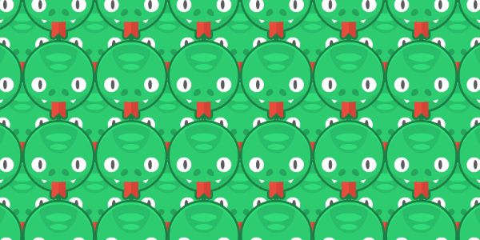

---
tags:
  - Cours 7
  - Mardi 8 octobre
---

# Animations programmées

## Interpolation

Une interpolation c'est ce qui nous permet de "remplir les trous" entre deux points pour obtenir une transition lisse.

Imaginons un personnage qui doit se déplacer de la gauche (**point A**) vers la droite (**point B**) en trois secondes.

❌ **Sans interpolation** : Le personnage sauterait du point A au point B sans transition.

✅ **Avec interpolation** : Le mouvement est décomposé en plusieurs petites étapes, faisant apparaître le personnage à diverses positions intermédiaires, donnant l'impression qu'il se déplace en douceur à travers l'écran. Voyez cela un peu comme les images par secondes au cinéma🍿.

<iframe class="aspect-4-1" height="300" style="width: 100%;" scrolling="no" title="Interpolation" src="https://codepen.io/tim-momo/embed/qBGxwQP?default-tab=result&theme-id=50173" frameborder="no" loading="lazy" allowtransparency="true" allowfullscreen="true">
  See the Pen <a href="https://codepen.io/tim-momo/pen/qBGxwQP">
  Interpolation</a> by TIM Montmorency (<a href="https://codepen.io/tim-momo">@tim-momo</a>)
  on <a href="https://codepen.io">CodePen</a>.
</iframe>

### Interpolation avec Phaser

Pour animer un élément de jeu, on peut utiliser le système d'interpolation de Phaser. Cela peut se faire par une **animation interpolée** ([Tweens](https://newdocs.phaser.io/docs/3.80.0/Phaser.Tweens)), par une **séquence d'animations** ([Timeline](https://newdocs.phaser.io/docs/3.80.0/Phaser.Time.Timeline) / [TweenChain](https://rexrainbow.github.io/phaser3-rex-notes/docs/site/tween/#chain)) ou par une **animation de parcours** ([PathFollow](https://newdocs.phaser.io/docs/3.80.0/Phaser.GameObjects.PathFollower)).

## Animation interpolée (Tween)

<iframe class="aspect-2-1" height="300" style="width: 100%;" scrolling="no" title="Tween" src="https://codepen.io/tim-momo/embed/YzbePoR?default-tab=result&theme-id=50173" frameborder="no" loading="lazy" allowtransparency="true" allowfullscreen="true">
  See the Pen <a href="https://codepen.io/tim-momo/pen/YzbePoR">
  Tween</a> by TIM Montmorency (<a href="https://codepen.io/tim-momo">@tim-momo</a>)
  on <a href="https://codepen.io">CodePen</a>.
</iframe>

De manière générale, une animation interpolée représente simplement une transformation géométrique 📐.

Pour créer une nouvelle animation (Tween), on doit écrire la commande `this.tweens.add({});`. Cela indique à la scène Phaser qu'une animation doit être déclenchée. Voici la syntaxe d'un exemple très minimal, sans spécification sur l'animation :

```js title="Syntaxe"
this.tweens.add({
  targets: objet_à_animer,
});
```

### Translation

```js hl_lines="5"
create() {
  const circle = this.add.circle(100, config.height / 2, 10, 0xffffff);
  this.tweens.add({
    targets: circle,
    x: 600,
    duration: 3000,
    repeat: -1
  });
}
```

<div class="grid" markdown>
<iframe class="aspect-2-1" height="300" style="width: 100%;" scrolling="no" title="Translation X" src="https://codepen.io/tim-momo/embed/vYwwZaB?default-tab=result&theme-id=50173" frameborder="no" loading="lazy" allowtransparency="true" allowfullscreen="true">
  See the Pen <a href="https://codepen.io/tim-momo/pen/vYwwZaB">
  Translation X</a> by TIM Montmorency (<a href="https://codepen.io/tim-momo">@tim-momo</a>)
  on <a href="https://codepen.io">CodePen</a>.
</iframe>
`x` : La nouvelle position sur l'axe des X. L'image se déplacera horizontalement jusqu'à cette position.
</div>

---

```js hl_lines="5 8"
create() {
  const circle = this.add.circle(config.width / 2, 50, 10, 0xffffff);
  this.tweens.add({
    targets: circle,
    y: 300,
    duration: 1500,
    repeat: -1,
    yoyo: true
  });
}
```

<div class="grid" markdown>
<iframe class="aspect-2-1" height="300" style="width: 100%;" scrolling="no" title="Translation Y" src="https://codepen.io/tim-momo/embed/GRaaEYJ?default-tab=result&theme-id=50173" frameborder="no" loading="lazy" allowtransparency="true" allowfullscreen="true">
  See the Pen <a href="https://codepen.io/tim-momo/pen/GRaaEYJ">
  Translation Y</a> by TIM Montmorency (<a href="https://codepen.io/tim-momo">@tim-momo</a>)
  on <a href="https://codepen.io">CodePen</a>.
</iframe>
`y` : La nouvelle position sur l'axe des Y. L'image se déplacera verticalement jusqu'à cette position.
</div>

### Rotation

```js hl_lines="5"
create() {
  const ellipse = this.add.ellipse(config.width / 2, config.height / 2, 50, 20, 0xffffff)
  this.tweens.add({
    targets: ellipse,
    angle: 360,
    duration: 1500,
    repeat: -1
  })
}
```

<div class="grid" markdown>
<iframe class="aspect-2-1" height="300" style="width: 100%;" scrolling="no" title="Rotation - Angle" src="https://codepen.io/tim-momo/embed/dyEERgB?default-tab=result&theme-id=50173" frameborder="no" loading="lazy" allowtransparency="true" allowfullscreen="true">
  See the Pen <a href="https://codepen.io/tim-momo/pen/dyEERgB">
  Rotation - Angle</a> by TIM Montmorency (<a href="https://codepen.io/tim-momo">@tim-momo</a>)
  on <a href="https://codepen.io">CodePen</a>.
</iframe>
`angle`: La nouvelle valeur de l'angle en degrés. Par exemple, une valeur de 360 fera tourner l'objet d'un tour complet.
</div>

---

```js hl_lines="5"
create() {
  const ellipse = this.add.ellipse(config.width / 2, config.height / 2, 50, 20, 0xffffff)
  this.tweens.add({
    targets: ellipse,
    rotation: Math.PI * 2,
    duration: 1500,
    repeat: -1
  })
}
```

<div class="grid" markdown>
<iframe class="aspect-2-1" height="300" style="width: 100%;" scrolling="no" title="Rotation" src="https://codepen.io/tim-momo/embed/OJYYjLb?default-tab=result&theme-id=50173" frameborder="no" loading="lazy" allowtransparency="true" allowfullscreen="true">
  See the Pen <a href="https://codepen.io/tim-momo/pen/OJYYjLb">
  Rotation</a> by TIM Montmorency (<a href="https://codepen.io/tim-momo">@tim-momo</a>)
  on <a href="https://codepen.io">CodePen</a>.
</iframe>
`rotation`: La nouvelle valeur de la rotation en radians. Une valeur de Math.PI (3.14159...) équivaut à une rotation de 180 degrés.
</div>

### Échelle

```js hl_lines="5"
create() {
  const circle = this.add.circle(config.width / 2, config.height / 2, 10, 0xffffff);
  this.tweens.add({
    targets: circle,
    scale: 3,
    duration: 1000,
    repeat: -1,
    yoyo: true
  });
}
```

<div class="grid" markdown>
<iframe class="aspect-2-1" height="300" style="width: 100%;" scrolling="no" title="Scale" src="https://codepen.io/tim-momo/embed/qBGGXWz?default-tab=result&theme-id=50173" frameborder="no" loading="lazy" allowtransparency="true" allowfullscreen="true">
  See the Pen <a href="https://codepen.io/tim-momo/pen/qBGGXWz">
  Scale</a> by TIM Montmorency (<a href="https://codepen.io/tim-momo">@tim-momo</a>)
  on <a href="https://codepen.io">CodePen</a>.
</iframe>
`scale` : Modifie la taille de l'élément. Une valeur de 2 doublera la taille, tandis qu'une valeur de 0.5 la réduira de moitié.
</div>

### Transparence

```js hl_lines="5"
create() {
  const circle = this.add.circle(config.width / 2, config.height / 2, 10, 0xffffff)
  this.tweens.add({
    targets: circle,
    alpha: 0,
    duration: 1500,
    repeat: -1,
    yoyo: true
  })
}
```

<div class="grid" markdown>
<iframe class="aspect-2-1" height="300" style="width: 100%;" scrolling="no" title="Scale" src="https://codepen.io/tim-momo/embed/Exzzvxr?default-tab=result&theme-id=50173" frameborder="no" loading="lazy" allowtransparency="true" allowfullscreen="true">
  See the Pen <a href="https://codepen.io/tim-momo/pen/Exzzvxr">
  Scale</a> by TIM Montmorency (<a href="https://codepen.io/tim-momo">@tim-momo</a>)
  on <a href="https://codepen.io">CodePen</a>.
</iframe>
`alpha` : Modifie l'opacité de l'élément. La valeur doit se situer entre 0 et 1. Une valeur de 1 signifie que l'élément est complètement opaque (100% d'opacité), tandis qu'une valeur de 0 le rend totalement transparent. Les valeurs entre 0 et 1 représentent différents niveaux de transparence.
</div>

### Fonctions d'accélération

```js hl_lines="6"
this.tweens.add({
  targets: belleLune,
  x: 700,
  duration: 5000,
  repeat: -1,
  ease: 'Circ.easeOut'
});
```

<iframe class="aspect-1-1" height="300" style="width: 100%;" scrolling="no" title="Ease" src="https://codepen.io/tim-momo/embed/LYoKGZK?default-tab=result&theme-id=50173" frameborder="no" loading="lazy" allowtransparency="true" allowfullscreen="true">
  See the Pen <a href="https://codepen.io/tim-momo/pen/LYoKGZK">
  Ease</a> by TIM Montmorency (<a href="https://codepen.io/tim-momo">@tim-momo</a>)
  on <a href="https://codepen.io">CodePen</a>.
</iframe>

[Liste des fonctions d'accélération Phaser](https://rexrainbow.github.io/phaser3-rex-notes/docs/site/ease-function/)

### Autres propriétés

```js
this.tweens.add({
  targets: sprite,
  x: 0,
  y: 0,
  alpha: 1.0,
  scale: 1,
  angle: 0,
  rotation: 0,
  duration: 0,
  ease: 'Linear',
  delay: 0,         // Délai avant l'animation
  repeat: 0,        // Nombre de répétitions (-1 pour infini)
  yoyo: false,
  hold: 0,          // Temps de pause entre les yoyo
  repeatDelay: 0,   // Délai entre chaque répétition
  paused: false,    // Commencer en pause
  onStart: function (tween, targets) {
    console.log('Animation commencée');
  },
  onComplete: function (tween, targets) {
    console.log('Animation terminée');
  },
  onYoyo: function (tween, targets) {
    console.log('Yoyo');
  },
  onRepeat: function (tween, targets) {
    console.log('Répétition');
  },
  onUpdate: function (tween, targets) {
    console.log('Mise à jour');
  }
});
```

## Séquence d'animations

### Chaine d'animation

La chaine n'animation déclenche un tween après l'autre tout simplement. Voici la syntaxe :

```js
create() {
  this.tweens.chain({
    targets: img,
    loop: -1, // infini
    tweens: [
      {
        x: 400,
        angle: -90,
        duration: 1500
      },
      {
        y: 100,
        duration: 1500
      },
      {
        x: 100,
        y: 200,
        angle: 360,
        duration: 1000,
        onComplete: () => {
          // Callback
        }
      }
    ]
  });
}
```

#### Exemple complet

<iframe class="aspect-2-1" height="300" style="width: 100%;" scrolling="no" title="Phaser - Timeline simple" src="https://codepen.io/tim-momo/embed/gOVwaWM?default-tab=result&editable=true&theme-id=50173" frameborder="no" loading="lazy" allowtransparency="true" allowfullscreen="true">
  See the Pen <a href="https://codepen.io/tim-momo/pen/gOVwaWM">
  Phaser - Timeline simple</a> by TIM Montmorency (<a href="https://codepen.io/tim-momo">@tim-momo</a>)
  on <a href="https://codepen.io">CodePen</a>.
</iframe>

### Ligne du temps (timeline)

L'usage de ligne du temps sert à spécifier plus précisément à quel moment une animation dans une séquence s'animations doit s'activer.

Cette méthode permet de superposer des animations au lieu de les déclencher séquentiellement (chain).

Pour définir une nouvelle séquence d'animations de type timeline, on doit la déclarer dans une variable.

```js
let timeline = this.add.timeline();
```

On y ajoute ensuite des animations avec la structure suivante :

```js
timeline.add({
    at: 0,
    tween: {
        // Paramètres de l'animation
    },
});

timeline.add({
    at: 1500,
    tween: {
        // Paramètres de l'animation
    },
});

timeline.add({
    at: 5400,
    tween: {
        // Paramètres de l'animation
    },
});
```

`at` : Spécifie en millisecondes le moment où l'animation (Tween) doit commencer par rapport au début de sa séquence (Timeline).

Finalement, pour démarrer la séquence, il faut simplement appeler la fonction `play()` :

```js
timeline.play();
```

Pour répéter l'animation, il ne suffit que d'appeler la fonction `repeat()` :

```js
timeline.play().repeat();
```

#### Exemple complet

<iframe class="aspect-2-1" height="300" style="width: 100%;" scrolling="no" title="Phaser - Timeline" src="https://codepen.io/tim-momo/embed/QWRrxEX?default-tab=result&editable=true&theme-id=50173" frameborder="no" loading="lazy" allowtransparency="true" allowfullscreen="true">
  See the Pen <a href="https://codepen.io/tim-momo/pen/QWRrxEX">
  Phaser - Timeline</a> by TIM Montmorency (<a href="https://codepen.io/tim-momo">@tim-momo</a>)
  on <a href="https://codepen.io">CodePen</a>.
</iframe>

## Animation de parcours (follower)

Pour créer une animation de parcours le plus simplement possible, il faut créer un chemin vectoriel.

```js
const cheminVectoriel = new Phaser.Curves.Path();
```

Ensuite, on assigne des coordonnées. Par exemple, une simple ligne comporte 2 coordonnées; le départ et la fin.

```js
cheminVectoriel.moveTo(200, 100);
cheminVectoriel.lineTo(600, 300);
```

Finalement, il faut créer un `follower` et appeler sa fonction `startFollow`. Voici un exemple :

```js  hl_lines="7 13-19"
class Example extends Phaser.Scene {
  preload() {
    this.load.image("img", "chemin/vers/mon/image.png");
  }

  create() {
    const cheminVectoriel = new Phaser.Curves.Path(200, 100).lineTo(600, 300);

    const graphics = this.add.graphics(); // Facultatif
    graphics.lineStyle(3, 0xffffff, 1); // Facultatif
    cheminVectoriel.draw(graphics); // Facultatif

    this.add.follower(cheminVectoriel, 0, 0, "img").startFollow({
      positionOnPath: true,
      duration: 2000,
      yoyo: true,
      repeat: -1,
      rotateToPath: true
    });
  }
}
```

### Exemple simple

<iframe class="aspect-2-1" height="300" style="width: 100%;" scrolling="no" title="Phaser - PathFollow 1" src="https://codepen.io/tim-momo/embed/rNXMxgL?default-tab=result&editable=true&theme-id=50173" frameborder="no" loading="lazy" allowtransparency="true" allowfullscreen="true">
  See the Pen <a href="https://codepen.io/tim-momo/pen/rNXMxgL">
  Phaser - PathFollow 1</a> by TIM Montmorency (<a href="https://codepen.io/tim-momo">@tim-momo</a>)
  on <a href="https://codepen.io">CodePen</a>.
</iframe>

### Exemple intermédiaire

<iframe class="aspect-2-1" height="300" style="width: 100%;" scrolling="no" title="Phaser - PathFollow 3" src="https://codepen.io/tim-momo/embed/GRVjZpw?default-tab=result&editable=true&theme-id=50173" frameborder="no" loading="lazy" allowtransparency="true" allowfullscreen="true">
  See the Pen <a href="https://codepen.io/tim-momo/pen/GRVjZpw">
  Phaser - PathFollow 3</a> by TIM Montmorency (<a href="https://codepen.io/tim-momo">@tim-momo</a>)
  on <a href="https://codepen.io">CodePen</a>.
</iframe>

### Exemple avancé

<iframe class="aspect-2-1" height="300" style="width: 100%;" scrolling="no" title="Phaser - PathFollow Avancé" src="https://codepen.io/tim-momo/embed/mdNrPez?default-tab=result&editable=true&theme-id=50173" frameborder="no" loading="lazy" allowtransparency="true" allowfullscreen="true">
  See the Pen <a href="https://codepen.io/tim-momo/pen/mdNrPez">
  Phaser - PathFollow Avancé</a> by TIM Montmorency (<a href="https://codepen.io/tim-momo">@tim-momo</a>)
  on <a href="https://codepen.io">CodePen</a>.
</iframe>

### Exemple avec physique

Le système de physique et des animations programmées sont complètement différents et ne fonctionne normalement pas ensemble. Toutefois, il est possible de simuler l'animation désirée et d'applique les coordonnées de cette animation à la vélocité d'un objet.

Autrement dit, exécute ces trois étapes :

1. On défini le chemin d'animation
1. On exécute mathématiquement l'animation
1. On applique une vélocité en fonction des coordonnées de l'animation

```js
update(time, delta) {
  // Supposons que 't' est mis à jour par un tween ou un calcul du temps
  const t = (time % duration) / duration;

  // Position cible sur le chemin
  const targetPosition = path.getPoint(t);

  // Calcul de la direction vers la position cible
  const direction = new Phaser.Math.Vector2(
    targetPosition.x - sprite.x,
    targetPosition.y - sprite.y
  ).normalize();

  // Application de la vélocité en fonction de la direction
  sprite.body.setVelocity(
    direction.x * speed,
    direction.y * speed
  );
}
```

<iframe class="aspect-2-1" height="300" style="width: 100%;" scrolling="no" title="Phaser - PathFollow + Physique" src="https://codepen.io/tim-momo/embed/oNKzLVj?default-tab=result&editable=true&theme-id=50173" frameborder="no" loading="lazy" allowtransparency="true" allowfullscreen="true">
  See the Pen <a href="https://codepen.io/tim-momo/pen/oNKzLVj">
  Phaser - PathFollow + Physique</a> by TIM Montmorency (<a href="https://codepen.io/tim-momo">@tim-momo</a>)
  on <a href="https://codepen.io">CodePen</a>.
</iframe>

## Exercices

<div class="grid grid-1-2" markdown>
  

  <small>Exercice - Phaser</small><br>
  **[Sssssss](exercices/sssss.md){.stretched-link}**
</div>

<div class="grid grid-1-2" markdown>
  

  <small>Exercice - Phaser</small><br>
  **[L'ambulance ambulante](exercices/ambulance.md){.stretched-link}**
</div>

<div class="grid grid-1-2" markdown>
  

  <small>Exercice - Phaser</small><br>
  **[La tête dans les nuages](exercices/nuages.md){.stretched-link}**
</div>

## Devoir

Devoir 6 | Partie 1/2

Ajouter au moins une animation programmée dans votre jeu. Cela peut être exécuté dans n'importe quelle scène, pas seulement la scène jeu, même si ce serait sans doute la plus pertinente.

Remise : 28 octobre à 23h59
