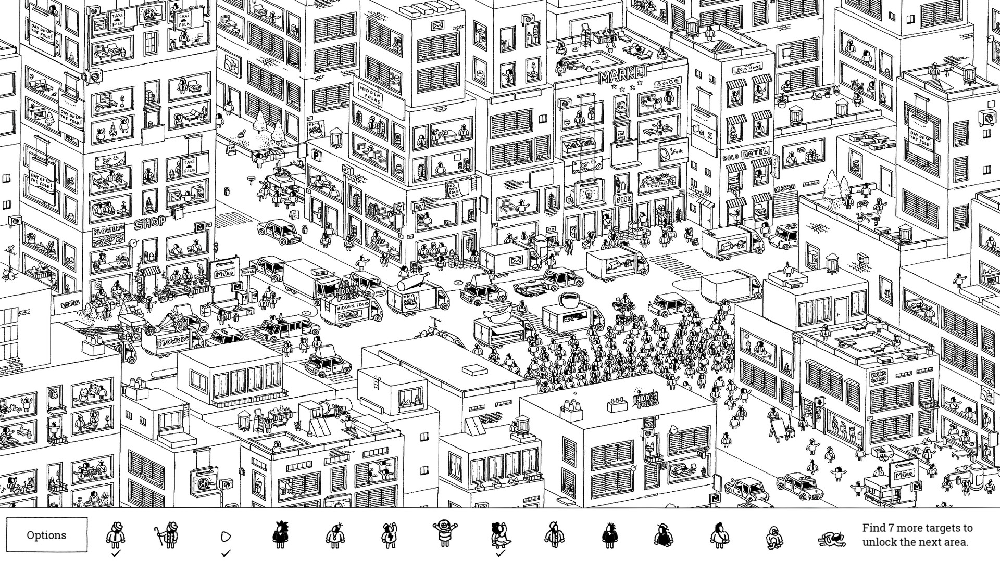

# Cours 7

## Le son - et Jalon 1

Ferme les yeux devant un bon jeu : tu sais encore tout ce qui se passe. Ouvre les yeux et coupe le son : le jeu semble mort. Aujourd'hui : comprendre ce que le son **fait**, puis sonoriser ton jeu. La séance se termine par le **premier jalon sommatif**.

<!-- ## Déroulement de la séance

| Temps | Activité |
|---|---|
| 0h00 – 0h10 | Retour express, questions |
| 0h10 – 1h10 | Théorie : le design sonore, l'audio dans Unity |
| 1h10 – 1h25 | Pause |
| 1h25 – 2h30 | Pratique : sonoriser ton jeu |
| 2h30 – 3h00 | Test croisé par les pairs (grille) |
| 3h00 – 3h25 | Présentations éclair |
| 3h25 – 3h35 | Build + remise du Jalon 1 | -->

## Théorie

### Les 4 fonctions du son dans un jeu

| Fonction | Ce que ça fait | Exemple |
|---|---|---|
| **Feedback** | Confirme qu'une action a marché (ou pas) | Le *ding* de la pièce de Mario |
| **Ambiance** | Installe le lieu et l'émotion | Vent, grillons, drone inquiétant |
| **Orientation** | Guide sans image | Une cascade qu'on entend avant de la voir |
| **Information** | Prévient, avertit | Le cœur qui bat quand la vie est basse |

{data-zoom-image}

[A Blind Legend (2016)](https://store.steampowered.com/app/437530/A_Blind_Legend/) pousse la logique au bout : **aucune image**. Le joueur navigue et se bat uniquement à l'oreille. Preuve que le son n'accompagne pas le jeu - il PEUT être le jeu.

{data-zoom-image}

[Hidden Folks (2017)](https://store.steampowered.com/app/435400/Hidden_Folks/) : tous les sons sont faits **à la bouche** - et c'est devenu l'identité du jeu. Leçon : la cohérence sonore bat la qualité studio. Tes sons doivent se ressembler entre eux.

!!! example "Mini-activité (5 min)"
    J'ouvre un jeu au projecteur, écran caché, haut-parleurs ouverts. À l'oreille seulement : que se passe-t-il? Comment le savez-vous? - Voilà tout ce que ton jeu muet ne communique pas encore.

### Les couches d'une bande sonore de jeu

1. **Musique** : l'émotion de fond - en boucle, discrète
2. **Ambiance** : le lieu (vent, foule, machines) - souvent oubliée, énorme différence
3. **SFX** (effets) : les actions - courts, réactifs
4. **UI** : les clics et confirmations de menus

Un petit jeu n'a pas besoin des quatre. **Minimum vital pour le jalon : une musique/ambiance + des SFX sur les événements importants.** Et n'oublie pas l'outil le plus sous-estimé : le **silence** - un moment sans musique juste avant la victoire la rend deux fois plus forte.

### Formats : lequel pour quoi?

| Format | Compression | Latence | Usage recommandé |
|---|---|---|---|
| `.wav` | Aucune (lourd) | Nulle | **SFX** - la réactivité avant tout |
| `.ogg` | Bonne (léger) | Faible | **Musique et ambiances** |
| `.mp3` | Bonne | Variable | Acceptable pour la musique |

### L'audio dans Unity : 3 pièces

* **AudioClip** : le fichier son importé (ta matière première)
* **AudioSource** : le composant qui **joue** un clip - c'est lui qu'on configure
* **AudioListener** : les « oreilles » - **une seule** par scène, déjà sur ta caméra. Deux Listeners = avertissement et chaos

Les paramètres d'AudioSource qui comptent :

| Paramètre | Effet |
|---|---|
| **AudioClip** | Le son à jouer |
| **Play On Awake** | Joue dès le démarrage (oui pour la musique, non pour les SFX) |
| **Loop** | En boucle (musique, ambiances) |
| **Volume** | 0 à 1 - ta musique devrait vivre autour de 0.3 |
| **Pitch** | Vitesse/hauteur - on s'en servira au cours 12 pour le juice |
| **Spatial Blend** | 0 = **2D** (partout pareil : musique, UI) · 1 = **3D** (localisé : cascade, radio) |

Trois façons de déclencher un son par code - choisis la bonne :

| Méthode | Comportement | Usage |
|---|---|---|
| `source.Play()` | Joue le clip de l'AudioSource | Musique, boucles |
| `source.PlayOneShot(clip)` | Joue par-dessus, sans couper | SFX répétés (pas, tirs) |
| `AudioSource.PlayClipAtPoint(clip, position)` | Crée une source temporaire à un endroit | **SFX d'un objet qui disparaît** (notre clé!) |

Pourquoi `PlayClipAtPoint` pour la clé? Parce que `SetActive(false)` coupe tout ce que l'objet jouait - la source temporaire, elle, survit à l'objet. Piège classique évité.

### Où trouver des sons - et l'obligation de citer

* [Freesound](https://freesound.org) - immense, vérifier la licence de chaque son
* [Kenney](https://kenney.nl/assets?q=audio) - packs entiers en **CC0** (usage libre, même commercial)
* [Pixabay](https://pixabay.com/sound-effects/) - libre d'utilisation, simple

Deux licences à connaître : **CC0** = fais ce que tu veux · **CC-BY** = libre, mais tu DOIS créditer l'auteur. Chaque son de ton jeu entre dans ton README : *titre - auteur - source (lien) - licence*. C'est exigé au projet final, c'est la loi, et c'est le réflexe professionnel.

## Pratique

Choisir et importer tes sons, poser l'ambiance et les SFX sur événements, puis tester, présenter et remettre le Jalon 1.

[Exercice - Sonoriser TON jeu :material-arrow-right:](./exercices/cours07-sonoriser-ton-jeu.md){ .md-button .md-button--primary }

## Devoir

* Applique les correctifs issus des retours de ton pair

## Ressources

* [Freesound](https://freesound.org) · [Kenney Audio](https://kenney.nl/assets?q=audio) · [Pixabay SFX](https://pixabay.com/sound-effects/)
* [Documentation Unity : AudioSource](https://docs.unity3d.com/ScriptReference/AudioSource.html)

## Savoirs essentiels touchés

Intégration de médias sonores dans l'environnement virtuel, déclenchement d'échantillons sonores, compilation de l'application.
