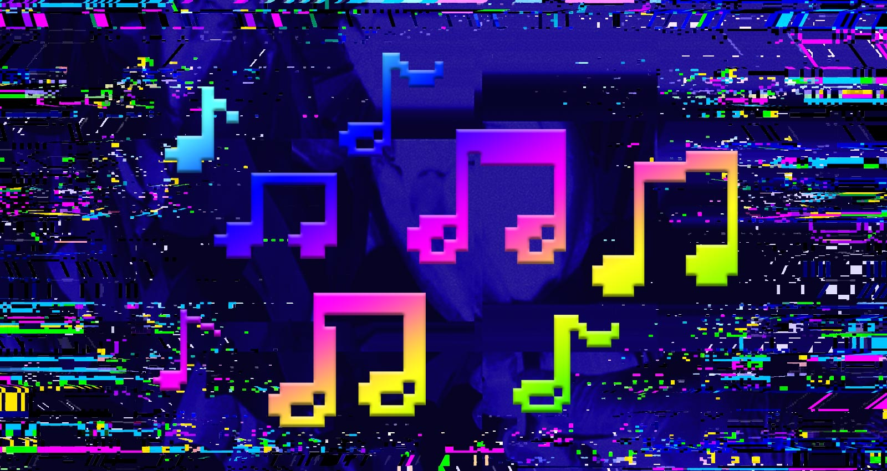
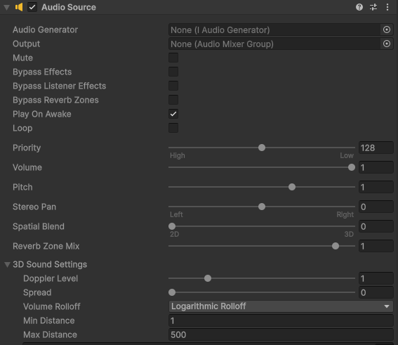
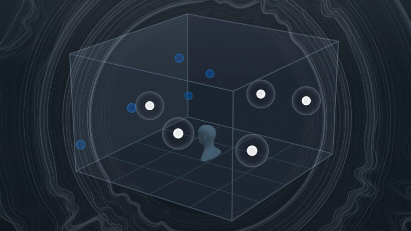
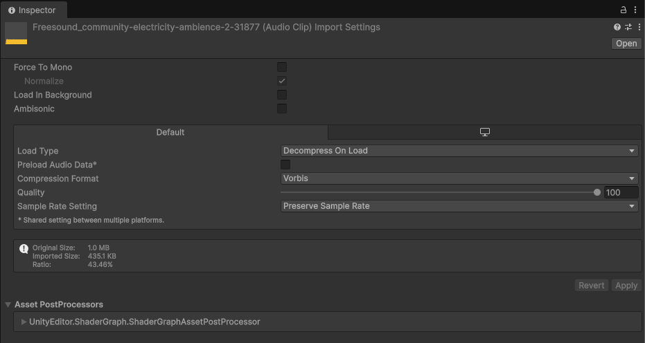
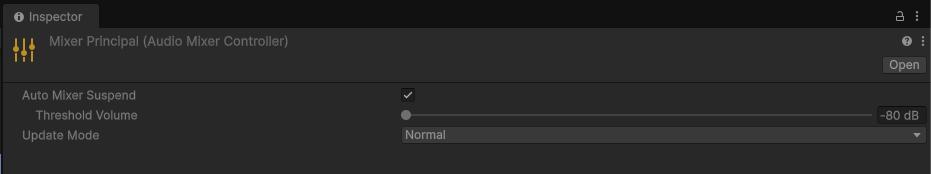
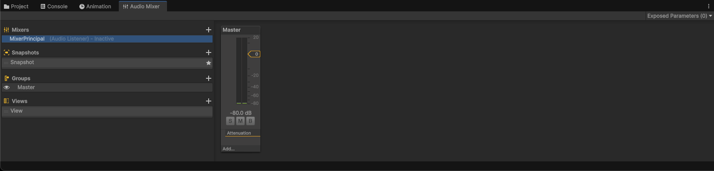
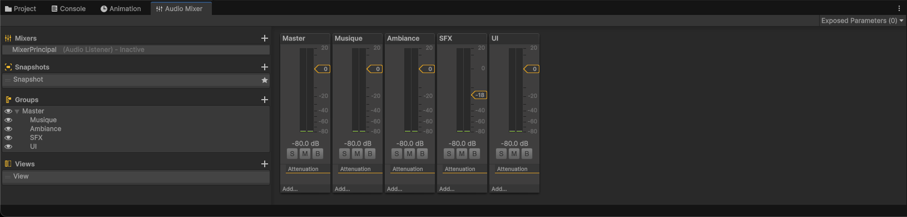

# Cours 7

*[HUD]: Heads-Up Display
*[HP]: Hit Points
*[CES]: Collider Event System

[STOP]

## HUD : vie, inventaire et minuterie

| Donnée | Variable CES | Exemples |
|---|---|---|
| Points de vie | **Int Variable** | `HP` |
| Objet qu'on compte | **Int Variable** | `Pieces`, `Munitions`, `Cristaux` |
| Objet unique | **Bool Variable** | `aCle`, `aLampe` |

!!! info "Le CES écrit, le script affiche"

    Le CES modifie les variables sans code, mais il ne sait pas écrire dans un texte du Canvas. C'est le seul rôle des petits scripts ci-dessous. Ils vont dans **Assets > _ > Scripts**.

!!! tip "Un HUD qui tient à toutes les résolutions"
    Avant de placer quoi que ce soit : **Canvas Scaler** en **Scale With Screen Size** ([cours 5](./cours05.md#canvas)) et chaque élément **ancré** à son coin ([Rect Transform](./cours05.md#rect-transform)). Tester ensuite dans l'onglet **Game** en 16:9, puis en 4:3.

## HUD | Points de vie

### La variable

1. Dans **Assets > _ > Variables**, clic-droit **Create > Collider Event System > Variables > Int Variable**
1. La nommer `HP`, **Initial Value** = `100`
1. Laisser **Persistent** décoché (sinon la valeur survit au Stop)

### Ouch !

1. Glisser un **Trigger Cube** qui représentera du danger (lave, feu, etc.)
1. Ajouter une action de type variable. Utilise la variable `HP` pour changer sa valeur. 
  > Ex. : **Value Mode** = **Additive** et **Int Value** = `-10`
1. **After Trigger** :
  - **Do Nothing** : blesse à chaque nouvelle entrée (il faut sortir et revenir)
  - **Destroy** : blesse une seule fois

!!! info "Potion de vie"

    Si on ramasse une potion, c'est la même méthode, mais on ajoute `+25`.

### Afficher le nombre

1. Dans le Canvas, clic-droit **UI (Canvas) > Text - TextMeshPro**, ancré en haut à gauche par exemple
1. Ajouter le script `AfficherVariable` sur ce texte
1. Glisser la variable `HP` dans **Variable**, **Format** = `HP : {0}`

```c# title="AfficherVariable.cs"
using UnityEngine;
using TMPro;
using ColliderEventSystem;

[RequireComponent(typeof(TMP_Text))]
public class AfficherVariable : MonoBehaviour
{
    public IntVariable variable;          // L'asset à afficher (HP, Gemmes ...)
    public string format = "{0}";         // {0} est remplacé par la valeur

    TMP_Text texte;
    int derniereValeur;
    bool premiereFois = true;

    void Start()
    {
        texte = GetComponent<TMP_Text>();
    }

    void Update()
    {
        if (variable == null) return;

        int valeur = variable.RuntimeValue;

        // Rien n'a changé : on ne touche pas au texte
        if (!premiereFois && valeur == derniereValeur) return;

        texte.text = string.Format(format, valeur);
        derniereValeur = valeur;
        premiereFois = false;
    }
}
```

!!! tip "Le format"
    `HP : {0}` donne « HP : 90 ». `× {0}` donne « × 3 ». `{0:000}` donne « 007 ».

#### Afficher une barre

1. Dans le Canvas, clic-droit **UI (Canvas) > Slider**
1. Supprimer l'enfant **Handle Slide Area** (la poignée)
1. Colorer **Fill Area > Fill** (ou y mettre un sprite _9-slice_, vu au [cours 6](./cours06.md))
1. Ajouter le script `BarreVariable`, glisser `HP` dans **Variable**, **Maximum** = `100`

```c# title="BarreVariable.cs"
using UnityEngine;
using UnityEngine.UI;
using ColliderEventSystem;

public class BarreVariable : MonoBehaviour
{
    public IntVariable variable;          // L'asset HP
    public int maximum = 100;
    public float vitesse = 100f;          // Vitesse de glissement de la barre

    Slider barre;

    void Start()
    {
        barre = GetComponent<Slider>();
        barre.interactable = false;       // Le joueur ne peut pas la glisser
        barre.maxValue = maximum;
        barre.value = variable.RuntimeValue;
    }

    void Update()
    {
        // La barre glisse vers la valeur au lieu de sauter
        barre.value = Mathf.MoveTowards(barre.value, variable.RuntimeValue, vitesse * Time.deltaTime);
    }
}
```

!!! tip "Un bout de barre reste visible à 0?"
    Mettre **Left** et **Right** à `0` dans le Rect Transform de **Fill Area** et de **Fill**.

#### Mourir

Un **Condition Watcher** (vu au [cours 6](./cours06.md)) surveille une variable en continu, sans zone :

1. Créer un Empty Object `GameOver`, lui ajouter **Condition Watcher**
1. **Add Condition > Variable** : `HP` **Less Than Or Equal** `0`
1. Actions, **dans cet ordre** :
    1. **Variable** : `HP`, **Set**, `100`
    1. **Scene** : la scène de fin, ou le niveau à recommencer

!!! danger "Recharger une scène ne remet pas les variables à zéro"
    Une variable CES vit **en dehors** des scènes. Sans l'action **Set 100**, le niveau rechargé démarre à 0 HP… et le Game Over se redéclenche aussitôt, en boucle. **Toujours réinitialiser avant de recharger.**

!!! tip "Plafonner la vie"
    Une potion à 90 HP en donne 115. Un deuxième Condition Watcher règle ça sans code : `HP` **Greater Than** `100` → **Variable** **Set** `100`, After Trigger **Do Nothing**.

### Inventaire

Un inventaire, c'est un ensemble de variables : une **Int** par objet qu'on compte, une **Bool** par objet unique.

#### Ramasser un objet qu'on compte

1. Créer une Int Variable `Pieces` (**Initial Value** = `0`)
1. Placer une pièce (modèle Synty) et glisser un **Trigger Cube** comme **enfant**, `Required Tags` = `Player`
1. **Add Action > Variable** : `Pieces`, **Additive**, `1`
1. **After Trigger** = **Destroy Parent** : la pièce disparaît avec sa zone
1. Glisser la pièce dans **Assets > _ > Prefabs** et la semer dans le niveau
1. Dans le Canvas : une **Image** (icône de pièce) et, à côté, un texte avec `AfficherVariable`, **Format** = `× {0}`

#### Animer l'objet à ramasser (🥕)

Un objet qui tourne ou flotte se remarque de loin et dit « prends-moi ». On l'anime **dans son prefab**, pour que chaque copie semée dans le niveau soit animée.

1. Créer un Empty Object à `0, 0, 0` et le renommer `Carotte animée`
1. Positionner la carotte à `0, 0, 0`, puis la glisser **sous** `Carotte animée` pour qu'elle devienne son enfant
1. Glisser `Carotte animée` dans **Assets > _ > Prefabs**
1. Double-cliquer sur le prefab pour l'éditer en mode isolé
1. Sélectionner la **carotte** (l'enfant, pas le parent) et l'animer par _keyframes_ comme au [cours 6](./cours06.md#animation-par-keyframe) : une rotation complète en Y, une petite montée et descente en Y. Nommer le clip `pick-me` et le ranger dans **Assets > _ > Animations**
1. Ajouter un **Trigger Cube** comme enfant de `Carotte animée`, puis les actions de [Ramasser un objet qu'on compte](#ramasser-un-objet-quon-compte), avec **After Trigger** = **Destroy Parent**

!!! warning "Pourquoi un parent vide?"
    Une animation enregistre des positions **locales**. Animée directement, la carotte reviendrait à la position enregistrée dans le clip, peu importe où on l'a placée dans le niveau. Animée **sous** un parent, elle bouge autour de lui, et c'est le parent qu'on déplace librement dans la scène.

!!! tip "Carotte empoisonnée"
    Le même prefab peut faire mal : remplacer l'action par **Variable** `HP`, **Additive**, `-10` (voir [Ouch !](#ouch)). Un objet attirant qui blesse doit quand même se distinguer d'un objet sain (couleur, particules, son), sinon le joueur se sent piégé.

#### Objet unique : une icône

Pas besoin de script :

1. Dans **Assets > _ > Variables**, clic-droit **Create > Collider Event System > Variables > Bool Variable**, la nommer `aCle` (**Initial Value** = ☐)
1. Dans le Canvas, une **Image** de l'objet (ex. : la clé), **désactivée** au départ
1. Sur la zone où l'objet est ramassé, deux actions :
    1. **Variable** : `aCle`, **Set**, ✅
    1. **Game Object** → l'icône, **Enable**
1. Là où l'objet est utilisé (la porte), les deux inverses : **Variable** `aCle` **Set** ☐, puis **Game Object** → l'icône, **Disable**

!!! warning "Le HUD peut mentir"
    L'icône et la variable `aCle` sont deux choses séparées. Les modifier toujours **dans la même zone**, sinon l'écran affiche une clé que le jeu ne considère pas comme ramassée (ou l'inverse).

#### Dépenser

Une porte, un marchand, un autel qui exige un prix :

1. Trigger Cube, **Add Condition > Variable** : `Pieces` **Greater Than Or Equal** `5`
1. Actions : **Variable** `Pieces` **Additive** `-5`, puis l'effet (ouvrir, faire apparaître, etc.)
1. Ajouter une deuxième condition, `aCle` = ✅, reliée par **And**

C'est exactement ce que demande le [projet final](./devoirs/projet-final/index.md) pour passer d'un niveau à l'autre : **deux conditions enchaînées**.

!!! info "Limite du CES"
    Une variable est **partagée** : tout ce qui la lit voit la même valeur. Parfait pour le joueur, mais dix ennemis ne peuvent pas partager un seul `HP`. La vie de chaque ennemi demande un script.

#### Nouvelle partie

Les variables gardent leur valeur d'un niveau à l'autre, et c'est voulu : le joueur conserve ses pièces. Mais au début d'une **nouvelle partie**, tout doit repartir à neuf.

Un **Condition Watcher sans aucune condition** s'exécute dès le chargement de la scène :

1. Dans la scène d'accueil (ou le premier niveau), Empty Object `NouvellePartie` + **Condition Watcher**
1. Une action **Variable** **Set** par variable : `HP` = `100`, `Pieces` = `0`, `aCle` = ☐
1. **After Trigger** = **Destroy**

??? example "Minuterie (optionnel)"

    Un compte à rebours affiché, et une action quand il atteint zéro : survivre 60 secondes, sortir avant l'effondrement, désamorcer la bombe.

    ```c# title="Minuterie.cs"
    using UnityEngine;
    using UnityEngine.Events;
    using TMPro;

    public class Minuterie : MonoBehaviour
    {
        public float duree = 60f;                 // En secondes
        public TMP_Text texte;                    // Le texte du Canvas
        public bool demarrerAuLancement = true;
        public UnityEvent quandTermine;           // Comme le On Click d'un bouton

        float restant;
        bool enCours;

        void Start()
        {
            restant = duree;
            enCours = demarrerAuLancement;
            Afficher();
        }

        void Update()
        {
            if (!enCours) return;

            restant -= Time.deltaTime;

            if (restant <= 0)
            {
                restant = 0;
                enCours = false;
                quandTermine.Invoke();
            }

            Afficher();
        }

        public void Demarrer()
        {
            restant = duree;
            enCours = true;
        }

        public void Arreter()
        {
            enCours = false;
        }

        void Afficher()
        {
            int secondes = Mathf.CeilToInt(restant);
            texte.text = string.Format("{0:00}:{1:00}", secondes / 60, secondes % 60);
        }
    }
    ```

    1. Dans le Canvas, un **Text - TextMeshPro** (en haut, au centre)
    1. Créer un Empty Object `Minuterie`, lui ajouter le script, glisser le texte dans **Texte**, régler **Duree**
    1. Dans **Quand Termine**, cliquer sur **+** et brancher l'action, comme le **On Click** d'un bouton :
      - **Activer un panneau** « Temps écoulé » du Canvas : glisser le panneau, **GameObject > SetActive** ✅
      - **Déclencher n'importe quelle action du CES** : activer un objet désactivé qui porte un **Condition Watcher sans condition**. Dès qu'il s'active, ses actions s'exécutent (charger une scène, retirer des HP, jouer un son…)

    !!! example "Course contre la montre, sans une ligne de plus"
        Décocher **Demarrer Au Lancement**. Une zone de départ appelle **Minuterie > Demarrer** avec **Add Action > Invoke Events**; la zone d'arrivée appelle **Minuterie > Arreter**.

    !!! tip "Et la pause?"
        La minuterie compte avec `Time.deltaTime` : quand le menu pause met `Time.timeScale` à `0`, elle s'arrête d'elle-même.

## Le menu pause

Mettre le jeu en pause, c'est figer le temps : `Time.timeScale` règle la vitesse à laquelle le temps s'écoule dans Unity.

| Valeur | Effet |
|---|---|
| `1` | Vitesse normale |
| `0.5` | Ralenti |
| `0` | Temps figé : la physique, les animations et tout ce qui dépend de `Time.deltaTime` s'arrêtent |

!!! warning "Ce que `timeScale` n'arrête pas"
  - `Update()` continue d'être appelée : un code qui ne se sert pas de `Time.deltaTime` continue de tourner.
  - L'interface (boutons, survol) reste cliquable, heureusement.
  - Le son continue de jouer. Pour l'étouffer, passer par un snapshot de l'Audio Mixer ([plus bas](#etouffer-le-jeu-en-pause)); pour le couper, `AudioListener.pause = true;`.
  - Avec les Starter Assets, la caméra suit encore la souris : le mouvement de la souris n'est pas multiplié par `Time.deltaTime`.

#### Monter le menu

1. Dans le **Canvas** du niveau, créer un **Panel** nommé `MenuPause`
1. Y ajouter un titre (TextMeshPro) et deux boutons : **Reprendre** et **Accueil**
1. Désactiver `MenuPause` (case à cocher en haut de l'**Inspector**) : il est caché au démarrage
1. Ajouter le script ci-dessous sur le **Canvas** (pas sur `MenuPause` : un objet désactivé n'exécute pas son `Update`), puis glisser `MenuPause` dans **Menu Pause**
1. **On Click** du bouton Reprendre → `GestionPause.Reprendre`; du bouton Accueil → `GestionPause.RetourAccueil`

```c# title="GestionPause.cs"
using UnityEngine;
using UnityEngine.InputSystem;
using UnityEngine.SceneManagement;

public class GestionPause : MonoBehaviour
{
    public GameObject menuPause;          // Glisser le Panel MenuPause ici
    public string sceneAccueil = "Accueil";

    bool enPause = false;

    void Update()
    {
        // Touche Échap (nouveau Input System, comme les Starter Assets)
        if (Keyboard.current.escapeKey.wasPressedThisFrame)
        {
            if (enPause) Reprendre();
            else Pause();
        }
    }

    public void Pause()
    {
        enPause = true;
        menuPause.SetActive(true);
        Time.timeScale = 0f;
        Cursor.lockState = CursorLockMode.None;
        Cursor.visible = true;
    }

    public void Reprendre()
    {
        enPause = false;
        menuPause.SetActive(false);
        Time.timeScale = 1f;
        Cursor.lockState = CursorLockMode.Locked;
        Cursor.visible = false;
    }

    public void RetourAccueil()
    {
        Time.timeScale = 1f; // Sinon la scène suivante démarre figée !
        SceneManager.LoadScene(sceneAccueil);
    }
}
```


## Le son



### Fonctions du son

| Fonction | Ce que ça fait | Exemple |
|---|---|---|
| **Rétroaction** | Confirme qu'une action a fonctionné (ou non) |  |
| **Ambiance** | Installe le lieu et l'émotion |  |
| **Orientation** | Guide sans image |  |
| **Information** | Prévient, avertit |  |

### Bande sonore

{.w-100 .aspect-16-9}

1. **Musique** : l'émotion de fond, en boucle, discrète
1. **Ambiance** : le lieu (vent, foule, machines). Souvent oubliée, mais fait vraiment la différence
1. **SFX** (effets) : les actions. Courts et réactifs
1. **UI** : clics et confirmations des menus

!!! tip "Le silence à double tranchant"

    Placé au mauvais endroit, il peut gâcher l'expérience.

    Placé au bon endroit, il peut l'amplifier ! Par exemple, couper la musique juste avant un combat épique crée une tension très efficace.

### Audio et Unity

* **AudioClip** : le fichier importé, dans **Assets > _ > Audio**
* **AudioSource** : le composant qui joue un clip
* **AudioListener** : les « oreilles » (Important : un seul actif à la fois). Vient par défaut avec une caméra

#### Audio Source

{data-zoom-image .w-50}

| Paramètre d'AudioSource | Effet |
|---|---|
| **Audio Generator** | Ce que la source joue : un AudioClip glissé du panneau **Project** ou un **Audio Random Container** (voir plus bas) |
| **Output** | Le groupe de l'Audio Mixer où le son est envoyé (voir plus bas) |
| **Play On Awake** | Joue au démarrage |
| **Loop** | En boucle : musique, ambiance |
| **Volume** | 0 à 1. Une musique de fond vit autour de **0.3** |
| **Pitch** | Vitesse et hauteur. Une légère variation aléatoire évite l'effet « mitraillette » |
| **Spatial Blend** | 2D ou 3D (voir plus bas) |

<!-- https://www.youtube.com/watch?v=FOewaiJeM2k -->

#### _Spatial blend_

{.w-50 data-zoom-image}

- **Spatial Blend = 0 (2D)** : même volume partout. Musique, UI, voix du narrateur.
- **Spatial Blend = 1 (3D)** : le son a une position. Le volume baisse avec la distance et le son passe d'une oreille à l'autre.

Dans **3D Sound Settings** :

| Réglage | Rôle |
|---|---|
| **Doppler Level** | `0` = Pas d'effet Doppler |
| **Spread** | "Largeur" d'un son 3D. Détermine la précision 3D d'un emplacement (ex. 0 = mouche, 130 = rivière) |
| **Volume Rolloff** | `Logarithmic` est plus réaliste, mais `Linear` est plus prévisible techniquement parlant |
| **Min Distance** | En deçà, le son est à plein volume |
| **Max Distance** | Au-delà, le son ne baisse plus (ou s'éteint en mode *Linear*) |


<!-- ??? quote "Spread"

    Le Spread ajuste la "largeur" d'un son 3D. Ça détermine un peu la précision d'un emplacement.

    À 0, le son est spacialisé très précisément (ex. : une mouche)
    
    À 180, le son est large, la direction devient floue (ex. : une rivière) -->

### Configuration du clip

{data-zoom-image .w-50}

Cliquer sur un fichier audio dans le panneau **Project** affiche ses **Import Settings** dans l'**Inspector**. Les valeurs par défaut conviennent presque partout. Trois choses à retenir :

1. **Force To Mono** : à cocher pour tout son **3D**. Unity le spatialise lui-même, la stéréo d'origine ne sert à rien
1. **Load Type** = `Streaming` pour la musique : elle est lue au fur et à mesure au lieu d'occuper la mémoire. Le reste peut rester par défaut
1. **Apply** : Ne pas oublier pas de sauvegarder en cliquant Apply dans l'Inspector

!!! note "Plusieurs clips à la fois"

    Sélectionner plusieurs fichiers dans le panneau **Project** permet de les régler tous d'un coup.

??? quote "Réglages d'optimisation"

    | Réglage | Rôle |
    |---|---|
    | **Normalize** | Remonte le volume après la fusion. Laisser coché |
    | **Load In Background** | Charge le son sans bloquer le jeu, mais il risque de ne pas être prêt au premier Play |
    | **Ambisonic** | Pour les enregistrements 360° (VR). Laisser décoché |
    | **Preload Audio Data** | Charge le son avec la scène. Décoché, il est chargé au premier Play : petit délai la première fois |
    | **Compression Format** | `Vorbis` (défaut) convient à tout. `PCM` (aucune compression) sert à optimiser un SFX très court |
    | **Quality** | (Vorbis) `100` = meilleure qualité. Entre `50` et `70`, la différence est rarement audible et le fichier fond |
    | **Sample Rate Setting** | `Preserve Sample Rate` par défaut. `Optimize` laisse Unity réduire la fréquence si le son le permet |

    | Load Type | Mémoire | Usage |
    |---|---|---|
    | `Decompress On Load` (défaut) | Lourd, mais aucun calcul pendant le jeu | SFX courts joués souvent |
    | `Compressed In Memory` | Léger, petit calcul à chaque lecture | Ambiances et sons moyens |
    | `Streaming` | Presque rien : lu au fur et à mesure | Musique et longues ambiances |

    En bas de l'**Inspector**, **Original Size** / **Imported Size** montre le gain sur le poids du build.


### Humaniser

<div class="grid" markdown>
<div markdown>{.h-auto}</div>
<div markdown>{.h-auto}</div>
</div>

Le même pas joué 10 fois de suite devient vite agaçant 💩

L'**Audio Random Container** pige au hasard parmi plusieurs clips et peut varier le volume et le pitch, sans code !

Le container est un **asset** (un fichier dans le panneau **Project**), pas un objet de la **Hierarchy**.

#### Exemple de tir

{.h-auto .w-50}

Bonne nouvelle, le script `Tir.cs` n'a pas besoin d'être modifié 😁

1. Dans le panneau **Project**, dossier **Assets > _ > Audio**, clic-droit > **Create > Audio > Audio Random Container**
1. Nommer le container `Tir`
1. Double-cliquer sur `Tir`
1. Dans la fenêtre qui s'ouvre, 
  - Glisser 3 à 5 sons dans **Audio Clips**
  - **Trigger** = `Manual`
  - **Playback Mode** = `Random` ou `Shuffle`

Maintenant, on va ajouter ces sons carrément sur le prefab du projectile

1. Dans le panneau **Project**, dossier **Assets > _ > Prefabs** : double-cliquer sur le prefab **Bullet** (ou peu importe le nom donné). Il va s'ouvrir en mode isolé.
1. Dans la **Hierarchy**, sélectionner « Bullet » (l'Empty Object parent, pas la sphère)
1. Dans l'**Inspector** : **Add Component > Audio Source**, puis :
  - **Audio Generator** : y glisser l'Audio Random Container `Tir`
  - **Play On Awake** coché
  - **Loop** décoché
  - **Spatial Blend** = `0` (2D)
1. Sauvegarder
1. Quitter le mode isolé avec la flèche **<** en haut de la **Hierarchy**

!!! info "À savoir" 

    Chaque projectile a sa propre AudioSource, donc des tirs rapprochés se superposent au lieu de se couper.

### L'Audio Mixer

<!-- https://www.youtube.com/watch?v=GDGAJf58Twc -->

Sans mixer, chaque AudioSource a son propre volume : régler la musique de tout le jeu veut dire retrouver chaque source à la main. L'**Audio Mixer** est la console de mixage du jeu.

<div class='grid' markdown>
{data-zoom-image}

{data-zoom-image}
</div>

1. Dans le panneau **Project**, dossier **Assets > _ > Audio** : clic-droit > **Create > Audio Mixer**, le nommer `MixerPrincipal`
1. Double-cliquer sur `MixerPrincipal` : la fenêtre **Audio Mixer** s'ouvre (aussi accessible par **Window > Audio > Audio Mixer**). La mention `- Inactive` à côté du nom signifie seulement qu'aucun son ne passe dans le mixer en ce moment

### Les groupes

{data-zoom-image}

1. La fenêtre **Audio Mixer** a deux zones : à gauche, une liste en 4 sections (**Mixers**, **Snapshots**, **Groups**, **Views**); à droite, une bande verticale par groupe (au départ, seulement **Master**)
1. Dans **Groups** : cliquer sur `Master`
1. Cliquer le **+** à droite du titre **Groups** : un nouveau groupe apparaît sous `Master` (nom en édition, sinon double-cliquer dessus). Le nommer `Musique`
1. Resélectionner `Master` et répéter pour `Ambiance`, `SFX` et `UI`. Chaque groupe ajoute une bande à droite
1. Sélectionner un objet qui porte une **Audio Source** (ex. : Bullet)
1. Dans l'**Inspector**, champ **Output** : cliquer le rond ⊙ à droite et choisir un groupe (ex. : SFX)
1. Play
1. Dans **Audio Mixer**, cliquer **Edit in Play Mode** pour régler les volumes pendant qu'on joue. 

#### Les effets par groupe

{data-zoom-image .w-50}

En bas de chaque bande, sous **Attenuation** : cliquer **Add...** et choisir l'effet. 

| Effet | Usage |
|---|---|
| **Lowpass** | Coupe les aigus : son étouffé, sous l'eau, derrière un mur, menu pause |
| **SFX Reverb** | Écho d'une caverne, d'une cathédrale, d'un couloir |
| **Duck Volume** | Baisse automatiquement un groupe (ex. musique) quand un autre joue (ex. dialogue) |

#### Les snapshots

Un **snapshot** est une photo de tous les réglages du mixer (volumes et effets). On passe d'un snapshot à l'autre en douceur.

1. Dans la fenêtre **Audio Mixer**, à gauche, section **Snapshots** : double-cliquer sur `Snapshot` pour le renommer `Normal` (l'étoile ★ indique le snapshot de départ du jeu)
1. Cliquer le **+** à droite du titre **Snapshots** pour créer un deuxième snapshot, le nommer `Pause`
1. Cliquer sur `Pause` dans la section **Snapshots** : les réglages faits maintenant n'appartiennent qu'à ce snapshot
1. Dans la bande `Musique`, descendre la flèche de volume; dans la bande `Master`, **Add... > Lowpass**, puis cliquer sur **Lowpass** dans la bande et, dans l'**Inspector**, mettre **Cutoff freq** bas (ex. `800 Hz`)
1. Recliquer sur `Normal` dans la section **Snapshots** pour vérifier que le son d'origine est intact

!!! example "Trois usages de snapshot"
    Étouffer le jeu quand le menu pause s'ouvre. Passer en « sous l'eau » en entrant dans une zone. Baisser la musique pendant un dialogue.

**Changer de snapshot**

> Vous entrez dans une caverne et devez ajuster l'audio 🦇

{.w-50 .h-auto}

[AudioSnapshotSwitcher.cs](./extra/AudioSnapshotSwitcher.cs) passe d'un snapshot à un autre avec une transition, depuis le CES ou un bouton, sans écrire de code.

1. Dans le panneau **Project**, dossier **Assets > _ > Scripts**, ajouter `AudioSnapshotSwitcher.cs`
1. Dans la **Hierarchy** : clic-droit > **Create Empty**, le nommer `SnapshotManager`
1. Glisser `AudioSnapshotSwitcher` depuis le panneau **Project** dans l'**Inspector**
    - **Start Snapshot** (optionnel) : snapshot appliqué au lancement de la scène
    - **Transition Duration** : durée d'une transition, en secondes
1. Sur le Trigger Cube, dans l'**Inspector** : **Add Action > Invoke Events**, puis cliquer **+**
1. Glisser `SnapshotManager` depuis la **Hierarchy** dans le champ objet, puis choisir **AudioSnapshotSwitcher > TransitionTo (AudioMixerSnapshot)**
1. Dans le panneau **Project**, déplier `MixerPrincipal` (petite flèche) pour voir ses snapshots et glisser le snapshot voulu dans le champ sous la fonction

<!-- #### Étouffer le jeu en pause

Le menu pause peut passer lui-même au snapshot `Pause`. Dans `GestionPause.cs`, ajouter :

c# title="GestionPause.cs (ajouts)"
using UnityEngine.Audio;                    // En haut, avec les autres using

public AudioMixerSnapshot snapshotNormal;   // Glisser Normal ici
public AudioMixerSnapshot snapshotPause;    // Glisser Pause ici

// À la fin de Pause() :
snapshotPause.TransitionTo(0.3f);

// À la fin de Reprendre() et de RetourAccueil() :
snapshotNormal.TransitionTo(0.3f);


Dans l'**Inspector** du Canvas, déplier `MixerPrincipal` dans le panneau **Project** et glisser les deux snapshots dans les champs du script.

!!! danger "Snapshot + `Time.timeScale = 0`"

    Par défaut, le mixer avance au rythme du temps du jeu : en pause, la transition ne se fait jamais. Dans le panneau **Project**, sélectionner `MixerPrincipal`; dans l'**Inspector**, régler **Update Mode** à `Unscaled Time`. -->

### Déclencher un son

| Méthode | Quand l'utiliser |
|---|---|
| **CES, action Audio** | Un son lié à une zone ou à une collision : ramasser, entrer, toucher. Aucun code |
| **CES + `AudioCrossfader`** | Un fondu d'une ambiance ou d'une musique à une autre en entrant dans une zone ou en la quittant. Aucun code à écrire |
| **Script** | Un son lié à une logique : vie basse, minuterie, combo |

<!-- | ***Animation Event*** | Un son synchronisé sur une image précise d'une animation : pas, coup d'épée, porte qui claque | -->

#### Avec le CES

1. Dans la **Hierarchy**, sélectionner le **Trigger Cube**
1. Dans l'**Inspector**, composant **Collider Event**, section **Actions** : **Add Action > Audio**
1. Dans l'action, assigner le son à jouer

Pour jouer un **Audio Random Container**, passer plutôt par l'**Audio Source** qui le porte : action **Invoke Events**, cliquer **+**, glisser l'objet de l'Audio Source (depuis la **Hierarchy**) dans le champ objet, puis choisir **AudioSource > Play ()**.

#### Fondus

{data-zoom-image .w-50}

[AudioCrossfader.cs](./extra/AudioCrossfader.cs) passe d'une trame audio à une autre en fondu enchaîné. 

**Préparer les ambiances**

1. Dans la **Hierarchy** : clic-droit > **Create Empty**, le nommer (ex. : `Ambiance-Foret`)
1. Dans l'**Inspector** : **Add Component > Audio Source**
  - **Audio Generator** : glisser le son d'ambiance depuis le panneau **Project**
  - **Play On Awake** décoché (le script s'en charge)
  - **Loop** coché
  - **Volume** = Exemple `0.3`
1. Répéter pour chaque ambiance (ex. `Ambiance-Montages`, `Ambiance-Pluie`)

**Ajouter le gestionnaire**

1. Dans le panneau **Project**, dossier **Assets > _ > Scripts**, ajouter [AudioCrossfader.cs](./extra/AudioCrossfader.cs)
1. Dans la **Hierarchy** : clic-droit > **Create Empty**, le nommer `AmbianceManager`
1. Glisser le script dans son _Inspector_
  - **Start Source** (optionnel) : on laisse vide normalement
  - **Fade Duration** : durée en secondes d'une transition, en secondes (ex.: 3)

**Brancher le CES**

1. Placer un **Trigger Cube**
1. Dans l'**Inspector**, **Collider Event** > **Actions** > **Add Action > Invoke Events**, puis cliquer **+**
1. Glisser `AmbianceManager` depuis la **Hierarchy** dans le champ objet, puis choisir **AudioCrossfader > Play (AudioSource)**
1. Glisser l'ambiance de la zone (ex. `Ambiance-Grotte`) dans le champ sous la fonction

!!! tip "Arrêter la piste"

    Dans le CES, configurer un déclenchement de type **Sortie** qui appelle **AudioCrossfader > Stop ()**

<!-- #### Animation Event

1. Dans la **Hierarchy**, sélectionner l'objet animé (celui qui porte l'**Animator**)
1. Ouvrir **Window > Animation > Animation** et choisir le clip dans le menu en haut à gauche de la fenêtre
1. Placer la tête de lecture sur l'image voulue, puis cliquer **Add Event** (icône à droite du bouton **Add Keyframe**, en haut à gauche de la fenêtre)
1. Le marqueur d'événement sélectionné, dans l'**Inspector** : menu **Function** > choisir une fonction publique d'un script placé **sur le même objet que l'Animator**

!!! tip "Starter Assets : déjà fait"
    Le **Third Person Controller** des Starter Assets utilise déjà des Animation Events pour les pas. Il suffit de remplir **Footstep Audio Clips** et **Landing Audio Clip** dans l'Inspector. -->

#### Par script

??? note "`JouerSon.cs` et les méthodes de lecture"

    Le son est joué par une **Audio Source** : le script n'a qu'à lui dire quand jouer.

    ```c# title="JouerSon.cs"
    using UnityEngine;

    public class JouerSon : MonoBehaviour
    {
        public AudioSource source;   // Glisser l'Audio Source ici
        public AudioClip clip;       // Optionnel : pour PlayOneShot

        public void Jouer()
        {
            // Joue ce qui est dans Audio Generator (clip ou Audio Random Container)
            source.Play();
        }

        public void JouerParDessus()
        {
            // Joue un AudioClip par-dessus le son en cours, sans le couper
            source.PlayOneShot(clip);
        }
    }
    ```

    1. Dans le panneau **Project**, dossier **Assets > _ > Scripts** : créer le script `JouerSon` ci-dessus
    1. Dans la **Hierarchy**, sélectionner l'objet qui porte l'**Audio Source** (**Play On Awake** décoché)
    1. Glisser `JouerSon` depuis le panneau **Project** dans l'**Inspector**
    1. Dans le champ **Source** du script, glisser ce même objet depuis la **Hierarchy**

    `Jouer()` est publique : un bouton (**On Click**), une action **Invoke Events** du CES ou un autre script (`GetComponent<JouerSon>().Jouer();`) peuvent l'appeler.

    !!! warning "`Play()` coupe, `PlayOneShot()` superpose"
        `Play()` recommence le son de l'Audio Source depuis le début : deux appels rapprochés coupent le premier. `PlayOneShot(clip)` superpose, mais n'accepte qu'un **AudioClip**, pas un container.

    Les trois façons de jouer un son :

    | Méthode | Comportement | Usage |
    |---|---|---|
    | `source.Play()` | Joue le contenu de l'Audio Source (coupe le précédent) | Musique, boucles, Audio Random Container |
    | `source.PlayOneShot(clip)` | Joue par-dessus, sans couper | SFX répétés : pas, tirs |
    | `AudioSource.PlayClipAtPoint(clip, position)` | Crée une source temporaire à un endroit | SFX d'un objet **qui disparaît** |

    Déclencher les fondus ci-dessus par code :

    ```c#
    public AudioCrossfader ambiances;   // Glisser AmbianceManager ici
    public AudioSource grotte;          // Glisser Ambiance-Grotte ici

    // ...
    ambiances.Play(grotte);             // Fondu vers la grotte
    ambiances.Stop();                   // Fondu vers le silence
    ```
<!-- 
!!! danger "Le son qui ne joue pas"
    Un objet désactivé (`SetActive(false)`) ou détruit coupe tout ce que son AudioSource jouait. La carotte ramassée qui disparaît ne peut pas jouer son propre son : le son doit venir d'un **autre** objet (le joueur, le Trigger Cube) ou de `PlayClipAtPoint`. -->

### Trouver des sons

* [Freesound](https://freesound.org) : immense, vérifier la licence de **chaque** son
* [Kenney Audio](https://kenney.nl/assets?q=audio) : packs complets en **CC0**
* [Pixabay SFX](https://pixabay.com/sound-effects/) : libre d'utilisation, simple

| Licence | Ce qu'elle permet |
|---|---|
| **CC0** | Tout, sans obligation |
| **CC-BY** | Tout, **à condition de créditer l'auteur** |
| **CC-BY-NC** | Usage non commercial seulement : à éviter pour un jeu publié sur itch.io avec dons |

Chaque son du jeu entre dans le `README` du répertoire, **au moment où on l'importe** : voir [Les crédits des assets](#les-credits-des-assets).

??? quote "En studio : FMOD et Wwise"

    {.w-50}

    En studio, le son n'est souvent pas géré dans Unity, mais dans un **intergiciel** (*middleware*) audio : [FMOD](https://www.fmod.com) ou [Wwise](https://www.audiokinetic.com/fr/wwise/). Le concepteur sonore y travaille dans son propre logiciel et le programmeur n'appelle qu'un **événement** (`"Pas_Herbe"`, `"Musique_Combat"`).

    Ces technologies reposent sur des threads que WebGL ne supporte pas (ce qui sera utilisé pour la remise finale) donc à ne pas installer.

## Les crédits des assets

Les sons s'ajoutent aux modèles, textures, polices et packs déjà importés. Chaque média externe se note **dans le `README`, au moment où on l'importe**. Plus tard, cette liste sert à écrire l'**écran de crédits** du jeu et la page itch.io.

Dans le `README.md`, ajouter une section `## Crédits` :

```markdown
## Crédits

| Asset | Type | Auteur | Source | Licence | Utilisé pour |
|---|---|---|---|---|---|
| Footstep_Grass_01 | Son | InspectorJ | [Freesound](https://freesound.org/s/123456/) | CC-BY 4.0 | Pas du joueur, zone 1 |
| Impact Sounds | Pack son | Kenney | [kenney.nl](https://kenney.nl/assets/impact-sounds) | CC0 | Coups, chutes |
| Night Forest | Musique | Nom de l'artiste | [Pixabay](https://pixabay.com/music/...) | Licence Pixabay | Musique zone 2 |
| POLYGON Dungeon | Pack 3D | Synty Studios | [Asset Store](https://assetstore.unity.com/...) | Licence standard Unity Asset Store | Décor zone 3 |
| Press Start 2P | Police | CodeMan38 | [Google Fonts](https://fonts.google.com/specimen/Press+Start+2P) | OFL | HUD et menus |
```

| Colonne | Quoi écrire |
|---|---|
| **Asset** | Le nom d'origine, celui qu'on retrouvera sur le site (même si le fichier a été renommé dans Unity) |
| **Type** | Son, musique, modèle 3D, texture, police, script, pack… |
| **Auteur** | Le pseudo ou le nom tel qu'affiché sur la page de l'asset |
| **Source** | Le lien **direct** vers la page de l'asset, pas vers la page d'accueil du site |
| **Licence** | La licence exacte, avec la version si elle existe (CC-BY **4.0**) |
| **Utilisé pour** | Où on l'entend ou le voit dans le jeu : utile pour retrouver ce qui peut être retiré |

!!! tip "Cinq minutes maintenant, deux heures à la fin"
    Ajouter la ligne **dès l'import**, pendant que l'onglet du navigateur est encore ouvert. Retrouver l'auteur d'un `explosion_final_v2.wav` trois semaines plus tard, c'est fouiller tout Freesound.

!!! warning "Aussi ce qui est gratuit et CC0"
    CC0 n'oblige pas à créditer, mais on le note quand même : c'est la **preuve** que l'asset est utilisable. Même chose pour les packs Synty, les Starter Assets d'Unity et les scripts récupérés en ligne.

!!! info "Du README à l'écran de crédits"
    L'écran de crédits du jeu (exigé au projet final) reprend cette liste, regroupée par type : *Musique*, *Effets sonores*, *Modèles 3D*, *Polices*. Pour une licence **CC-BY**, la mention *titre — auteur — licence* doit apparaître **dans le jeu**, pas seulement sur GitHub.

## Trello : backlog

Catégorisation [MoSCoW](https://fr.wikipedia.org/wiki/M%C3%A9thode_MoSCoW) : `Must`, `Should`, `Could`, `Won't`

### Propositions de cartes

Une carte = une action qui tient dans une séance de labo. L'étiquette MoSCoW proposée suit les exigences du [projet final](./devoirs/projet-final/index.md) : ce qui y est exigé est `Must`.

**Prototype jouable (premier jalon)**

- `Must` Monter les zones 2 et 3 en greybox
- `Must` Construire le passage 1 → 2 et vérifier les trois règles (thématique, prérequis, récompense)
- `Must` Construire le passage 2 → 3 et vérifier les trois règles
- `Must` Construire le passage final vers l'écran de victoire
- `Must` Brancher la défaite (HP à 0 ou minuterie écoulée) vers un écran de fin
- `Must` Recommencer une partie sans relancer le jeu (remettre les variables à zéro)

**HUD**

- `Must` Afficher les points de vie (nombre ou barre)
- `Must` Afficher un indicateur de progression (objets ramassés, fragments, clés)
- `Should` Afficher l'icône d'un objet unique quand on l'obtient
- `Could` Ajouter une minuterie à une zone
- `Must` Tester le HUD à deux résolutions (16:9 et 4:3)

**Menu pause**

- `Must` Monter le menu pause (Échap, `timeScale`, boutons Reprendre et Quitter)
- `Should` Ajouter un panneau Options au menu pause

**Son**

- `Must` Créer l'Audio Mixer avec les groupes Musique et SFX (+ Ambiance, UI)
- `Must` Poser une ambiance en boucle dans la zone 1
- `Must` Poser une ambiance en boucle dans la zone 2
- `Must` Poser une ambiance en boucle dans la zone 3
- `Must` Ajouter un son spatialisé 3D (source fixe dans le décor)
- `Must` Ajouter 5 sons déclenchés par des événements (ramasser, blesser, ouvrir, réussir, échouer)
- `Should` Ajouter de la variation (pitch ou clips multiples) aux sons répétés : pas, tir
- `Should` Synchroniser les pas avec l'animation (Animation Event)
- `Should` Ajouter un fondu de musique au changement de zone
- `Could` Créer un snapshot pour le menu pause (son étouffé)
- `Could` Ajouter des sons aux boutons des menus

**Crédits**

- `Must` Créer la section `## Crédits` du README et y entrer les assets déjà importés
- `Must` Monter l'écran de crédits accessible depuis le menu titre
- `Should` Ajouter les crédits à l'écran de fin

!!! tip "La colonne `Won't`"
    Une carte qui ne rentrera pas dans la session va dans `Won't`, pas à la poubelle : c'est la preuve qu'on a fait un choix. FMOD et Wwise, par exemple.
