# Cours 7

*[HUD]: Heads-Up Display
*[HP]: Hit Points
*[CES]: Collider Event System

## Le son


### Fonctions du son

| Fonction | Description |
|---|---|
| **Rétroaction** | Confirme qu'une action a fonctionné (ou non)<br><br> |
| **Ambiance** | Installe le lieu et l'émotion<br><br> |
| **Orientation** | Guide sans image, ni texte<br><br> |
| **Information** | Informe sans image, ni texte<br><br> |

### Bande sonore

{.w-100 .aspect-16-9}

1. **Musique** : l'émotion de fond, en boucle, discrète
1. **Ambiance** : le lieu (vent, foule, machines)
1. **SFX** (effets sonores) : les actions (sons courts)
1. **UI** : clics et confirmations des menus (sons très courts et subtiles)

  !!! tip "Le silence, une force ou une faiblesse"

      ❌ Placé au mauvais endroit, il peut gâcher l'expérience. Ça évoque souvent le manque de finition.

      ✅ Placé au bon endroit, il peut amplifier l'expérience ! Par exemple, couper la musique (pas les autres sons) juste avant un combat épique crée une tension très efficace.

### Trouver des sons

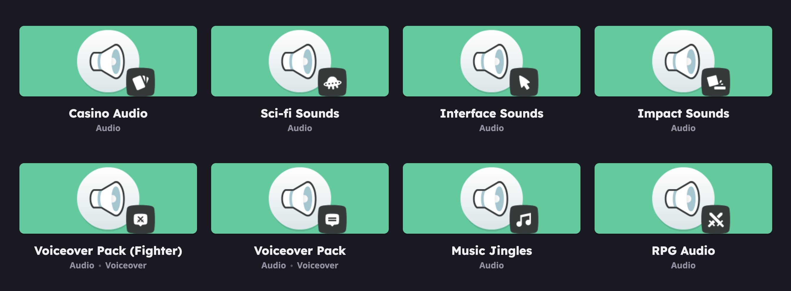{.w-100}

* [Freesound](https://freesound.org) : vérifier la licence de **chaque** son
* [Kenney Audio](https://kenney.nl/assets?q=audio) : packs **CC0**
* [Pixabay SFX](https://pixabay.com/sound-effects/)

Exemples de licences : 

| Licence | Ce qu'elle permet |
|---|---|
| **CC0** | Tout, sans obligation |
| **CC-BY** | Tout, **à condition de créditer l'auteur** |
| **CC-BY-NC** | Usage non commercial seulement : à éviter pour un jeu publié sur itch.io avec dons |

Chaque son du jeu entre dans le `README` du répertoire, **au moment où on l'importe** : voir [Les crédits des assets](#les-credits-des-assets).

### L'audio dans Unity

* **AudioClip** : les fichiers audio dans **Assets > _ > Audio**
* **AudioSource** : le composant qui joue un clip
* **AudioListener** : les « oreilles » vient par défaut avec une caméra
  
  !!! warning "Un seul AudioListener actif à la fois est permis" 

[:simple-youtube: Ambient Sound & 3D Spatial Audio | Synty Studios](https://www.youtube.com/watch?v=FOewaiJeM2k)

#### Audio Source

<figure markdown>
{data-zoom-image .w-50}
</figure>

| Paramètre d'AudioSource | Effet |
|---|---|
| **Audio Generator** | Ce que la source joue : un AudioClip glissé du panneau **Project** ou un **Audio Random Container** (voir plus bas) |
| **Output** | Le groupe de l'Audio Mixer où le son est envoyé (voir plus bas) |
| **Play On Awake** | Joue au démarrage |
| **Loop** | En boucle : musique, ambiance |
| **Volume** | 0 à 1. Une musique de fond tourne autour de `0.3` |
| **Pitch** | Vitesse et hauteur du son |
| **Spatial Blend** | 2D ou 3D |

##### _Spatial blend_

{.w-50 data-zoom-image}

- **Spatial Blend = 0 (2D)** : même volume partout. Musique, UI, voix du narrateur.
- **Spatial Blend = 1 (3D)** : le son a une position. Le volume baisse avec la distance et le son passe d'une oreille à l'autre.

Dans **3D Sound Settings** :

| Réglage | Rôle |
|---|---|
| **Doppler Level** | `0` = Pas d'effet Doppler |
| **Spread** | "Largeur" d'un son 3D. Détermine la précision 3D d'un emplacement (ex. 0 = mouche, 130 = rivière) |
| **Volume Rolloff** | `Logarithmic` est plus réaliste, mais `Linear` est plus prévisible techniquement parlant |
| **Min Distance** | En deçà, le son est à plein volume |
| **Max Distance** | Au-delà, le son ne baisse plus (ou s'éteint en mode *Linear*) |

<div class="grid" markdown>
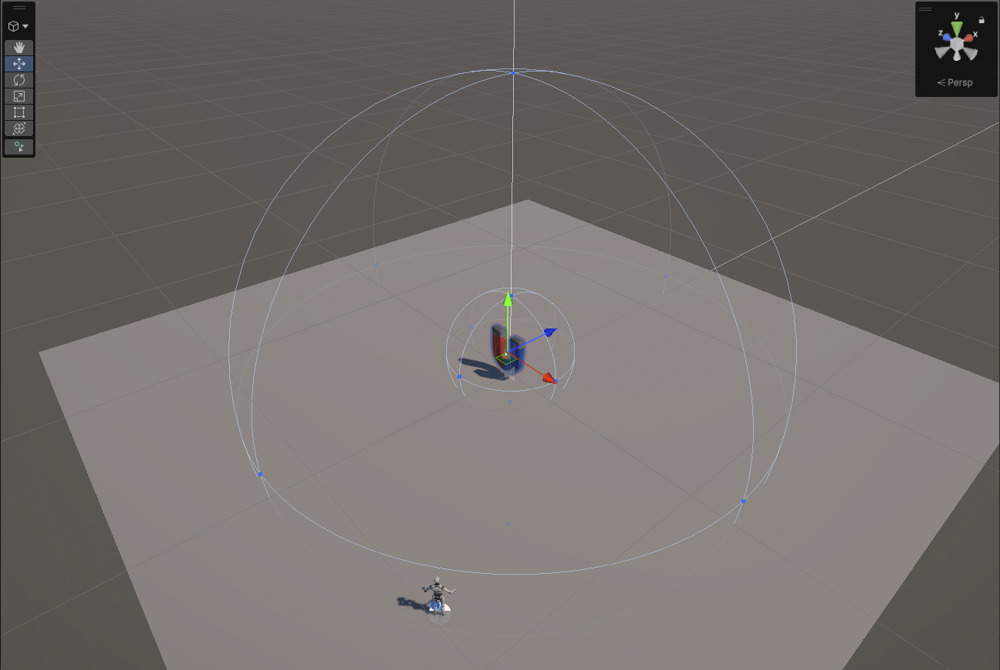{data-zoom-image}

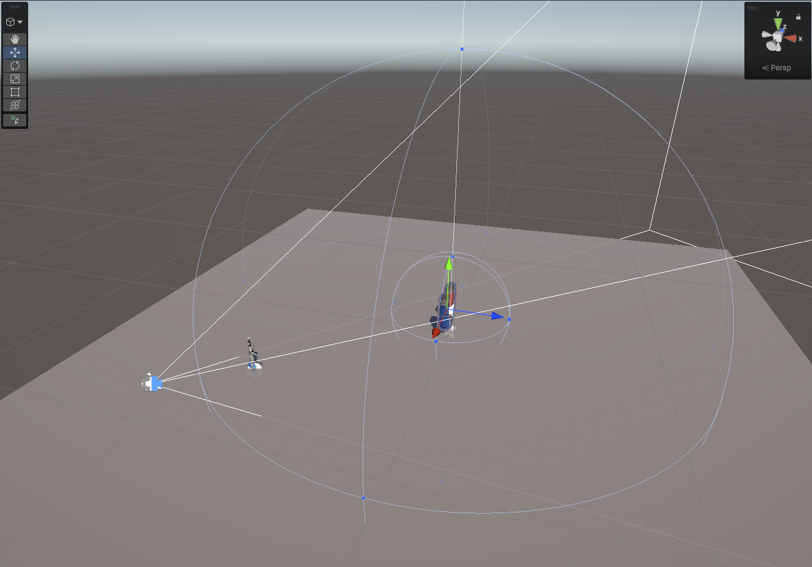{data-zoom-image}
</div>

??? quote "L'effet Doppler"

    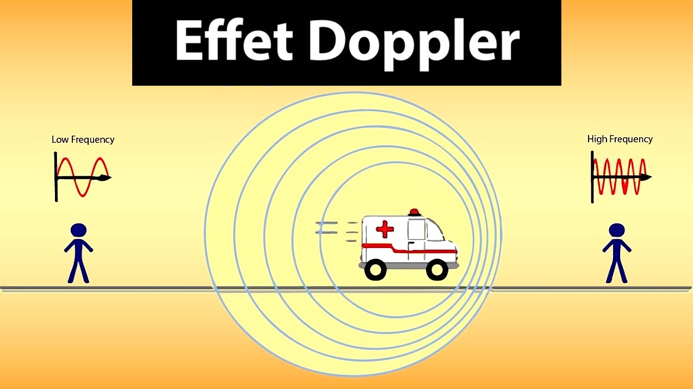{data-zoom-image}

    {.h-auto .w-20}

    


<!-- ??? quote "Spread"

    Le Spread ajuste la "largeur" d'un son 3D. Ça détermine un peu la précision d'un emplacement.

    À 0, le son est spacialisé très précisément (ex. : une mouche)
    
    À 180, le son est large, la direction devient floue (ex. : une rivière) -->

### Configuration du clip

{data-zoom-image .w-50}

Cliquer sur un fichier audio dans le panneau **Project** affiche ses **Import Settings** dans l'**Inspector**. Les valeurs par défaut conviennent presque partout. Trois choses à retenir :

1. **Force To Mono** : à cocher pour tout son **3D**. Unity le spatialise lui-même, la stéréo d'origine ne sert à rien
1. **Load Type** = `Streaming` pour la musique : elle est lue au fur et à mesure au lieu d'occuper la mémoire. Le reste peut rester par défaut
1. **Apply** : Ne pas oublier pas de sauvegarder en cliquant Apply dans l'Inspector

<!-- !!! note "Plusieurs clips à la fois"

    Sélectionner plusieurs fichiers dans le panneau **Project** permet de les régler tous d'un coup. -->

??? quote "Réglages d'optimisation"

    | Réglage | Rôle |
    |---|---|
    | **Normalize** | Remonte le volume après la fusion. Laisser coché |
    | **Load In Background** | Charge le son sans bloquer le jeu, mais il risque de ne pas être prêt au premier Play |
    | **Ambisonic** | Pour les enregistrements 360° (VR). Laisser décoché |
    | **Preload Audio Data** | Charge le son avec la scène. Décoché, il est chargé au premier Play |
    | **Compression Format** | `Vorbis` (défaut) convient à tout. `PCM` (aucune compression) sert à optimiser un SFX très court |
    | **Quality** | (Vorbis) `100` = meilleure qualité. Entre `50` et `70`, la différence est rarement audible et le fichier fond |
    | **Sample Rate Setting** | `Preserve Sample Rate` par défaut. `Optimize` laisse Unity réduire la fréquence si le son le permet |

    | Load Type | Mémoire | Usage |
    |---|---|---|
    | `Decompress On Load` (défaut) | Lourd, mais aucun calcul pendant le jeu | SFX courts joués souvent |
    | `Compressed In Memory` | Léger, petit calcul à chaque lecture | Ambiances et sons moyens |
    | `Streaming` | Presque rien : lu au fur et à mesure | Musique et longues ambiances |

    En bas de l'**Inspector**, **Original Size** / **Imported Size** montre le gain sur le poids du build.

### Déclencher un son

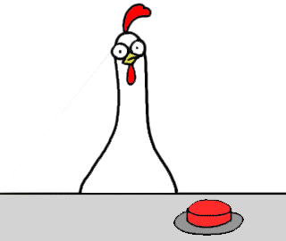{.aspect-4-3 .w-50}

| Méthode | Quand l'utiliser |
|---|---|
| **CES + action Audio** | Un son lié à une collision : ramasser, entrer, toucher |
| **CES + `AudioCrossfader`** | Un fondu d'une musique à une autre (code fourni plus bas) |
| **Script** | Un son lié à une logique : vie basse, minuterie, combo |

#### Avec le CES

1. Dans la **Hierarchy**, sélectionner le **Trigger Cube**
1. Dans l'**Inspector**, composant **Collider Event**, section **Actions** : **Add Action > Audio**
1. Dans l'action, assigner le son à jouer

##### Fondus

{.h-auto}

[AudioCrossfader.cs](./extra/AudioCrossfader.cs) passe d'une trame audio à une autre en fondu enchaîné. 

**Préparer les ambiances**

1. Dans la **Hierarchy** : clic-droit > **Create Empty**, le nommer (ex. : `Ambiance-Foret`)
1. Dans l'**Inspector** : **Add Component > Audio Source**
  - **Audio Generator** : glisser le son d'ambiance depuis le panneau **Project**
  - **Play On Awake** décoché (le script s'en charge)
  - **Loop** coché
  - **Volume** = Exemple `0.3`
1. Répéter pour chaque ambiance (ex. `Ambiance-Montages`, `Ambiance-Pluie`)

**Ajouter le gestionnaire**

1. Dans le panneau **Project**, dossier **Assets > _ > Scripts**, ajouter [AudioCrossfader.cs](./extra/AudioCrossfader.cs)
1. Dans la **Hierarchy** : clic-droit > **Create Empty**, le nommer `AmbianceManager`
1. Glisser le script dans son _Inspector_
  - **Start Source** (optionnel) : on laisse vide normalement
  - **Fade Duration** : durée en secondes d'une transition, en secondes (ex.: 3)

**Brancher le CES**

1. Placer un **Trigger Cube**
1. Dans l'**Inspector**, **Collider Event** > **Actions** > **Add Action > Invoke Events**, puis cliquer **+**
1. Glisser `AmbianceManager` depuis la **Hierarchy** dans le champ objet, puis choisir **AudioCrossfader > Play (AudioSource)**
1. Glisser l'ambiance de la zone (ex. `Ambiance-Grotte`) dans le champ sous la fonction

!!! tip "Arrêter la piste"

    Dans le CES, configurer un déclenchement de type **Sortie** qui appelle **AudioCrossfader > Stop ()**


#### Par script

Enfin, il est possible d'écrire son propre script de lecture audio.

??? note "Méthodes de lecture"

    Le son est joué par une **Audio Source** : le script n'a qu'à lui dire quand jouer.

    ```c# title="JouerSon.cs"
    using UnityEngine;

    public class JouerSon : MonoBehaviour
    {
        public AudioSource source;   // Glisser l'Audio Source ici
        public AudioClip clip;       // Optionnel : pour PlayOneShot

        public void Jouer()
        {
            // Joue ce qui est dans Audio Generator (clip ou Audio Random Container)
            source.Play();
        }

        public void JouerParDessus()
        {
            // Joue un AudioClip par-dessus le son en cours, sans le couper
            source.PlayOneShot(clip);
        }
    }
    ```

    1. Dans le panneau **Project**, dossier **Assets > _ > Scripts** : créer le script `JouerSon` ci-dessus
    1. Dans la **Hierarchy**, sélectionner l'objet qui porte l'**Audio Source** (**Play On Awake** décoché)
    1. Glisser `JouerSon` depuis le panneau **Project** dans l'**Inspector**
    1. Dans le champ **Source** du script, glisser ce même objet depuis la **Hierarchy**

    
### Humaniser

<div class="grid" markdown>
<div markdown>{.h-auto}</div>
<div markdown>{.h-auto}</div>
</div>

Le même pas joué 10 fois de suite devient vite agaçant 💩

L'**Audio Random Container** pige au hasard parmi plusieurs clips et peut varier le volume et le pitch !

<figure markdown>
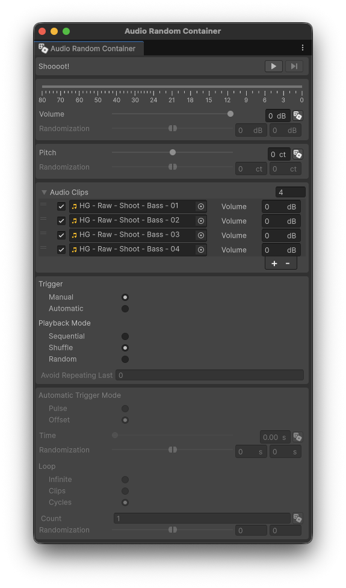{data-zoom-image .w-33}
</figure>

<!-- Le container est un **asset** (un fichier dans le panneau **Project**), pas un objet de la **Hierarchy**. -->

#### Exemple : Tir

{.h-auto .w-50}

<!-- Le script `Tir.cs` n'a pas besoin d'être modifié 😁 -->

1. Dans le panneau **Project**, dossier **Assets > _ > Audio**, clic-droit > **Create > Audio > Audio Random Container**
1. Nommer le container `Tir`
1. Double-cliquer sur `Tir`
1. Dans la fenêtre qui s'ouvre, 
  - Glisser 3 à 5 sons dans **Audio Clips**
  - **Trigger** = `Manual`
  - **Playback Mode** = `Random` ou `Shuffle`

Pour faire jouer les sons, on les ajoute sur le prefab du projectile.

1. Dans le panneau **Project**, dossier **Assets > _ > Prefabs** : double-cliquer sur le prefab **Bullet** (ou peu importe le nom donné). Il va s'ouvrir en mode isolé.
1. Dans la **Hierarchy**, sélectionner « Bullet » (l'Empty Object parent, pas la sphère)
1. Dans l'**Inspector** : **Add Component > Audio Source**, puis :
  - **Audio Generator** : y glisser l'Audio Random Container `Tir`
  - **Play On Awake** coché
  - **Loop** décoché
  - **Spatial Blend** = `0` (2D)
1. Sauvegarder
1. Quitter le mode isolé avec la flèche **<** en haut de la **Hierarchy**

!!! info "À savoir" 

    Chaque projectile a sa propre AudioSource, donc des tirs rapprochés se superposent au lieu de se couper.

#### Avec le CES

Pour un son qui ne vient pas d'un prefab (ex. : un pas sur une plaque, une porte), passer par l'**Audio Source** qui porte le container (**Play On Awake** décoché) :

1. Dans la **Hierarchy**, sélectionner le **Trigger Cube**
1. Dans l'**Inspector**, composant **Collider Event**, section **Actions** : **Add Action > Invoke Events**, puis cliquer **+**
1. Glisser l'objet de l'Audio Source depuis la **Hierarchy** dans le champ objet, puis choisir **AudioSource > Play ()**

### L'Audio Mixer

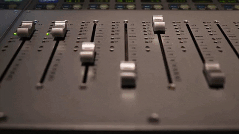{.w-50}

1. Dans le panneau **Project**, dossier **Assets > _ > Audio** : clic-droit > **Create > Audio Mixer**, le nommer `MixerPrincipal`<br>{data-zoom-image .w-20}
1. Double-cliquer sur `MixerPrincipal` : la fenêtre **Audio Mixer** s'ouvre (aussi accessible par **Window > Audio > Audio Mixer**).<br>{data-zoom-image .w-20}

#### Groupes

{data-zoom-image}

1. La fenêtre **Audio Mixer** a deux zones : à gauche, une liste en 4 sections (**Mixers**, **Snapshots**, **Groups**, **Views**); à droite, une bande verticale par groupe (au départ, seulement **Master**)
1. Dans **Groups** : cliquer sur `Master`
1. Cliquer le **+** à droite du titre **Groups** : un nouveau groupe apparaît sous `Master` (nom en édition, sinon double-cliquer dessus). Le nommer `Musique`
  - Resélectionner `Master` et répéter pour `Ambiance`, `SFX` et `UI`. Chaque groupe ajoute une bande à droite
1. Sélectionner un objet qui porte une **Audio Source** (ex. : Bullet)
1. Dans l'**Inspector**, champ **Output** : cliquer le rond ⊙ à droite et choisir un groupe (ex. : SFX)
1. Play
1. Dans **Audio Mixer**, cliquer **Edit in Play Mode** pour régler les volumes pendant qu'on joue. 

##### Les effets par groupe

{data-zoom-image .w-50}

En bas de chaque bande, sous **Attenuation** : cliquer **Add...** et choisir l'effet <br>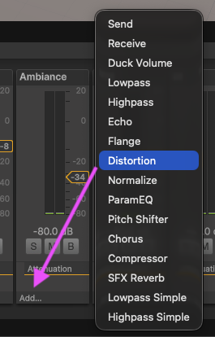{data-zoom-image .w-20}

| Effet | Usage |
|---|---|
| **Lowpass** | Coupe les aigus : son étouffé, sous l'eau, derrière un mur, menu pause |
| **SFX Reverb** | Écho d'une caverne, d'une cathédrale, d'un couloir |
| **Duck Volume** | Baisse automatiquement un groupe (ex. musique) quand un autre joue (ex. dialogue) |

#### _Snapshots_ (contextes)

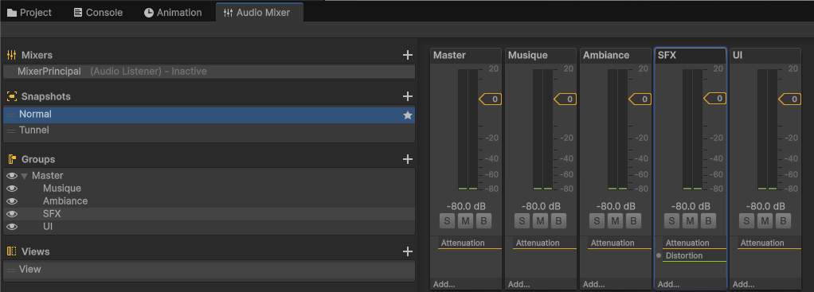{data-zoom-image .w-50}

Un **snapshot** est un réglage spécifique du mixer (volumes et effets) prévu pour des contextes spécifiques. Par exemple, dans un tunel, on veut mettre de la réverbération sur les SFX, ou encore, on veut baisser la musique pendant un dialogue.

1. Dans la fenêtre **Audio Mixer**, à gauche, section **Snapshots** : double-cliquer sur `Snapshot` pour le renommer `Normal` (l'étoile ★ indique le snapshot de départ du jeu)
1. Cliquer le **+** à droite du titre **Snapshots** pour créer un deuxième snapshot (ex: `Tunnel`)
1. Cliquer sur `Tunnel` dans la section **Snapshots** : les réglages faits maintenant n'appartiennent qu'à ce snapshot

##### Permuter les _snapshots_

> Vous entrez dans une caverne et devez ajuster l'audio 🦇

{.w-50 .h-auto}

[AudioSnapshotSwitcher.cs](./extra/AudioSnapshotSwitcher.cs) passe d'un snapshot à un autre avec une transition, depuis le CES ou un bouton, sans écrire de code.

1. Dans le panneau **Project**, dossier **Assets > _ > Scripts**, ajouter `AudioSnapshotSwitcher.cs`
1. Dans la **Hierarchy** : clic-droit > **Create Empty**, le nommer `SnapshotManager`
1. Glisser `AudioSnapshotSwitcher` depuis le panneau **Project** dans l'**Inspector**
    - **Start Snapshot** (optionnel) : snapshot appliqué au lancement de la scène
    - **Transition Duration** : durée d'une transition, en secondes
1. Sur le Trigger Cube, dans l'**Inspector** : **Add Action > Invoke Events**, puis cliquer **+**
1. Glisser `SnapshotManager` depuis la **Hierarchy** dans le champ objet, puis choisir **AudioSnapshotSwitcher > TransitionTo (AudioMixerSnapshot)**
1. Dans le panneau **Project**, déplier `MixerPrincipal` (petite flèche) pour voir ses snapshots et glisser le snapshot voulu dans le champ sous la fonction

<figure markdown>
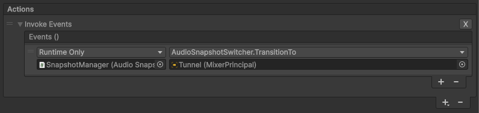{data-zoom-image .w-50}
</figure>

<!-- 
??? quote "En studio : FMOD et Wwise"

    {.w-50}

    En studio, le son n'est souvent pas géré dans Unity, mais dans un **intergiciel** (*middleware*) audio : [FMOD](https://www.fmod.com) ou [Wwise](https://www.audiokinetic.com/fr/wwise/). Le concepteur sonore y travaille dans son propre logiciel et le programmeur n'appelle qu'un **événement** (`"Pas_Herbe"`, `"Musique_Combat"`).

    Ces technologies reposent sur des threads que WebGL ne supporte pas (ce qui sera utilisé pour la remise finale) donc à ne pas installer. 
-->

## Les crédits des assets

{.w-100}

Les sons s'ajoutent aux modèles, textures, polices et packs déjà importés. Chaque média externe se note dans le `README`, au moment où on l'importe.

Dans le `README.md`, ajouter une section `## Crédits` :

| Colonne | Quoi écrire |
|---|---|
| **Asset** | Nom de l'asset sur le site qui l'héberge |
| **Type** | Son, musique, modèle 3D, texture, police, script, pack, etc. |
| **Auteur** | Le pseudo ou le nom tel qu'affiché sur la page de l'asset |
| **Source** | Le lien direct vers la page de l'asset (pas vers la page d'accueil du site) |
| **Licence** | La licence exacte, même si c'est CC0 ! |

??? example "Exemple"

    | Asset | Type | Auteur | Licence | Source |
    |---|---|---|---|---|
    | md1trk22.AIF | Son | alienistcog | CC0 | https://freesound.org/s/123456/ | 
    | Impact Sounds | Pack son | Kenney |  CC0 | https://kenney.nl/assets/impact-sounds |
    | Riser Wildfire | Son | SoundReality | Pixabay Content License | https://pixabay.com/sound-effects/film-special-effects-riser-wildfire-285209/ | 
    | POLYGON Dungeon Pack | Pack 3D | Synty Studios | Humble Bundle Licence | https://syntystore.com/products/polygon-dungeon-pack | 
    | Press Start 2P | Police | CodeMan38 | SIL OPEN FONT LICENSE Version 1.1 | https://fonts.google.com/specimen/Press+Start+2P | 

!!! info "Projet final"

    L'écran de crédits du jeu (sera exigé au projet final) reprendra cette liste.

## HUD dynamique

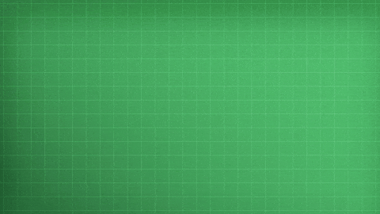{.w-100}

### Points de vie

{.h-auto}

1. Dans le panneau **Project**, dossier **Assets > _ > Scripts** : ajouter [Health.cs](./extra/Health.cs)
1. Dans la **Hierarchy** : clic-droit > **Create Empty**, le renommer `HP`
1. Glisser `Health` depuis le panneau **Project** dans l'**Inspector** de `HP`
1. Dans la **Hierarchy**, sur le **Canvas** : clic-droit > **UI (Canvas) > Text - TextMeshPro**, le renommer `HP_Text`
1. Sur le **Canvas** : clic-droit > **UI (Canvas) > Image**, la renommer `HP_Bar`. Dans l'**Inspector** :
  - **Pivot X** = `0`, pour que la barre rétrécisse vers la gauche
  - Optionnel, mais préférable : une image 9-slice dans **Source Image**, **Image Type** = `Sliced`
1. Sélectionner `HP` dans la **Hierarchy**. Dans l'**Inspector**, glisser `HP_Text` dans **Text** et `HP_Bar` dans **Bar**
1. Régler **Maximum** et **Start Value**, puis brancher les événements au besoin :
  - **On Damaged** : un son, un flash rouge
  - **On Healed** : un son, une particule
  - **On Death** : charger la scène de fin ou recommencer le niveau

!!! tip "Un fond pour la barre"

    Une deuxième **Image** foncée placée **derrière** `HP_Bar`, de la même taille, montre ce qui a été perdu.

#### Perte :drop_of_blood:

1. Dans la **Hierarchy**, ajouter un **Trigger Cube** et le renommer `Damage`
1. Dans l'**Inspector**, composant **Collider Event** : **Add Action > Invoke Events**, puis cliquer **+**
1. Glisser `HP` depuis la **Hierarchy** dans le champ objet, puis choisir **Health > Remove (int)** et entrer `30`, par exemple

#### Gain :green_heart:

1. Dupliquer `Damage` et le renommer `Potion`
1. Remplacer la fonction par **Health > Add (int)**, avec la valeur `50`, par exemple

### Chrono

{.h-auto}

1. Dans le panneau **Project**, dossier **Assets > _ > Scripts** : ajouter [CountdownTimer.cs](./extra/CountdownTimer.cs)
1. Dans la **Hierarchy** : clic-droit > **Create Empty**, le renommer `Chrono`
1. Glisser `CountdownTimer` depuis le panneau **Project** dans l'**Inspector** de `Chrono`
1. Dans la **Hierarchy**, sur le **Canvas** : clic-droit > **UI (Canvas) > Text - TextMeshPro**, le renommer `Chrono_Text`
1. Sélectionner `Chrono` dans la **Hierarchy**. Dans l'**Inspector**, glisser `Chrono_Text` dans **Text**
1. Régler **Duration** (en secondes) puis brancher les événements au besoin :
  - **On Started** : un son, une musique plus tendue
  - **On Warning** : le texte passe au rouge, un tic-tac
  - **On Finished** : charger la scène de fin, retirer des points de vie (**Health > Remove (int)**)

  ??? tip "Le format"

      Dans **Format**, `{0}` = minutes, `{1}` = secondes et `{2}` = centièmes (optionnel).

      | Format | Affichage |
      |---|---|
      | `{0:00}:{1:00}` | 01:05 |
      | `Temps : {0}:{1:00}` | Temps : 1:05 |
      | `{0:00}:{1:00}.{2:00}` | 01:05.42 |

#### Départ :checkered_flag:

**Start On Load** coché : le chrono part dès le chargement de la scène.

Pour une course contre la montre qui commence à un endroit précis, décocher **Start On Load**, puis :

1. Dans la **Hierarchy**, ajouter un **Trigger Cube** et le renommer `Chrono_Start`
1. Dans l'**Inspector**, composant **Collider Event** : **Add Action > Invoke Events**, puis cliquer **+**
1. Glisser `Chrono` depuis la **Hierarchy** dans le champ objet, puis choisir **CountdownTimer > StartTimer ()**

#### Arrivée :stopwatch:

1. Dupliquer `Chrono_Start` et le renommer `Chrono_Stop`
1. Remplacer la fonction par **CountdownTimer > StopTimer ()**

#### Bonus et pénalité :hourglass:

1. Dupliquer `Chrono_Start` et le renommer `Sablier`
1. Remplacer la fonction par **CountdownTimer > AddTime (float)**, avec la valeur `10` pour un bonus, ou `-10` pour une pénalité

<!-- !!! info "Et la pause?"

    Le chrono compte avec `Time.deltaTime` : quand le menu pause ([cours 8](./cours08.md#le-menu-pause)) met `Time.timeScale` à `0`, il se fige de lui-même. -->

### Ressources

{.h-auto}

Ce qu'on accumule et qu'on dépense : pièces, munitions, cristaux.

1. Dans le panneau **Project**, dossier **Assets > _ > Scripts** : ajouter [Resource.cs](./extra/Resource.cs)
1. Dans la **Hierarchy** : clic-droit > **Create Empty**, le renommer `Coins`
1. Glisser `Resource` depuis le panneau **Project** dans l'**Inspector** de `Coins`
1. Dans la **Hierarchy**, sur le **Canvas** : clic-droit > **UI (Canvas) > Image**, la renommer `Coins_Icon`, et y glisser l'icône de la ressource dans **Source Image**
1. Sur le **Canvas** : clic-droit > **UI (Canvas) > Text - TextMeshPro**, le renommer `Coins_Text`, à côté de l'icône
1. Sélectionner `Coins` dans la **Hierarchy**. Dans l'**Inspector**, glisser `Coins_Text` dans **Text**
1. Régler **Start Value**, **Maximum** (`0` = aucune limite) et **Goal** (`0` = aucun objectif), puis brancher les événements au besoin :
  - **On Added** : un son, une particule
  - **On Removed** : un son
  - **On Goal Reached** : ouvrir un passage, faire apparaître la sortie
  - **On Insufficient Funds** : un son de refus, un message « Il manque des pièces »

??? tip "Le format"

    Dans **Format**, `{0}` = quantité et `{1}` = objectif.

    | Format | Affichage |
    |---|---|
    | `× {0}` | × 3 |
    | `{0} / {1}` | 3 / 5 |
    | `Fragments : {0}/{1}` | Fragments : 3/5 |

#### Ramasser :coin:

1. Placer l'objet à ramasser (un modèle Synty) et glisser un **Trigger Cube** comme **enfant**
1. Dans l'**Inspector** du Trigger Cube, composant **Collider Event** : **Add Action > Invoke Events**, puis cliquer **+**
1. Glisser `Coins` depuis la **Hierarchy** dans le champ objet, puis choisir **Resource > Add (int)** et entrer `1`
1. **After Trigger** = **Destroy Parent** : l'objet disparaît avec sa zone
1. Semer des copies dans le niveau en sélectionnant l'objet dans la **Hierarchy** et en faisant **Ctrl+D** (**Cmd+D** sur Mac)

!!! warning "Dupliquer, pas glisser depuis Project"

    Une copie faite avec **Ctrl+D** dans la **Hierarchy** garde le lien vers `Coins`. Un prefab glissé depuis le panneau **Project**, non : un asset ne peut pas pointer vers un objet de la scène. Le champ objet d'Invoke Events arrive alors vide, et il faut y glisser `Coins` à nouveau.

#### Dépenser :shopping_cart:

Une porte, un marchand, un autel qui exige un prix :

1. Dans la **Hierarchy**, ajouter un **Trigger Cube** et le renommer `Shop`
1. **Add Action > Invoke Events**, puis choisir **Resource > Spend (int)** et entrer le prix, par exemple `5`
1. Sur `Coins`, brancher l'effet dans **On Removed** (ouvrir, faire apparaître) et le refus dans **On Insufficient Funds**

!!! info "Spend ou Remove?"

    **Spend** est tout ou rien : avec 3 pièces, un prix de 5 ne retire rien et déclenche **On Insufficient Funds**. **Remove** retire ce qu'il peut, sans descendre sous 0 : une pénalité, un vol.

## Trello


* Semaine 7 | 8 octobre : Prototype ⭐️ Aujourd'hui
* Semaine 8 | 22 octobre (👾 Énoncé du projet final)
* Semaine 9 | 29 octobre 🏃🏻‍♂️ Sprint 2 : Tranche verticale
* <span class="opacity-50">Semaine 10 | 5 novembre</span>
* <span class="opacity-50">Semaine 11 | 12 novembre</span>
* <span class="opacity-50">Semaine 12 | 19 novembre 🏃🏻‍♂️ Sprint 3 : Alpha</span>
* <span class="opacity-50">Semaine 13 | 26 novembre</span>
* <span class="opacity-50">Semaine 14 | 3 décembre 🏃🏻‍♂️ Sprint 4 : Beta</span>
* <span class="opacity-50">Semaine 15 | 10 décembre 🏃🏻‍♂️ Sprint 5 : Oral</span>

### Tranche verticale

> Un segment court, mais terminé 💯

- Scène d'introduction terminée
- Scène Zone 1 terminée :  habillée (assets), éclairée (lighting / skybox), animée et sonorisée
- HUD terminé : habillé (assets), animé et sonorisé
- Scènes d'échec et de succès terminées : habillée (assets), animée et sonorisée
- Logique minimale terminée
- Export Windows (le WebGL sera exigé au sprint suivant)

### MoSCoW

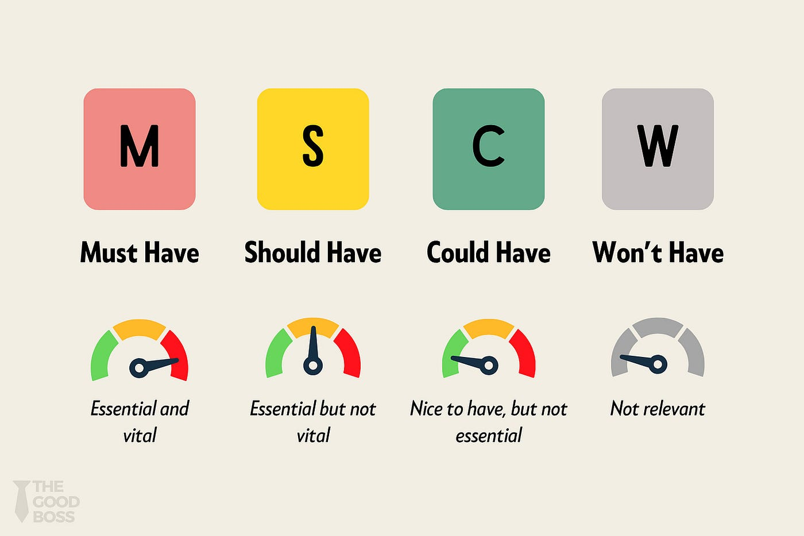{data-zoom-image}

La catégorisation [MoSCoW](https://fr.wikipedia.org/wiki/M%C3%A9thode_MoSCoW) sert à prioriser les tâches : `Must`, `Should`, `Could`, `Won't`

Si ce n'est pas encore déjà en place, il faudra maintenant prioriser les tâches Trello

### Nouvelles cartes

> Les cartes `must` sont obligatoires pour le projet final. Les autres sont relatives à vos projets.

**Général**

- `Must` Finaliser le passage de la zone 1 vers la zone 2 et vérifier les trois règles (voir ci-dessous)
- `Must` Monter la scène d'introduction (titre, bouton Jouer)
- `Must` Monter les scènes d'échec et de succès (boutons Recommencer et Accueil)
- `Must` Brancher la défaite (ex. : HP à 0 ou chrono écoulé) vers la scène d'échec
- `Must` Recommencer une partie sans relancer le jeu
- `Must` Habiller la zone 1 (assets)
- `Must` Éclairer la zone 1 (lighting, skybox)
- `Must` Animer au moins un élément de la zone 1
- `Must` Exporter un build Windows

!!! info "Les trois règles d'un passage"

    Chaque passage d'une zone à l'autre est vérifié selon trois règles :

    - **Thématique** : l'obstacle fait partie de l'univers du jeu. Une grille rouillée dans une prison, une rivière en forêt; pas un cube rouge
    - **Prérequis** : le passage exige AU MOINS deux conditions enchaînées et l'interacteur comprend quoi faire. (Ne pas comprendre n'est pas un niveau de difficulté)
    - **Récompense** : franchir le passage ça se mérite, mais ça se célèbre aussi ! (via un son, des particules, une cinématique, un objet qui apparaît, une nouvelle vue, etc.)

**HUD**

- `Must` Tester le HUD à deux résolutions (16:9 et 4:3)
- `Must` Afficher des indicateurs de progression (ex. : objets ramassés, clés, nombre de vies)
- `Should` Afficher un état (ex. : moment dans la journée, hp)
- `Should` Afficher l'icône d'un objet unique quand on l'obtient
- `Could` Ajouter une minuterie à une zone

**Son**

- `Must` Créer un Audio Mixer dont les groupes sont pensés selon leur usage (ex. : baisser la musique sans toucher aux effets)
- `Must` Ajouter une ambiance (ou une musique) en boucle dans la zone 1
- `Must` Ajouter un son spatialisé (source fixe dans le décor)
- `Must` Ajouter les sons déclenchés par des événements (ramasser, blesser, ouvrir, réussir, échouer)
- `Must` Ajouter des sons aux boutons des menus
- `Should` Ajouter de la variation (pitch ou clips multiples) aux sons répétés (ex. : tir, objets ramassés)
- `Could` Ajouter un fondu d'ambiance

**Assets et crédits**

- `Must` Créer un README.md 
  - Ajouter une section `## Crédits`
  - Noter la source de chaque asset importé (modèles, textures, audio, polices, packs, scripts)
- `Must` Chercher les assets visuels manquants (modèles, textures, polices)
