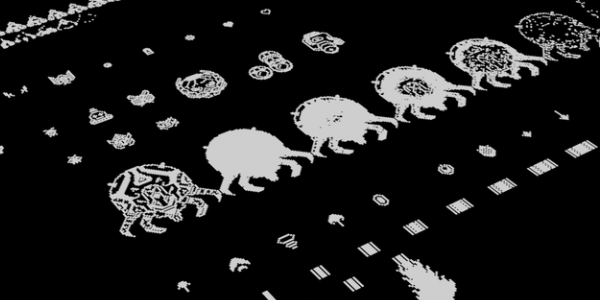
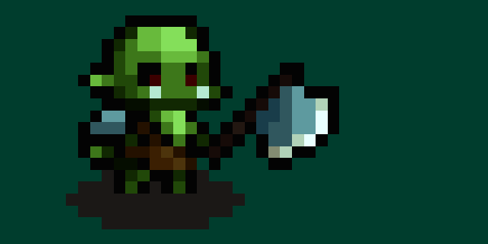

---
tags:
  - Cours 8
  - Mardi 22 octobre
---

# Superposition

Précédemment, nous avons vu la fonction `collider` pour les collisions : `this.physics.add.collider(Objets_A, Objets_B);`. Elle permet de gérer les collisions physiques entre deux objets ou groupes d'objets.

Aujourd'hui, nous allons voir la fonction de chevauchement : [`overlap`](https://newdocs.phaser.io/docs/3.86.0/focus/Phaser.Physics.Arcade.ArcadePhysics-overlap). Cette fonction détecte si deux objets se chevauchent ou se touchent, mais sans appliquer de physique. Elle est souvent utilisée pour des interactions de type déclencheur (trigger), comme ramasser des objets, entrer dans une zone ou activer une action lorsque deux objets se superposent.

```js title="Syntaxe"
this.physics.add.overlap(
  Objets_A, Objets_B, () => {
    // Code à exécuter lorsque les objets A et B se chevauchent
  }
);
```

## Projectiles

Les projectiles doivent être placées dans un groupe. Ça nous permet de travailler avec un nombre précis de projectiles et de les « recycler » à volonté.

À noter qu'un groupe de projectiles se place très bien dans une fonction `overlap()` ;)

```js
this.ballesDeGun = this.physics.add.group({
  defaultKey: "bullet", // Identifiant de l'image dans le preload
  maxSize: 5 // Nombre max de projectiles affichés d'un coup
});
```

La fonction `get` et la méthode `setActive` sont souvent utilisées dans Phaser pour gérer des objets réutilisables, notamment lorsqu’on travaille avec des groupes d’objets comme des projectiles.

### get()

La fonction `get` permet d’accéder à un objet inactif dans un groupe. Au lieu de créer et de détruire constamment de nouveaux objets (ce qui serait coûteux en termes de performances), Phaser recycle les objets en les mettant en mode actif ou inactif selon leur utilisation.

```js
const balle = this.ballesDeGun.get(this.player.x, this.player.y);
```

Dans cet exemple, `get` retourne une balle à partir du groupe ballesDeGun. Si une balle est disponible (inactive dans le groupe), elle sera renvoyée et positionnée aux coordonnées du joueur (this.player.x et this.player.y).

### setActive()

La méthode `setActive()` est utilisée pour rendre un objet actif ou inactif. Lorsqu’un objet est actif, il peut interagir dans le jeu (par exemple, se déplacer, entrer en collision, être visible, etc.). À l’inverse, `setActive(false)` le désactivera, le rendant “invisible” aux autres objets dans le jeu.

```js
if (balle) {
  balle.setActive(true); // Activer la balle pour qu'elle soit utilisée
  balle.setVisible(true); // S'assurer qu'elle soit visible
  balle.setVelocity(0, -300); // Lancer la balle vers le haut avec une certaine vitesse
}
```

### this.cameras.main.worldView.contains()

Utile pour savoir si un objet est à l’écran ou non.

`this.cameras.main.worldView.contains(x, y)` vérifie si les coordonnées (x, y) se trouvent dans la zone visible de la caméra principale du jeu.

### addEvent()

Pareillement à [`setInterval()`](https://www.w3schools.com/jsref/met_win_setinterval.asp) en JavaScript, [`addEvent()`](https://newdocs.phaser.io/docs/3.86.0/focus/Phaser.Time.Clock-addEvent) permet d'exécuter une fonction à un interval donnée.

```js
this.time.addEvent({
  delay: 1000,
  loop: true,
  callback: () => {
    // Code à exécuter toutes les 1000 ms
  }
});
```

## Super

{ .w-100 }

**Super**, le jeu utilisé comme exemple pour le cours portant sur le thème de la SUPERposition.

<iframe class="aspect-2-1" height="300" style="width: 100%;" scrolling="no" title="Phaser - Projectile FULL" src="https://codepen.io/tim-momo/embed/preview/dyxzLYJ?default-tab=result&editable=true&theme-id=50173" frameborder="no" loading="lazy" allowtransparency="true" allowfullscreen="true">
  See the Pen <a href="https://codepen.io/tim-momo/pen/dyxzLYJ">
  Phaser - Projectile FULL</a> by TIM Montmorency (<a href="https://codepen.io/tim-momo">@tim-momo</a>)
  on <a href="https://codepen.io">CodePen</a>.
</iframe>

### Première étape : le personnage

Pour commencer, créons le personnage et ses projectiles.

<iframe class="aspect-2-1" height="300" style="width: 100%;" scrolling="no" title="Phaser - Projectile Step1" src="https://codepen.io/tim-momo/embed/preview/yLmodRd?default-tab=result&editable=true&theme-id=50173" frameborder="no" loading="lazy" allowtransparency="true" allowfullscreen="true">
  See the Pen <a href="https://codepen.io/tim-momo/pen/yLmodRd">
  Phaser - Projectile Step1</a> by TIM Montmorency (<a href="https://codepen.io/tim-momo">@tim-momo</a>)
  on <a href="https://codepen.io">CodePen</a>.
</iframe>

### Deuxième étape : l'ennemie

Ensuite, ajoutons l'ennemie et ses projectiles.

<iframe class="aspect-2-1" height="300" style="width: 100%;" scrolling="no" title="Phaser - Projectile FULL" src="https://codepen.io/tim-momo/embed/preview/JjgygqZ?default-tab=result&editable=true&theme-id=50173" frameborder="no" loading="lazy" allowtransparency="true" allowfullscreen="true">
  See the Pen <a href="https://codepen.io/tim-momo/pen/JjgygqZ">
  Phaser - Projectile FULL</a> by TIM Montmorency (<a href="https://codepen.io/tim-momo">@tim-momo</a>)
  on <a href="https://codepen.io">CodePen</a>.
</iframe>

### Troisième étape : les collisions

Activons la collision des projectiles.

<iframe class="aspect-2-1" height="300" style="width: 100%;" scrolling="no" title="Phaser - Projectile Step3" src="https://codepen.io/tim-momo/embed/preview/BaXwBQK?default-tab=result&editable=true&theme-id=50173" frameborder="no" loading="lazy" allowtransparency="true" allowfullscreen="true">
  See the Pen <a href="https://codepen.io/tim-momo/pen/BaXwBQK">
  Phaser - Projectile Step3</a> by TIM Montmorency (<a href="https://codepen.io/tim-momo">@tim-momo</a>)
  on <a href="https://codepen.io">CodePen</a>.
</iframe>

### Quatrième étape : les animations

Ajoutons des animations

<iframe class="aspect-2-1" height="300" style="width: 100%;" scrolling="no" title="Phaser - Projectile Step 4" src="https://codepen.io/tim-momo/embed/preview/jOgGNLw?default-tab=result&editable=true&theme-id=50173" frameborder="no" loading="lazy" allowtransparency="true" allowfullscreen="true">
  See the Pen <a href="https://codepen.io/tim-momo/pen/jOgGNLw">
  Phaser - Projectile Step 4</a> by TIM Montmorency (<a href="https://codepen.io/tim-momo">@tim-momo</a>)
  on <a href="https://codepen.io">CodePen</a>.
</iframe>

### Cinquième étape : les importantes fioritures

Ajoutons enfin  :

* l'animation de fond
* la mention textuelle après avoir battu le boss
* le comportement de désactivation temporaire lorsqu'on est touché

<iframe class="aspect-2-1" height="300" style="width: 100%;" scrolling="no" title="Phaser - Projectile FULL" src="https://codepen.io/tim-momo/embed/preview/dyxzLYJ?default-tab=result&editable=true&theme-id=50173" frameborder="no" loading="lazy" allowtransparency="true" allowfullscreen="true">
  See the Pen <a href="https://codepen.io/tim-momo/pen/dyxzLYJ">
  Phaser - Projectile FULL</a> by TIM Montmorency (<a href="https://codepen.io/tim-momo">@tim-momo</a>)
  on <a href="https://codepen.io">CodePen</a>.
</iframe>

## Exercice

<div class="grid grid-1-2" markdown>
  

  <small>Exercice - Phaser</small><br>
  **[Orc](./exercices/orc.md){.stretched-link}**
</div>

## Devoir

Devoir 6 | Partie 2/2

Avec la fonction `overlap`, ajoutez le concept de superposition accompagnée d'une réaction pertinente au fonctionnement de votre jeu.

Remise : 28 octobre à 23h59

[STOP]

```js
this.zoneDeSuperposition = this.add.rectangle(100, 100, 100, 100, 0xff0000, 0.5);
this.physics.add.existing(this.zoneDeSuperposition, true);
this.player = this.physics.add.image(100, 100, 'img');
this.physics.add.overlap(this.player, this.zoneDeSuperposition, () => {});
```
