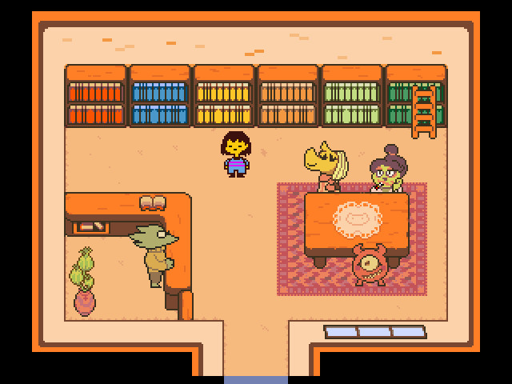

# Cours 8

## HUD et rétroaction au joueur

Comment ton jeu **parle** au joueur : afficher l'état du monde (le HUD) et communiquer clairement chaque réussite **et** chaque échec. C'est un pilier du devis - et la différence entre un jeu compréhensible et un jeu frustrant.

<!-- ## Déroulement de la séance

| Temps | Activité |
|---|---|
| 0h00 – 0h15 | Retour sur le Jalon 1 : constats de groupe |
| 0h15 – 1h30 | Théorie : les interfaces de jeu, les ancres, le feedback |
| 1h30 – 1h45 | Pause |
| 1h45 – 3h20 | Pratique : HUD + feedback de succès et d'échec |
| 3h20 – 3h35 | Rituel de commit + devoirs | -->


## Théorie

### Les interfaces de jeu : un petit zoo

Toute information transmise au joueur passe par une interface - mais pas toujours celle qu'on croit :

| Type | C'est où? | Exemples |
|---|---|---|
| **HUD** (non-diégétique) | Par-dessus le jeu, hors du monde | Compteur de pièces, minicarte, barre de vie |
| **Diégétique** | DANS le monde du jeu | La jauge de vie sur le dos de l'armure (*Dead Space*), le compteur au tableau de bord d'un jeu de course |
| **Spatiale** | Dans l'espace, mais pas « du monde » | Le contour lumineux d'un objet interactif, une flèche au sol |

La tendance moderne : le moins de HUD possible, le plus de diégétique possible - le monde lui-même informe. Ton jeu fera les deux : un HUD minimal + de l'affordance dans le monde (ta clé qui flotte, cours 9).

!!! question "Discussion (3 min)"
    Pourquoi *Dead Space* a-t-il mis la barre de vie SUR le personnage plutôt qu'au coin de l'écran? Qu'est-ce que ça change pour l'immersion? Pour la lisibilité en plein combat?

### Les 3 règles du HUD

1. **Minimal** : n'affiche que ce dont le joueur a besoin *maintenant*. Chaque élément de plus dilue les autres. L'anti-modèle : l'écran de MMO tapissé de barres, cartes et boutons - illisible pour un nouveau venu
2. **Lisible en une seconde** : contraste fort, typo suffisante, positions conventionnelles (vie en haut à gauche, score en haut à droite - les conventions existent, profites-en)
3. **Cohérent** : mêmes couleurs, même typo, même langage que ton ambiance. Un HUD futuriste sur un jeu médiéval, ça grince

**Compteur, jauge ou icônes?** Un nombre précis qui monte → compteur (`Cles : 2/3`). Une ressource continue qui varie → jauge (vie, oxygène). Une petite quantité fixe → icônes (3 cœurs). Choisis selon ta donnée, pas selon l'esthétique.

### Les ancres : pour que ça tienne à tous les écrans

Chaque élément UI a une **ancre** (Anchor) : le point de l'écran auquel il est accroché. Un compteur ancré **en haut à gauche** reste en haut à gauche sur un 16:9, un ultrawide ou un projecteur. Sans ancre correcte, ton HUD centré sur TON écran déborde sur celui du jury.

Mode d'emploi : sélectionne l'élément → **Rect Transform** → clique le carré d'ancres → choisis le coin. Combiné au **Canvas Scaler** (1920 × 1080, cours 6), ton interface devient indestructible.

### Le feedback : la moitié de l'agentivité

Souviens-toi du cours 5 : l'agentivité, c'est sentir que ses actions **comptent**. Le feedback en est le mécanisme concret - et il doit être **immédiat** (sous ~100 ms, sinon le cerveau ne relie plus l'action à la réponse).

La règle d'or du devis : le **double canal**, pour les réussites ET les échecs :

| Événement | Canal visuel | Canal sonore |
|---|---|---|
| ✅ Clé ramassée | La clé disparaît + le compteur s'incrémente | Son de collecte clair |
| ❌ Porte sans clé | Message « Il te faut une clé! » | Son sourd, négatif |

<div class="grid grid-1-2" markdown>
{data-zoom-image}

[Undertale (2015)](https://store.steampowered.com/app/391540/Undertale/) : interface minimale, mais chaque action reçoit une réponse nette - texte qui tremble, sons distinctifs, cœur qui clignote. Un budget minuscule, un feedback impeccable : c'est une question de design, pas de moyens.
</div>

**L'échec est le canal le plus oublié - et le plus important.** Quand une action ne marche pas, le joueur doit savoir : (1) que ça n'a PAS marché, (2) idéalement pourquoi, (3) implicitement quoi faire. « Il te faut une clé! » fait les trois en quatre mots. Le silence, lui, fait croire à un bug.

!!! example "Mini-activité (5 min)"
    Pense au dernier jeu où tu as été frustré. La frustration venait-elle de la difficulté… ou de ne pas **comprendre** pourquoi ça ne marchait pas? La distinction est exactement notre sujet : un bon jeu peut être dur, il ne doit jamais être muet.


## Pratique

### 1. Le Canvas HUD

- [ ] Dans ta scène `Jeu` : **UI → Canvas**, nomme-le `HUD`
- [ ] **Canvas Scaler → Scale With Screen Size → 1920 × 1080** (le réflexe du cours 6)

### 2. Le compteur

- [ ] **UI → Text - TextMeshPro** dans le HUD, nomme-le `CompteurTexte`
- [ ] **Ancre en haut à gauche** (Rect Transform → carré d'ancres) + position à ~30 px des bords
- [ ] Texte de départ : `Cles : 0 / 1` - adapte le mot à ton jeu (gemmes, offrandes, batteries…)
- [ ] Crée `CompteurHUD.cs` sur un GameObject vide `GestionHUD` :

```csharp
using UnityEngine;
using TMPro; // La boîte à outils TextMeshPro : sans elle, pas de TextMeshProUGUI

public class CompteurHUD : MonoBehaviour
{
    public TextMeshProUGUI texte;   // Glisser CompteurTexte ici
    public int objectif = 1;        // Le total à collecter (règle-le dans l'Inspector)
    private int compte = 0;         // L'état : combien on en a (private : protégé)

    public void Incrementer()       // La porte d'entrée officielle (cours 5, le duo private/public!)
    {
        compte++;
        texte.text = "Cles : " + compte + " / " + objectif;
    }
}
```

**Lecture rapide :** `using TMPro` en haut, sinon le type `TextMeshProUGUI` n'existe pas. La ligne `texte.text = ...` **assemble** du texte avec `+` : nombres et mots se combinent. Et retrouve le patron du cours 5 : état `private`, méthode `public` - c'est partout, c'est voulu.

- [ ] Dans `Cle.cs`, ajoute la référence et l'appel :

```csharp
public CompteurHUD hud; // Glisser l'objet GestionHUD dans l'Inspector
// ...dans OnTriggerEnter, après le son :
hud.Incrementer();
```

- [ ] **Branche tout dans l'Inspector** (le texte dans GestionHUD, GestionHUD dans la clé) → ▶️ le compteur monte à la collecte
- [ ] `NullReferenceException`? Tu sais quoi faire depuis le cours 4 : un champ est vide quelque part

- [ ] **Une icône vaut mille mots** : importe une petite image (clé, gemme…) → Inspector → **Texture Type → Sprite (2D and UI)** → puis **UI → Image** dans le HUD, à gauche du compteur, et assigne ton sprite. `🗝 2/3` se lit encore plus vite que `Cles : 2/3`

### 3. Le feedback d'échec

- [ ] **UI → Text - TextMeshPro** dans le HUD : `MessageEchec` (« Il te faut une clé! »), centré, visible… puis **désactive-le** (case en haut de l'Inspector) : il n'apparaîtra que sur un échec
- [ ] Complète `Porte.cs` :

```csharp
public GameObject messageEchec; // Glisser MessageEchec ici
public AudioClip sonEchec;      // Un son sourd, négatif

private void OnTriggerEnter(Collider other)
{
    if (other.CompareTag("Player"))
    {
        if (aCle)
        {
            batantDePorte.SetActive(false); // (animé au cours 9!)
        }
        else
        {
            // L'ÉCHEC A DROIT À SON FEEDBACK, double canal :
            AudioSource.PlayClipAtPoint(sonEchec, transform.position);
            messageEchec.SetActive(true);
            Invoke("CacherMessage", 2f); // Appelle CacherMessage dans 2 secondes
        }
    }
}

private void CacherMessage()
{
    messageEchec.SetActive(false);
}
```

**La nouveauté : `Invoke("NomDeMethode", delai)`** - « appelle cette méthode dans X secondes ». C'est ta première minuterie! Un message qui reste affiché pour toujours est un bug; deux secondes, c'est lu et disparu.

- [ ] ▶️ Teste **les deux chemins** : sans clé → message + son d'échec (et le message disparaît après 2 s); avec clé → ouverture + son de réussite

### 4. Passe UX

- [ ] Recule ta chaise, plisse les yeux : ton HUD se lit-il en une seconde? Trop petit? Trop d'info?
- [ ] Redimensionne la fenêtre Game (étire-la, écrase-la) : le HUD reste-t-il aux coins? Sinon → ancres
- [ ] Le HUD respecte-t-il ton ambiance (couleurs, typo)? Deux minutes d'accord visuel changent tout

### 5. Le rituel

- [ ] Commit : `HUD + feedback succes/echec` → Push

## Devoir

- [ ] Complète le HUD pour tout ce que ton jeu doit communiquer - et **rien de plus** (règle 1!)
- [ ] Passe chaque interaction de ton jeu au test du double canal : réussite = visuel + son? échec = visuel + son? Complète les trous

## Ressources

* [Game UI Database](https://www.gameuidatabase.com/) - des milliers de captures d'interfaces de jeux, classées. Mine d'or d'inspiration
* [Documentation Unity : TextMeshPro](https://docs.unity3d.com/Packages/com.unity.textmeshpro@4.0/manual/index.html)

## Savoirs essentiels touchés

Intégration d'une interface graphique HUD, indication visuelle et sonore des réussites et échecs d'interaction, fonctionnement d'une interface virtuelle.
