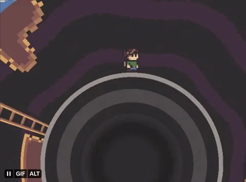
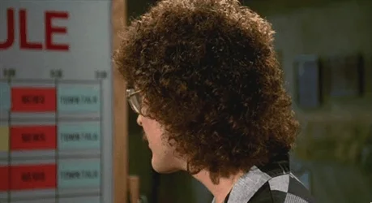
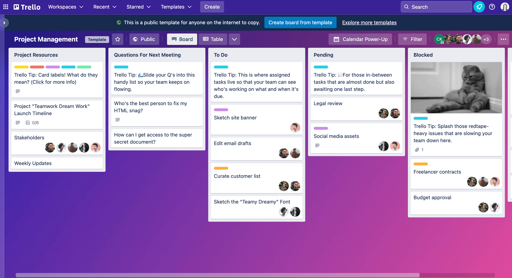

---
tags:
  - Cours 9
  - Mardi 29 octobre
---

# Cours 9

Vue d'ensemble de la session :

1. Document de conception
1. Images
1. Scènes et HUD
1. Déplacement, physique et collision
1. Caméra
1. Sprite et états
1. Animations tween
1. Superposition
1. Expérience complète d'un jeu :fontawesome-regular-hand-point-left:{ .horizontal-anim .valign-bottom }
1. Expérience complète la suite
1. Effets spéciaux
1. Sauvegarde
1. Qualité et réusinage
1. Publication
1. Présentations

## Expérience ludique complète

{.w-100}

N'oubliez pas, l'objectif du cours c'est aussi de :

* Créer un **produit intéressant**, dont vous serez **fier** et qui est à la hauteur de vos compétences.
* Créer une **expérience**. Créer quelque chose qui engage un utilisateur, qui pique sa curiosité ou qui l'amuse, c'est tout un accomplissement!

### L'attention aux détails

L'idée est de concevoir un jeu équilibré, captivant et abouti, qui pourra non seulement enrichir votre portfolio, mais aussi illustrer votre **professionnalisme** et votre **souci du détail**.

Questions à poser pour une expérience réussie :

* Quel est l'objectif de mon jeu ?
* Comment y joue-t-on ?
* Pour le joueur, qu’est-ce qui est **amusant**, **difficile**, **facile** et **surprenant** ?

En effet, la surprise est un facteur essentiel en jeu vidéo.

### L'expérience complète

* Mécaniques de jeu
  * Déplacements
  * Interactions
  * Collecte d’objets
  * Ressources (HP, MP, objets, potions, monnaie, etc.)
* Histoire et narration
  * Scénario, dialogues, développement des personnages
* Transitions de scène
* Interface utilisateur (UI)
* Retour et feedback visuel/auditif
* Système de progression / Objectifs
* Ambiance graphique et sonore

## [Audio](https://docs.phaser.io/phaser/concepts/audio)

```js
preload(){
  this.load.audio('musiqueDeFond', 'chemin/vers/la/piste_sonore.mp3');
}

create(){
  this.bgMusic = this.sound.add('musiqueDeFond', {
    mute: false,
    volume: 1,  // 0 (muet) et 1 (volume maximum)
    rate: 1,    // Change la vitesse de lecture. 1 est la vitesse normale
    detune: 0,  // Change la fréquence (ex : -1200 pour une octave inférieure)
    seek: 0,    // Position de démarrage en secondes
    loop: false,
    delay: 0,   // Temps en secondes avant de lancer le son après play()
  });
  this.bgMusic.play();
  // this.bgMusic.pause(); // Met le son en pause.
  // this.bgMusic.resume(); // Reprend le son après une pause.
  // this.bgMusic.stop(); // Arrête la lecture du son.

  // this.bgMusic.setMute(true); // Active ou désactive le son.
  // this.bgMusic.mute; // Retourne la valeur de mute

  // this.bgMusic.setVolume(0.2); // Change le volume
  // this.bgMusic.volume; // Retourne la valeur du volume
}
```

### Audio déclenché par un bouton

```js
this.audioBtn = this.add.text(10, 10, 'Mute', { fill: '#f00' })
    .setInteractive()
    .on('pointerdown', () => {
        if (this.backgroundMusic.isPlaying) {
            this.backgroundMusic.pause();
            musicButton.setText('Play');
        } else {
            this.backgroundMusic.resume();
            musicButton.setText('Mute');
        }
    });
```

### Audio déclenché par superposition

```js
this.load.audio('overlapSound', 'chemin/vers/la/piste_sonore.mp3');

this.overlapSound = this.sound.add('overlapSound');

this.physics.add.overlap(objectA, objectB, () => {
    this.overlapSound.play();
});
```

### Animation audio

{.w-100}

```js
this.bgMusic = this.sound.add('musiqueDeFond');
this.tweens.add({
    targets:  this.bgMusic,
    volume:   0,
    duration: 500
});
```

<iframe class="aspect-4-1" height="300" style="width: 100%;" scrolling="no" title="Phaser - Audio" src="https://codepen.io/tim-momo/embed/LYwQgRL?default-tab=result&editable=true&theme-id=50173" frameborder="no" loading="lazy" allowtransparency="true" allowfullscreen="true">
  See the Pen <a href="https://codepen.io/tim-momo/pen/LYwQgRL">
  Phaser - Audio</a> by TIM Montmorency (<a href="https://codepen.io/tim-momo">@tim-momo</a>)
  on <a href="https://codepen.io">CodePen</a>.
</iframe>

## Liste de tâches

{.w-100}

À partir de maintenant, il faudra noter l'ensemble des tâches à effectuer pour terminer votre jeu.

Catégorisez vos tâches avec 3 mentions :

* **Essentiel** : Les tâches essentielles sont les tâches nécessaire à l'accomplissement d'une expérience complète de jeu vidéo.
* **Important** : Les tâches importantes sont celles qui ne mettent pas en péril l'expérience de jeu, mais qui contribuent à l'améliorer.
* **N2H** ou Nice to have : Les tâches N2H sont celles qu'on aimerait réaliser, mais qui nous paraissent difficile ou longues à implémenter.

-OU-

Ordonnez chacune des tâches en ordre de priorité. Pour ce faire, appliquez une numérotation de 1 à 3. 1 étant la plus haute priorité, 3 étant l'équivalent d'un "Nice to have".

### Gestionnaires de tâches



* Excel / Spreadsheet
* [Trello.com](https://trello.com/fr) :fontawesome-regular-hand-point-left:{ .horizontal-anim .valign-bottom }
* [Autres applications](https://www.forbes.com/advisor/business/software/top-trello-alternatives)

### Exemples de tâches

* (1) Trouver l'ensemble des assets manquants
* (1) Ajouter un ours dans ma scène principale
* (1) Finaliser la mécanique de projectile
* (2) Créer un système de score
* (2) Animer l'ours quand on le touche
* (3) Animer les projectiles
* +99 autres tâches

## Exercice

* [ ] Faire la liste **exhaustive** des tâches à effectuer pour terminer votre jeu et présenter votre liste à l'enseignant.
* [ ] Ajouter les pistes et effets sonores, puis, rendre fonctionnel le bouton de son.
* [ ] Ajouter le contenu de la scène "Comment jouer"
* [ ] Ajouter un HUD à votre jeu
* [ ] Ajouter ou supprimer des scènes en fonction de votre jeu et de vos objectifs.
