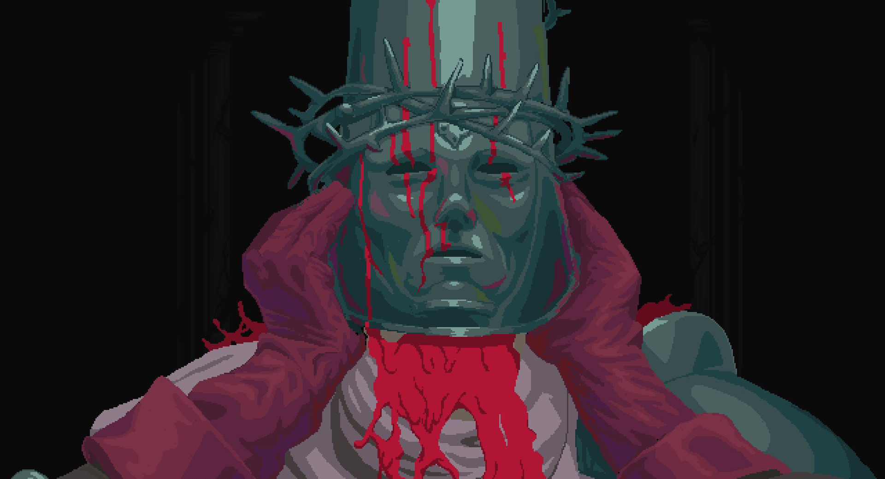
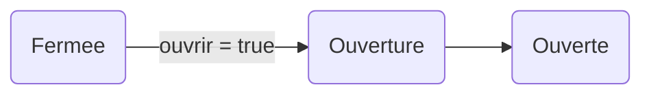
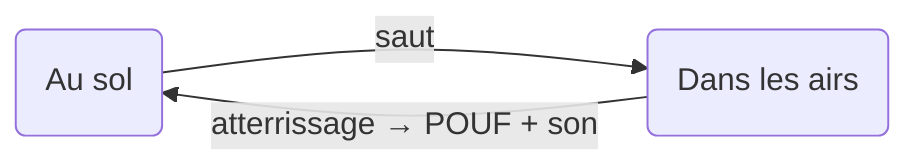

# Cours 9

## Animation et états du personnage

Un monde immobile est un décor; un monde qui bouge est vivant. Aujourd'hui : animer les éléments visuels de ton jeu, comprendre la machine qui décide *quelle* animation joue *quand* (l'Animator), et détecter **l'état** de ton personnage pour le montrer au joueur - par l'image et par le son.

<!-- ## Déroulement de la séance

| Temps | Activité |
|---|---|
| 0h00 – 0h15 | Retour : HUD et feedbacks, questions |
| 0h15 – 1h30 | Théorie : principes d'animation, l'Animator, les machines à états |
| 1h30 – 1h45 | Pause |
| 1h45 – 3h20 | Pratique : animer le décor, la porte, sonoriser les états |
| 3h20 – 3h35 | Rituel de commit + devoirs | -->


## Théorie

### Tu sais déjà animer

Tu as fait de l'After Effects : des **keyframes**, de l'**interpolation**, des courbes d'**easing**. Unity anime exactement pareil - tu poses des valeurs à des moments, le moteur remplit les trous :

```
frame 0 :  y = 0
frame 30 : y = 0.5     ← Unity interpole tout ce qui est entre
frame 60 : y = 0
```

La différence avec After Effects : ici, l'animation doit **réagir au joueur**. Un film joue toujours pareil; ta porte ne s'ouvre que si l'interacteur a la clé. D'où la deuxième moitié du cours : la machine à états.

### Trois principes d'animation qui changent tout

Des 12 principes classiques de Disney, trois font 90 % du travail dans un jeu :

* **Anticipation** : un petit mouvement inverse avant le mouvement principal (s'accroupir avant de sauter). Sans elle, tout paraît téléporté
* **Squash & stretch** : les objets s'écrasent et s'étirent à l'impact - c'est ce qui rend une balle « vivante » et un bloc « mort ». On s'en resservira au cours 12
* **Timing** : lent = lourd, majestueux; rapide = léger, nerveux. Ta porte de château et ta porte de saloon n'ont pas le même timing

<div class="grid grid-1-2" markdown>
{data-zoom-image}

[Blasphemous (2019)](https://store.steampowered.com/app/774361/Blasphemous/) : du pixel art, donc peu d'images - mais chaque animation a une anticipation et un timing si soignés que le combat « pèse ». L'animation, c'est du design avant d'être du dessin.
</div>

### Les 3 pièces de l'animation Unity

| Pièce | Rôle | Analogie |
|---|---|---|
| **Animation Clip** | UNE séquence de keyframes (position, rotation, couleur, intensité…) | Une chanson |
| **Animator Controller** | Le graphe qui décide quel clip joue quand | Le DJ |
| **Animator** (composant) | Exécute le controller sur un GameObject | Le haut-parleur |

!!! warning "Deux fenêtres au nom cruel"
    **Animation** (on crée les clips, les keyframes) et **Animator** (on organise les états et transitions). Les confondre est LE piège de la séance. Mnémo : Anima**tion** = créa**tion**; Anima**tor** = organisa**teur**.

### La machine à états : le cerveau

Un **état** = « ce que l'objet fait en ce moment » (fermée / en train de s'ouvrir / ouverte). Une **transition** = le passage autorisé d'un état à l'autre, sous condition. Un **paramètre** = la variable qui déclenche la condition.


```mermaid
graph LR
    A(Fermee) -->|"ouvrir = true"| B(Ouverture)
    B --> C(Ouverte)
```

Tu as déjà rencontré ce concept sans le nom : `aCle` du cours 5 EST un état. La machine à états, c'est la version visuelle et animée de tes `bool`.

!!! warning "Loop Time : le piège"
    Un clip destiné à jouer **une fois** (porte qui s'ouvre) : sélectionne le clip → **décoche Loop Time**. Sinon ta porte s'ouvrira… en boucle, pour l'éternité. Symptôme classique : « mon animation clignote ».

### L'état du personnage : détecter, puis montrer

Le devis demande de **détecter l'état du personnage** (au sol, dans les airs, en collision) et de l'**indiquer** visuellement et par le son. Comment un jeu sait-il qu'un personnage est « au sol »?

* **Le raycast** : un rayon invisible tiré vers le bas - s'il touche le sol à moins de X cm, on est au sol. (Un laser de mesure, littéralement)
* **Le CharacterController** : expose directement `isGrounded`

Ton contrôleur Starter Assets fait déjà cette détection et pilote un Animator complet avec des paramètres (`Speed`, `Grounded`, `Jump`, `FreeFall`). Aujourd'hui on ne le réécrit pas - on l'**observe** (rétro-ingénierie, comme au cours 5), puis on le **sonorise**.


```mermaid
graph LR
    A(Au sol) -->|saut| B(Dans les airs)
    B -->|"atterrissage → POUF + son"| A
```


## Pratique

Animer un collectable et une porte, observer la machine à états du personnage et la sonoriser.

[Exercice - Animations et états du personnage :material-arrow-right:](./exercices/cours09-animations-et-etats.md){ .md-button .md-button--primary }

## Devoir

* Au moins **3 animations** intégrées à ton jeu (collectable, porte, + une au choix)
* Rédige ta **liste des tâches restantes** (tout ce qui manque à ton jeu, en vrac) : on la transforme en plan de production au prochain cours - c'est le jalon 2!

## Ressources

* [Les 12 principes d'animation (vidéo, sous-titres FR)](https://www.youtube.com/watch?v=uDqjIdI4bF4)
* [Documentation Unity : Animator Controller](https://docs.unity3d.com/Manual/class-AnimatorController.html)

## Savoirs essentiels touchés

Animation d'éléments visuels, détection de l'état du personnage (collision, au sol, dans les airs), indication visuelle et animation de l'état du personnage, déclenchement d'échantillons sonores.
