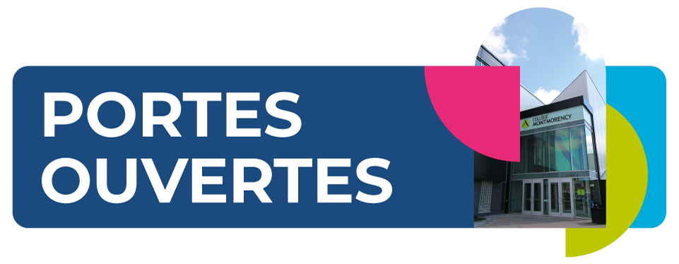
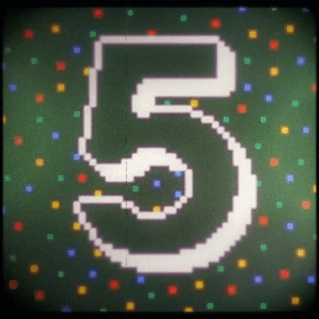
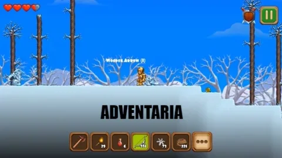
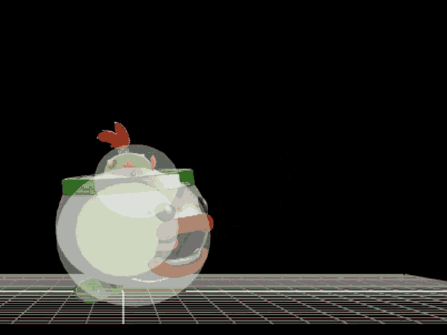
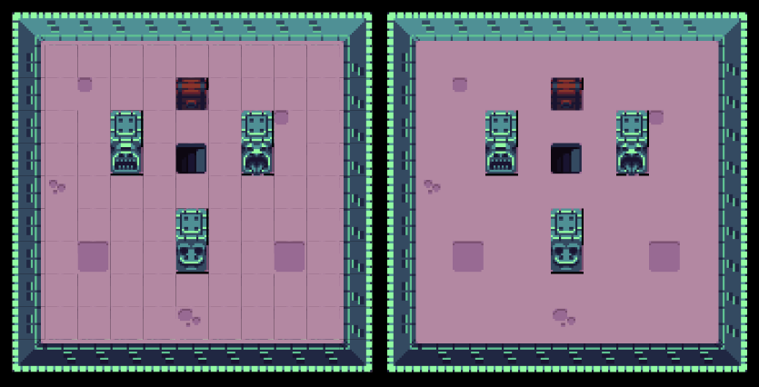

---
tags:
  - Cours 10
  - Mardi 5 novembre
---

# Cours 10

## Annonce



<div class="grid" markdown>
<div markdown>
Mardi le 12 novembre 2024<br>
16h à 21h<br>
Repas inclus

**Nous avons besoin de 5 personnes de 2ème pour participer à l'événement!**

[Portes ouvertes | cmontmorency.qc.ca](https://www.cmontmorency.qc.ca/futurs-etudiants/visite-du-college/portes-ouvertes)
</div>


</div>

## Suivi sur les exercices de la semaine dernière

* Liste **exhaustive** des tâches à effectuer pour terminer votre jeu
> Parlez-moi de l'évolution de votre liste de tâche. Avez-vous ajouté, modifié ou retiré des éléments ?
* Pistes et effets sonores
* Scène "Comment jouer"
* HUD

## Parallax

{.w-100}

Le *parallax* est une technique qui donne une impression de profondeur en faisant bouger différents plans d’arrière-plan à des vitesses différentes.

### Comment ça marche ?

Plus le plan est proche, plus l'animation est vite. Plus il est loin, plus il s'anime lentement.

Malgré qu'il soit possible de créer un effet parallax sans arriêre-plan infini, il est toutefois préférable d'avoir des images qui peuvent se répéter.

Le code minimal est le suivant :

```js
class Example extends Phaser.Scene {
  preload() {
    //...
  }

  create() {
    this.bgFar = this.add.tileSprite(0, 0, config.width, config.height, "background_far").setOrigin(0, 0);
    this.bgMid = this.add.tileSprite(0, 0, config.width, config.height, "background_mid").setOrigin(0, 0);
    this.bgNear = this.add.tileSprite(0, 0, config.width, config.height, "background_near").setOrigin(0, 0);
  }

  update(time, delta) {
    this.bgFar.tilePositionX += 0.2;
    this.bgMid.tilePositionX += 0.5;
    this.bgNear.tilePositionX += 1;
  }
}
```

[Codepen - Parallax automatique](https://codepen.io/tim-momo/pen/ExqPNNd)

[Codepen - Parallax par défilement manuel](https://codepen.io/tim-momo/pen/ZEgjqZZ)

## HUD + Zoom

{.w-100}

La méthode `element.setScrollFactor(0);` permet d'attacher un élément à la caméra, mais si un zoom est effectué, malgré que l'attachement soit bien fonctionne, l'affichage de l'élément peut peut se faire en dehors de la portion visible du jeu!

Il existe une méthode pour résoudre ce problème. Celle-ci conciste à créer une scène dédiée à l'affichage du HUD.

Afin d'interagir avec une autre scène, on doit créer un petit système de communication par événement. Voici comment ça peut se mettre en place.

```js

let score = 0;
const config = {
  //...
  scene: [Jeu, HUD]
};

class HUD extends Phaser.Scene {
  constructor() {
    super({ key: "hud" });
  }

  create() {
    let info = this.add.text(10, 10, "Distance: 0cm", {font: "16px Arial", fill: "#C9CCCF"});

    let jeu = this.scene.get("jeu");
    // Événement personnalisé
    jeu.events.on("addScore", (pts) => {
      score += pts;
      info.setText("Distance : " + score + "cm");
    });
  }
}

class Jeu extends Phaser.Scene {
  constructor() {
    super({ key: "jeu" });
  }

  create() {
    // HUD
    this.scene.launch("hud");

    // Joueur
    this.player = this.add.sprite(0, 0, "spritesheet");

    // Caméra
    this.mainCamera = this.cameras.main;
    this.mainCamera.startFollow(this.player);
    this.mainCamera.setZoom(2);
  }

  update(time, delta) {
    // Événement personnalisé
    this.events.emit("addScore", 20);
  }
}
```

!!! info "Variables globales"

    Notez l'ajout d'une variable globale! Cela s'avère très utile pour stocker de l'information indépendament des scènes.

[Codepen - Scène HUD](https://codepen.io/tim-momo/pen/zYgLMBG)

[Référence](https://phaser.io/examples/v3.85.0/scenes/view/ui-scene)

## Collision temporaire

{.w-100}

En fonction des animations de votre personage, il est parfois pertinent de savoir comment créer un boite de collision temporaire qui serait pour un combat ou simplement interagir avec l'environnement.

Pour ce faire, il faut simplement ajouter une zone à notre scène. Voici la syntaxe :

```js
this.hitbox = this.add.zone(
  this.player.x + (this.player.flipX ? -15 : 15),
  this.player.y,
  30, // largeur
  40  // hauteur
);
this.physics.add.existing(this.hitbox);
this.hitbox.body.setAllowGravity(false);
this.hitbox.body.setImmovable(true);
```

Une fois la zone créé, un peu alors préparer l'événement de collision. Voici un exemple :

```js
this.physics.add.overlap(this.enemies, this.hitbox, (enemy, hitbox) => {
  // Votre logique de collision ici ...
  hitbox.destroy();
};)
```

Maintenant que tout est prêt, il faut déterminer quand on fait apparaitre la zone. Voici un cas de figure :

```js
this.input.on("pointerdown", (pointer) => {
  // Création du hitbox ici. Afin de garder le tout propre,
  // on pourrait créer une fonction qu'on appelerait "createHitbox()".
  // et on l'appellerait ici.
});

this.player.on("animationcomplete", (animation, frame) => {
  if (animation.key == "attack") {
    // Quand l'animation se termine, on détruit la zone.
    this.hitbox.destroy();
  }
});
```

[Codepen - Collision temporaire](https://codepen.io/tim-momo/pen/bGXKpEa)

## Tunneling

En Phaser, le tunneling est un problème fréquent, surtout lorsqu’on utilise le système de physique “arcade” (ce qui est notre cas).

Il survient lorsque des objets en mouvement rapide traversent d’autres objets physiques sans déclencher de collisions ou de superpositions (overlap).

Pour atténuer ce problème, certaines configurations peuvent être ajustées, mais **la solution la plus fiable reste de limiter la vitesse des objets dans votre jeu**.

```js
const config = {
  type: Phaser.AUTO,
  width: 800,
  height: 400,
  scene: Example,
  pixelArt: true,
  roundPixels: true,
  transparent: true,
  physics: {
    default: "arcade",
    arcade: {
      debug: true,
      gravity: { y: 0 },

      // FPS
      // Augmentation du taux de rafraichissement du jeu.
      fps: 120, // Default 60

      // TILE_BIAS
      // Détermine le chevauchement maximal entre le corps d’un objet et une tuile pour déclencher la séparation.
      // Valeurs élevées : Favorisent la séparation (l’objet sera repoussé pour éviter le chevauchement).
      // Valeurs faibles : Favorisent l’absence de séparation (l’objet peut rester plus proche de la tuile sans être repoussé).
      tileBias: 32, // Default 16.

      // OVERLAP_BIAS
      // Définit la différence maximale entre la vitesse d’un objet et son chevauchement avec un autre objet pour déclencher la séparation.
      // Valeurs élevées : Favorisent la séparation (l’objet sera repoussé pour éviter le chevauchement).
      // Valeurs faibles : Favorisent l’absence de séparation (l’objet peut rester plus proche de la tuile sans être repoussé).
      overlapBias: 16 // Default 4
    }
  }
};
```

https://docs.phaser.io/api-documentation/typedef/types-physics-arcade#arcadeworldconfig

https://codepen.io/tim-momo/pen/wvVvdXN

Plus d'information sur le tunneling : https://www.youtube.com/watch?v=VpSWuywFlC8

## Tile Bleed



Le phénomène illustré ci-dessus s'appelle le "Tile bleeding". Il s'agit d'un problème graphique qui peut survenir dans les jeux qui utilisent des tuiles (tileset). Le problème se manifeste par des lignes ou des bords indésirables qui apparaissent entre les tuiles.

Si vous rencontrez ce problème[^tilebleed], commencez par mettre à jour votre version de Phaser. Vous pouvez également désactiver le mode debug pour voir si l'anomalie persiste.

[^tilebleed]: [Issue 6674 - GitHub de Phaser](https://github.com/phaserjs/phaser/issues/6674)

## Progression / Prérequis

Votre jeu inclut-il un prérequis ou une forme de progression perceptible ? Il est essentiel que le joueur puisse ressentir une avancée au cours de l'expérience de jeu.

Si ce n'est pas le cas, vous devez **obligatoirement** ajouter des éléments de progression. Voici quelques exemples :

* Accomplissement d'objectifs spécifiques
* Enchaînement de niveaux
* Obtention d'objets nécessaires pour progresser
* Complétion d'une quête en plusieurs étapes
* Finir le jeu dans un temps limité
* Prise de décisions narratives influençant le déroulement du jeu
* Activation d'un équipement qui modifie le *gameplay*
* Atteinte d'un certain niveau de compétence ou statistique (ex. : force ou intelligence)
* Accumulation de ressources ou de points (argent, expérience, etc.)

## Scène Crédits

Dans la scène "Crédits", vous devrez inclure les informations suivantes :

1. Votre nom complet, prénom, ou nom d'artiste :artist:
2. La source de chaque *asset* utilisé dans votre projet, pour les images et les sons. Indiquez le nom d'utilisateur et la provenance entre parenthèses. Par exemple : [GandalfHardcore (itch.io)](./assets/images/credit.png)
3. L'année en cours

Cette démarche montre :

* Votre respect pour les créateurs
* Votre transparence envers les utilisateurs
* Votre contribution pour aider les autres à trouver des ressources pour leurs propres projets

## Devoir

<div class="grid grid-1-2" markdown>
  

  <small>Devoir - Phaser</small><br>
  **[Expérience ludique et interactive](./devoirs/experience.md){.stretched-link}**
</div>
