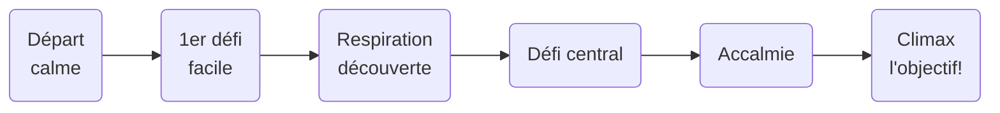

# Cours 11

## Production - capsule Level design

La production est lancée : l'essentiel de la séance se passe sur ton jeu, piloté par tes issues. La capsule du jour t'outille pour rendre ton **niveau** meilleur - elle n'est pas un prérequis pour livrer, mais c'est peut-être elle qui fera dire « oh, c'est bien fait » aux joueurs.

<!-- ## Déroulement de la séance

| Temps | Activité |
|---|---|
| 0h00 – 0h45 | Capsule : level design |
| 0h45 – 1h00 | Application express : diagnostic de ton niveau |
| 1h00 – 1h15 | Pause |
| 1h15 – 3h20 | Production (issues) |
| 3h20 – 3h35 | Rituel de commit | -->

## Capsule - Level design

### Le level design : l'espace qui raconte la boucle

Le level design est un métier à part entière : concevoir l'**espace** pour qu'il serve le gameplay. Un bon niveau n'est pas un beau décor - c'est un décor qui **enseigne, guide, dose et récompense** sans un mot de tutoriel. Ton niveau unique doit faire les quatre.

### Le rythme : tension et repos

Un bon niveau respire : moment d'action → respiration → action plus intense → grande respiration. Tout en tension épuise; tout en repos ennuie (le couloir du flow, cours 5 - appliqué à l'espace).

Trace la courbe de TON niveau : où sont les pics? S'il n'y a pas de vallées, ajoute un moment contemplatif (un point de vue, une salle sûre). S'il n'y a pas de pic final, ton arrivée à l'objectif est plate.

### Les lumières : l'outil de guidage n° 1

Avant de guider par la lumière, il faut connaître ses sources. Unity (URP) en offre trois principales :

| Source | Métaphore | Usage type |
|---|---|---|
| **Directional Light** | Le soleil : partout, parallèle, une seule direction | L'éclairage global de ta scène (il y en a déjà une!) |
| **Point Light** | Une ampoule : rayonne dans toutes les directions | Lampadaire, torche, lueur d'un objet important |
| **Spot Light** | Un projecteur : un cône orienté | Mettre l'objectif « sous le projecteur », littéralement |

Les réglages qui comptent : **Color** (chaude = accueillant, froide = danger - raconte avec la température!), **Intensity**, **Range** (portée des Point/Spot) et **Shadow Type** (des ombres = du réalisme, mais un coût - *No Shadows* sur les petites lumières décoratives).

!!! tip "La lumière émissive"
    Un material avec **Emission** activée « brille » par lui-même (un cristal, un écran, des champignons luminescents). Combiné au bloom du cours 12, c'est l'effet le plus spectaculaire du cours pour 30 secondes de travail.

### Guider sans flèches

Le joueur doit savoir **où aller** sans qu'on le lui dise. Les outils, par ordre de subtilité :

* **La lumière** : l'œil va vers la clarté. Éclaire ta destination, laisse les impasses dans la pénombre
* **La couleur** : une tache contrastée dans un décor uniforme est un aimant (la peinture jaune du cours 5!)
* **Les lignes** : chemins, clôtures, façades et rangées d'arbres pointent naturellement quelque part - fais-les pointer au bon endroit
* **Les landmarks** : un repère visible de partout (tour, arbre géant, statue). Le joueur ne se perd jamais s'il peut toujours se dire « la tour est par là »

{data-zoom-image}

Dans [Elden Ring (2022)](https://store.steampowered.com/app/1245620/ELDEN_RING/), l'Erdtree - l'arbre doré - est visible depuis presque partout : landmark absolu. Sans aucune flèche, tu sais toujours grossièrement où est « l'objectif ». Les parcs Disney font pareil avec le château (les *weenies* de Walt).

### La lisibilité : si tout brille, rien ne brille

L'affordance appliquée à l'espace : ce qui est **interactif** doit se distinguer de ce qui est **décoratif**. Ta clé flotte et tourne (cours 9) - assure-toi que le décor autour reste calme. Le contrat implicite avec le joueur : « ce qui bouge/brille me concerne; le reste est du paysage ». Romps ce contrat et il touchera à tout (ou à rien).

### Placer l'objectif : visible tôt, atteignable tard

Le vieux truc des grands niveaux : montre la destination dès le début (la porte verrouillée bien en vue), fais-la mériter (la clé demande un détour). Le joueur comprend l'objectif en 5 secondes ET a une raison d'explorer - c'est ta boucle de jeu **racontée par l'espace**.

Corollaire : **récompense les détours**. Un recoin exploré doit contenir quelque chose (un son, un visuel sympa, un raccourci…). La curiosité punie (cul-de-sac vide) éteint l'envie d'explorer - pour tout le reste du jeu.

## Application express (15 min)

- [ ] Parcours ton niveau **comme un nouveau joueur** : à chaque intersection, note où tes yeux vont naturellement - c'est là que ton niveau « pointe ». Est-ce le bon endroit?
- [ ] Ton objectif est-il visible tôt? Sinon, peux-tu l'exposer (surélever la porte, l'éclairer, ouvrir une percée)?
- [ ] Place une **Point ou Spot Light** sur ton objectif (ou ta clé) : couleur accordée à ton ambiance, Range ajusté. Recule : l'œil y va tout seul?
- [ ] Choisis **UN** principe de la capsule et applique-le maintenant (une lumière sur l'objectif, un landmark, un contraste sur ta clé) - 15 minutes, pas plus : c'est un diagnostic, pas un chantier

## Production

- [ ] Reprends tes issues **Must**, dans l'ordre; ferme-les au fur et à mesure
- [ ] Les améliorations de level design que tu viens d'identifier → nouvelles issues `[SHOULD]`
- [ ] Coincé plus de 15 minutes? Lève la main - c'est à ça que sert la production supervisée
- [ ] Élève rapide, issues Must terminées? Pige dans les [**Recettes avancées**](./extra/recettes-avancees.md) (double saut, dash, projectiles…) - en issues [COULD]
- [ ] Commit de fin de séance : `Production S11 : ...` → Push

## Devoir

- [ ] Poursuivre ses issues (Must d'abord, toujours)

## Ressources

* [The Level Design Book (référence libre, en anglais)](https://book.leveldesignbook.com/)
* [GMTK - la chaîne de référence sur le design de jeu](https://www.youtube.com/@GMTK)
