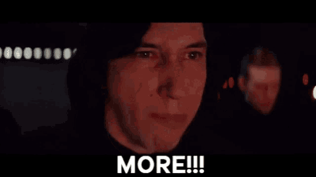

---
tags:
  - Cours 12
  - Mardi 19 novembre
---

# Cours 12

## Transition de scène

```js
play.once('pointerdown', () => {
    const fx = this.cameras.main.postFX.addWipe();
    this.scene.transition({
        target: 'Jeu',
        duration: 2000,
        moveBelow: true,
        onUpdate: (progress) => {
            fx.progress = progress;
        }
    });
});
```

* **target** (obligatoire) : la clé de la scène vers laquelle vous souhaitez effectuer la transition.
* **duration** (optionnel) : la durée de la transition en millisecondes. Par défaut, elle est de 1000 ms.
* **moveAbove** (optionnel) : si défini à true, la scène cible sera placée au-dessus de la scène actuelle dans la liste d’affichage.
* **moveBelow** (optionnel) : si défini à true, la scène cible sera placée en dessous de la scène actuelle dans la liste d’affichage.
* **sleep** (optionnel) : si défini à true, la scène actuelle sera mise en sommeil à la fin de la transition. Si false, elle sera arrêtée. Par défaut, elle est arrêtée.
* **remove** (optionnel) : si défini à true, la scène actuelle sera supprimée du gestionnaire de scènes après la transition.
* **onUpdate** (optionnel) : callback appelée à chaque frame pendant la transition, recevant le pourcentage d’avancement de la transition (entre 0 et 1).

<iframe class="aspect-2-1" height="300" style="width: 100%;" scrolling="no" title="Phaser - Transition de scène" src="https://codepen.io/tim-momo/embed/ZEgNKGm?default-tab=result&editable=true&theme-id=50173" frameborder="no" loading="lazy" allowtransparency="true" allowfullscreen="true">
  See the Pen <a href="https://codepen.io/tim-momo/pen/ZEgNKGm">
  Phaser - Transition de scène</a> by TIM Montmorency (<a href="https://codepen.io/tim-momo">@tim-momo</a>)
  on <a href="https://codepen.io">CodePen</a>.
</iframe>

### Scène de chargement

À mesure que votre jeu se développe, la gestion des médias devient de plus en plus complexe, ce qui est un défi courant en développement de jeux.

Pour anticiper et résoudre ces problèmes, il est recommandé d’intégrer une scène de chargement dédiée.

Cette scène sert à charger les ressources nécessaires au jeu, garantissant leur disponibilité dans les autres scènes. Voici un exemple :

<iframe class="aspect-2-1" height="300" style="width: 100%;" scrolling="no" title="Phaser - Transition de scène" src="https://codepen.io/tim-momo/embed/preview/ExqzWJM?default-tab=result&editable=true&theme-id=50173" frameborder="no" loading="lazy" allowtransparency="true" allowfullscreen="true">
  See the Pen <a href="https://codepen.io/tim-momo/pen/ExqzWJM">
  Phaser - Transition de scène</a> by TIM Montmorency (<a href="https://codepen.io/tim-momo">@tim-momo</a>)
  on <a href="https://codepen.io">CodePen</a>.
</iframe>

## Particules

Un système de particules est un outil qui permet de créer et de gérer de nombreux petits objets appelés particules.

Ces particules sont utilisées pour simuler des effets visuels dynamiques tels que la fumée, le feu, la pluie, les explosions, etc.

### Comment ça marche ?

**Émetteur de particules** ([Emitter](https://docs.phaser.io/api-documentation/class/gameobjects-particles-particleemitter)) : C’est la source qui génère les particules. Vous pouvez définir sa position, sa fréquence d’émission, la durée de vie des particules, leur vitesse, leur rotation, etc.

**Particules** : Ce sont les éléments individuels créés par l’émetteur. Chaque particule a ses propres propriétés, comme sa taille, sa couleur, sa transparence et suit un comportement défini lors de sa création.

!!! info "Ressources"

    [TexturePacker](https://www.codeandweb.com/tp-online) : Sert à créer un tileset à partir de plusieurs images.

    [Kenney (Particle pack)](https://www.kenney.nl/assets/particle-pack) : Si vous ne voulez pas vous casser la tête à trouver des textures de particules, vous pouvez utiliser celles du site https://kenney.nl/. Elles sont gratuites et sans droit d'auteur. Prévilégiez les textures avec un fond transparent.

### Émetteur de particules

```js title="Syntaxe"
// this.add.particles(x, y, texture, config);
```

```js title="Exemple normal"
preload() {
  this.load.image('particle', 'chemin/vers/particle.png');
}
create() {
  this.emitter = this.add.particles(400, 300, "particle", {
    scale: 0.05,
    lifespan: 800, // Durée de vie des particules en ms
    frequency: 30, // Fréquence d'émission en ms
    speed: 200     // Vitesse initiale des particules (px par seconde)
  });
}
```

<iframe class="aspect-2-1" height="300" style="width: 100%;" scrolling="no" title="Phaser - Particles" src="https://codepen.io/tim-momo/embed/oNKRzZV?default-tab=result&editable=true&theme-id=50173" frameborder="no" loading="lazy" allowtransparency="true" allowfullscreen="true">
  See the Pen <a href="https://codepen.io/tim-momo/pen/oNKRzZV">
  Phaser - Particles</a> by TIM Montmorency (<a href="https://codepen.io/tim-momo">@tim-momo</a>)
  on <a href="https://codepen.io">CodePen</a>.
</iframe>

```js title="Exemple avec tous les paramètres et leur valeur par défaut"
this.add.particles(400, 300, "particle", {
    // Propriétés de base
    active: true,                      // Définit si l'émetteur est actif
    blendMode: 'ADD',                  // Mode de fusion des particules
    emitting: true,                    // Si les particules sont émises en continu
    follow: player,                    // Objet que les particules suivent
    followOffset: { x: 10, y: 10 },    // Décalage par rapport à l'objet suivi
    frequency: 100,                    // Fréquence d'émission en ms
    lifespan: { min: 500, max: 1000 }, // Durée de vie des particules en ms
    maxParticles: 100,                 // Nombre maximum de particules actives
    quantity: 2,                       // Nombre de particules émises à chaque intervalle
    timeScale: 1,                      // Échelle de temps pour l'émetteur
    trackVisible: true,                // Émet uniquement si l'objet suivi est visible
    visible: true,                     // Visibilité de l'émetteur

    // Propriétés physiques
    accelerationX: 0,              // Accélération horizontale
    accelerationY: 0,              // Accélération verticale
    angle: { min: 0, max: 360 },   // Angle initial des particules
    bounce: 0.5,                   // Rebond des particules
    gravityX: 0,                   // Gravité horizontale
    gravityY: 200,                 // Gravité verticale
    maxVelocityX: 200,             // Vitesse horizontale maximale
    maxVelocityY: 200,             // Vitesse verticale maximale
    moveToX: 400,                  // Coordonnée X vers laquelle les particules se déplacent
    moveToY: 300,                  // Coordonnée Y vers laquelle les particules se déplacent
    speed: { min: 100, max: 200 }, // Vitesse initiale des particules (px par sec.)
    x: { min: 0, max: 800 },       // Position X d'émission
    y: { min: 0, max: 600 },       // Position Y d'émission

    radial: true, // Détermine la direction initiale du mouvement des particules.
                  // Si true, les particules se déplacent dans toutes les directions à partir du point d’émission.
                  // Dans ce mode, la propriété speed contrôle la vitesse des particules.
                  // Si false, les particules se déplacent selon une direction spécifique, influencée par les propriétés angle et speedX/speedY.

    // Propriétés visuelles
    alpha: { start: 1, end: 0 },          // Transparence des particules
    scale: { start: 1, end: 0 },          // Échelle des particules
    tint: [0xff0000, 0x00ff00, 0x0000ff], // Couleurs des particules
    frame: [0, 1, 2],                     // Frames d'un spritesheet utilisé pour les particules

    // Zones
    emitZone: { type: 'random', source: new Phaser.Geom.Rectangle(0, 0, 800, 600) }, // Zone d'émission
    deathZone: { type: 'onEnter', source: new Phaser.Geom.Circle(400, 300, 100) },   // Zone de mort

    // Calbacks
    emitCallback: (particle, emitter) => { /* Code lors de l'émission */ },
    deathCallback: (particle, emitter) => { /* Code lors de la mort */ },
});
```

### Configurer les émetteurs

De nombreux paramètres peuvent être configurés de manière flexible. Par exemple :

#### Valeur fixe

```js
scale: 0.5
```

#### Plage aléatoire

Pour que chaque particule ait une valeur différente choisie aléatoirement dans une plage définie, utilisez un objet avec les propriétés min et max.

```js
scale: { min: 0.4, max: 1.2 }
```

#### Transition progressive (start/end)

Pour que la valeur d’un paramètre évolue progressivement au cours de la durée de vie de la particule, utilisez un objet avec les propriétés start et end. On peut aussi interpoler ou ajouter de l'aléatoire si le désire!

```js
scale: { start: 0.5, end: 2}
scale: { start: 0.5, end: 2, ease: 'Sine.easeInOut', random: true }
```

#### Valeurs aléatoires à partir d’un tableau

```js
angle: [0, 90, 180, 270]
```

#### Callback onEmit et onUpdate (avancé)

```js
speed: {
    onEmit: (particle, key, t, value) => {
        // Chaque particule est émise avec une vitesse aléatoire entre 100 et 300 pixels par seconde.
        return Math.random() * 200 + 100;
    }
}
```

<iframe class="aspect-2-1" height="300" style="width: 100%;" scrolling="no" title="Phaser - Particles blendmode" src="https://codepen.io/tim-momo/embed/JjgqJbJ?default-tab=result&editable=true&theme-id=50173" frameborder="no" loading="lazy" allowtransparency="true" allowfullscreen="true">
  See the Pen <a href="https://codepen.io/tim-momo/pen/JjgqJbJ">
  Phaser - Particles blendmode</a> by TIM Montmorency (<a href="https://codepen.io/tim-momo">@tim-momo</a>)
  on <a href="https://codepen.io">CodePen</a>.
</iframe>

### Modes de fusion

Les modes de fusion ([blend modes](https://docs.phaser.io/api-documentation/constant/blendmodes)) déterminent comment les couleurs des particules émises se combinent avec celles de l’arrière-plan ou des autres objets. Lors de la configuration d’un émetteur de particules, vous pouvez spécifier le mode de fusion en utilisant la propriété blendMode. Voici la liste des modes de fusion disponibles :

* **NORMAL** : Mode par défaut où les nouvelles formes sont dessinées par-dessus le contenu existant du canevas.
* **ADD** : Les couleurs des formes qui se chevauchent sont déterminées en additionnant les valeurs de couleur.
* **MULTIPLY** : Les pixels de la couche supérieure sont multipliés par les pixels correspondants de la couche inférieure, produisant une image plus sombre.
* **SCREEN** : Les pixels sont inversés, multipliés, puis inversés à nouveau, produisant une image plus claire (opposé de MULTIPLY).
* **ERASE** : Mode d’effacement alpha.
* **OVERLAY** : Combinaison de MULTIPLY et SCREEN. Les parties sombres de la couche de base deviennent plus sombres et les parties claires deviennent plus claires.
* **DARKEN** : Conserve les pixels les plus sombres des deux couches.
* **LIGHTEN** : Conserve les pixels les plus clairs des deux couches.
* **COLOR_DODGE** : Divise la couche inférieure par l’inverse de la couche supérieure.
* **COLOR_BURN** : Divise l’inverse de la couche inférieure par la couche supérieure, puis inverse le résultat.
* **HARD_LIGHT** : Combinaison de MULTIPLY et SCREEN similaire à OVERLAY, mais avec les couches supérieure et inférieure inversées.
* **SOFT_LIGHT** : Version plus douce de HARD_LIGHT. Le noir ou le blanc pur ne donne pas du noir ou du blanc pur.
* **DIFFERENCE** : Soustrait la couche inférieure de la couche supérieure ou inversement pour toujours obtenir une valeur positive.
* **EXCLUSION** : Semblable à DIFFERENCE, mais avec un contraste plus faible.
* **HUE** : Préserve la luminance et la chrominance de la couche inférieure, tout en adoptant la teinte de la couche supérieure.
* **SATURATION** : Préserve la luminance et la teinte de la couche inférieure, tout en adoptant la chrominance de la couche supérieure.
* **COLOR** : Préserve la luminance de la couche inférieure, tout en adoptant la teinte et la chrominance de la couche supérieure.
* **LUMINOSITY** : Préserve la teinte et la chrominance de la couche inférieure, tout en adoptant la luminance de la couche supérieure.
* **SOURCE_IN** : La nouvelle forme est dessinée uniquement là où elle chevauche le contenu existant du canevas. Tout le reste devient transparent.
* **SOURCE_OUT** : La nouvelle forme est dessinée là où elle ne chevauche pas le contenu existant du canevas.
* **SOURCE_ATOP** : La nouvelle forme est dessinée uniquement là où elle chevauche le contenu existant du canevas.
* **DESTINATION_OVER** : Les nouvelles formes sont dessinées derrière le contenu existant du canevas.
* **DESTINATION_IN** : Le contenu existant du canevas est conservé là où la nouvelle forme et le contenu existant se chevauchent. Tout le reste devient transparent.
* **DESTINATION_OUT** : Le contenu existant est conservé là où il ne chevauche pas la nouvelle forme.
* **DESTINATION_ATOP** : Le contenu existant est conservé là où il chevauche la nouvelle forme. La nouvelle forme est dessinée derrière le contenu existant.
* **LIGHTER** : Les couleurs des formes qui se chevauchent sont déterminées en additionnant les valeurs de couleur.
* **COPY** : Seule la nouvelle forme est affichée.
* **XOR** : Les formes deviennent transparentes là où elles se chevauchent et sont dessinées normalement ailleurs.

<iframe class="aspect-2-1" height="300" style="width: 100%;" scrolling="no" title="Phaser - Particles" src="https://codepen.io/tim-momo/embed/OJKYgRr?default-tab=result&editable=true&theme-id=50173" frameborder="no" loading="lazy" allowtransparency="true" allowfullscreen="true">
  See the Pen <a href="https://codepen.io/tim-momo/pen/OJKYgRr">
  Phaser - Particles</a> by TIM Montmorency (<a href="https://codepen.io/tim-momo">@tim-momo</a>)
  on <a href="https://codepen.io">CodePen</a>.
</iframe>

### Interaction avec explode!

Vous pouvez déclencher manuellement une émission de particules. Pour ce faire, assurez vous que le paramêtre `emitting` de votre emetteur est à `false`.

Ensuite, vous pouvez ajouter un event listener de la manière suivante :

```js
this.input.on("pointerdown", (pointer) => {
  this.emitter.explode(10, pointer.x, pointer.y);
});
```

<iframe class="aspect-2-1" height="300" style="width: 100%;" scrolling="no" title="Phaser - Particles interaction" src="https://codepen.io/tim-momo/embed/qBeGryG?default-tab=result&editable=true&theme-id=50173" frameborder="no" loading="lazy" allowtransparency="true" allowfullscreen="true">
  See the Pen <a href="https://codepen.io/tim-momo/pen/qBeGryG">
  Phaser - Particles interaction</a> by TIM Montmorency (<a href="https://codepen.io/tim-momo">@tim-momo</a>)
  on <a href="https://codepen.io">CodePen</a>.
</iframe>

### J'en veux plus!

{.w-100}

Le sujet des particules est un sujet très vaste. Si vous voulez explorer davantage le thème, consultez les [exemples d'émetteurs de particules](https://phaser.io/examples/v3.85.0/game-objects/particle-emitter) sur le site officiel de Phaser.

## JSON

Le JSON (JavaScript Object Notation) est un format léger d’échange de données, facile à lire et à écrire. Il est principalement utilisé pour représenter des données structurées de manière similaire aux objets en JavaScript.

!!! note "Prononciation"

    JSON se prononce «JAY SON» :white_check_mark: et non comme le prénom «JASON» :x:.

**Principales caractéristiques du JSON**

* Les données sont représentées sous forme de **texte**
* Les données sont organisées en paires, où chaque **clé** est associée à une **valeur** correspondante.
* Le JSON est compatible avec de nombreux langages de programmation.

```json title="Exemple simple de JSON"
{
  "nom": "Alice",
  "age": 18,
  "professions": [
    "Écrivaine",
    "Chanteuse",
    "Actrice",
    "Peintre"
  ]
}
```

## Sauvegarde et chargement

La sauvegarde de la progression implique généralement le stockage de données telles que le **niveau atteint**, le **score**, les **objets collectés**, etc.

En JavaScript, ces informations peuvent être stockées localement en utilisant le `localStorage` du navigateur.

!!! tip "Limite au stockage"

    Bien que le localStorage permette de stocker des données localement dans le navigateur, il présente des limitations importantes. La capacité de stockage est généralement limitée à environ [5 Mo](https://web.dev/articles/storage-for-the-web?hl=fr).

    Pour du stockage de grand volume, il est recommandé d’utiliser des solutions plus robustes comme [IndexedDB](https://medium.com/@kamresh485/indexeddb-tutorial-for-beginners-a-comprehensive-guide-with-coding-examples-74df2914d4d5). Toutefois, IndexedDB ne fait pas partie du cours, il est plus complexe à utiliser et nécessite une implémentation plus approfondie.

Il est recommandé de structurer les données de sauvegarde en utilisant des objets `JSON` pour regrouper toutes les informations pertinentes :

```js title="Sauvegarder des données"
const sauvegarde = {
    niveau: niveauActuel,
    score: scoreActuel,
    objets: objetsCollectes
};
localStorage.setItem('sauvegardeJeu', JSON.stringify(sauvegarde));
```

```js title="Charger des données"
const sauvegarde = JSON.parse(localStorage.getItem('sauvegardeJeu'));
```

<iframe class="aspect-2-1" height="300" style="width: 100%;" scrolling="no" title="Phaser - Sauvegarde" src="https://codepen.io/tim-momo/embed/zYgQzwN?default-tab=result&editable=true&theme-id=50173" frameborder="no" loading="lazy" allowtransparency="true" allowfullscreen="true">
  See the Pen <a href="https://codepen.io/tim-momo/pen/zYgQzwN">
  Phaser - Sauvegarde</a> by TIM Montmorency (<a href="https://codepen.io/tim-momo">@tim-momo</a>)
  on <a href="https://codepen.io">CodePen</a>.
</iframe>

## Capture d'écran

La capture d'écran est utile pour indiquer à l'utilisateur où il en était dans sa progression lors de sa dernière session. Cette fonctionnalité est possible avec la méthode suivante :

```js
this.game.renderer.snapshot((image) => {});
```

!!! tip "Remarques importantes"

    **Performance** : La génération de captures d’écran peut être coûteuse en termes de performance, surtout pour des jeux avec des résolutions élevées. Je conseille donc de limiter la fréquence de ces captures et de limiter la résolution de votre jeu.

    **Taille des données** : Les images encodées en base64 peuvent être volumineuses. C'est pourquoi je suggère de redimentionner la capture d'écran si vous voulez l'enregistrer dans le localStorage.

    Par exemple, une capture d'un jeu de 800x600 en base64 se situe autour de 1 Mo.

<iframe class="aspect-2-1" height="300" style="width: 100%;" scrolling="no" title="Phaser - Snapshot" src="https://codepen.io/tim-momo/embed/ZEgNJXr?default-tab=result&editable=true&theme-id=50173" frameborder="no" loading="lazy" allowtransparency="true" allowfullscreen="true">
  See the Pen <a href="https://codepen.io/tim-momo/pen/ZEgNJXr">
  Phaser - Snapshot</a> by TIM Montmorency (<a href="https://codepen.io/tim-momo">@tim-momo</a>)
  on <a href="https://codepen.io">CodePen</a>.
</iframe>

Voici un exemple de capture d'écran qui permet de redimentionner l'image capturée afin de réduire son poids :

```js
captureScreenshot() {
  this.game.renderer.snapshot((image) => {

    // Taille d'origine de l'image capturée
    const originalWidth = image.width;
    const originalHeight = image.height;

    // Définissez la largeur cible (ajustez selon vos besoins)
    const targetWidth = 200;

    // Calcule la hauteur parce qu'on veut garder le même ratio!
    const aspectRatio = originalWidth / originalHeight;
    const targetHeight = targetWidth / aspectRatio;

    // Crée un canvas temporaire pour redimensionner l'image
    const canvas = document.createElement("canvas");
    const ctx = canvas.getContext("2d");
    canvas.width = targetWidth;
    canvas.height = targetHeight;

    // Attendre que l'image se charge complètement avant de dessiner
    const img = new Image();
    img.src = image.src;
    img.onload = () => {
      // Dessine l'image redimensionnée tout en respectant le ratio
      ctx.drawImage(img, 0, 0, targetWidth, targetHeight);

      // Convertit le canvas redimensionné en une URL de base64
      // Ex : "data:image/png;base64,iVBORw0KGgoAAAANSUhEUgAAAMgAAABkCAYAAADDhn8LAAAAAXNSR...
      const resizedImage = canvas.toDataURL();

      // Enregistre l'image redimensionnée dans le localStorage
      localStorage.setItem("screenshotImage", resizedImage);

      // Génère une clé unique pour la texture, sinon ca bogue
      const uniqueKey = `screenshotTexture_${Date.now()}`;

      // Ajoute la texture redimensionnée avec une clé unique
      this.textures.addBase64(uniqueKey, resizedImage);

      // Ajoute une texture à la scène Phaser
      this.textures.once("onload", (picture) => {
        // Test :
        // Affiche l'image au centre du jeu dès que la texture est prête
        this.add.image(config.width / 2, config.height / 2, picture).setOrigin(0.5, 0.5);
      });
    };
  });
}
```

Lorsqu'on veut afficher l'image sauvegardée dans `localStorage`, vous pouvez le faire avec le code suivant :

```js
const savedImage = localStorage.getItem("screenshotImage");

if (savedImage) {
  const uniqueKey = `restoredImage_${Date.now()}`;
  this.textures.once("onload", (key) => {
    this.add
      .image(this.cameras.main.centerX, this.cameras.main.centerY, key)
      .setOrigin(0.5, 0.5);
  });
  this.textures.addBase64(uniqueKey, savedImage);
}
```

## Exercice

Osez dont ajouter des particules à votre jeu, ça pourrait être cool !

## Devoir

<div class="grid grid-1-2" markdown>
  

  <small>Devoir - Phaser</small><br>
  **[La disquette](./devoirs/sauvegarde.md){.stretched-link}**
</div>
