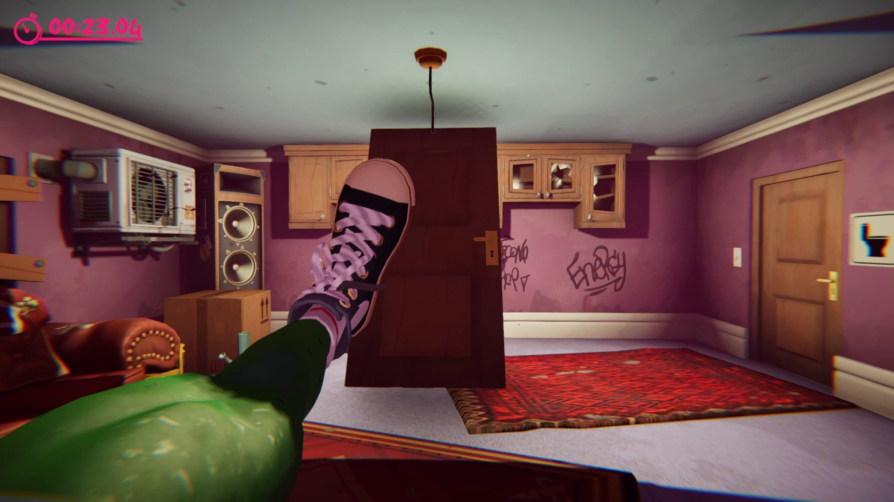

# Cours 12


## Application express 2 (15 min) - le bloom

- [ ] Hierarchy → **Volume → Global Volume** → **New** Profile → **Add Override → Post-processing → Bloom** : Threshold ~0.9, Intensity ~0.6
- [ ] **Add Override → Vignette** : Intensity ~0.25
- [ ] Vérifie **Post Processing** coché sur ta caméra
- [ ] Crée un material **émissif** (Emission cochée, couleur vive, intensité 2+) sur ta clé ou ton objectif → il rayonne
- [ ] Compare avec/sans (coche du Volume) : garde la version subtile

## Production - capsule Game feel

Prends deux jeux identiques en mécaniques. Dans le premier, ramasser une pièce la fait disparaître en silence. Dans le second, elle **éclate en particules**, le compteur *pop*, un *ding* satisfaisant retentit. Même code, même design - le second est « meilleur ». Cet écart a un nom : le **game feel**, ou « juice ».

<!-- ## Déroulement de la séance

| Temps | Activité |
|---|---|
| 0h00 – 1h00 | Capsule : game feel, post-processing, transitions |
| 1h00 – 1h30 | Applications express : l'éclat + le bloom |
| 1h30 – 1h45 | Pause |
| 1h45 – 3h20 | Production (issues) |
| 3h20 – 3h35 | Rituel de commit | -->


## Capsule - Game feel

### Pourquoi ça marche

Le cerveau adore les réponses **immédiates, multiples et légèrement exagérées** à ses actions. C'est du feedback (cours 8) poussé au niveau sensoriel : non seulement je *sais* que l'action a réussi, mais je le *ressens*. C'est le prolongement direct de l'agentivité - le monde ne se contente pas de répondre, il **célèbre**.

📺 *Les deux classiques du sujet (à voir absolument) :* [Juice it or lose it (conférence, 15 min)](https://www.youtube.com/watch?v=Fy0aCDmgnxg) - la démonstration en direct d'un Breakout qui passe de morne à jouissif - et [Secrets of Game Feel (GMTK)](https://www.youtube.com/watch?v=216_5nu4aVQ).

<div class="grid grid-1-2" markdown>
{data-zoom-image}

[Anger Foot (2024)](https://store.steampowered.com/app/1978590/Anger_Foot/) : chaque porte défoncée déclenche particules, secousse, sons percutants. Le jeu entier est construit sur la satisfaction sensorielle d'une seule action. Le juice n'est pas un vernis, c'est un pilier de design.
</div>

### La boîte à outils

| Outil | Effet | Coût |
|---|---|---|
| **Particules** | Éclat à la collecte, poussière au pas, halo sur l'objectif | Faible - l'outil du jour |
| **Screen shake** | Micro-secousse sur un impact : le monde « encaisse » | Faible, ⚠️ à doser |
| **Squash & stretch** | L'objet s'écrase/s'étire (cours 9!) : la vie | Moyen |
| **Pop d'échelle** | Le compteur qui grossit brièvement quand il change | Faible |
| **Hitstop** | Micro-pause de quelques millisecondes à l'impact : le poids | Faible |
| **Couches sonores** | Un grand moment = 2-3 sons superposés (impact + récompense) | Faible |
| **Pitch aléatoire** | Chaque répétition du son varie légèrement : jamais mécanique | Trivial (2 lignes!) |

Le pitch aléatoire, cadeau immédiat - dans n'importe quel son répété :

```csharp
// Au lieu d'un PlayClipAtPoint direct, sur une AudioSource :
source.pitch = Random.Range(0.9f, 1.1f); // Entre -10% et +10% à chaque fois
source.PlayOneShot(sonPas);
```

### Le Particle System en 5 réglages

**GameObject → Effects → Particle System.** Le module a 30 sections; 5 font 90 % du travail :

| Réglage | Rôle |
|---|---|
| **Looping** | En continu (fontaine) ou une rafale (explosion)? Décoche pour une rafale |
| **Start Lifetime** | Durée de vie de chaque particule (0.5–1 s pour un éclat) |
| **Start Speed** | Vitesse d'éjection |
| **Start Color** | LA couleur de ton effet - accorde-la à l'objet |
| **Emission → Bursts** | « 20 particules d'un coup au temps 0 » : l'éclat type |

!!! warning "Le dosage - et l'accessibilité"
    Le juice **amplifie ce qui compte** : si TOUT tremble et éclate, plus rien n'a d'importance - et tu fatigues le joueur. Garde tes gros effets pour tes grands moments. Attention aussi à l'accessibilité : flashs rapides (photosensibilité) et screen shake intense (nausée) doivent rester modestes. Les studios offrent des options pour les désactiver; toi, reste simplement raisonnable.

!!! question "Discussion (3 min)"
    Pourquoi le *hitstop* (geler le jeu 3 centièmes de seconde à l'impact) donne-t-il une sensation de **poids**? Qu'est-ce que ça dit de la perception du temps par le joueur?

### Le post-processing : le filtre Instagram de ton jeu

Le **post-processing** applique des effets à l'image entière, après le rendu - c'est ce qui sépare visuellement un prototype d'un jeu « fini ». Dans URP, tout passe par un **Volume** :

* **Bloom** : les zones lumineuses « débordent » - combiné à un material émissif (cours 11), ton cristal rayonne pour vrai
* **Vignette** : assombrit les bords - concentre le regard, ambiance instantanée
* **Color Adjustments** : teinte globale, contraste, saturation - l'humeur de ton moodboard appliquée à l'image

Mise en place (une fois) : Hierarchy → **Volume → Global Volume** → bouton **New** (Profile) → **Add Override** → choisis tes effets. Vérifie que ta caméra a **Post Processing** coché. C'est tout - et c'est réversible : le Volume se désactive d'un clic.

!!! warning "La main légère"
    Le post-processing est un condiment : un bloom subtil transforme; un bloom à fond aveugle. Règle, recule, compare avec/sans (la case du Volume). Si on « voit l'effet » avant de voir le jeu, c'est trop.

### Les transitions de scène en douceur

Un changement de scène sec (coupure brute) fait amateur; un **fondu au noir** de une demi-seconde fait produit fini. La recette sans grand code :

1. Dans chaque scène : un Canvas `Fondu` avec une **Image noire plein écran** (ancres étirées aux 4 coins) - **Raycast Target décoché** (sinon elle bloque tes boutons!)
2. Une animation `FonduEntree` (alpha 1 → 0, ~0.5 s) jouée automatiquement à l'arrivée (état par défaut de l'Animator)
3. Pour la sortie, le duo que tu connais déjà - une animation `FonduSortie` (alpha 0 → 1) + `Invoke` :

```csharp
using UnityEngine;
using UnityEngine.SceneManagement;

public class FonduDeScene : MonoBehaviour
{
    public Animator animFondu;      // L'Animator de l'image noire
    private string sceneCible;

    public void ChangerScene(string nom)   // Remplace tes LoadScene directs
    {
        sceneCible = nom;
        animFondu.Play("FonduSortie");     // L'écran devient noir...
        Invoke("Charger", 0.5f);           // ...puis on charge (durée = celle du clip)
    }

    private void Charger()
    {
        SceneManager.LoadScene(sceneCible);
    }
}
```

Tout est déjà connu : Animator (cours 9), Invoke (cours 8), LoadScene (cours 6). Le game feel, c'est souvent juste tes acquis, mieux orchestrés.

## Application express (30 min) - l'éclat de collecte

- [ ] Dans ta scène : **GameObject → Effects → Particle System**, nomme-le `EclatCollecte`, place-le comme **enfant de ta clé**
- [ ] Configure : décoche **Looping** · Duration 0.5 · Start Lifetime 0.6 · Start Speed 4 · **Start Color** : la couleur de ta clé
- [ ] **Emission** → Rate over Time = 0 → **Bursts → +** : Count 20, Time 0
- [ ] Décoche **Play On Awake** (sinon il éclate au lancement du jeu)
- [ ] Dans `Cle.cs` :

```csharp
public ParticleSystem eclat; // Glisser EclatCollecte ici

// ...dans OnTriggerEnter, AVANT gameObject.SetActive(false) :
eclat.transform.parent = null; // Détache l'effet : il survit à la clé
eclat.Play();
```

- [ ] ▶️ Ramasse la clé : elle éclate. Ferme les yeux, rouvre-les, compare l'avant/après. **C'est ça, le juice** - 10 minutes de travail, 100 % de satisfaction en plus
- [ ] Bonus rapide : le pitch aléatoire sur tes bruits de pas (le snippet de la capsule)

## Production

- [ ] Issues **Must** d'abord, comme toujours
- [ ] Le juice sur tes autres interactions (porte, victoire, échec) → issues `[COULD]` - le meilleur rapport plaisir/temps de ta fin de session, mais APRÈS les Must
- [ ] Issues Must finies? [**Recettes avancées**](./extra/recettes-avancees.md) : double saut, dash, projectiles, coroutines - et le fondu de scène de la capsule
- [ ] Commit de fin de séance : `Production S12 : ...` → Push

## Devoir

- [ ] Poursuivre ses issues

## Ressources

* [Juice it or lose it (la conférence culte)](https://www.youtube.com/watch?v=Fy0aCDmgnxg)
* [Secrets of Game Feel (GMTK)](https://www.youtube.com/watch?v=216_5nu4aVQ)
* [Documentation Unity : Particle System](https://docs.unity3d.com/Manual/class-ParticleSystem.html)
