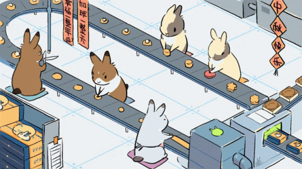
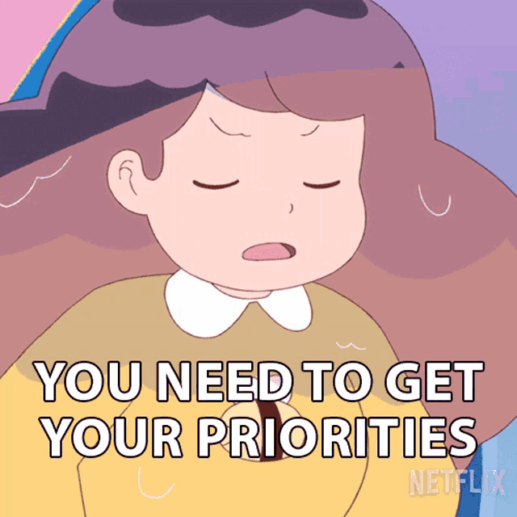
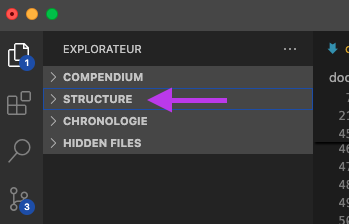

---
tags:
  - Cours 13
  - Mardi 26 novembre
---

# Cours 13

## Réusinage (Refactoring)

{.w-100}

Le refactoring consiste à améliorer le code existant sans changer son comportement. C’est un processus essentiel pour maintenir la qualité du logiciel, réduire la dette technique et faciliter les futures évolutions [^refactoring]. Ça vise à améliorer la **lisibilité du code**, sa **maintenabilité** et sa **flexibilité**.

[^refactoring]: <https://dev.to/balrajola/how-to-write-clean-code-refactoring-and-best-practices-1mo>

* **Lisibilité** : Un code lisible est **facile à comprendre** autant par l'auteur que ceux qui ne le sont pas. Cela implique l’utilisation de **noms** de variables et de fonctions explicites, une **indentation** cohérente, des **commentaires** pertinents et une **structure** logique.

* **Maintenabilité** : La maintenabilité désigne la facilité avec laquelle un code peut être modifié pour corriger des bogues, ajouter de nouvelles fonctionnalités ou améliorer les performances. Un code maintenable est **bien structuré**, **modulaire** et suit des **conventions de codage** établies.

* **Flexibilité** : La flexibilité est la capacité d’une application à s’adapter aux changements, que ce soit par l’ajout, la modification ou la suppression de fonctionnalités, **sans compromettre le système existant**.

Pour guider le refactoring, plusieurs principes et méthodologies offrent des bonnes pratiques. Découvrons-les !

### YAGNI

<div class="grid" markdown>
Le principe *YAGNI (You Aren’t Gonna Need It[^yagni])* encourage à **ne pas coder** ce qui n’est pas immédiatement nécessaire! Lorsqu’un développeur propose d’ajouter une fonctionnalité « au cas où », il est préférable de s’en tenir aux besoins actuels.


</div>

[^yagni]: <https://fr.wikipedia.org/wiki/YAGNI>

### MoSCoW

<div class="grid" markdown>
<div markdown>
*MoSCoW (Must, Should, Could, Won’t[^moscow])* est un méthode de priorisation des tâches en fonction de leur importance :

* **Must** : Indispensable
* **Should** : Important, mais pas critique
* **Could** : Optionnel
* **Won’t** : À exclure pour l’instant
</div>


</div>

[^moscow]: <https://fr.wikipedia.org/wiki/M%C3%A9thode_MoSCoW>

### DRY

<div class="grid" markdown>
*DRY (Don't Repeat Yourself[^dry])* est une philosophie en programmation qui veut qu'on ne duplique aucune information ni logique. Identifiez des portions de code similaires et regrouper les dans une fonction.


</div>

[^dry]: <https://fr.wikipedia.org/wiki/Ne_vous_r%C3%A9p%C3%A9tez_pas>

### KISS

<div class="grid" markdown>
Le principe *KISS (Keep It Simple, Stupid[^kiss])* favorise la simplicité dans le code. Un design complexe est plus difficile à comprendre et à maintenir.


</div>

[^kiss]: <https://fr.wikipedia.org/wiki/Principe_KISS>

## Optimisation des médias

Toutes les images devraient être redimensionnées à la taille de leur utilisation. Vous pouvez utiliser votre logiciel d'édition graphique préféré ou [ImageResizer.com](https://imageresizer.com/).

Ensuite, on pour les optimiser en utilisant des outils comme [TinyPNG](https://tinypng.com/).

## Hygiène de code

{.w-100}

### Variables

<div class="grid align-items-top" markdown>
!!! success "Bien"

    Utilisez des noms de variables et de fonctions clairs et significatifs qui reflètent leur rôle ou leur contenu.

    ```js
    let nombreViesJoueur = 3;
    ```

!!! failure "À éviter"

    Évitez les noms vagues ou abrégés qui ne donnent pas d’indication sur leur utilité.

    ```js
    let nv = 3;
    ```
</div>

### Fonctions

<div class="grid align-items-top" markdown>
!!! success "Bien"

    Écrivez des fonctions qui accomplissent une seule tâche spécifique, facilitant ainsi la réutilisation.

    ```js
    function calculerScore(niveau, temps) {
      return niveau * 1000 - temps * 10;
    }
    ```

!!! failure "À éviter"

    Évitez les fonctions longues qui réalisent plusieurs tâches distinctes.

    ```js
    function gererNiveau() {
      // initialise le niveau
      // met à jour le score
      // gère les ennemis
    }
    ```
</div>

!!! quote "Le saviez-vous ?"

    Dans vscode, vous pouvez afficher la structure de votre code en dépliant la section **structure** de la colonne de droite (juste en bas de votre structure de projet).

    

### Consistance

Votre code doit être prévisible.

<div class="grid align-items-top" markdown>
!!! success "Bien"

    Maintenez une cohérence dans le style de codage, les conventions de nommage et la structure du code à travers tout le projet.

    ```js
    let joueur = {
        positionX: 100,
        positionY: 200,
        vitesse: 5
    };
    let ennemi = {
        positionX: 300,
        positionY: 400,
        vitesse: 3
    };
    ```

!!! failure "À éviter"

    Évitez de mélanger différents styles ou conventions dans le même projet.

    ```js
    let joueur = {
        posX: 100,
        posY: 200,
        speed: 5
    };
    let ennemi = { position_x: 300, position_x: 400, vitesse: 3 };
    ```
</div>

### Commentaires

Grace aux commentaires, on devrait être en mesure de comprendre le code sans le lire, mais attention, n'en faites pas trop. Tout est dans l'équilibre.

Le code explique le « comment », les commentaires expliquent le « pourquoi ».[^commentbestpractices]

[^commentbestpractices]: <https://blog.bitsrc.io/best-practices-for-using-comments-in-javascript-4c4cd8619c18>

<div class="grid align-items-top" markdown>
!!! success "Bien"

    Ajoutez des commentaires uniquement lorsque le code n’est pas suffisamment explicite, en évitant les commentaires redondants ou évidents.

    ```js
    // Utilisation d'un pool d'objets pour les projectiles afin d'améliorer les performances
    function tirerProjectile() {
        let projectile = poolObtenu();
        if (!projectile) {
            // Si aucun projectile n'est disponible dans le pool, en créer un nouveau
            projectile = creerNouveauProjectile();
        }
        // Initialiser et activer le projectile
        initialiserProjectile(projectile);
        activerProjectile(projectile);
    }
    ```

!!! failure "À éviter"

    Évitez les commentaires inutiles qui répètent ce que le code exprime déjà clairement.

    ```js
    // Décrémenter le nombre de vies du joueur de 1
    joueur.vies -= 1;

    // Si le nombre de vies du joueur est égal à zéro
    if (joueur.vies === 0) {
        // Appeler la fonction de fin de jeu
        finDeJeu();
    }
    ```
</div>

### Nombres magiques :magic_wand:

Lorsqu'on utilise des nombres dans le code plutôt que dans des variables ou constantes, on dit que la valeur est « hardcoded ». Le problème est-ce que pour modifier des paramètres de l'application, il faut comprendre le code, ce qui ne devrait pas etre le cas.

<div class="grid align-items-top" markdown>
!!! success "Bien"

    Remplacez les valeurs numériques non explicites par des constantes nommées pour améliorer la lisibilité.

    ```js
    const VITESSE_JOUEUR = 5;

    joueur.vitesse = VITESSE_JOUEUR;
    ```

!!! failure "À éviter"

    Évitez d’utiliser des valeurs numériques brutes sans explication dans le code.

    ```js
    joueur.vitesse = 5
    ```
</div>

### Opérateur ternaire

Des fois c'est oui, des fois c'est non.

<div class="grid align-items-top" markdown>
!!! success "Bien"

    ```js title="Avant"
    let isFlipped = false;
    if(velocityX > 0) {
      isFlipped = true;
    }
    ```

    ```js title="Après"
    let isFlipped = (velocityX > 0) ? true : false;

    // Encore mieux
    let isFlipped = velocityX > 0;
    ```

!!! failure "À éviter"

    ```js title="Avant"
    let velocityX = 0;
    if (cursors.left.isDown) {
        velocityX = -160;
    } else if (cursors.right.isDown) {
        velocityX = 160;
    }
    ```

    ```js title="Après"
    const velocityX = cursors.left.isDown ? -160 : cursors.right.isDown  ? 160 : 0;
    ```
</div>

## Exemple de réusinage

Réusinons ensemble le code suivant

```js title="Avant"
create() {
  this.player.anims.create({
    key: 'run',
    frames: player.anims.generateFrameNumbers('player', { start: 0, end: 3 }),
    frameRate: 10,
    repeat: -1
  });
  this.enemy.anims.create({
    key: 'enemy_run',
    frames: enemy.anims.generateFrameNumbers('enemy', { start: 0, end: 3 }),
    frameRate: 10,
    repeat: -1
  });
  this.enemy.anims.create({
    key: 'enemy_dash',
    frames: enemy.anims.generateFrameNumbers('enemy', { start: 12, end: 14 }),
    frameRate: 10,
    repeat: -1
  });
}

update() {
  if (cursors.left.isDown) {
    player.setVelocityX(-160);
    player.anims.play('left', true);
  } else if (cursors.right.isDown) {
    player.setVelocityX(160);
    player.anims.play('right', true);
  } else {
    player.setVelocityX(0);
    player.anims.play('turn');
  }
  if (cursors.up.isDown && player.body.blocked.down) {
    player.setVelocityY(-330);
  }
  if (enemy.body.velocity.x < 0) {
    enemy.anims.play('enemy-left', true);
  } else if (enemy.body.velocity.x > 0) {
    enemy.anims.play('enemy-right', true);
  } else {
    enemy.anims.play('enemy-idle', true);
  }
}
```

{.w-100}

```js title="Après"
create() {
  this.PLAYER_NORMAL_SPEED = 160; // KISS
  this.PLAYER_JUMP_SPEED = 333; // KISS

  this.createAnimation('player_run', 'player_animations', 0, 3); // DRY
  this.createAnimation('enemy_run', 'enemy_animations', 0, 3); // DRY
  // YAGNI : Retrait du "enemy_dash", car pas utilisé
}

update() {
  // KISS
  handlePlayerMovement(this.player);
  handlePlayerAnimation(this.player);
  handleEnemyAnimation(this.enemy);
}

createAnimation(key, spritesheet, firstFrame, lastFrame, frameRate = 14, loop = -1) {
  this.anims.create({
    key: key,
    frames: this.anims.generateFrameNumbers(spritesheet, {
      start: firstFrame,
      end: lastFrame
    }),
    frameRate: frameRate,
    repeat: loop
  });
}

handlePlayerMovement(player) {
  // Gestion de la vélocité du joueur
  let velocityX = 0;
  if (cursors.left.isDown) {
    velocityX = -this.PLAYER_NORMAL_SPEED;
  } else if (cursors.right.isDown) {
    velocityX = this.PLAYER_NORMAL_SPEED;
  }
  player.setVelocityX(velocityX);

  // Gestion du saut
  if (cursors.up.isDown && player.body.blocked.down) {
    player.setVelocityY(-this.PLAYER_JUMP_SPEED);
  }
}

// Activation des animations du player en fonction des controles
handlePlayerAnimation(player) {
  if (cursors.left.isDown) {
    player.anims.play('left', true);
  } else if (cursors.right.isDown) {
    player.anims.play('right', true);
  } else {
    player.anims.play('idle', true);
  }
}

// Activation des animations de l'ennemi en fonction de sa vélocité
handleEnemyAnimation(enemy) {
  if (enemy.body.velocity.x < 0) {
    enemy.anims.play('enemy-left', true);
  } else if (enemy.body.velocity.x > 0) {
    enemy.anims.play('enemy-right', true);
  } else {
    enemy.anims.play('enemy-idle', true);
  }
}
```

## Programmation orientée objet

Lorsque les fonctions deviennent trop nombreuses et le code trop long, il est temps de penser à une stratégie de catégorisation plus structurée. C'est là que la programmation orientée objet (OOP) entre en jeu.

```js title="Nouvelle classe dans ./src/scripts/characters/Bird.js"
class Bird {
  constructor(scene) {
    this.scene = scene;
    this.sprite = scene.add.sprite(0, 0, "bird").setDepth(-1).setTint(0x808080);
    this.sprite.anims.play("bird_bg", true);

    // Déplace l'oiseau de façon aléatoire
    this.move();
  }

  // Fonction récursive pour l'animation du vol d'oiseau
  move() {
    const targetY = Phaser.Math.Between(0, config.height);

    this.sprite.setPosition(0, targetY);

    this.scene.tweens.add({
      targets: this.sprite,
      x: config.width,
      duration: Phaser.Math.Between(3000, 6000),
      ease: 'Linear',
      onComplete: () => this.move(),
    });
  }
}
```

Dans la scène Jeu.js

```js title="Avant"
createBirds() {
  this.birds = [];

  for (let i = 0; i < 3; i++) {
    let bird = this.add.sprite(0, 0, "bird");
    bird.setDepth(0).setTint(0x808080);
    bird.anims.play("bird_bg", true);
    this.birds.push(bird);
    this.moveBird(bird); //...
  }
}
```

```js title="Après"
createBirds() {
  this.birds = [];
  for (let i = 0; i < 3; i++) {
    const bird = new Bird(this);
    this.birds.push(bird);
  }
}
```

### Exemple de programmation orientée objet

Dans cet exemple, les soleils sont des objets et le joueur également. La scène sert alors de gestionnaire d'objets, ce qui est beaucoup moins lourd et plus segmenté comme code.

<iframe class="aspect-2-1" height="300" style="width: 100%;" scrolling="no" title="Phaser - Fx - Shadow" src="https://codepen.io/tim-momo/embed/azooPoZ?default-tab=result&editable=true&theme-id=50173" frameborder="no" loading="lazy" allowtransparency="true" allowfullscreen="true">
  See the Pen <a href="https://codepen.io/tim-momo/pen/azooPoZ">
  Phaser - Fx - Shadow</a> by TIM Montmorency (<a href="https://codepen.io/tim-momo">@tim-momo</a>)
  on <a href="https://codepen.io">CodePen</a>.
</iframe>

## Exercice

<div class="grid grid-1-2" markdown>
  

  <small>Exercice - Phaser</small><br>
  **[Le grand ménage](./exercices/refactoring.md){.stretched-link}**
</div>

[STOP]

### Extreme Programming


La méthode de développement *extreme programming (XP[^xp])* met l’accent sur la **collaboration**, les **retours rapides**, la **simplicité** et l’**adaptation** au changement.

* **Collaboration respectueuse** : Travailler en équipe avec bienveillance et respect, même lors de désaccords.
* **Apprentissage continu** : Être ouvert à apprendre des autres et des retours (pairs, clients, tests).
* **Adaptabilité** : Accepter les changements dans les priorités ou les fonctionnalités sans résistance excessive.
* **Proximité client** : Être en contact direct avec le client pour comprendre ses besoins réels.
* **Courage** : Être honnête sur les problèmes, proposer des améliorations et ne pas avoir peur de refactoriser du code.
* **Simplicité** : Toujours chercher à faire ce qui est nécessaire et rien de plus.

[^xp]: <https://fr.wikipedia.org/wiki/Extreme_programming>