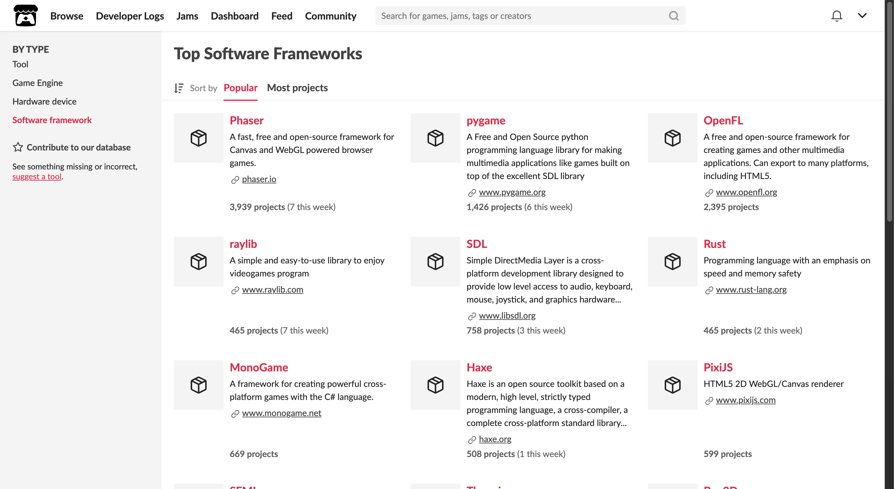
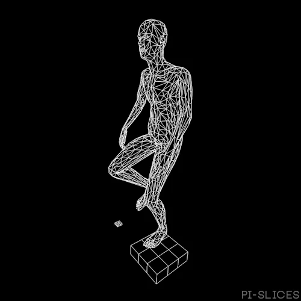
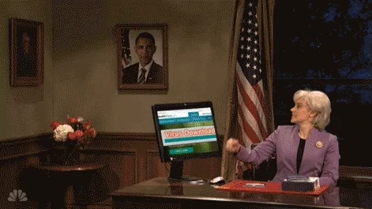

---
tags:
  - Cours 14
  - Mardi 3 décembre
---

# Cours 14

## itch.io

[itch.io](https://itch.io) est une plateforme de distribution de jeux vidéo en ligne, axée sur l’accessibilité et la créativité. Elle permet aux développeurs, indépendants ou amateurs, de publier facilement leurs jeux et de les partager avec une communauté de joueurs. Les créateurs peuvent fixer leurs propres prix, choisir un modèle de rémunération libre (donation-based) et bénéficier d’une vitrine personnalisable.

itch.io a été fondé et est détenu par Leaf Corcoran, un programmeur américain. Lancé en mars 2013, le site s’est imposé comme une plateforme majeure pour les développeurs indépendants souhaitant héberger, distribuer et vendre leurs créations[^itch].

[^itch]: <https://fr.wikipedia.org/wiki/Itch.io>

### En comparaison avec Steam

**Steam** :simple-steam: : La commission standard est de 30% sur les ventes jusqu’à 10 millions de dollars US. Ce taux diminue à 25% pour les ventes entre 10 et 50 millions de dollars, puis à 20% au-delà de 50 millions de dollars.

**itch.io** :simple-itchdotio: : Par défaut, itch.io prélève une commission de 10% sur les ventes. La plateforme offre aussi la possibilité de définir le pourcentage de commission, pouvant aller jusqu’à 0%[^pricing].

[^pricing]: <https://itch.io/docs/creators/pricing>

### La place de phaser sur itch.io

{ data-zoom-image }

D'après les [statistiques](https://itch.io/game-development/frameworks) itch.io, Phaser ne serait pas considéré comme un moteur de jeu vidéo, mais plutôt comme un cadriciel. D'ailleurs, il serait carrément le plus populaire ! On dirait presque une coïncidence :thinking:

## Publication sur itch.io

### Licences :octicons-law-16:

Assurez-vous que tous les assets (images, sons, musiques, etc.) utilisés dans votre jeu sont correctement licenciés pour la distribution. Même s’ils sont gratuits, il est important de respecter les conditions d’utilisation, qui peuvent inclure des crédits à donner aux créateurs originaux.

### Documentation :material-file-document-outline:

Préparez une documentation claire pour votre jeu, incluant :

* Comment jouer
* Crédits
* Toute information supplémentaire pertinente

### Page de présentation :art:

Du mieux que possible, créez une page attrayante pour votre jeu avec les outils sur itch.io.

## Mise en ligne

{.w-100}

1. Aller sur [https://itch.io](https://itch.io/)
1. Cliquer sur le bouton **Register**
  1. Remplir les informations de création de compte.
  1. Assurez-vous de sélectionner la case « I'm interrested in distribution content on itch.io »
  1. Vérifiez vos courriels est validez votre adresse courriel en cliquant sur le lien mentionné dans le courriel reçu. Ensuite validez votre courriel sur le site.
  1. Vous devriez maintenant être connecté.
1. Cliquer sur le lien **Dashboard** en haut de page.
1. Cliquez sur le bouton **Create new project** et remplir les informations demandées
  1. Téléverser une image pour votre jeu.
  1. Ajouter 3 captures d'écran de votre jeu.
  1. (facultatif) Ajoutez une vidéo promotionnel sur youtube et écrire l'url de la vidéo.
  1. **Title** (titre)
  1. **Project URL** (URL de votre projet)
  1. **Short description or tagline** (Courte description de votre jeu)
  1. À la question « What are you uploading? », sélectionnez l'option « Games - A piece of software you can play »
  1. **Kind of project** (Type de projet). Sélectionnez l'option « HTML - You have a ZIP or HTML file that will be played in the browser »
  1. **Release status** (État du projet). Sélectonnez l'option « Released — Project is complete, but might receive some updates »
  1. **Pricing** (prix). Sélectionnez l'option « No payments ».
  1. **Uploads** (téléversement). Ajoutez votre fichier .zip. Une fois le fichier téléversé, sélectionnez la case « This file will be played in the browser »
  1. **Embed options**(options d'intégration). Sélectionnez l'option « Embed in page » et « Manually set size ».
  1. **Viewport dimensions** (dimensions du jeu). Insérez les dimensions de votre jeu.
  1. Ne cochez aucune des options dans la section « Frame options ».
  1. **Details** (détails). Inscrivez une description complète de votre jeu.
  1. **Genre** (catégorie). Inscrivez la catégorie qui représente le mieux votre jeu.
  1. **Tags** (Étiquettes). Ajoutez 10 étiquettes pour votre jeu
  1. **AI generation disclosure** (divulgation de génération par intelligence artificielle). Répondez oui ou non à la question.
  1. **App store links**. Ne sélectionnez rien.
  1. **Community** (communauté). Sélectionnez l'option « Comments »
  1. **Visibility & access** (Accès et visibilité du projet). Sélectionnez l'option « Restricted ».
1. Cliquez sur **Save & view page**
1. Ajustez le thème de votre page de jeu
1. Lorsque tout est prêt, modifiez votre projet et changez la visibilité pour « Public ».

## Dépannage

{.w-100}

### Trop de fichiers

Il se peut que votre projet contienne [trop de fichiers](./assets/images/toomany.png). Si c'est le cas, faires le ménage du dossier node_modules et conservez uniquement le dossier `dist` pour chaque sous dossier.

### Les images ne s'affichent pas

Assurez-vous toujours de charger les ressources avec un chemin relatif commençant par `./`

## Exercice

Vous devez mettre en ligne votre jeu sur itch.io, configurer votre page et l'esthétiser.

## Devoir

  

  <small>Devoir - Phaser</small> 
  **[Projet de session](./devoirs/demo_finale.md){.stretched-link}**

