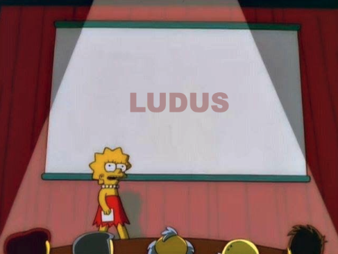

[:material-arrow-u-left-top: Cours 14](../cours14.md){.breadcrumb}

# Projet de session | Ludus

{.w-100}

L'objectif du projet de session est de **démontrer** la réalisation d'une **expérience ludique** intégrant **images** et **échantillons sonores** dans laquelle l‘interacteur **progresse** en accomplissant des **actions**[^plandecours].

[^plandecours]: Plan de cours 582 301 MO Interactivité ludique.

Cette remise compte pour `40%` de votre note finale et elle est notée sur `100%`.

!!! info "Post-mortem"

    _Post mortem_ est une locution latine signifiant « après la mort »[^postmortem].

    C'est une rétrospective effectuée après l’achèvement d’un projet. Il consiste à examiner l’ensemble du processus pour identifier ce qui a bien fonctionné, ce qui a moins bien fonctionné et les raisons derrière ces résultats. L’objectif est de tirer des leçons de l’expérience pour améliorer les projets futurs.

[^postmortem]: <https://fr.wikipedia.org/wiki/Post_mortem>

## Remise

La remise du projet final est le **9 décembre** à 23h59.

Déposez le lien vers votre jeu sur itch.io dans le devoir sur Teams.

### Critères de remise (10%)

- [ ] Le jeu doit être **fonctionnel** et n'être affecté par **aucun bogue majeur**[^major].
- [ ] Le jeu doit être publié **publiquement** sur le site **itch.io**.
- [ ] Retrait obligatoire du mode debug.

[^major]: Ce qui est considéré comme un bogue majeur est un problème ou une anomalie qui empêche la progression du jouer.

## Oral

La présentation finale est le **10 décembre**.

### Durée :timer: (10%)

L’exposé doit durer entre **8** et **10** minutes.

**Gestion du temps**

* Si votre présentation dure moins de 8 minutes, vous perdez **5%** par minute en moins.
* Si votre présentation dépasse 10 minutes, vous perdez **5%** par minute en trop.

### Démonstration :video_game:

Une brève démonstration du jeu peut être intégrée à votre présentation pour illustrer ou renforcer vos propos. Toutefois, elle ne sera pas notée.

!!! warning "Attention"

    Ne présentez pas l’intégralité du jeu pour respecter le temps imparti.

### Contenu de la présentation (80%)

1. Expérience ludique (20%)
  - [ ] **Inspirations et intentions** : Expliquez vos inspirations, vos intentions artistiques et les mécaniques interactives développées pour créer une expérience ludique cohérente et engageante.
1. Progression (20%)
  - [ ] **Mécaniques de progression** : Expliquez les méthodes utilisées pour créer un sentiment de progression dans votre jeu.
1. Post-mortem du projet (40%)
  - [ ] **Objectifs initiaux vs réalisation finale** : Comparez ce que vous vouliez réaliser initialement et ce que vous avez accompli au final.
  - [ ] **Ce qui a bien fonctionné** : Identifiez les aspects réussis du projet et les raisons du succès.
  - [ ] **Ce qui n’a pas bien fonctionné** : Décrivez les défis ou problèmes rencontrés et analysez leurs causes.
  - [ ] **Leçons apprises** : Partagez les enseignements tirés de cette expérience et l'influence sur votre cheminement académique.
  - [ ] **Améliorations futures** : Indiquez ce que vous changeriez si vous aviez à refaire l'expérience en termes de processus de développement et de création.

[STOP]

## Grille d'évaluation

| **Critère**                              | **Description**                                                                                                                                                                                                                                                                                               | **Pourcentage** |
|------------------------------------------|---------------------------------------------------------------------------------------------------------------------------------------------------------------------------------------------------------------------------------------------------------------------------------------------------------------|-----------------|
| **Critères de remise**                   |                                                                                                                                                                                                                                                                                                               | **10 %**        |
| Fonctionnalité du jeu                    | Le jeu doit être fonctionnel et ne comporter aucun bogue majeur. *(Un bogue majeur est un problème qui empêche l’interacteur de progresser dans le jeu.)*                                                                                                                                                  |                 |
| Publication sur itch.io                  | Le jeu doit être publié sur la plateforme **itch.io**.                                                                                                                                                                                                                                                        |                 |
| Retrait du mode debug                    | Le mode debug doit être désactivé.                                                                                                                                                                                                                                                                            |                 |
| **Critères de la présentation orale**    |                                                                                                                                                                                                                                                                                                               | **90 %**        |
| **Durée**                                | L’exposé doit durer entre **8** et **10** minutes. Pas plus, pas moins. - Si la présentation dure **moins de 8 minutes**, vous perdez **1 %** par minute en moins. - Si elle dépasse **10 minutes**, vous perdez **1 %** par minute en trop.                                                            | **10 %**        |
| **Contenu de la présentation**           |                                                                                                                                                                                                                                                                                                               | **80 %**        |
| **1. Processus créatif**                 |                                                                                                                                                                                                                                                                                                               | **20 %**        |
| Inspirations et intentions               | Expliquez vos **inspirations** et vos **intentions initiales** dans la création du jeu.                                                                                                                                                                                                                       |                 |
| Choix de conception                      | Décrivez les **décisions clés** de design et comment elles ont contribué à l'**expérience ludique**.                                                                                                                                                                                                          |                 |
| **2. Progression dans le jeu**           |                                                                                                                                                                                                                                                                                                               | **20 %**        |
| Mécaniques de progression                | Expliquez les **méthodes** utilisées pour créer la **progression** dans votre jeu.                                                                                                                                                                                                                            |                 |
| Implémentation des prérequis             | Mettez en avant comment vous avez intégré les **prérequis** ou les **systèmes de progression**.                                                                                                                                                                                                               |                 |
| **3. Post-mortem du projet**             |                                                                                                                                                                                                                                                                                                               | **40 %**        |
| Objectifs initiaux vs réalisation finale | Comparez ce que vous **vouliez réaliser initialement** et ce que vous avez **accompli au final**.                                                                                                                                                                                                             |                 |
| Succès et défis                          |                                                                                                                                                                                                                                                                                                               |                 |
| Ce qui a bien fonctionné                 | Identifiez les **aspects réussis** du projet et les **raisons** de ces succès.                                                                                                                                                                                                                                |                 |
| Ce qui n’a pas bien fonctionné           | Décrivez les **défis** ou problèmes rencontrés et analysez leurs **causes**.                                                                                                                                                                                                                                  |                 |
| Leçons apprises                          | Partagez les **enseignements** tirés de cette expérience, tant sur le plan **technique** que **créatif**.                                                                                                                                                                                                     |                 |
| Améliorations futures                    | Indiquez ce que vous **changeriez** si vous refaisiez le projet, en termes de **processus de développement** et de **création**.                                                                                                                                                                               |                 |
| **Démonstration du jeu** *(optionnelle)* | Une **brève démonstration** du jeu peut être intégrée pour illustrer ou renforcer votre propos oral. - **Attention** : Ne présentez pas l’intégralité du jeu afin de respecter le temps imparti.
