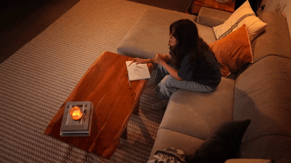
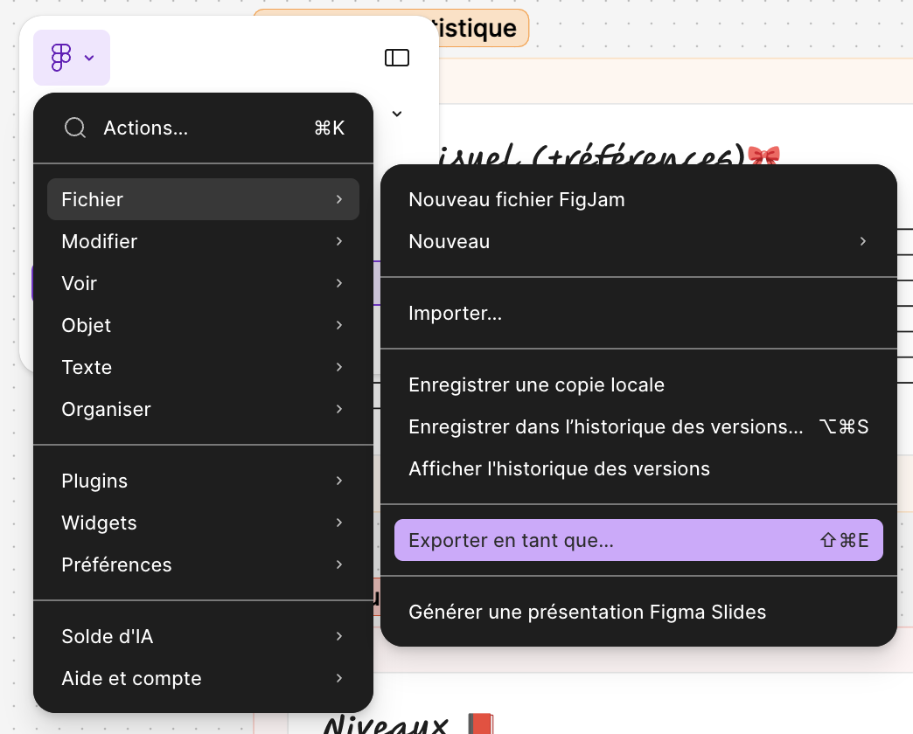
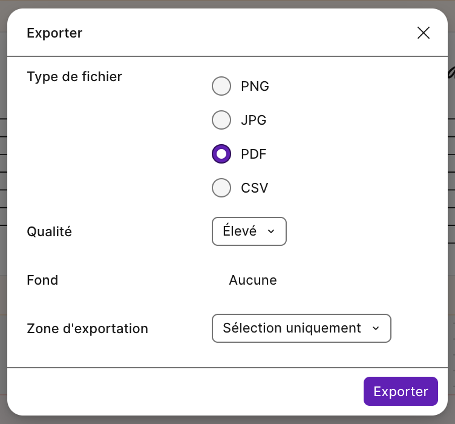

# Document de conception (GDD)

{.w-100}

*[GDD] : Game Design Document

## Objectif

Concevoir le jeu à réaliser pendant le reste de la session.

Ce devoir représente le point de départ de votre jeu et il compte pour 5 % de la note finale.

!!! question "Coulé dans le béton ?"

    Non. 
    
    Un document de conception est une ressource importante pour garder le cap sur un projet, mais il se peut qu'en cours de route, le plan change. C'est normal.

## Grandes lignes du projet final

- 3 zones
- Thème libre
- Assets Synty et possibilité d'en faire valider plus avec l'enseignant

## Consignes

- [ ] Télécharger le [document Figma de départ](./Document%20de%20conception%20(GDD).jam)
- [ ] Ouvrir le document dans Figma

### Identité

- [ ] **Titre** 
- [ ] **Courte description** 
  - 1 ou 2 phrases
  - Ce que le joueur fait, pas ce que le jeu « est »
- [ ] **Genre(s)**
  - Ex. : _Plateformer_, _Roguelite_, Casse-tête, _Tower defense_, Jeu de rythme ...
- [ ] **Public cible**
  - Age, genre, expérience préalable.
- [ ] **Inspirations**
  - Jeux, films, BD, architecture, musique
  - Nommer ce qui est **emprunté**, pas seulement le titre
  - Recommandation : Accompagner d'une ou plusieurs images

### Objectifs et conditions

- [ ] **Objectif du jeu**
  - Du point de vue du joueur.
- [ ] **Condition(s) de victoire**
  - Doit être **mesurable** et vérifiable dans le code.
- [ ] **Condition(s) de défaite**
  - Préciser la **conséquence**, pas seulement la **cause**.

### Gameplay

- [ ] **Boucles de jeu**
  - Minimalement réfléchir à une boucle courte et "longue". Il peut y en avoir plus.
  - La boucle longue se termine généralement par un passage franchi : explorer > trouver > activer (la porte s'ouvre, nouvelle zone)
- [ ] **Mécaniques principales** 
  - 3 à 5 verbes maximum, chacun accompagné de sa règle.
  !!! example "Exemples"

      - *Super Mario Bros. : courir (accélération progressive), sauter (hauteur selon la durée d'appui), écraser (un saut sur l'ennemi l'élimine), ramasser (le champignon change d'état).*
      - *Portal : marcher, sauter, tirer un portail bleu, tirer un portail orange, porter un cube : la vitesse d'entrée est conservée à la sortie.*
      - *Celeste : sauter, s'agripper (endurance limitée), foncer (une seule fois, rechargé au contact du sol).*

### Narration

- [ ] **Histoire**
  - Le strict nécessaire pour justifier l'objectif du jeu.
- [ ] **Personnages**
  - Rôle et fonction dans le jeu, pas une biographie.

### Direction artistique / Moodboard

- [ ] **Style visuel et références** 
  - La technique (ex. : low poly, pixel art) accompagnée de références visuelles.
  - Recommandation : Accompagner d'une ou plusieurs images
- [ ] **Palette** 
  - Recommandation : Accompagner d'une ou plusieurs images
- [ ] **HUD** 
  - Ce qui est affiché en permanence et à quel endroit sur l'écran.
  - Recommandation : Faire un petit magazinage et indiquer les URL retenues.
- [ ] **Audio**
  - Musique, effets, ambiance et le rôle de chacun.
  - Recommandation : Faire un petit magazinage et indiquer les URL retenues.
  
### Structure

- [ ] **Niveaux**
  - 3 scènes différentes dans Unity
  - Dans objectif, spécifier le système de gating : « Qu'est-ce qui bloque le passage et qu'est-ce qui le débloque ? »
- [ ] **Écrans et navigation**
  - La liste des écrans et les transitions entre eux.
  - *Minimum attendu : Menu principal → Jeu → Écran de défaite → (Recommencer | Menu), et un écran de victoire.*
  - Recommandation : Au lieu d'un pragraphe faire un schéma avec des esquisses pour chaque écran.

## Remise

* **Échéance :** avant le début du cours 5
* **Format :** PDF | Qualité élevée {data-zoom-image .w-10}{data-zoom-image .w-10}

## Évaluation

:octicons-star-fill-16: :octicons-star-fill-16: :octicons-star-fill-16: :octicons-star-fill-16: :octicons-star-fill-16: : Le document est **habité**. On comprend bien le jeu et l'ensemble des éléments demandés ainsi que les recommandations figurent dans le document de conception. On sent un véritable effort dans la démarche.

:octicons-star-fill-16: :octicons-star-fill-16: :octicons-star-fill-16: :octicons-star-fill-16: :octicons-star-16: : Le document est soigné, mais il manque un peu de précision. Les recommandations sont suivies en bonne partie.

:octicons-star-fill-16: :octicons-star-fill-16: :octicons-star-fill-16: :octicons-star-16: :octicons-star-16: : Le document est complété minimalement. Toutes les sections sont remplies, mais les recommandations sont peu ou pas suivies.

:octicons-star-fill-16: :octicons-star-fill-16: :octicons-star-16: :octicons-star-16: :octicons-star-16: : Le document est incomplet et manque de précision pour comprendre l'ampleur du projet.

:octicons-star-fill-16: :octicons-star-16: :octicons-star-16: :octicons-star-16: :octicons-star-16: : Le document est amorcé, mais des sections entières sont vides.