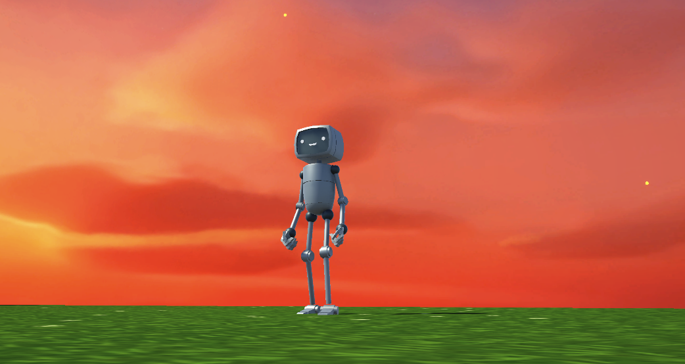
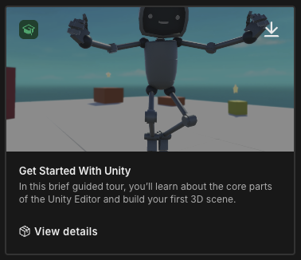
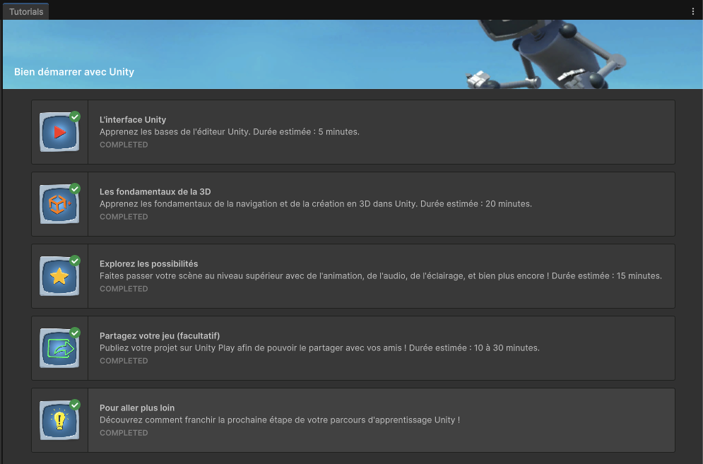

# Tutoriel pour commencer avec Unity

{.w-100}

## Préallables

Pour réaliser cet exercice, vous devez avoir un compte Unity et avoir accès à Unity Hub.

Au besoin, consultez le [guide de création de compte et d'installation de Unity Hub](../../extra/installation-unity-hub.md))

## Consignes

- [ ] Ouvrir Unity Hub
- [ ] Sous l'onglet ***Projects***, créez un nouveau projet.
- [ ] Sélectionnez le template « _Get Started With Unity_ » (au besoin, cliquez sur _Download Template_) {data-zoom-image .w-25}
- [ ] Nommez le projet « Commencer avec Unity »
- [ ] Sélectionnez un chemin pour enregistrer le projet (ex. : votre disque dur)
- [ ] Laissez le reste intacte et cliquez sur « Create project »
- [ ] Complétez les 5 étapes du tutoriel {data-zoom-image .w-25}

!!! tip "Tutoriel en français"
    
    - [Télécharger le fichier de traduction](./Get-Started-With-Unity-FR.unitypackage){download}
    - Dans le project « _Get Started With Unity_ », dans le panneau « _Project_ », clic-droit sur le dossier « _Assets_ »
    - Choisi l'option « _Import Package_ » puis « _Custom Package..._ »
    - Choisir le fichier le traduction téléchargé.
    - Une petite fenêtre « _Import Unity Package_ » apparaitra. Cliquez simplement sur le bouton « _Import_ »