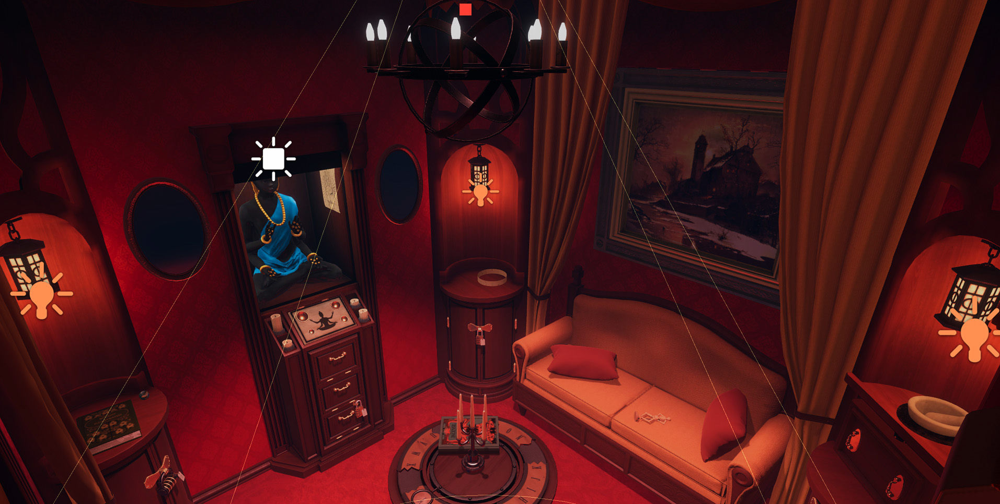

# Projet final

{.w-100}

*[GDD]: Game Design Document
*[CES]: Collider Event System
*[PNJ]: Personnage non joueur

L'objectif est de concevoir et réaliser une expérience ludique en **trois niveaux** (3 scènes), dans laquelle l'interacteur progresse en accomplissant des actions. Le tout devra être publié en ligne.

Le thème, le genre et l'univers sont libres. 

Ce qui est imposé :

- **Forme** : trois zones séparées en différentes scènes.
- **Mise en place des notions apprises en classe** selon un gabarit qualitatif.

> Changer de zone est facile : un CES et un chargement de scène suffisent. Ce qui compte, c'est le chemin pour y arriver, le soin apporté à chaque technique apprise en classe, la qualité du produit fini et la créativité démontrée. Mieux vaut miser sur la qualité que sur la quantité.

**80% de la note finale**

## Exigences

La plupart des techniques vues en classe doit se retrouver dans le jeu. Toutefois, leur présence ne suffit pas. C'est surtout la qualité de leur implémentation sera évalué. Voici l'échelle de l'évaluation : 

| Niveau | Description |
|--------|-------------|
| **Absente**       | La technique n'apparaît pas, ou ne fonctionne pas |
| **Fonctionnelle** | La technique est présente |
| **Intégrée**      | Son usage est cohérent avec le jeu |
| **Raffinée**      | Son usage est cohérent avec le jeu, créatif et bien fait |

!!! example "Un bouton en quatre niveaux"

    * **Absent :** aucun menu. 
    * **Fonctionnel :** un bouton Unity blanc de base. 
    * **Intégré :** un bouton aux couleurs, à la police et aux sprites de l'univers. 
    * **Raffiné :** il est intégré et en plus, il réagit au survol et au clic, émet un son et le menu apparaît par une transition.

### 3 zones en 3 scènes

On ne change de scène que lorsqu'on a accompli une suite d'actions (_gating_).

Rappel des prérequis (_gating_) : 

| Prérequis | L'interacteur doit |
|------|---------------------|
| **Clé / serrure** | Trouver un objet quelque part et l'utiliser ailleurs |
| **Adresse** | Réussir une action physique : saut, parcours, timing |
| **Connaissance** | Comprendre ou observer : un code, un indice, un ordre |
| **Collecte** | Réunir un nombre d'éléments dispersés |
| **Confrontation** | Vaincre, éviter ou semer un PNJ |
| **Mécanisme** | Manipuler le monde : levier, pont, plateforme, eau |
| **Découverte** | Trouver un chemin qui ne se voit pas au premier regard |
| **Négociation** | Obtenir quelque chose d'un PNJ |

#### Zone 1

- [ ] L'obstacle qui empêche l'accès à la scène suivante doit faire partie de la thématique choisie
- [ ] Les prérequis constituants l'objectif du niveau sont réfléchis et contiennent des conditions
- [ ] L'interacteur doit savoir quoi faire (ne pas comprendre n'est pas un niveau de difficulté)
- [ ] Le passage à la scène suivante doit être précédé d'une récompense
- [ ] Au moins 1 minute de jeu

#### Zone 2

- [ ] L'obstacle qui empêche l'accès à la scène suivante doit faire partie de la thématique choisie
- [ ] Les prérequis constituants l'objectif du niveau sont réfléchis et contiennent des conditions
- [ ] L'interacteur doit savoir quoi faire (ne pas comprendre n'est pas un niveau de difficulté)
- [ ] Le passage à la scène suivante doit être précédé d'une récompense
- [ ] Au moins 1 minute de jeu

#### Zone 3 

- [ ] L'obstacle qui empêche l'accès à la scène suivante doit faire partie de la thématique choisie
- [ ] Les prérequis constituants l'objectif du niveau sont réfléchis et contiennent des conditions
- [ ] L'interacteur doit savoir quoi faire (ne pas comprendre n'est pas un niveau de difficulté)
- [ ] Le passage à la scène suivante doit être précédé d'une récompense
- [ ] Au moins 1 minute de jeu

### Les techniques

#### Structure et progression

- [ ] **Environnement** : On ne traverse pas à travers le décor, on ne tombe pas éternellement
- [ ] **Transitions de scènes** | Transitions sans erreur
- [ ] **Menus** | Menu titre, menu pause, écran de fin et crédits. Possibilité de recommencer sans relancer le jeu
- [ ] Scène menu, scène victoire, scène défaite (s'il y en a)

#### Personnage et interactions

- [ ] **Contrôle et caméra** : Personnage contrôlable et usage efficace de la caméra
- [ ] Rétrocations : surbrillance à l'approche, son, animation
- [ ] **Affordance** : On comprend où aller et sur quoi agir
- [ ] **Script C#** : Au moins un script personnalisé dont chaque ligne peut être expliquée

#### Rétroaction et interface

- [ ] **Réussite et échec** : Chaque action réussies et chaque effets néfastes produisent un signal visuel et sonore approprié
- [ ] **HUD** : Au moins un indicateur de progression
- [ ] **HUD** : Le positionnement des éléments résistent bien à un changement de résolution

#### Médias visuels

- [ ] Narration environmentale : 

- [ ] **Environnement** | Construit avec les assets Synty ou validés, rien en magenta | Aucun objet flottant ni raccord visible; l'image importée semble faire partie du monde |
- [ ] 
- [ ] **Éclairage** | Éclairage et post-traitement propres à chaque zone | La lumière guide le regard vers ce qui compte |
- [ ] **Décor animé** | Au moins un élément de décor animé : plateforme, mécanisme, porte | Mouvement travaillé (accélération, ralentissement) et son synchronisé |
- [ ] **Particules** | Au moins trois systèmes de particules liés à des événements du jeu | Durée, quantité et son accordés à l'événement |
- [ ] **Cinématique** | Une modeste cinématique déclenchée par une action, contrôles verrouillés pendant sa durée | Entrée et sortie sans à-coup; son ou musique accordé |

#### Son

- [ ] **Ambiances** | Une ambiance sonore par zone, en boucle, sans coupure audible | Volume équilibré avec les effets; aucune coupure au changement de zone |
- [ ] **Effets sonores** | Au moins cinq sons déclenchés par des événements, dont un spatialisé en 3D | Variation de hauteur ou sons multiples pour ce qui se répète |
- [ ] **Volume** | Audio Mixer à deux groupes, et un curseur de volume dans les options | Le curseur agit en temps réel, avec un son de test |

#### Personnage non joueur

- [ ] **PNJ** (NPC) | Au moins un PNJ qui se déplace sur NavMesh (hostile, guide ou marchand), dont l'état se voit ou s'entend | Ses changements d'état se lisent de loin : posture, son, lumière |


### Publication et finition

Ces éléments sont **présents ou absents** : ils ne se raffinent pas.

- [ ] Jeu publié en **WebGL sur itch.io**
- [ ] **README** : concept, commandes, et **crédits de tous les médias externes avec leur licence** — tenu au fil de la session, pas reconstitué à la fin
- [ ] **Arborescence du projet** vue en classe, respectée tout au long de la session
- [ ] **Aucun défaut de finition** : pas de magenta, pas d'objet flottant, pas de texte provisoire, pas de collider manquant


<!-- - **Journal de bord** (*devlog*) : une entrée par séance, à partir de la séance 5 -->


### Créativité

- Un élément conceptuel du GDD tenu jusqu'au bout
- Trois zones qui se distinguent par leur style

### Rigeur

- Gestion du projet effectuée dans Trello
- Les recommandations faites par l'enseignant lors des rencontres individuelles ont été considérés et traités

## La carte de preuves

À la remise, le README.md sur GitHub doit contenir : 

- [ ] Le Walkthrough complet pour finir le jeu (solution des prérequis). Important pour la correction
- [ ] La liste des techniques et comment ils sont traités dans le jeu. Important pour la correction 

!!! warning "Ce qui n'est pas déclaré n'est pas corrigé"

    La correction ne cherche pas les fonctionnalités dans le jeu : elle va où la carte l'indique. Une technique réalisée mais non déclarée est traitée comme absente.

<!-- | Technique | Où (scène et objet) | Comment y arriver en jouant |
|-----------|---------------------|-----------------------------|
| Clé et serrure | `Zone2` · `Cle_Manivelle` → `Porte_Atelier` | Ramasser la manivelle sur l'établi, revenir à la porte rouge |
| Cinématique | `Zone3` · `Timeline_Reacteur` | Actionner le levier final au fond de la salle de contrôle |
| Son spatialisé | `Zone1` · `AudioSource_Generatrice` | S'approcher de la génératrice à gauche du départ |
| … | … | … | -->


## Le calendrier

| Séance | Étape | À la fin de la séance |
|--------|-------|-----------------------|
| **5** | Ouvrir le chantier | GDD validé · projet Unity créé et rangé · répertoire GitHub et tableau de tâches en place · zone 1 parcourable en *greybox* · HUD en place |
| **6** | Le personnage et les menus | 3 états du personnage visibles · caméra réglée · menus titre et fin · cinématique déclenchée |
| **7** | **Prototype jouable — premier jalon** | Les 3 zones parcourables · les 3 passages fonctionnent · début et fin · 3 ambiances, 5 sons, Audio Mixer |
| **8** | Habiller et éclairer | La **zone 1 est finie** : habillée, éclairée, animée, sonorisée |
| **9** | La tranche verticale **deuxième jalon** | 3 systèmes de particules · signaux de réussite et d'échec · script C# écrit et branché · premier build WebGL |
| **10** | Le PNJ | Le PNJ patrouille, détecte, réagit |
| **11** | Publier | Page itch.io en ligne · README et crédits · PlayerPrefs · carte de preuves amorcée |
| **12** | **Alpha — troisième jalon** | Les 3 zones habillées · build en ligne · 3 tests de jeu reçus |
| **13** | Corriger | Les problèmes relevés aux tests sont réglés ou reportés |
| **14** | **Gel — quatrième jalon** | Contenu complet · vérification de la finition · build de validation publié |
| **15** | Version finale | Version finale publiée · carte de preuves complète · oral de 10 minutes |

## Tâches

```txt
Séance 5
  Créer le projet Unity et appliquer l'arborescence
  Créer le répertoire GitHub, le .gitignore Unity et le tableau de tâches
  Monter la zone 1 en greybox, parcourable de bout en bout
  Ancrer le HUD et le tester à deux résolutions

Séance 6
  Monter au moins 3 états du personnage et les rendre visibles
  Régler la caméra Cinemachine
  Monter les menus titre, pause et fin
  Monter la cinématique et la déclencher par une action

Séance 7
  Monter les zones 2 et 3 en greybox
  Construire le passage 1 et vérifier les trois règles
  Construire le passage 2 et vérifier les trois règles
  Construire le passage 3 et vérifier les trois règles
  Brancher la victoire et la défaite
  Poser les 3 ambiances sonores et les 5 sons déclenchés
  Ajouter un son spatialisé et configurer l'Audio Mixer

Séance 8
  Habiller la zone 1 (prefabs, matériaux, image importée)
  Éclairer la zone 1 et régler le post-traitement
  Animer un élément de décor

Séance 9
  Créer le signal de réussite (son, particule, HUD)
  Créer le signal d'échec (son, particule, HUD)
  Écrire le script C# et le brancher
  Publier un premier build WebGL sur une page privée

Séance 10
  Préparer le NavMesh
  Monter le PNJ : patrouille, détection, réaction

Séance 11
  Créer la page itch.io et publier le build
  Rédiger le README et les crédits des médias
  Brancher PlayerPrefs (volume et progression)
  Amorcer la carte de preuves

Séance 12
  Habiller et éclairer les zones 2 et 3
  Comparer 3 captures côte à côte : les zones sont-elles distinctes ?
  Chronométrer chaque zone (1 min minimum, 10 min au total)
  Publier l'alpha et la faire tester par 3 camarades

Séance 13
  Régler les problèmes relevés aux tests

Séance 14
  Vérifier la finition (magenta, objets flottants, textes provisoires)
  Publier le build de validation

Séance 15
  Compléter la carte de preuves
  Publier la version finale et préparer l'oral
```

## La grille d'évaluation

| Critère | Ce qui est regardé | Pondération |
|---------|--------------------|-------------|
| **Intégration des médias** | Médias visuels et son, sur l'échelle de raffinement | **22 %** |
| **Actions et progression** | Structure et progression, personnage et interactions, rétroaction et interface, PNJ, sur l'échelle de raffinement | **22 %** |
| **Créativité** | Parti pris nommé et tenu, zones distinctes, prérequis cohérents, détournement d'un outil, décisions justifiées | **12 %** |
| **Rigueur** | Les tâches exigées aux quatre jalons sont réalisées, et démontrées à l'oral | **12 %** |
| **Publication et finition** | Build en ligne, README et crédits, arborescence, carte de preuves, aucun défaut visible | **7 %** |
| **Oral** | Concept, tâches reçues et ce qui en a été fait, une difficulté technique et sa résolution, ce qui serait fait autrement | **5 %** |
| | | **80 %** |

