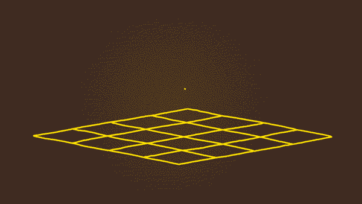

# Gravité

*[URP] : Universal Render Pipeline

{.w-100}

À la manière d'une [machine de Rube Goldberg](https://en.wikipedia.org/wiki/Rube_Goldberg_machine), utilisez la physique de Unity pour donner un parcours à une sphère.

L'objectif de cet exercice est de : 

- pratiquer le positionnement d'objets en 3D
- faire usage de la physique

## Résultat suggéré

{data-zoom-image .h-auto}

## Consignes

- [ ] Créez un projet « 3D Universal » (URP)
- [ ] Ajoutez des cubes sur une scène
- [ ] Assurez-vous que le positionnement sur l'axe `z` de tous les cubes soit à `0`
- [ ] Redimensionnez et déplacez les cubes de sorte à fabriquer un parcours
- [ ] Ajoutez quelques sphères vers le début du parcours (`z` toujours à `0`)
- [ ] Pour activer la physique sur les sphères, ajoutez-leur un ***Rigidbody***
- [ ] Testez votre parcours de sorte que les sphères puissent le terminer
