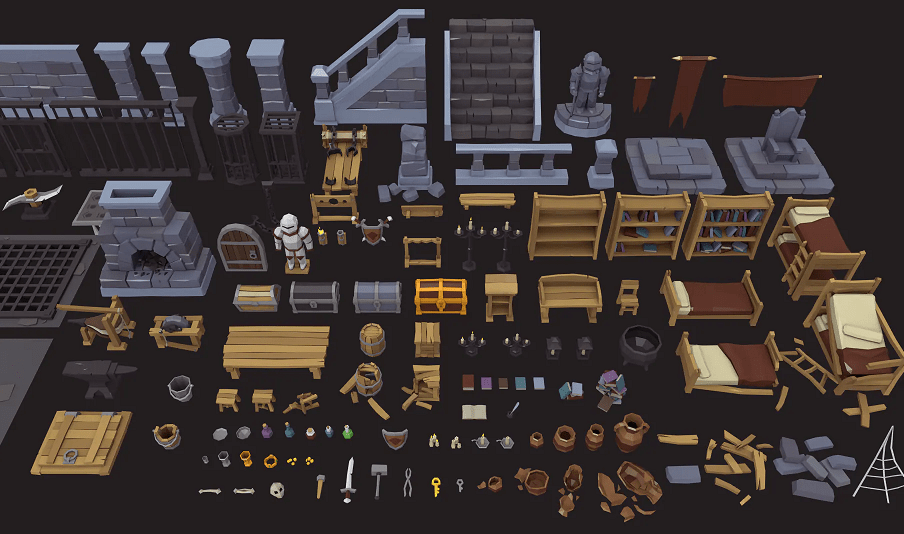
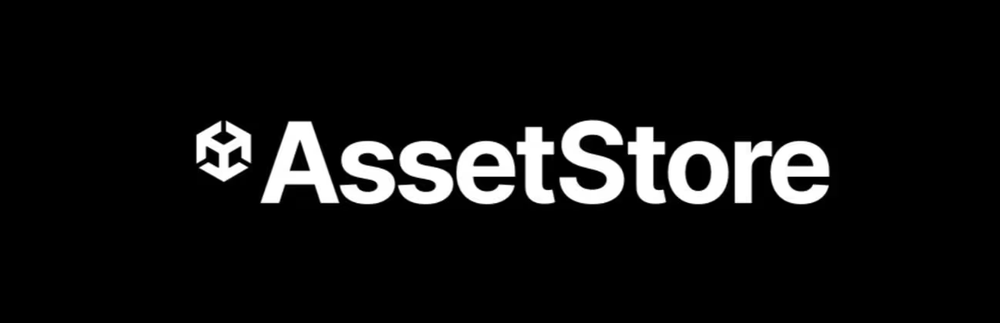
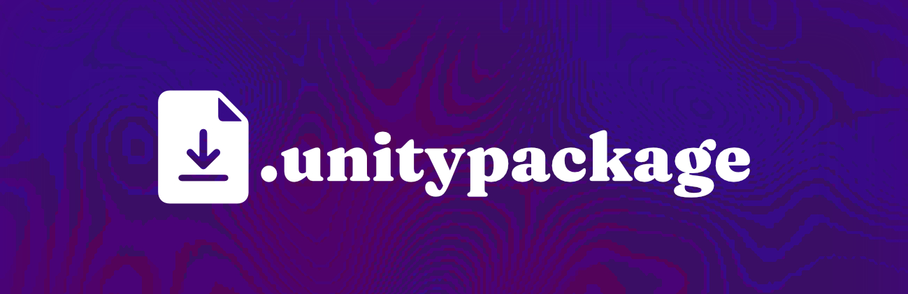
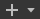
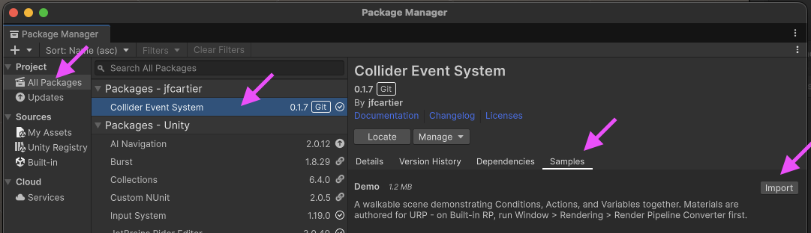
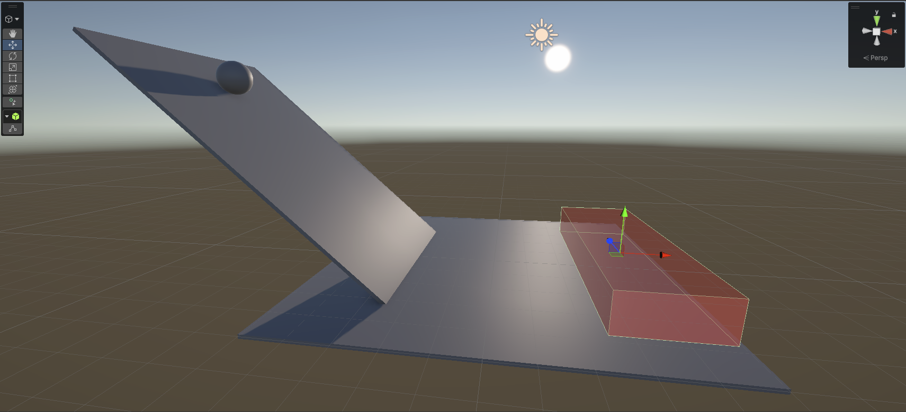
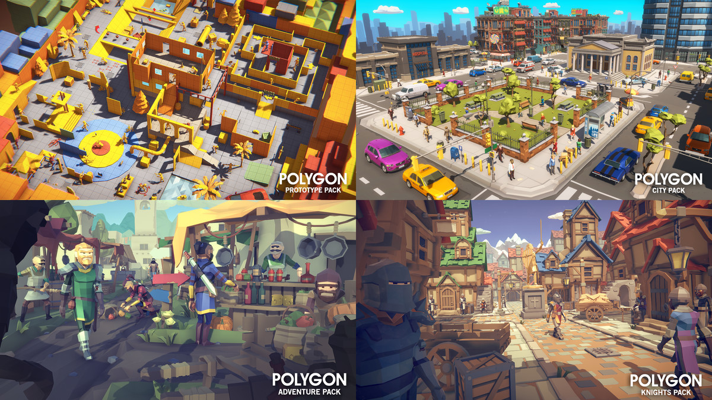

# Assets

{.w-100}

Les ***assets*** sont les ressources graphiques ou logicielles qui composent un jeu : objets 2D, 3D, textures, scripts, matériaux, etc.

## Installation dans Unity

### Via Asset Store :simple-unity:

{.w-50}

[Asset Store](https://assetstore.unity.com/) est le magasin d'assets de Unity. On y trouve du gratuit comme du payant.

Avant d'ajouter des assets du Asset Store à votre projet, vous devez les connectez d'abord à votre compte.

1. Visiter le site Web [Asset Store](https://assetstore.unity.com/) en mode connecté.
1. Choisir un des assets gratuits du magasin (vous pouvez aussi en payer si vous le désirez)
1. Appuyer sur « *Add to my assets* » et accepter les conditions

Ainsi, l'asset sera enregistré à votre compte et sera maintenant disponible dans Unity !

Ensuite, sur Unity :

1. Cliquez sur `Window` > `Package Management` > `Package Manager`. Une petite fenêtre s'ouvrira, celle du « *Package Manager* ».
1. Cliquez sur « *My Assets* » si vous n'y êtes pas déjà.
1. Cliquez sur l'asset ajouté via l'Asset Store, puis cliquez sur « *Download* »
1. Une fois téléchargé, cliquez sur « *Import ... to project* » (puis sur « *Install / Upgrade* » si demandé).
1. Une autre fenêtre s'ouvrira, cliquez sur « *Import* »

Le contenu de l'asset se trouve maintenant dans le panneau « *Project* », à la racine du dossier « *Assets* »

### Via fichier `.unitypackage`

{.w-50}

La façon manuelle d'installer des assets se fait via un fichier avec l'extension `.unitypackage`.

1. Dans le panneau « *Project* », faites un clic droit sur le dossier « *Assets* »
1. Choisissez l'option « *Import Package* » puis « *Custom Package...* »
1. Choisissez un fichier avec l'extension `.unitypackage`
1. Une petite fenêtre « *Import Unity Package* » apparaîtra. Cliquez sur le bouton « *Import* »

### Via un repo Git

1. Cliquez sur `Window` > `Package Management` > `Package Manager`. Une petite fenêtre s'ouvrira, celle du « *Package Manager* ».
1. Cliquez sur le bouton  et choisir « _Install package from git URL..._ »
1. Ajoutez l'URL et cliquez `Install`

Pour voir le _package_ installé, cliquez sur `All Packages`, il devrait être dans la liste. 

Certains packages ont des outils qu'on peut téléchager en plus. Il se trouvent normalement sous l'onglet Samples. {data-zoom-image .w-20}

## Assets du cours

### Collision Event System

<!-- https://assetstore.unity.com/packages/tools/game-toolkits/enhanced-trigger-box-72826 -->

***Collision Event System*** permet de faciliter la gestion des événements suite à une collision en Unity. 

Lorsqu'un GameObject entre en contact avec un des prefab du plugin, le plugin peut déclencher plusieurs événements et ce, sans programmation.

Il n'est malheureusement pas disponible via l'Asset Store. Il doit être installé via un repo Git.

URL : <https://github.com/jfcmontmorency/collider-event-system.git> 

!!! example "Une scène de démonstration est téléchargeable dans l'onglet _Samples_ du _package_"

### POLYGON - Sampler Pack | Synty Studios™

Avec le compte éducationnel, vous avez accès gratuitement à « [POLYGON - Sampler Pack](https://assetstore.unity.com/packages/3d/environments/polygon-sampler-pack-art-by-synty-207048) » d'une valeur de 80 $ USD. Le _pack_ contient des centaines de modèles _low poly_ 3D **cohérents entre eux**.

[Sampler Pack | :simple-unity: AssetStore](https://assetstore.unity.com/packages/3d/environments/polygon-sampler-pack-art-by-synty-207048){ .md-button .md-button--primary }

## Autres ressources

* <https://kenney.nl/assets/category:3D> (Assets)
* <https://itch.io/game-assets/free/tag-3d> (Assets)
* <https://www.mixamo.com/> (Animation)