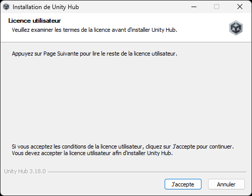
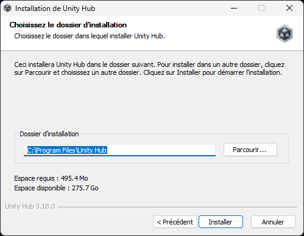
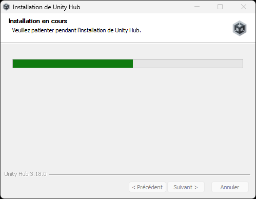
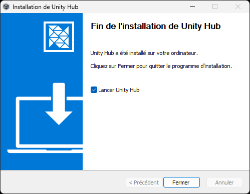
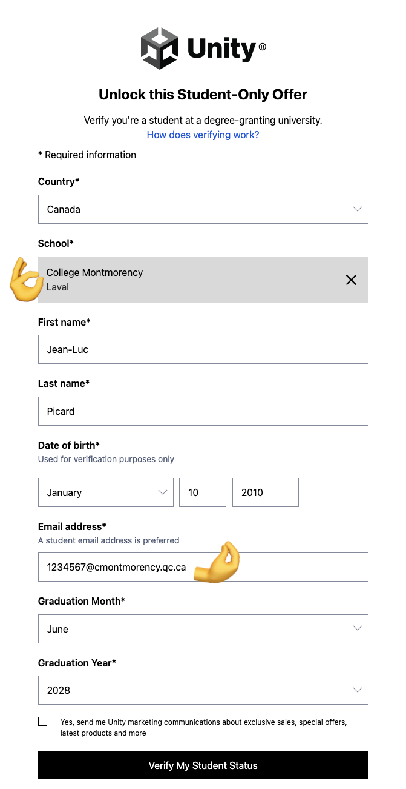
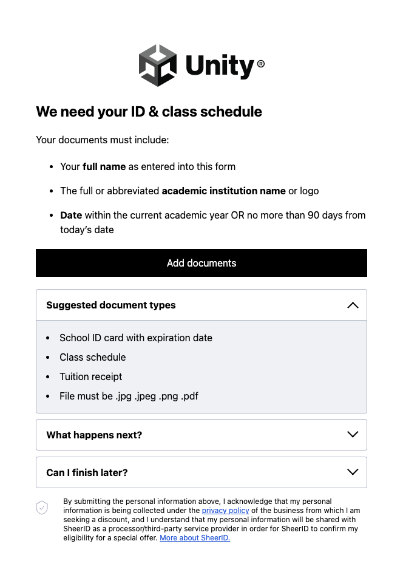

# Unity

## Installation

Avant de procéder à l'installation, assurez-vous d'être connecté sur <https://unity.com/>. Si vous n'avez pas encore de compte, dirigez-vous à la section création de compte.

- [ ] Rendez-vous sur la page de [téléchargement de Unity](https://unity.com/download).
- [ ] Il se peut que le fichier "UnityHubSetup" se télécharge aussitôt. Dans le cas contaire, sélectionnez l'option de téléchargement correspondant à votre système d’exploitation (windows ou mac). Un fichier nommé UnityHubSetup sera téléchargé.
- [ ] Repérez le fichier UnityHubSetup que vous venez de télécharger et lancez-le.
- [ ] Suivez les instructions propres à votre plateforme afin d’installer Unity Hub.
    * Si vous n’avez pas encore créé de compte Unity, vous serez invité à le faire durant cette étape.
    * Une fois connecté à Unity Hub, celui-ci vous guidera pour installer la plus récente version LTS de l’éditeur Unity. Les versions LTS sont les versions les plus récentes ayant fait l’objet de tests complets et offrant une stabilité accrue.
- [ ] Sélectionnez Installer l’éditeur Unity (Install Unity Editor) afin de télécharger et d’installer la dernière version LTS de l’éditeur Unity.

{data-zoom-image}

{data-zoom-image}

{data-zoom-image}

{data-zoom-image}

{data-zoom-image}

## Création de compte

- [ ] Rendez-vous sur la page [créer un compte | Unity.com](https://login.unity.com/fr/sign-up).
- [ ] Cliquer sur « Continuer avec l'e-mail »
- [ ] Important : Utilisez votre courriel du collège (ex. : 1234567@cmontmorency.qc.ca). Cette étape est nécéssaire pour accéder à votre compte éducationnel gratuit.
- [ ] Incrire votre nom complet, un mot de passe puis cliquez sur « Créer un compte »
- [ ] Confirmer l'adresse e-mail via votre boite de courriels

## Adhésion au compte éducationnel gratuit

- [ ] Rendez-vous sur la page [Formule Unity Student | Unity.com](https://unity.com/fr/products/unity-student).

{data-zoom-image .w-100}

- [ ] Cliquez sur le lien « Enseignement suppérieur ».

- [ ] Remplir l'étape 1 du formulaire. Assurez-vous d'utiliser votre courriel du collège et de bien choisir « College Montmorency ».
   {data-zoom-image .w-10}

- [ ] Remplir l'étape 2 étape du formulaire. {data-zoom-image .w-10}

  !!! note "Preuve du statut étudiant"
      
      Votre document doit inclure votre nom complet (identique à celui entré à l'étape 1), le nom/logo du collège et une date récente (comprise dans l'année scolaire en cours OU datée de moins de 90 jours). Exemples de document : 
      
      - Horaire de cours
      - Reçu de paiement des frais de scolarité
      - Carte étudiante
  
- [ ] Cliquer sur « Submit » 