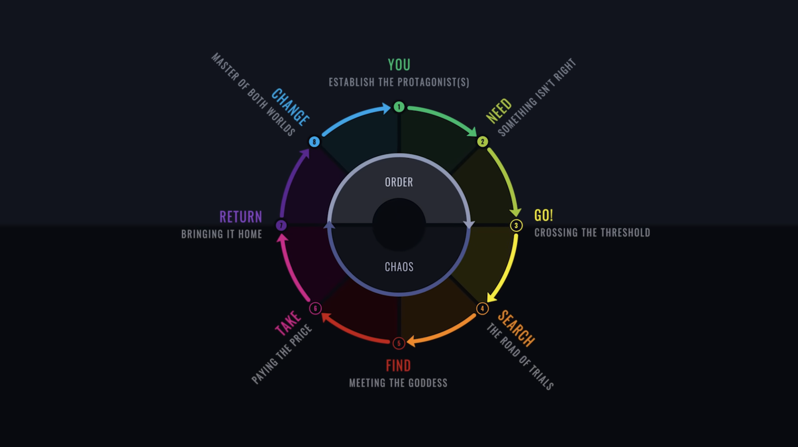
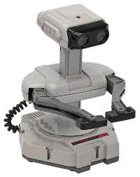
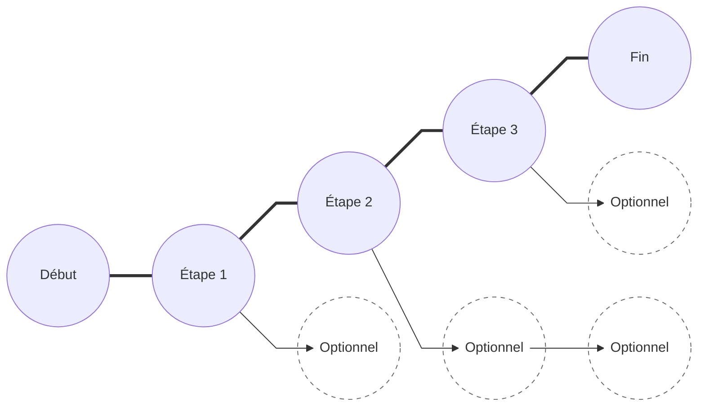
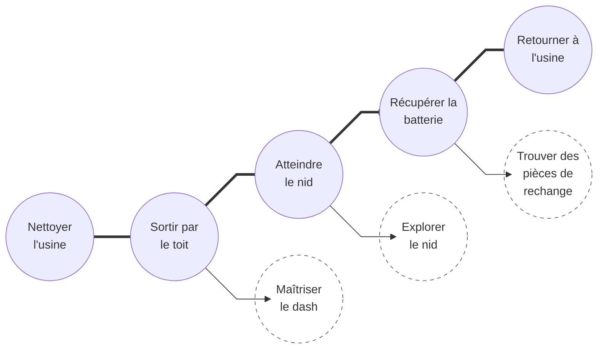
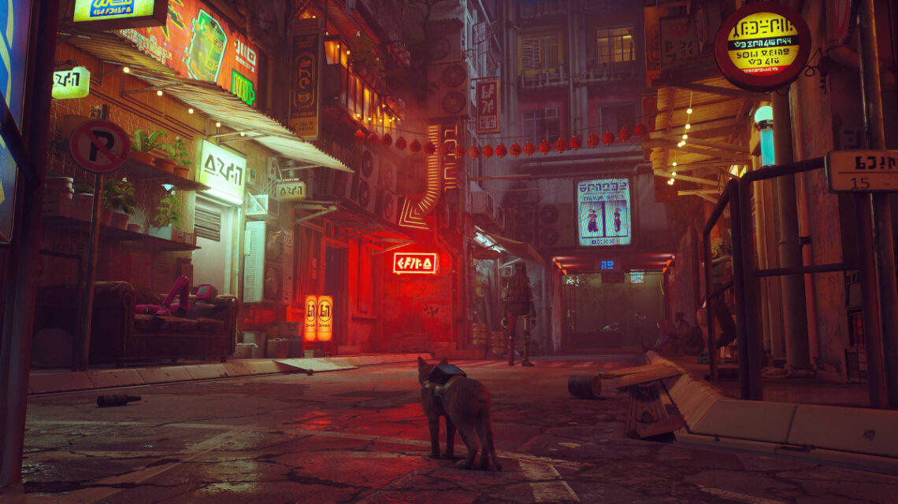
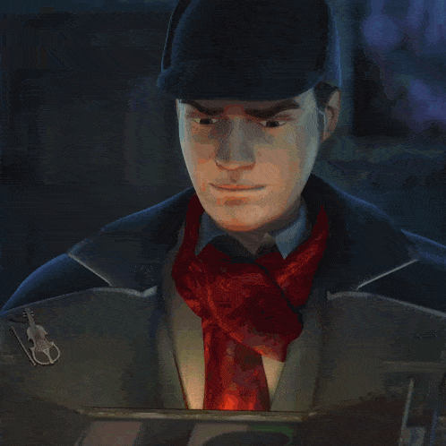
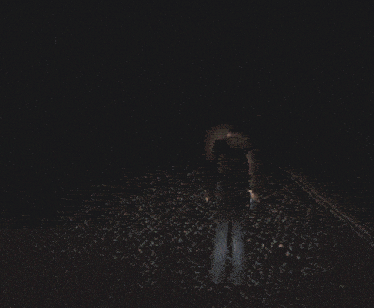
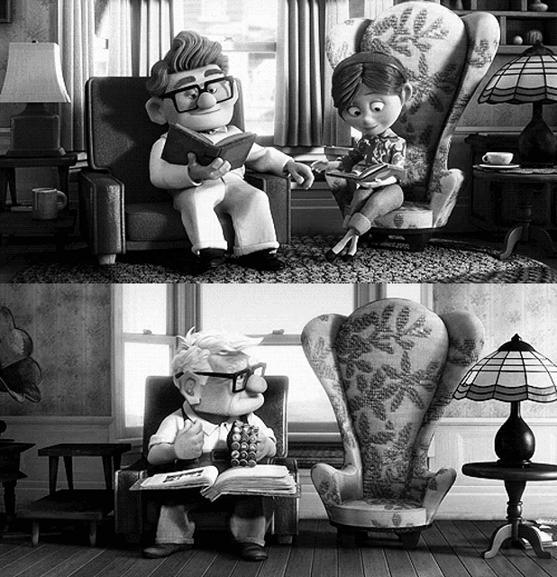

# Narrer pour un jeu vidéo

<!-- https://www.youtube.com/watch?v=GqWHPTDAFSQ -->
<!-- https://www.youtube.com/watch?v=XcIp2zPydMU -->

*[GDD] : Game Design Document
*[PNJ] : Personnage non joueur

> **Narrer** verbe 
> Faire le récit de (quelque chose), raconter

Cette page est conçue pour ceux et celles qui veulent raconter quelque chose, sans trop savoir par où commencer, ni sans trop savoir comment faire.

## Comment fabriquer une histoire intéressante

### Le cercle de Dan Harmon en 8 étapes

{.w-100 data-zoom-image}

Créé par le scénariste de *Rick and Morty*, il résume chaque épisode en 1 phrase :

> Quelqu'un veut quelque chose, va le chercher, en paye le prix fort et revient changé

| Étape | Explication |
|---|---|
| :sunny:&nbsp;***You*** | Situation de départ. On comprend qui est le personnage principal et comment il se comporte dans son état naturel. | 
| :sunny:&nbsp;***Need*** | Le personnage veut, souhaite ou a besoin de quelque chose. |
| :white_sun_small_cloud:&nbsp;***Go***  | Il part part à sa recherche et doit quitter sa zone de confort. |
| :cloud:&nbsp;***Search***  | Il doit s'adapter à cette nouvelle réalité. Il explore, via des détours, des impasses et il vit ses premiers échecs. |
| :cloud_rain:&nbsp;***Find***  | Le personnage trouve ce qu'il cherchait, mais ce n'est pas comme il pensait au point 2 |
| :cloud_lightning:&nbsp;***Take***  | Il obtient ce qu'il veut, mais en paye le prix ! |
| :white_sun_cloud:&nbsp;***Return***  | Il retourne à la situation de départ. |
| :sunny:&nbsp;***Changed***  | Le personnage n'est plus le même. Son aventure l'a changé. |

Les icônes météo ne sont pas décoratives : elles indiquent **l'intensité émotionnelle** de chaque étape. On verra plus loin [comment la provoquer](#courbe-emotionnelle).

!!! tip "Fait de l'étape 6 quelque chose d'intense !"

    Par exemple : il faut une clé pour ouvrir un coffre.
    
    Règle d'or : Il ne faut surtout pas accéder **facilement** à cette clé. Ce serait ennuyant.
    
    Pour l'obtenir, il faudrait idéalement devoir kidnaper le président des États-Unis et avoir la garde nationale sur le dos. Ou encore, faire un pacte avec le diable. Bref, il faut une «twist» pour rendre cette étape de l'histoire captivante.

#### Exemple de scénario

<figure markdown>

<figcaption>R.O.B.</figcaption>
</figure>

| Étape | Niveau 1 |
| --- | --- |
| :sunny:&nbsp;***You*** | R.O.B., un petit robot ouvrier, nettoie le sol d'une usine. Tutoriel de déplacement du personnage |
| :sunny:&nbsp;***Need*** | L'usine s'arrête d'un coup. Un oiseau mécanique a volé la batterie centrale ! R.O.B. veut redémarrer son usine. |
| :white_sun_small_cloud:&nbsp;***Go*** | R.O.B. sort de l'usine par le toit. (L'environnement change : on passe de l'intérieur à l'extérieur, dans les nuages). |
| :cloud:&nbsp;***Search*** | R.O.B. affronte des bourrasques de vent, rate des sauts, meurt et recommence. Il doit maîtriser le dash pour avancer. |
| :cloud_rain:&nbsp;***Find*** | Il atteint le nid de l'oiseau et trouve la batterie brillante. Mais surprise : l'oiseau s'en servait pour couver ses oeufs électroniques. |
| :cloud_lightning:&nbsp;***Take*** | R.O.B. prend la batterie, mais le nid s'effondre et les oeufs éclatent. Il tombe dans le vide et perd un de ses bras dans la chute. Il est blessé et triste pour les oeufs. |
| :white_sun_cloud:&nbsp;***Return*** | Il atterrit lourdement au point de départ et constate que l'usine est déjà repartie et qu'il s'était trompé au sujet de l'oiseau. |
| :sunny:&nbsp;***Changed*** | R.O.B. essaye de retourner travailler avec un membre en moins, ce qui rend sa tâche difficile. |

Niveau 2, R.O.B. a un nouveau besoin, il doit repartir à la recherche d'un bras mécanique.

Et ainsi de suite.

## Comment traiter une narration en jeu vidéo

Maintenant que l'histoire est faite, il reste à lui donner une **forme jouable**.

### Collier de perles

Le collier de perles (_String of Pearls_) est un classique narratif  linéaire qui permet au joueur de faire ce qu'il veut entre les étapes principales.

Le cercle de Harmon décrit ce qui arrive au **personnage** tandis que le collier de perles décrit ce que doit faire le **joueur**.

Une cercle (perle) se formule comme une **action jouable**.

<!-- !!! warning "Limitez vos ambitions"
    
    Pour un premier jeu, essayez d'avoir le moins d'étapes principales possibles. Sinon, la charge de travail peut être très élevée.

    On peut ajouter autant d'étapes optionnelles que l'on désire. Ainsi, si on a pas le temps de les développer, ça ne brise pas le jeu. -->

#### Exemple avec l'histoire de R.O.B.

<figure markdown>

<figcaption>R.O.B.</figcaption>
</figure>

Reprenons l'histoire de R.O.B. et donnons-lui une forme jouable :

### Narration environnementale

<figure markdown>
{.w-100}

<figcaption markdown>[Stray](https://www.playstation.com/fr-ca/games/stray/)</figcaption>
</figure>

La narration environnementale (_environmental storytelling_) est l'art de communiquer les étapes d'une histoire sans mot.

Peut être très efficace pour évoquer une émotion.

| Ce que tu veux raconter | ❌ En texte | ✅ En jeu |
|---|---|---|
| « Cet endroit était habité » | Un panneau qui l'explique | Des chaises renversées, une tasse de café encore chaude, un jouet par terre |
| « Il ne faut pas aller là » | « Attention, danger! » | Une lumière rouge clignotte, un squelette à l'entrée, un son grave qui monte |
| « Tu as réussi quelque chose d'important » | « Bravo! Quête complétée » | La porte s'ouvre avec des conffetis, un thème musical démarre, le ciel devient bleu |
<!-- 
## Émotion

Une fois l'histoire faite et le _gameplay_ planifié, on pour s'attaquer à ce qu'on aimerait que le joueur **ressente** et à quel moment.

Pour ce faire, on peut y aller avec des leviers narratifs ou techniques comme la lumière, le son, la caméra, l'espace.

Bonne expérimentation. -->
<!-- 
!!! tip "Une technique très efficace : **enlever** quelque chose"

    Couper la musique. Diminuer la vitesse de déplacement. Changer la lumière, etc.
 -->
<!--
!!! danger "Une émotion vient d'un **changement**, jamais d'un état"

    On ne peut pas ressentir le soulagement sans tension avant. Ni l'émerveillement sans avoir été à l'étroit juste avant.

    C'est pour ça que chaque recette ci-dessous commence par **« il faut d'abord »**. La moitié du travail se fait *avant* le moment que tu veux réussir.

### Recettes

Ce qui suit ne sont pas des règles absolues, mais des suggestions.

#### Curiosité

{.aspect-1-1 data-zoom-image}

En ne montrant au joueur qu'**une partie d'un tout**, on sucite la curiosité et l'intérêt. 
> On ne montre pas ce qu'il y a dans la boite, juste sa lumière. C'est mystérieux.

#### Peur

{.aspect-1-1 data-zoom-image}

Pour évoquer la peur, on doit essayer en créer une **tension**. Soit par un **danger** imminent, par une piste **audio** stressante ou par des jeux d'**ombres**.

> Un classique dans le genre : Silent Hill

#### Tristesse

{.aspect-1-1 data-zoom-image}

Pour créer de la tristesse, le joueur doit avoir passé du temps avec une chose ou une personne avant de la perdre.

 -->
