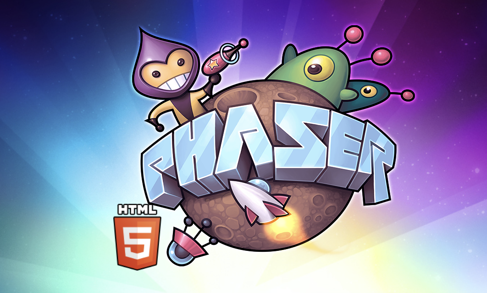

[:material-arrow-u-left-top: Cours 1](../cours01.md){ .breadcrumb }

# Phaser


[Phaser](https://phaser.io/) est un cadriciel open-source destiné au développement de jeux en 2D, principalement pour les navigateurs web. Il est écrit en JavaScript et utilise [WebGL](https://get.webgl.org/) ou [canvas](https://www.w3schools.com/html/html5_canvas.asp) pour le rendu graphique. Il fournit des fonctionnalités pour la gestion des **scènes**, de **physique**, d'**animations**, des **contrôles**, et plus encore.

## Installation minimale

Créer un dossier nommé « Jeu » dans lequel devra se trouver un fichier `index.html` et un fichier `script.js`.

Assurez vous d'activer l'extension [Live server](https://marketplace.visualstudio.com/items?itemName=ritwickdey.LiveServer) dans VSCode.

L'usage d'un :material-server-network-outline: serveur Web est [obligatoire](https://phaser.io/tutorials/getting-started-phaser3) avec Phaser.

```html title="index.html"
<!DOCTYPE html>
<html>
  <head>
      <script src="https://cdn.jsdelivr.net/npm/phaser@v3.80.1/dist/phaser.min.js" defer></script>
      <script src="script.js" defer></script>
  </head>
  <body></body>
</html>
```

```js title="script.js"
const config = {
    type: Phaser.AUTO,
    width: 800,
    height: 600,
    scene: {
        preload: preload,
        create: create,
        update: update
    }
};
const game = new Phaser.Game(config);

function preload() {
  // Fonction de préchargement des assets
}

function create() {
  // Fonction de création des éléments de jeu
}

function update(s) {
  // Fonction de mise à jour (boucle de jeu)
}
```

<iframe class="aspect-2-1" height="300" style="width: 100%;" scrolling="no" title="Installation Phaser (CDN)" src="https://codepen.io/tim-momo/embed/rNEKGeG?default-tab=result&editable=true&theme-id=50210" frameborder="no" loading="lazy" allowtransparency="true" allowfullscreen="true">
  See the Pen <a href="https://codepen.io/tim-momo/pen/rNEKGeG">
  Installation Phaser (CDN)</a> by TIM Montmorency (<a href="https://codepen.io/tim-momo">@tim-momo</a>)
  on <a href="https://codepen.io">CodePen</a>.
</iframe>

## Configuration

```js
const config = {
    type: Phaser.AUTO, // Type de rendu
    width: 800, // Largeur du canvas
    height: 600, // Hauteur du canvas
    scene: {
        preload: preload, // Fonction de préchargement des assets
        create: create, // Fonction de création des éléments de jeu
        update: update // Fonction de mise à jour (boucle de jeu)
    },

    title: 'Jeu', // Titre du jeu (facultatif)
    url: 'https://monjeu.com', // URL associée au jeu (facultatif)
    parent: 'game-container', // ID de l'élément DOM parent où le jeu sera injecté (facultatif)
    backgroundColor: '#1a1a1a', // Couleur de fond du canvas en hexadécimal (facultatif)
    transparent: false, // Transparence du canvas (facultatif)
    pixelArt: true, // Active le mode pixel art pour un rendu net des pixels (facultatif)
    antialias: false, // Désactive l'anticrénelage (facultatif)
    roundPixels: true, // Arrondi les pixels pour éviter le flou (facultatif)
    version: '1.0', // Version du jeu (facultatif)
    disableContextMenu: true, // Désactive le menu contextuel du clic droit (facultatif)
};
```

### Types de rendu

1. **Phaser.CANVAS**
    * Utilise le contexte 2D du **canvas** HTML5.
    * Il est généralement plus lent que WebGL.
    * Il est compatible avec presque tous les navigateurs modernes.
1. **Phaser.WEBGL**
    * Utilise WebGL pour exploiter le GPU (**processeur graphique**).
    * Il permet des **effets graphiques avancés**, comme des shaders et des transformations 3D.
    * C’est l’option privilégiée pour des jeux nécessitant un bon niveau de performance.
1. **Phaser.AUTO** (recommandé)
    * Ce mode laisse Phaser décider du type de rendu. Il essaiera d’abord d’utiliser WebGL pour les meilleures performances et basculera sur Canvas si WebGL n’est pas pris en charge par le navigateur.
    * Ce mode garantit que votre jeu fonctionnera correctement dans un large éventail de navigateurs tout en profitant des meilleures performances possibles.

Pour connaître la compatibilité WebGL. [CanIUse WebGL ?](https://caniuse.com/?search=webgl)

## Installation plus étoffée :fontawesome-regular-hand-point-left:{ .horizontal-anim .valign-bottom }

### Structure de fichiers

Le libellé des fichiers et des dossiers doivent être **courts**, en **minuscule** et **sans espace**.

```markdown
jeu
│
├── index.html
├── node_module
├── assets
│   ├── images
│   │   ├── backgrounds
│   │   ├── fx
│   │   ├── characters
│   │   ├── ui
│   │   └── items
│   ├── audio
│   │   ├── music
│   │   └── sfx
│   └── fonts
│       └── nes.ttf
└── src
    ├── styles
    |   └── main.css
    └── scripts
        ├── init.js
        ├── scenes
        │   ├── Game.js
        │   ├── GameOver.js
        │   ├── MainMenu.js
        │   └── Preloader.js
        └── characters
            ├── Player.js
            └── Enemy.js
```

*[npm]: Node package manager

À la racine du document,

Exécuter la ligne de commande suivante pour télécharger Phaser.

```powershell title="Terminal"
npm install phaser@v3.80.1
```

Un dossier `node_module` sera ainsi créé à la racine du projet.

```html title="index.html"
<!DOCTYPE html>
<html>
<head>
    <meta charset="UTF-8">
    <title>Titre du jeu</title>
    <meta name="description" content="Description du jeu">
    <meta name="author" content="Votre Nom">

    <link href="./src/styles/css/styles.css" rel="stylesheet">

    <script src="./node_modules/phaser/dist/phaser.min.js" defer></script>

    <script src="./src/scripts/scenes/homepage.js" defer></script>
    <script src="./src/scripts/init.js" defer></script>
</head>
<body>
    <div id="canvas-wrapper"></div>
</body>
</html>
```

```css title="/src/styles/css/styles.css"
html {
  background-color: pink;
}
```

```js title="/src/scripts/init.js"
const config = {
    type: Phaser.AUTO,
    parent: "canvas-wrapper",
    transparent: true,
    width: 800,
    height: 400,
    scene: Homepage,
};

const game = new Phaser.Game(config);
```

```js title="/src/scripts/scenes/homepage.js"
class Homepage extends Phaser.Scene {

    preload() {}

    create() {
      this.add.text(20, 20, 'Salut !');
    }

    update() {}
}
```

## Intellisense

Enfin, assurez vous d'activer l'extension [Intellisense](https://code.visualstudio.com/docs/editor/intellisense).

À la racine du projet, ajoutez le fichier `jsconfig.json`.

Celui-ci indiquera à Intellisense le contenu à utiliser pour améliorer l'expérience de votre développement.

Ajoutez-y le code suivant.

```json title="jsconfig.json"
{
    "include": ["src/**/*", "node_modules/phaser/types/**/*.d.ts"]
}
```

<div class="grid grid-1-2" markdown>
  

  <small>Exercice - Phaser</small><br>
  **[Installation de base](exercices/phaser-intro.md){.stretched-link}**
</div>
