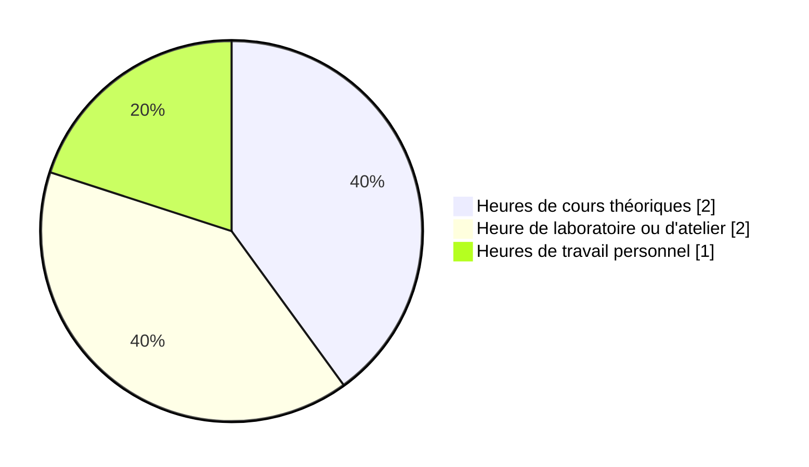

# Interactivité ludique

## Descriptif du cours

L’élève réalise un projet ludique sur ordinateur qui intègre des images et des échantillons sonores. Il doit créer une expérience ludique à travers laquelle l’interacteur progresse selon ses actions.

Ce cours permet à l’élève de se familiariser avec les logiciels d’intégration multimédia et d’assimiler les notions de base de l’interactivité : présentation d’actions à accomplir, mesure et communication de la réussite (succès ou échec) et progression.

| Spécifications        | Valeur  |
| --------------------- | ------- |
| Code                  | 582-301 |
| Pondération           | 2-2-1   |
| Unités                | 1⅔      |
| Heures d’enseignement | 60      |
| Session               | 3       |

## Objectifs

* Intégrer des médias visuels et sonores dans une expérience ludique.
* Programmer des actions ludiques qu’un interacteur doit accomplir pour progresser.

## Préalables

-   Les cours suivants sont préalables absolus au présent cours

    * 420 V11 MO Programmation interactive

-   Le présent cours est préalable absolu aux cours suivants

    * 582 401 MO Réalité mixte
    * 582 541 MO Préparation au milieu de travail

## Attitudes professionnelles

* Rigueur
* Créativité

## Enseignant 🌱

  

  **Jean-François Cartier** 
  _Enseignant en Techniques d'intégration multimédia_ 
  :material-microsoft-teams: [jfcartier@cmontmorency.qc.ca](mailto:jfcartier@cmontmorency.qc.ca) 
  :material-github: [https://github.com/jfcmontmorency](https://github.com/jfcmontmorency) 
  :material-codepen: [https://codepen.io/tim-momo](https://codepen.io/tim-momo)

