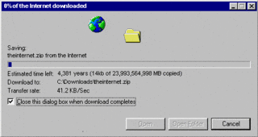

# Publier un build Vite

L'objectif de cet exercice est de mettre en ligne un build effectué par Vite.

## Consignes

- [ ] Reprenez un exercice qui utilise Vite (ex: daisyui-vite)
- [ ] Effectuez un build avec la commande `npx vite build`
- [ ] Vérifiez que le build fonctionne avec `npx vite preview`

- [ ] Sur votre cPanel, dans Gestionnaire de fichiers, créer un nouveau dossier «test» sous `public_html`.
- [ ] Déplacer le contenu du dossier `dist` du build à l'intérieur du dossier `test` sur cPanel
  > C'est plus facile de faire un `.zip` du contenu avant de le transférer sur cPanel. Rendu sur le gestionnaire de fichiers, vous pouvez alors le décompresser et déplacer des fichiers/dossiers au besoin.
- [ ] Vérifier que l'URL xxxxxx.tim-momo.com/test fonctionne (évidemment, remplacer xxxxxx par votre sous-domaine à vous)