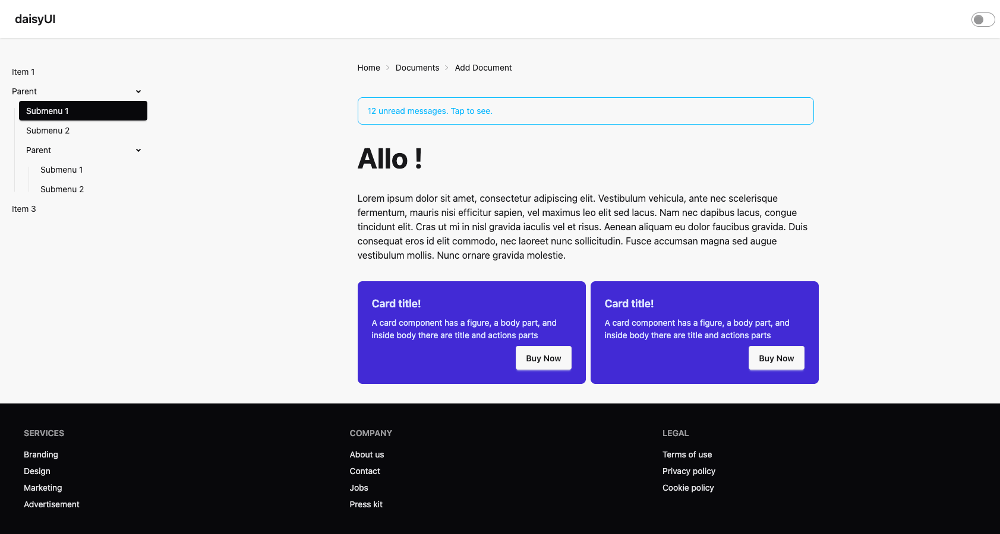
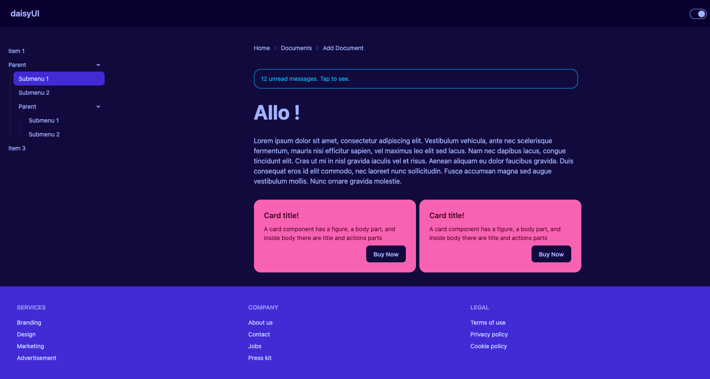

---
tags:
  - Exercice
---

# DaisyUI

{.w-100}

L'objectif de cet exercice est de faire un usage technique des composantes DaisyUI sans modifier le contenu.

## Résultat attendu

<figure markdown>
{.w-100 data-zoom-image}
<figcaption>Mode clair</figcaption>
</figure>

<figure markdown>
{.w-100 data-zoom-image}
<figcaption>Mode sombre</figcaption>
</figure>

## Consignes

- [ ] [Accepter le devoir Classroom 50](https://classroom50.org/tim-w3/web-3/assignments/daisyui/accept)
- [ ] Cloner le dépôt avec GitHub Desktop
- [ ] Ouvrir le dossier cloné dans VSCode

---

- [ ] Dans `<head>`, connecter Tailwind et DaisyUI
- [ ] Sur `<html>`, ajouter un thème clair de votre choix
- [ ] Sur `<body>`, appliquer la classe `bg-base-200` (permettra de séparer visuellement le contenu principal de l'entête)
- [ ] Dans `<body>`, ajouter une structure « Layout header + aside + main + footer »

### Entête (_header_)

- [ ] Sur `<header>`, ajouter les classes `sticky top-0 z-30`. (Ça va attacher l'entête en haut au scroll de la page)
- [ ] Dans `<header>`, ajouter la composante DaisyUI : « Navbar with title and icon »
  - [ ] Dans la navbar, remplacer le bouton par une composante "Theme Controller" de votre choix

### Colonne de gauche (_aside_)
      
- [ ] Dans `<aside>`, ajouter la composante DaisyUI : « Collapsible submenu »
  - [ ] Sur un des éléments de menu, appliquer une classe qui l'affichera comme sélectionné. (Consultez la documentation à cet effet)

### Colonne principale (_main_)

- [ ] Dans `<main>`, ajouter une colonne centrée avec une largeur maximale d'environ 3xl. Tout le contenu ira dedans
  - [ ] La colonne centrée doit s'afficher en flexbox afin d'appliquer un gap pour séparer les enfants

#### Dans la colonne centrée ...

- [ ] Ajouter une composante daisyUI : « Breadcrumb »
- [ ] Ajouter une composante daisyUI : « Alert »
- [ ] Ajouter un titre 1 et ajuster sa taille avec des classes Tailwind
- [ ] Ajouter un ou plusieurs paragraphes [Lorem Ipsum](https://www.lipsum.com/feed/html)
- [ ] Ajouter une grille à 2 colonnes
  - [ ] Ajouter dans chaque colonne une composante DaisyUI : « Card »

### Pied de page (_footer_)

- [ ] Remplacer <footer> par une composante DaisyUI : « Footer »

### Finition

- [ ] Avec `gap`, ajuster les espacements de la page pour que ce soit esthétique
- [ ] Formatter le code HTML

[STOP]

https://tim-w3.github.io/daisyui-solution/