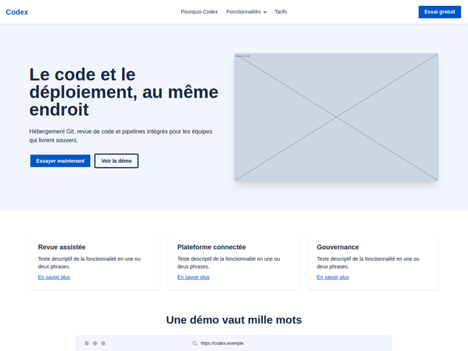
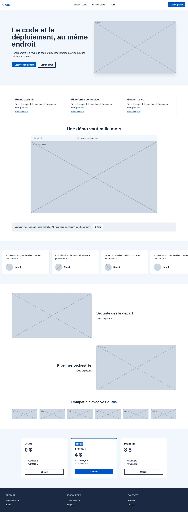
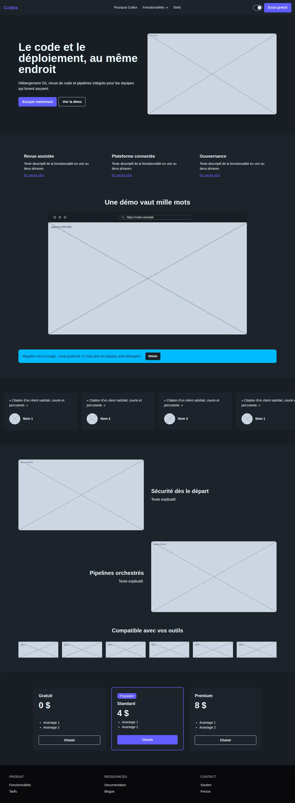
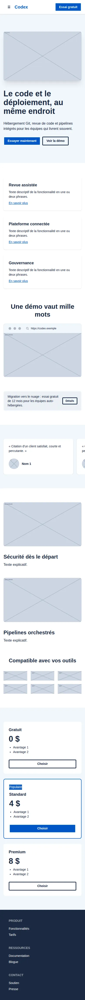

---
tags:
  - Exercice
  - DaisyUI
  - Vite
---

# Vitrine

{.w-100}

L'objectif de cet exercice est de reproduire la structure d'une page promotionnelle de produit avec des composantes DaisyUI, des ajustements Tailwind et un thème maison.

La page de référence est celle de [Bitbucket](https://bitbucket.org/product/). Seule la **mise en page** est reproduite : le produit (« Codex »), les textes et les images sont fictifs.

## Résultat attendu

<figure markdown>
{.w-100 data-zoom-image}
<figcaption>Thème maison</figcaption>
</figure>

<figure markdown>
{.w-100 data-zoom-image}
<figcaption>Mode sombre</figcaption>
</figure>

<figure markdown>
{.w-50 data-zoom-image}
<figcaption>Mobile</figcaption>
</figure>

## Consignes

- [ ] [Accepter le devoir Classroom 50](https://classroom50.org/tim-w3/web-3/assignments/daisyui-vitrine/accept) <!-- TODO : créer le devoir à partir de vitrine_starter.zip -->
- [ ] Cloner le répertoire avec GitHub Desktop
- [ ] Ouvrir le dossier cloné dans VSCode
- [ ] Dans le terminal, exécuter `npm install`, puis `npx vite`

---

### Thème

- [ ] Avec le [générateur de thèmes](https://daisyui.com/theme-generator/), créer un thème nommé `vitrine`, avec `#0052CC` comme couleur primaire
- [ ] Coller le thème dans `style.css` et en faire le thème par défaut (`default: true`)
- [ ] Activer aussi le thème `dark` avec le drapeau `--prefersdark`

### Sections

Chaque section est indiquée par un commentaire dans `index.html`. Les images sont fournies dans `assets/images`.

- [ ] **Navbar** : collée en haut (`sticky top-0 z-30`)
  - [ ] Nom du produit à gauche
  - [ ] Menu horizontal au centre, avec un sous-menu « Fonctionnalités » (visible à partir de `lg`)
  - [ ] Menu déroulant (_dropdown_) à la place du menu horizontal sur mobile
  - [ ] À droite : un `theme-controller` clair/sombre et un bouton primaire « Essai gratuit »
- [ ] **Hero** : texte et image côte à côte sur grand écran, empilés sur mobile, avec deux boutons (plein et contour)
- [ ] **Trois cartes** : grille de trois `card` à partir de `sm`, chacune avec titre, texte et lien
- [ ] **Démo** : titre centré et image `pipeline.webp` dans une composante `mockup-browser`
- [ ] **Bannière** : composante `alert` avec texte et petit bouton
- [ ] **Témoignages** : `carousel` de cartes contenant une citation, un `avatar` et un nom
- [ ] **Paires image + texte** : deux rangées, l'image changeant de côté à la deuxième (voir « Image + contenu » au cours 3)
- [ ] **Logos** : grille de 3 colonnes sur mobile, 6 sur grand écran
- [ ] **Tarifs** : trois cartes. Celle du centre est mise en valeur avec une bordure `primary` et un `badge` « Populaire »
- [ ] **Footer** : composante `footer` à trois colonnes, sur fond `neutral`

### Finition

- [ ] N'utiliser que des couleurs sémantiques (`primary`, `base-200`, `neutral`…), aucune couleur Tailwind fixe
- [ ] Vérifier le rendu sur mobile (DevTools) et en mode sombre
- [ ] Formater le code HTML
- [ ] Faire un _commit_ et un _push_, puis vérifier que `node_modules` n'est pas sur GitHub

[STOP]
