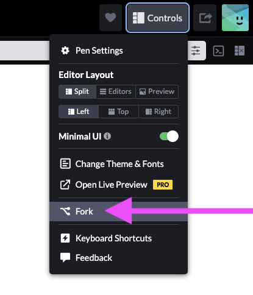

# Gratuit

L'objectif de cet exercice est d'appliquer les classes Tailwind afin de reproduire le résultat attendu.

## Résultat attendu

{.w-100 data-zoom-image}

[Ouvrir dans un onglet](https://es-d-75839172920260731-019faecd-5870-720f-8558-f71d426eedfd.codepen.dev/){ .md-button .md-button--primary }

## Consignes

### Première étape

- [ ] Consultez le [CodePen de départ](https://codepen.io/editor/tim-momo/pen/019faedd-f07b-75f8-9b63-05e059d4c3fb)
- [ ] Connectez-vous si ce n'est déjà fait
- [ ] Effectuez un _fork_ du projet

  {data-zoom-image .w-10}

### Mise en page

Plusieurs commentaires HTML ont été ajoutés afin de guider votre travail. 

- [ ] Appliquez les classes Tailwind nécessaires afin de reproduire le résultat attendu.
