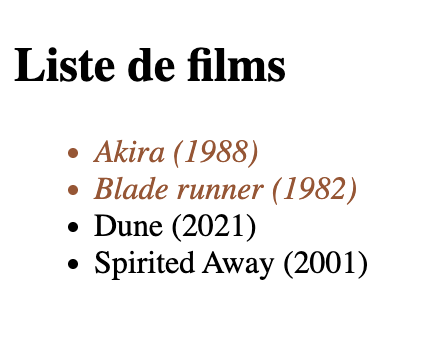

---
tags:
  - Exercice
---

*[DOM]: Document Object Model

# Manipulation du DOM


## Matière à connaître

??? example "DOM"

    Le DOM c'est le code HTML interprété par le navigateur.

??? example "Attribut"

    En HTML, un attribut c'est une information supplémentaire sur une balise (tag).

    ```html
    <p id="un-beau-bonjour" class="des belles classes">Bonjour</p>
    <!-- id et class sont des attributs -->
    ```

??? example "Sélecteur"

    Un sélecteur c'est une façon de sélectionner des éléments du DOM.

    Certains sélecteurs sélectionnent un élément à la fois, d'autres sélectionnent plusieurs éléments.

    ```js
    // Sélectionne UN SEUL élément par son attribut `id`.
    let maSelectionA = document.getElementById(id);

    // Sélectionne le premier élément qui correspond au sélecteur CSS donné.
    let maSelectionB = document.querySelector(selecteur_css);

    // Sélectionne tous les éléments qui correspondent au sélecteur CSS. Retourne une liste!
    let maSelectionC = document.querySelectorAll(selecteur_css);
    ```

??? example "Sélecteur CSS"

    Un sélecteur CSS s'écrit de la même manière qu'en CSS.

    ```js
    let maSelection = document.querySelector('.container p:first-child');
    ```

??? example "Manipulation"

    ```js title="Modifier la sélection"
    maSelection.innerHTML = "Nouveau contenu";
    ```

    ```js title="Supprimer la sélection"
    maSelection.remove();
    ```

## Objectif

Manipuler le DOM pour ajouter, modifier et supprimer des éléments sur la page.

## Résultat attendu



## Instructions

### Étape 1

Dans le fichier `index.html` :

* [ ] Ajouter le code HTML suivant :

  ```html
  <h2 id="title">Liste de films</h2>
  <ul id="films">
    <li class="film" data-annee="1979">Alien</li>
    <li class="film" data-annee="1988">Akira</li>
    <li class="film" data-annee="1982">Blade runner</li>
    <li class="film" data-annee="2021">Dune</li>
    <li class="film" data-annee="2001">Spirited Away</li>
  </ul>
  ```

Dans le fichier `script.js` :

* [ ] Créer une constante `films` qui contient toutes les balises `li` de la liste de films
* [ ] À l'aide d'une boucle `for`, ajouter l'année après chaque titre de film (ex : Alien (1979)). L'année se trouve dans l'attribut `data-annee` de chaque balise `li`.

  ??? tip "Indice"

      [`getAttribute()`](https://developer.mozilla.org/en-US/docs/Web/API/Element/getAttribute) permet de récupérer la valeur d'un attribut HTML.

      <!-- let annee = films[i].getAttribute('data-annee'); -->
      

* [ ] Vérifier dans le navigateur (sur la page, pas dans la console) que les 5 films affichent leur année
* [ ] Effectuer un `commit` avec le message « Afficher les années »

### Étape 2

* [ ] À l'aide d'une deuxième boucle `for`, ajouter la classe CSS `prehistorique` aux films réalisés avant l'an 2000

  ??? tip "Indices"

      * [`classList.add()`](https://developer.mozilla.org/en-US/docs/Web/API/Element/classList) sert à ajouter une classe à une balise HTML
      * La valeur d'un attribut est toujours du **texte**. Pour la comparer à un nombre, il faut d'abord la convertir avec [`Number()`](https://developer.mozilla.org/en-US/docs/Web/JavaScript/Reference/Global_Objects/Number)

Dans un nouveau fichier `style.css` :

* [ ] Ajouter un style de votre choix (ex. : couleur rouge) pour la classe `.prehistorique`
* [ ] [Lier le fichier `style.css`](https://www.w3schools.com/css/css_howto.asp) dans la portion `<head>` de `index.html`
* [ ] Vérifier dans le navigateur qu'Alien, Akira et Blade runner ont le style préhistorique
* [ ] Hocher la tête en guise de satisfaction<br>{.w-25}
* [ ] Effectuer un `commit` avec le message « Identifier les films préhistoriques »

### Étape 3

Dans le fichier `script.js` :

* [ ] Créer une variable `filmLePlusVieux` qui contient le premier film de la liste
* [ ] À l'aide d'une troisième boucle `for`, parcourir les films. Si l'année d'un film est plus petite que celle de `filmLePlusVieux`, remplacer `filmLePlusVieux` par ce film.
* [ ] **Après** la boucle, supprimer `filmLePlusVieux` de la page
* [ ] Vérifier dans le navigateur que le tout correspond au résultat attendu
* [ ] Effectuer un `commit` avec le message « Supprimer le film le plus vieux »
* [ ] Effectuer un `push`

<figure markdown>
{.w-50}
</figure>

[STOP]

## Solution

```js title="script.js"
const films = document.querySelectorAll('#films .film');

// Étape 1
for (let i = 0; i < films.length; i++) {
  const annee = films[i].getAttribute('data-annee');
  films[i].textContent += ` (${annee})`;
}

// Étape 2
for (let i = 0; i < films.length; i++) {
  const annee = films[i].getAttribute('data-annee');
  if (Number(annee) < 2000) {
    films[i].classList.add('prehistorique');
  }
}

// Étape 3
let filmLePlusVieux = films[0];
for (let i = 1; i < films.length; i++) {
  const annee = films[i].getAttribute('data-annee');
  const anneePlusVieux = filmLePlusVieux.getAttribute('data-annee');
  if (Number(annee) < Number(anneePlusVieux)) {
    filmLePlusVieux = films[i];
  }
}
filmLePlusVieux.remove();
```

```css title="style.css"
.prehistorique {
  color: sienna;
  font-style: italic;
}
```
