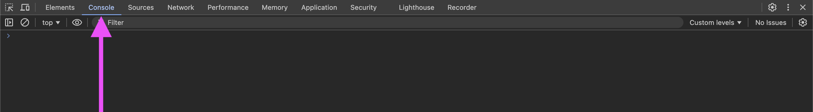

---
tags:
  - Exercice
---

# Les variables et les types


## Matière à connaître

??? example "Variable"

    C'est un mot qui sauvegarde une valeur. Vous pouvez lui donner le nom que vous voulez.

    ```js title="Exemple"
    let profDeWeb = "Marie-Michelle";
    ```

    - `profDeWeb` est le nom de la variable
    - `Marie-Michelle` est sa valeur

??? example "Vocabulaire"

    C'est le processus d'assigner une valeur initiale à une variable au moment de sa déclaration ou plus tard dans le code.

    ```js
    let nom;       // Déclaration
    nom = "JF";    // Initialisation

    let age = 99;  // Déclaration + initialisation
    ```

??? example "Déclaration"

    C'est la partie (ou l'endroit) dans le code où une variable est créée et est rendue disponible pour être utilisée.

    Important : Avec `let`, il n'est pas possible de redéclarer une variable existante.

    ```js title="Exemple"
    let age = 99;
    let age = 2; // ❌ Erreur
    ```

??? example "Types"

    Un type c'est comme une catégorie de variable. Les types de base sont les nombres, les textes, les booléens, les tableaux et les objets.

    ```js
    let age = 99;                               // Nombre (number)
    let nom = "JF";                             // Texte / chaîne de caractères (string)
    let estEtudiant = true;                     // Booléen (boolean)
    let fruits = ["Pomme", "Banane", "Orange"]; // Tableau (array)
    let personne = { nom: "JF", age: 99 };      // Objet (object)
    ```

??? example "Console"

    C’est un espace dans le navigateur où tu peux afficher des messages pour comprendre ce que fait ton programme. C’est aussi là que s’affichent les messages d’erreur si ton programme rencontre un problème.

    { data-zoom-image }

    [Comment ouvrir les outils pour les développeurs Chrome ?](https://developer.chrome.com/docs/devtools/open?hl=fr)

## Objectif

Déclarer des **variables** de différents **types** et les afficher dans la **console**.

## Résultat attendu

Avec vos propres valeurs :

```txt title="Console"
Nom : JF
Âge : 99
Est étudiant(e) : false
```

## Instructions

Dans le fichier `script.js` :

* [ ] Déclarer une variable de type chaîne de caractères pour stocker votre nom.
* [ ] Déclarer une variable de type nombre pour stocker votre âge.
* [ ] Déclarer une variable de type booléen pour indiquer si vous êtes étudiant(e).
* [ ] Afficher chaque variable dans la console, une par ligne, précédée d'un libellé comme dans le résultat attendu.
* [ ] Effectuer un `commit`, puis un `push`

<figure markdown>
{.w-50}
</figure>

[STOP]

## Solution

```js
let nom = "JF";
let age = 99;
let estEtudiant = false;
console.log("Nom : " + nom);
console.log("Âge : " + age);
console.log("Est étudiant(e) : " + estEtudiant);
```
