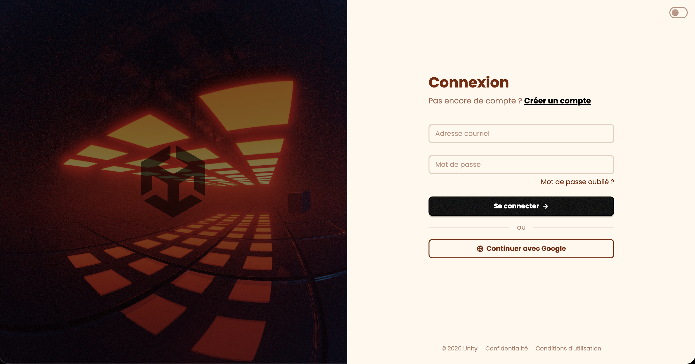

---
tags:
  - Exercice
  - npm
  - DaisyUI
  - Vite
---

# Page de connexion Unity

{.w-100 data-zoom-image}

L'objectif de cet exercice est de démontrer sa capacité à installer et à utiliser des technologies `npm` dans un projet Vite, puis à assembler une page avec Tailwind et DaisyUI.

Le HTML est déjà écrit : **les consignes sont dans les commentaires du projet**. Celles de cette page servent uniquement à donner l'ordre de travail.

## Résultat attendu

[Ouvrir dans le navigateur](https://tim-w3.github.io/login-unity-solution/){ .md-button .md-button--primary }

Prendre quelques minutes pour **observer** la page avant de commencer :

- Redimensionner la fenêtre pour voir le comportement des breakpoints
- Cliquer sur l'interrupteur en haut à droite
- Recharger la page et observer les animations.

## Consignes

### Étape 1 - Mise en place

- [ ] [Accepter le devoir Classroom 50](https://classroom50.org/tim-w3/web-3/assignments/connexion-unity/accept)
- [ ] Cloner le dépôt avec GitHub Desktop
- [ ] Ouvrir le dossier cloné dans VSCode
- [ ] Installer les packages déjà présents dans `package.json`

  ??? quote "Indice"

      Le récapitulatif du cours 4 présente deux commandes d'installation : `npm install xyz` et `npm install`. Une seule des deux lit le fichier `package.json` pour tout réinstaller d'un coup.

- [ ] Lancer le serveur de développement et ouvrir l'adresse affichée
  
  ??? quote "Indice"

      La ligne de commande commence par `npx` et fini par `vite` 🤪

### Étape 2 - Installer les technologies

La page utilise trois _packages_ supplémentaires : **FontSource** (Poppins), **Lucide** et **Animatecss**

- [ ] Installer les trois paquets
- [ ] Vérifier dans `package.json` que les trois _packages_ y sont
- [ ] Ajuster le nécessaire dans `style.css`
  - [ ] Importer et utiliser la fonte Poppins
  - [ ] Importer Lucide
  - [ ] Importer animate.css 

!!! example "Vérification"

    Pour tester que tout y est, ajouter temporairement ce code dans le `<body>` :

    ```html
    <h1 class="text-3xl font-bold animate__animated animate__bounce">
      Test <span class="icon-rocket"></span>
    </h1>
    ```

### Étape 3 - Thèmes

La page utilise deux thèmes intégrés de DaisyUI : `caramellatte` (par défaut) et `halloween`.

- [ ] Configurer le nécessaire dans `style.css`
- [ ] Faire **#1 et #2** d'`index.html`

### Étape 4 - Squelette de la page

Sur desktop, la page est divisée en **deux colonnes**. Un visuel à gauche (caché en mobile) et le formulaire à droite. 

<p class="codepen aspect-16-9" data-theme-id="50173" data-height="300" data-pen-title="Tailwind - Structure login Unity" data-version="2" data-default-tab="result" data-slug-hash="jEBVRXq" data-user="tim-momo" style="height: 300px; box-sizing: border-box; display: flex; align-items: center; justify-content: center; border: 2px solid; margin: 1em 0; padding: 1em;">
  <span>See the Pen <a href="https://codepen.io/editor/tim-momo/pen/01a0ad8b-217d-74d1-a1e6-666c403c8061">
  Tailwind - Structure login Unity</a> by TIM Montmorency (<a href="https://codepen.io/tim-momo">@tim-momo</a>)
  on <a href="https://codepen.io">CodePen</a>.</span>
</p>
<script async src="https://public.codepenassets.com/embed/index.js"></script>

- [ ] Faire **#3, #4 et #8** d'`index.html`

### Étape 5 - Colonne visuelle

S'inspirer de la structure **« Texte sur image »** vue au cours 3.

- [ ] Télécharger le logo svg de Unity sur <https://simpleicons.org/>
- [ ] Faire **#5, #6 et #7** d'`index.html`

### Étape 6 - Formulaire et pied de page

- [ ] Faire **#9 à #19** d'`index.html`

### Étape 7 - Finition

- [ ] Formater le code HTML
- [ ] Faire un build et tester le résultat avec `npx vite preview`
- [ ] Effectuer un push
