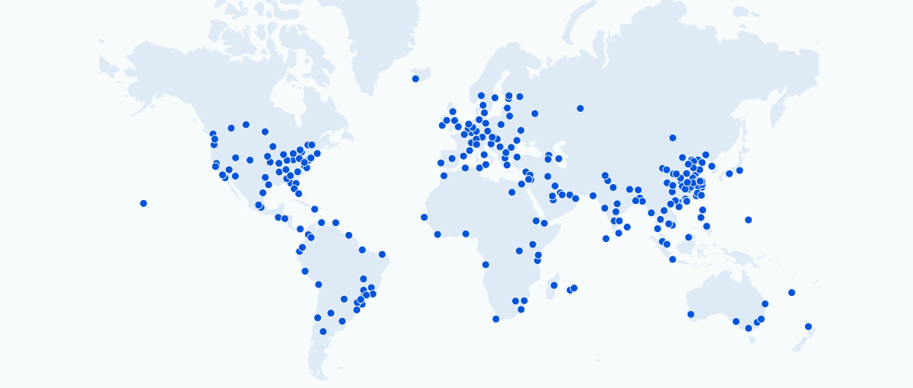

# Mon premier _framework_

{.w-100}

*[CDN]: Content Delivery Network

L'objectif ici est simplement d'installer un cadriciel (_framework_) et d'en faire usage.

[^frameworkcss]: [List of awesome CSS frameworks](https://github.com/troxler/awesome-css-frameworks)

<!--  -->

## Consignes

### Téléchargement et installation

- [ ] Téléchargez et décompressez le [dossier de départ](./exercices/digger/digger.zip), puis ouvrez `digger.html` dans votre navigateur.
- [ ] Ajoutez ces **3 lignes** dans le `<head>` de `digger.html` pour installer le framework **Milligram**&nbsp;: 
  ```html
  <link rel="stylesheet" href="https://fonts.googleapis.com/css?family=Roboto:300,300italic,700,700italic">

  <link rel="stylesheet" href="https://cdn.jsdelivr.net/npm/normalize.css@8.0.1/normalize.css">
  <link rel="stylesheet" href="https://cdn.jsdelivr.net/npm/milligram@1.4.1/dist/milligram.min.css">
  ```    
- [ ] Sauvegardez, rechargez la page et observez les changements.

!!! info "Observation"

    Les liens utilisés pour installer le framework proviennent de ce qu'on appelle un CDN.

    Un CDN, c'est un réseau d'ordinateurs situés un peu partout dans le monde qui distribuent les mêmes fichiers. Ça peut servir à tester rapidement un framework par exemple 😜 C'est pratique parce qu'on n'a pas besoin de télécharger manuellement quoi que ce soit.

    {data-zoom-image .w-50}

### Usage

Le pouvoir d'un framework CSS réside dans ses **classes CSS** préfaites. 

!!! note "Pour chaque étape, observez le résultat."

- [ ] Ajoutez la classe `container` sur le `<main>`

<!-- Ça centre le contenu de la page et limite sa largeur. -->

- [ ] Ajoutez la classe `row` à l'enfant direct de `<main>`, puis ajoutez la classe `column` aux enfants de `.row`

<!-- `row` + `column` placent les div en **colonnes** (flexbox) -->

- [ ] Ajoutez la classe `button` sur le lien `<a>`

<!-- , et `button` transforme le lien en **bouton**. -->

- [ ] Ajoutez une deuxième classe (`row-center`) à la div `row`.

 <!-- pour **centrer** les colonnes verticalement. -->

### Conclusion

Vous devriez avoir ce [résultat](./digger-result.png){download}. L'idée ici est simplement de comprendre le concept d'un Framework CSS afin d'avoir une base de comparaison pour la suite. 

Milligram spécifiquement n'est pas important à connaître. Vous pouvez d'ailleurs l'oublier pour toujours.

