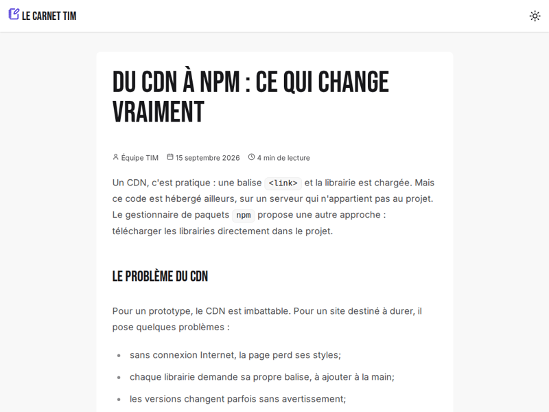
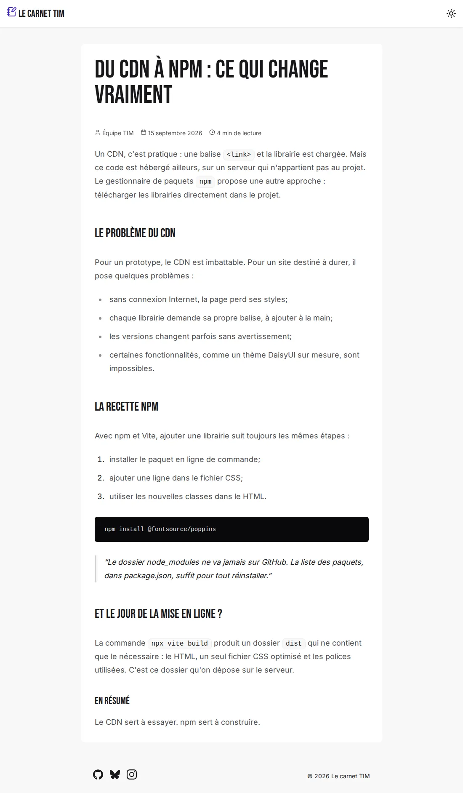
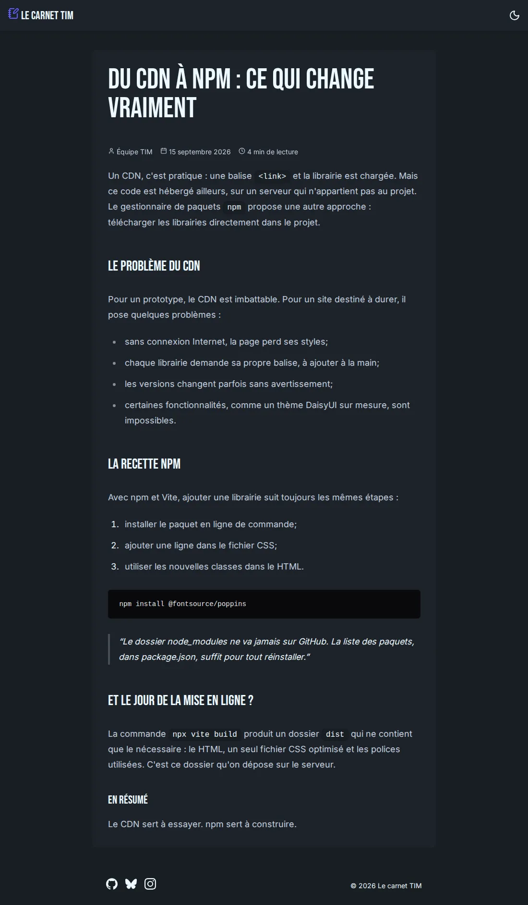

---
tags:
  - Exercice
  - npm
  - Vite
---

# Article

{.w-100}

L'objectif de cet exercice est d'installer et de configurer plusieurs paquets `npm` dans un projet Vite, **sans aucun JavaScript** : Fontsource, Iconify, Typography et Animate.css.

Le contenu de l'article est fourni. Le travail consiste uniquement à le mettre en forme.

## Résultat attendu

<figure markdown>
{.w-100 data-zoom-image}
<figcaption>Mode clair</figcaption>
</figure>

<figure markdown>
{.w-100 data-zoom-image}
<figcaption>Mode sombre</figcaption>
</figure>

## Consignes

- [ ] [Accepter le devoir Classroom 50](https://classroom50.org/tim-w3/web-3/assignments/npm-article/accept) <!-- TODO : créer le devoir à partir de article_starter.zip -->
- [ ] Cloner le répertoire avec GitHub Desktop
- [ ] Ouvrir le dossier cloné dans VSCode
- [ ] Dans le terminal, exécuter `npm install`, puis `npx vite`

---

### Thèmes

- [ ] Dans `style.css`, activer les thèmes `light` (par défaut) et `dark` (`--prefersdark`)
- [ ] Sur `<body>`, appliquer `bg-base-200`

### Polices (Fontsource)

- [ ] Choisir deux polices sur [fontsource.org](https://fontsource.org/) : une pour le texte, une pour les titres
- [ ] Les installer avec `npm install`
- [ ] Importer les graisses 400 et 700 de la police de texte
- [ ] Dans `@theme`, déclarer la police de texte dans `--font-sans` et la police de titre dans `--font-titre`

### Typographie

- [ ] Installer et activer le plugin `@tailwindcss/typography`
- [ ] Sur `<article>`, appliquer `prose prose-lg`, le centrer (`mx-auto`) et lui donner un fond `bg-base-100`, un arrondi et un espacement intérieur
- [ ] Appliquer la police de titre à tous les titres de l'article avec `prose-headings:font-titre`

### Icônes (Iconify)

- [ ] Installer `@iconify/tailwind4` et `@iconify-json/lucide`, puis activer le plugin
- [ ] Dans `<header>`, remplacer le lien par une composante `navbar` contenant :
  - [ ] Le nom du blogue précédé d'une icône Lucide
  - [ ] Un bouton clair/sombre `swap` avec les icônes `sun` et `moon`
- [ ] Dans les métadonnées de l'article, ajouter une icône devant l'auteur (`user`), la date (`calendar`) et le temps de lecture (`clock`). Utiliser `not-prose` pour que `prose` ne modifie pas cette ligne
- [ ] Installer `@iconify-json/simple-icons` et ajouter dans le pied de page trois icônes de réseaux sociaux (ex. `github`, `bluesky`, `instagram`)

### Animations (Animate.css)

- [ ] Installer et importer `animate.css`
- [ ] Animer le titre `<h1>` à son apparition
- [ ] Animer les métadonnées avec un délai d'une seconde

### Vérification

- [ ] Consulter `package.json` : tous les paquets installés y figurent
- [ ] Couper le Wi-Fi et recharger la page : les polices, les icônes et les animations fonctionnent toujours
- [ ] Faire un _commit_ et un _push_, puis vérifier que `node_modules` n'est pas sur GitHub

[STOP]
