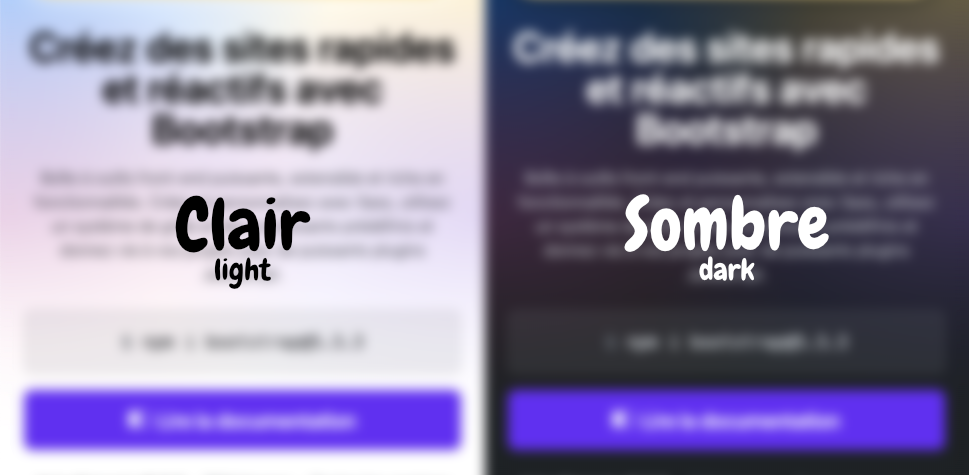

# Bootstrap


Bootstrap est un cadriciel (*framework*) front-end qui offre une structure de styles et de mise en page permettant aux développeurs de ne pas réinventer la roue à chaque projet. Il fournit une [collection de composantes](https://getbootstrap.com/docs/5.3/examples/cheatsheet/) (*components*) ainsi que plusieurs classes CSS facilitant la création de sites Web réactifs (*responsive*).

## Installation

Pour [installer Bootstrap](https://getbootstrap.com/docs/5.3/getting-started/download), vous n'avez qu'à inclure ces balises dans votre HTML.

```html
<link href="https://cdn.jsdelivr.net/npm/bootstrap@5.3.3/dist/css/bootstrap.min.css" rel="stylesheet" integrity="sha384-QWTKZyjpPEjISv5WaRU9OFeRpok6YctnYmDr5pNlyT2bRjXh0JMhjY6hW+ALEwIH" crossorigin="anonymous">

<script src="https://cdn.jsdelivr.net/npm/bootstrap@5.3.3/dist/js/bootstrap.bundle.min.js" integrity="sha384-YvpcrYf0tY3lHB60NNkmXc5s9fDVZLESaAA55NDzOxhy9GkcIdslK1eN7N6jIeHz" crossorigin="anonymous"></script>
```

!!! question "integrity & crossorigin 🤔"
    L’attribut `integrity` est utilisé pour des raisons de sécurité. C'est le hash (sommes de contrôle cryptographiques) du fichier original.
    L’attribut, `crossorigin` pour sa part, indique que la requête à cdn.jsdelivr.net doit être faite sans envoyer de témoins (cookies), identifiants ou autres informations de l’utilisateur.

Voici un aperçu du HTML de départ.

```html
<!doctype html>
<html lang="fr">
  <head>
    <meta charset="utf-8">
    <meta name="viewport" content="width=device-width, initial-scale=1">
    <title>Bootstrap</title>
    <link href="https://cdn.jsdelivr.net/npm/bootstrap@5.3.3/dist/css/bootstrap.min.css" rel="stylesheet" integrity="sha384-QWTKZyjpPEjISv5WaRU9OFeRpok6YctnYmDr5pNlyT2bRjXh0JMhjY6hW+ALEwIH" crossorigin="anonymous">
  </head>
  <body>
    <!-- Code de la page ici -->

    <script src="https://cdn.jsdelivr.net/npm/bootstrap@5.3.3/dist/js/bootstrap.bundle.min.js" integrity="sha384-YvpcrYf0tY3lHB60NNkmXc5s9fDVZLESaAA55NDzOxhy9GkcIdslK1eN7N6jIeHz" crossorigin="anonymous"></script>
  </body>
</html>
```

## Couleurs

Les [couleurs bootstrap](https://getbootstrap.com/docs/5.3/customize/color/) sont représentées par des identifiants auxquels sont assignées des couleurs prédéfinies.

Voici la liste des identifiants associés à leur couleur respective.

<iframe class="aspect-4-3" height="300" style="width: 100%;" scrolling="no" title="Couleur - Primary" src="https://codepen.io/tim-momo/embed/poXJXaO?default-tab=result&theme-id=50173" frameborder="no" loading="lazy" allowtransparency="true" allowfullscreen="true">
  See the Pen <a href="https://codepen.io/tim-momo/pen/poXJXaO">
  Couleur - Primary</a> by TIM Montmorency (<a href="https://codepen.io/tim-momo">@tim-momo</a>)
  on <a href="https://codepen.io">CodePen</a>.
</iframe>

### Variables

Ces identifiants sont utilisés dans des variables CSS, ce qui permet de personnaliser facilement les couleurs de Bootstrap.

Par exemple, si on souhaite changer la couleur associée à `Primary`, on peut tout simplement réécrire les variables concernées :


```css
:root {
  --bs-primary: #6610f2;
  --bs-primary-rgb: 102, 16, 242;
}
```

<iframe class="aspect-4-1" height="300" style="width: 100%;" scrolling="no" title="Couleurs" src="https://codepen.io/tim-momo/embed/WNqvqKJ?default-tab=result&theme-id=50173" frameborder="no" loading="lazy" allowtransparency="true" allowfullscreen="true">
  See the Pen <a href="https://codepen.io/tim-momo/pen/WNqvqKJ">
  Couleurs</a> by TIM Montmorency (<a href="https://codepen.io/tim-momo">@tim-momo</a>)
  on <a href="https://codepen.io">CodePen</a>.
</iframe>


Pour connaitre le nom des variables Bootstrap, il suffit de consulter la [documentation officielle](https://getbootstrap.com/docs/5.3/customize/css-variables/) ou encore, consulter l'inspecteur du navigateur.


### Classes

Bootstrap fournit un vaste ensemble de classes CSS prêtes à l’emploi.

Par exemple, pour appliquer différents styles associés à la couleurs `Danger`, voici quelques classes CSS disponibles.

```css
.text-danger
.bg-danger
.border-danger
.btn-danger
.btn-outline-danger
.alert-danger
.badge-danger
.table-danger
.link-danger
```

Dans l'exemple ci-dessous, on voit l'effet des classes CSS Bootstrap sur du code HTML.

<iframe class="aspect-3-2" height="300" style="width: 100%;" scrolling="no" title="Couleur - Danger" src="https://codepen.io/tim-momo/embed/MWMwYeY?default-tab=html%2Cresult&editable=true&theme-id=50173" frameborder="no" loading="lazy" allowtransparency="true" allowfullscreen="true">
  See the Pen <a href="https://codepen.io/tim-momo/pen/MWMwYeY">
  Couleur - Danger</a> by TIM Montmorency (<a href="https://codepen.io/tim-momo">@tim-momo</a>)
  on <a href="https://codepen.io">CodePen</a>.
</iframe>

!!! example "Exercice rapide"
    Change le nom des classes CSS avec différents identifiants Bootstrap.
    Par exemple, remplace les mentions `danger` par `primary` ou `warning` et observe le résultat.

### Mode sombre (darkmode)



Pour activer le mode sombre, il suffit d’ajouter l'attribut `data-bs-theme="dark"` à l'élément `<html>` ou `<body>` de votre page :

```html
<html data-bs-theme="dark">
```

Si vous voulez permettre à l'utilisateur de basculer entre les modes clair et sombre, vous pouvez utiliser JavaScript pour changer dynamiquement l'attribut data-bs-theme. Voici un exemple :

```html title="HTML"
<button id="toggleTheme"></button>
```

```js title="JavaScript"
const htmlElement = document.querySelector('html');
const toggleButton = document.getElementById('toggleTheme');

toggleButton.addEventListener('click', () => {
  if (htmlElement.getAttribute('data-bs-theme') === 'dark') {
    htmlElement.setAttribute('data-bs-theme', 'light');
  } else {
    htmlElement.setAttribute('data-bs-theme', 'dark');
  }
});
```

## Mise en page

### Point de rupture

{.invert} [^breakpoint]

[^breakpoint]: Illustration breakpoint : https://webandcrafts.com/blog/beginners-guide-to-responsive-web-design

Un [breakpoint](https://blog.froont.com/9-basic-principles-of-responsive-web-design/) est une condition où la mise en page du site Web change pour s’adapter à différentes tailles d’écran. Voici un exemple traditionnel de gestion de breakpoint :

!!! info "Responsively App Downloads"
    [Responsively App Downloads](https://responsively.app/download) est un outil intéressant pour visionner en un coup d'oeil le site sur plusiers appareils.


```scss
.col {
  width: 50%;
}

@media (max-width: 992px) { // 👈 Breakpoint
  .col {
    width: 100%;
  }
}
```

En Bootstrap, plusieurs points de rupture (breakpoints) sont prédéfinis. Portez une attention particulière à la colonne des suffixes.

| Point de rupture  | Suffixe de classe | Dimensions | CSS                               |
|-------------------|-------------------|------------|-----------------------------------|
| Extra petit       | `xs`              | `<576px`   | `@media (max-width: 575.98px) {}` |
| Petit             | `sm`              | `≥576px`   | `@media (min-width: 576px) {}`    |
| Moyen             | `md`              | `≥768px`   | `@media (min-width: 768px) {}`    |
| Large             | `lg`              | `≥992px`   | `@media (min-width: 992px) {}`    |
| Extra large       | `xl`              | `≥1200px`  | `@media (min-width: 1200px) {}`   |
| Extra extra large | `xxl`             | `≥1400px`  | `@media (min-width: 1400px) {}`   |

### Conteneurs

Un conteneur Bootstrap c'est simplement une classe CSS qu'on assigne à un `<div>` dans le but de définir sa largeur.

```html
<div class="container">
  ...
</div>
```

Les tailles des conteneurs selon les différents points de rupture de la page.

| CSS                     | sm      | md      | lg      | xl      | xxl     |
|-------------------------|---------|---------|---------|---------|---------|
| `.container`            | `540px` | `720px` | `960px` | `1140px`| `1320px`|
| `.container-sm`         | `540px` | `720px` | `960px` | `1140px`| `1320px`|
| `.container-md`         | `100%`  | `720px` | `960px` | `1140px`| `1320px`|
| `.container-lg`         | `100%`  | `100%`  | `960px` | `1140px`| `1320px`|
| `.container-xl`         | `100%`  | `100%`  | `100%`  | `1140px`| `1320px`|
| `.container-xxl`        | `100%`  | `100%`  | `100%`  | `100%`  | `1320px`|
| `.container-fluid`      | `100%`  | `100%`  | `100%`  | `100%`  | `100%`  |

#### Démo

<iframe class="aspect-16-9" height="300" style="width: 100%;" scrolling="no" title="Container" src="https://codepen.io/tim-momo/embed/YzoXmxE?default-tab=result&editable=true&theme-id=50173" frameborder="no" loading="lazy" allowtransparency="true" allowfullscreen="true">
  See the Pen <a href="https://codepen.io/tim-momo/pen/YzoXmxE">
  Container</a> by TIM Montmorency (<a href="https://codepen.io/tim-momo">@tim-momo</a>)
  on <a href="https://codepen.io">CodePen</a>.
</iframe>

### Système de grille

<iframe class="aspect-4-1" height="300" style="width: 100%;" scrolling="no" title="Grille" src="https://codepen.io/tim-momo/embed/LYKVwKQ?default-tab=result&theme-id=50173" frameborder="no" loading="lazy" allowtransparency="true" allowfullscreen="true">
  See the Pen <a href="https://codepen.io/tim-momo/pen/LYKVwKQ">
  Grille</a> by TIM Montmorency (<a href="https://codepen.io/tim-momo">@tim-momo</a>)
  on <a href="https://codepen.io">CodePen</a>.
</iframe>

Bootstrap vient avec un système de grille à 12 colonnes. Il nous permet d'ajouter facilement des colonnes sans avoir à écrire une seule ligne de CSS. Voici la syntaxe :

```html
<div class="container">
  <div class="row">
    <div class="col">Colonne 1</div>
    <div class="col">Colonne 2</div>
    <div class="col">Colonne 3</div>
    <div class="col">etc.</div>
  </div>
</div>
```

Lorsqu'on veut spécifier une taille de colonne, on doit ajuster la classe CSS `.col` et lui spécifier une proportion sur 12 colonnes. Voici un exemple :

<iframe class="aspect-16-9" height="300" style="width: 100%;" scrolling="no" title="Grille CSS" src="https://codepen.io/tim-momo/embed/wvLKwWv?default-tab=result&editable=true&theme-id=50173" frameborder="no" loading="lazy" allowtransparency="true" allowfullscreen="true">
  See the Pen <a href="https://codepen.io/tim-momo/pen/wvLKwWv">
  Grille CSS</a> by TIM Montmorency (<a href="https://codepen.io/tim-momo">@tim-momo</a>)
  on <a href="https://codepen.io">CodePen</a>.
</iframe>


On peut également utiliser les suffixes de point de rupture. Ainsi nos colonnes deviennent *responsive*!

<iframe class="aspect-16-9" height="300" style="width: 100%;" scrolling="no" title="Grille Tailles" src="https://codepen.io/tim-momo/embed/wvLKwea?default-tab=result&editable=true&theme-id=50173" frameborder="no" loading="lazy" allowtransparency="true" allowfullscreen="true">
  See the Pen <a href="https://codepen.io/tim-momo/pen/wvLKwea">
  Grille Tailles</a> by TIM Montmorency (<a href="https://codepen.io/tim-momo">@tim-momo</a>)
  on <a href="https://codepen.io">CodePen</a>.
</iframe>

## Utilitaires

### Image

La classe CSS `.img-fluid` est utilisée pour rendre les images réactives (responsive). Cette classe applique les styles nécessaires pour que l’image s’adapte automatiquement à la largeur de son conteneur, tout en conservant son ratio original.

```html

```

<iframe class="aspect-4-3" height="300" style="width: 100%;" scrolling="no" title="Form" src="https://codepen.io/tim-momo/embed/dyBYbqr?default-tab=result&theme-id=50210" frameborder="no" loading="lazy" allowtransparency="true" allowfullscreen="true">
  See the Pen <a href="https://codepen.io/tim-momo/pen/dyBYbqr">
  Form</a> by TIM Montmorency (<a href="https://codepen.io/tim-momo">@tim-momo</a>)
  on <a href="https://codepen.io">CodePen</a>.
</iframe>

### Espacement

La gestion des espacements en Bootstrap est beaucoup plus simple qu'il n'y parait. Il suffit de connaitre la syntaxe.

Les classes CSS sont construites de la façon suivante : `{propriété}{côté}-{taille}` et `{propriété}{côté}-{breakpoint}-{taille}`

<div class="grid cards" markdown>

-   **Propriété**

    ---

    `m` = margin<br>
    `p` = padding

-   **Côté**

    ---

    `t` = top<br>
    `b` = bottom<br>
    `s` = left (start)<br>
    `e` = right (end)<br>
    `x` = l'axe des x<br>
    `y` = l'axe des y

-   **Taille**

    ---

    `0` = 0<br>
    `1` = 0.25rem<br>
    `2` - 0.5rem<br>
    `3` - 1rem<br>
    `4` - 1.5rem<br>
    `5` - 3rem<br>
    `auto`

</div>

```css title="Exemples de classes d'espacement"
.m-0     .my-4     .mt-md-5
.p-1     .ps-2     .px-xxl-51
```

<iframe class="aspect-4-1" height="300" style="width: 100%;" scrolling="no" title="Image fluid" src="https://codepen.io/tim-momo/embed/jOjbNdm?default-tab=html%2Cresult&theme-id=50173" frameborder="no" loading="lazy" allowtransparency="true" allowfullscreen="true">
  See the Pen <a href="https://codepen.io/tim-momo/pen/jOjbNdm">
  Image fluid</a> by TIM Montmorency (<a href="https://codepen.io/tim-momo">@tim-momo</a>)
  on <a href="https://codepen.io">CodePen</a>.
</iframe>

### Display

Les classes CSS de type `display` sont construites de la façon suivante : `d-{affichage}` et `d-{breakpoint}-{affichage}`

<div class="grid cards" markdown>

-   **Affichage**

    ---

    `none`, `inline`, `inline-block`, `block`, `grid`, `inline-grid`, `table`, `table-cell`, `table-row`, `flex`, `inline-flex`

</div>

On utilise souvent ces classes afin de déterminer ce qui doit être affiché sur certains breakpoints.

| Taille d'écran                                              | Classe                                |
|-------------------------------------------------------------|---------------------------------------|
| :material-eye-off:{.text-danger} Caché sur tous             | `.d-none`                             |
| :material-eye-off:{.text-danger} Caché uniquement sur xs    | `.d-none` `.d-sm-block`               |
| :material-eye-off:{.text-danger} Caché uniquement sur sm    | `.d-sm-none` `.d-md-block`            |
| :material-eye-off:{.text-danger} Caché uniquement sur md    | `.d-md-none` `.d-lg-block`            |
| :material-eye-off:{.text-danger} Caché uniquement sur lg    | `.d-lg-none` `.d-xl-block`            |
| :material-eye-off:{.text-danger} Caché uniquement sur xl    | `.d-xl-none` `.d-xxl-block`           |
| :material-eye-off:{.text-danger} Caché uniquement sur xxl   | `.d-xxl-none`                         |
| :material-eye:{.text-success} Visible partout               | `.d-block`                            |
| :material-eye:{.text-success} Visible uniquement sur xs     | `.d-block` `.d-sm-none`               |
| :material-eye:{.text-success} Visible uniquement sur sm     | `.d-none` `.d-sm-block` `.d-md-none`  |
| :material-eye:{.text-success} Visible uniquement sur md     | `.d-none` `.d-md-block` `.d-lg-none`  |
| :material-eye:{.text-success} Visible uniquement sur lg     | `.d-none` `.d-lg-block` `.d-xl-none`  |
| :material-eye:{.text-success} Visible uniquement sur xl     | `.d-none` `.d-xl-block` `.d-xxl-none` |
| :material-eye:{.text-success} Visible uniquement sur xxl    | `.d-none` `.d-xxl-block`              |


<iframe  class="aspect-2-1" height="300" style="width: 100%;" scrolling="no" title="Espacements" src="https://codepen.io/tim-momo/embed/OJeyJqz?default-tab=result&editable=true&theme-id=50173" frameborder="no" loading="lazy" allowtransparency="true" allowfullscreen="true">
  See the Pen <a href="https://codepen.io/tim-momo/pen/OJeyJqz">
  Espacements</a> by TIM Montmorency (<a href="https://codepen.io/tim-momo">@tim-momo</a>)
  on <a href="https://codepen.io">CodePen</a>.
</iframe>

#### Flex

justify content
align-items

## [Formulaire](https://getbootstrap.com/docs/5.3/forms/overview/)

<iframe class="aspect-4-3" height="300" style="width: 100%;" scrolling="no" title="Form" src="https://codepen.io/tim-momo/embed/XWLmrqZ?default-tab=result&theme-id=50210" frameborder="no" loading="lazy" allowtransparency="true" allowfullscreen="true">
  See the Pen <a href="https://codepen.io/tim-momo/pen/XWLmrqZ">
  Form</a> by TIM Montmorency (<a href="https://codepen.io/tim-momo">@tim-momo</a>)
  on <a href="https://codepen.io">CodePen</a>.
</iframe>


## Composantes 🍬

### [Bouton](https://getbootstrap.com/docs/5.3/components/buttons/)

<iframe class="aspect-4-3" height="300" style="width: 100%;" scrolling="no" title="Button" src="https://codepen.io/tim-momo/embed/abgOzzm?default-tab=result&theme-id=50173" frameborder="no" loading="lazy" allowtransparency="true" allowfullscreen="true">
  See the Pen <a href="https://codepen.io/tim-momo/pen/abgOzzm">
  Button</a> by TIM Montmorency (<a href="https://codepen.io/tim-momo">@tim-momo</a>)
  on <a href="https://codepen.io">CodePen</a>.
</iframe>

```html title="Dimensions"
<button class="btn btn-primary btn-sm">Petit</button>
<button class="btn btn-primary">Normal</button>
<button class="btn btn-primary btn-lg">Large</button>
```

```html title="Style outline"
<button class="btn btn-outline-primary">Normal</button>
```

```html title="État désactivé"
<button class="btn btn-primary" disabled>Bouton</button>
```

### [Alerte](https://getbootstrap.com/docs/5.3/components/alerts/)

Nécessite javascript bootstrap d'ajouté dans la page.

Classe .alert-dismissible et
`<button type="button" class="btn-close" data-bs-dismiss="alert" aria-label="Close"></button>`

<iframe class="aspect-2-1" height="300" style="width: 100%;" scrolling="no" title="Alert" src="https://codepen.io/tim-momo/embed/GRbpgjQ?default-tab=html%2Cresult&editable=true&theme-id=50210" frameborder="no" loading="lazy" allowtransparency="true" allowfullscreen="true">
  See the Pen <a href="https://codepen.io/tim-momo/pen/GRbpgjQ">
  Alert</a> by TIM Montmorency (<a href="https://codepen.io/tim-momo">@tim-momo</a>)
  on <a href="https://codepen.io">CodePen</a>.
</iframe>

### [Modal](https://getbootstrap.com/docs/5.3/components/modal/)

<iframe class="aspect-4-3" height="300" style="width: 100%;" scrolling="no" title="Modal" src="https://codepen.io/tim-momo/embed/MWMaYoW?default-tab=result&theme-id=50210" frameborder="no" loading="lazy" allowtransparency="true" allowfullscreen="true">
  See the Pen <a href="https://codepen.io/tim-momo/pen/MWMaYoW">
  Modal</a> by TIM Montmorency (<a href="https://codepen.io/tim-momo">@tim-momo</a>)
  on <a href="https://codepen.io">CodePen</a>.
</iframe>

### [Accordéon](https://getbootstrap.com/docs/5.3/components/accordion/)

<iframe class="aspect-4-3" height="300" style="width: 100%;" scrolling="no" title="Modal" src="https://codepen.io/tim-momo/embed/bGPVNMZ?default-tab=result&theme-id=50210" frameborder="no" loading="lazy" allowtransparency="true" allowfullscreen="true">
  See the Pen <a href="https://codepen.io/tim-momo/pen/bGPVNMZ">
  Modal</a> by TIM Montmorency (<a href="https://codepen.io/tim-momo">@tim-momo</a>)
  on <a href="https://codepen.io">CodePen</a>.
</iframe>

### [Navigation](https://getbootstrap.com/docs/5.3/components/navbar/)

<iframe class="aspect-2-1" height="300" style="width: 100%;" scrolling="no" title="Navbar" src="https://codepen.io/tim-momo/embed/qBzOEMX?default-tab=result&editable=true&theme-id=50173" frameborder="no" loading="lazy" allowtransparency="true" allowfullscreen="true">
  See the Pen <a href="https://codepen.io/tim-momo/pen/qBzOEMX">
  Navbar</a> by TIM Montmorency (<a href="https://codepen.io/tim-momo">@tim-momo</a>)
  on <a href="https://codepen.io">CodePen</a>.
</iframe>