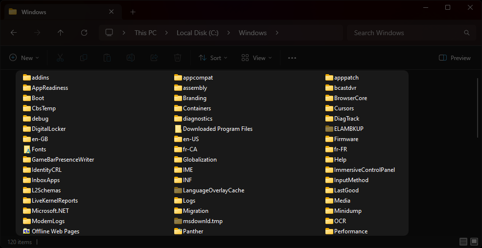

# Lignes de commandes

{ .w-100 }

La [ligne de commande](https://fr.wikipedia.org/wiki/Commandes_Unix) est un outil qui permet d’interagir avec un ordinateur en tapant des commandes textuelles.

On écris des lignes de commandes dans un CLI, aussi appelé « Terminal ».

*[CLI] : Command-Line Interface


Contrairement à une interface graphique (GUI) où vous cliquez sur des boutons, ici, vous tapez directement ce que vous voulez faire.

*[GUI] : Graphical User Interface

Les lignes de commande sont très utile en développement web et pour configurer les serveurs, entre autres.

!!! info "Bon à savoir"

    * En ligne de commande, lorsqu'on voit `.` ou `./`, cela signifie le répertoire courant.
    * Lorsqu'on voit `..` ou `../`, ça signifie le répertoire parent.
    * On peut utiliser la touche ++tab++ pour compléter une ligne de commande.

## Où se trouve le terminal ?

* En **Windows**, utilisez l'application **PowerShell[^powershell]** plutôt que command prompt.
* En **macOS**, utilisez l'application **Terminal[^terminal_osx]**.
* En **Linux**, utilisez l'application **Terminal[^terminal_unix]**.

[^powershell]: [https://learn.microsoft.com/fr-ca/training/modules/introduction-to-powershell/](https://learn.microsoft.com/fr-ca/training/modules/introduction-to-powershell/)
[^terminal_osx]: [https://support.apple.com/fr-ca/guide/terminal/welcome/mac](https://support.apple.com/fr-ca/guide/terminal/welcome/mac)
[^terminal_unix]: [https://ubuntu.com/tutorials/command-line-for-beginners](https://ubuntu.com/tutorials/command-line-for-beginners) (en anglais)

## Position

Affichager l'emplacement avec « pwd »

*[pwd]: Acronyme pour « Print Working Directory » en anglais

=== "Windows"

    

=== "Ligne de commande"

    ```powershell
    pwd

    # Résultat : C:\Windows
    ```

## Navigation

### Liste

Lister des fichiers et dossiers avec « ls »

*[ls]: Diminutif du mot « list » en anglais

=== "Windows"

    

=== "Ligne de commande"

    ```powershell
    ls
    ```

### Déplacement

Changer de répertoire avec « cd »

*[cd]: Acronyme pour « Change Directory » en anglais

=== "Windows"

    

=== "Ligne de commande"

    ```powershell
    cd nom_du_dossier
    ```

    ```powershell
    cd ./nom_du_dossier # identique à la commande précédente
    ```

    ```powershell
    cd .. # Se déplace au répertoire parent
    ```

## Fichiers

### Création

Créer un fichier avec « touch »

=== "Windows"

    

=== "Ligne de commande"

    ```bash
    touch nom_du_fichier.txt
    ```

### Lecture

Lire le contenu d'un fichier avec « cat »

*[cat]: Diminutif du mot « concatenate » en anglais

=== "Windows"

    

=== "Ligne de commande"

    ```powershell
    cat nom_du_fichier.txt
    ```

### Écriture

Écrire dans un fichier avec « echo »

```powershell
echo "Texte à ajouter" >> nom_du_fichier.txt
echo "Texte en deuxième ligne" >> nom_du_fichier.txt
echo "Texte en troisième ligne!" >> nom_du_fichier.txt
```

```powershell
echo "Finalement, remplace tout par ceci" > nom_du_fichier.txt
```

### Déplacement

Déplacer, ou renommer!!, un fichier avec « mv »

*[mv]: Diminutif du mot « move » en anglais

```powershell
mv nom_du_fichier.txt nouveau_nom.txt
```

```powershell
mv nom_du_fichier.txt assets/nom_du_fichier.txt
```

### Suppression

Supprimer un fichier ou un répertoire avec « rm »

=== "Windows"

    

=== "Ligne de commande"

    ```powershell
    rm nom_du_fichier.txt
    ```

## Dossiers

### Création

Créer un fichier avec « mkdir »

*[mkdir]: Diminutif des mots « make » et « directory » en anglais

=== "Windows"

    

=== "Ligne de commande"

    ```powershell
    mkdir nom_du_dossier
    ```

### Supprimer un dossier

Supprimer un dossier avec « rm -r ». L’option `-r` signifie récursif (recursive en anglais), ce qui permet de supprimer tout les contenus d'un dossier.

*[rm]: Diminutif du mot « remove »  en anglais

=== "Windows"

    

=== "Ligne de commande"

    ```powershell
    rm -r nom_du_dossier
    ```

<div class="grid grid-1-2" markdown>
  

  <small>Exercice - CLI</small><br>
  **[Mandala](./exercices/cli-mandala.md){.stretched-link}**
</div>