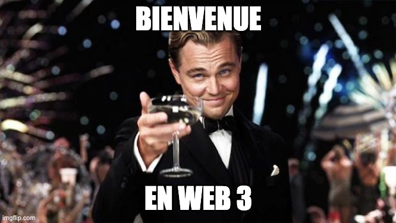
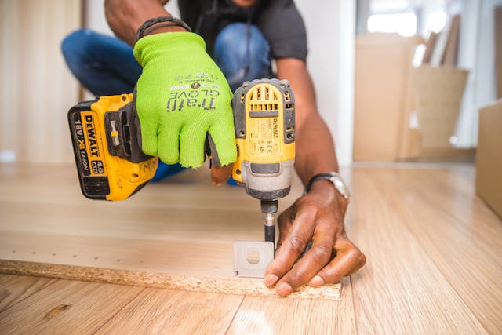

# Cours 1 |   Bienvenue

<style>
  nav.md-nav--secondary > ul > li > nav > ul > li > nav {
    display: none;
  }
</style>

{.w-100}

## Introduction 

<div class="grid gap-lg" markdown>


🤝 Présentations<br>
📙 Plan de cours<br>
📱 Téléphones<br>
🤖 Intelligence artificielle
</div>

## Révision - Web 2 (582 211 MO)

**HTML**

* Formulaire : [1](https://tim-montmorency.com/timdoc/582-211MO/html/formulaire/), [2](https://tim-montmorency.com/timdoc/582-211MO/html/formulaire-intermediaire/), [3](https://tim-montmorency.com/timdoc/582-211MO/html/formulaire-avance/)
* Images : [img](https://tim-montmorency.com/timdoc/582-211MO/html/image/) et [picture](https://tim-montmorency.com/timdoc/582-211MO/html/picture/)
* [Favicon](https://tim-montmorency.com/timdoc/582-211MO/html/favicon/)
* [SVG](https://tim-montmorency.com/timdoc/582-211MO/html/svg/)

**CSS**

* Espacements : [margin](https://tim-montmorency.com/timdoc/582-211MO/css/margin/) et [padding](https://tim-montmorency.com/timdoc/582-211MO/css/padding/)
* [Display](https://tim-montmorency.com/timdoc/582-211MO/css/display/)
* [Position](https://tim-montmorency.com/timdoc/582-211MO/css/position/)
* [Media Queries](https://tim-montmorency.com/timdoc/582-211MO/css/media-queries/)
* [Sélecteurs](https://tim-montmorency.com/timdoc/582-211MO/css/selecteurs-avances/)
* [Aspect-ratio](https://tim-montmorency.com/timdoc/582-211MO/css/aspect-ratio/)
* [Flexbox 1](https://tim-montmorency.com/timdoc/582-211MO/css/flexbox/)
* [Flexbox 2](https://tim-montmorency.com/timdoc/582-211MO/css/flexbox-intermediaire/)
* [Flexbox 3](https://tim-montmorency.com/timdoc/582-211MO/css/flexbox-avance/)

## Révision - Programmation interactive (420 V11 MO)

<https://discovro-js.netlify.app/>

## Révision - JavaScript


### La base

```js title="Commentaires"
// Ceci est un commentaire sur une seule ligne

/*
Ceci est un commentaire
sur plusieurs lignes
*/
```

```js title="Message"
console.log("Wubba Lubba Dub Dub!");
```

```js title="Message d’alerte"
alert("Wubba Lubba Dub Dub!");
```

### Variables

```js title="Types de variables"
let name = 'JF';
const age = 99;
var isStudent = false;
```

```js title="Valeurs"
let num = 10;        // Nombre entier (number)
let pi = 3.14;       // Nombre à virgule (number)
let str = 'Salut !'; // Chaine de caractères (string)
let isTrue = true;   // Booléen (boolean)
let empty = null;    // Nul (null)
let notDefined;      // Non défini (undefined)
let arr = [];        // Tableau (array)
let obj = {};        // Objet (object)
let fn = () => {}    // Fonction (function)
```

### Opérateurs

```js
let sum = 10 + 5;
let difference = 10 - 5;
let product = 10 * 5;
let quotient = 10 / 5;
```

!!! tip "L’opérateur modulo"
    L’opérateur modulo `%` en JavaScript renvoie le reste de la division entière de deux nombres.
    ```js
    let modulo = 10 % 3;
    ```

```js
let isEqual = 5 == '5';
let isStrictEqual = 5 === '5';

let isNotEqual = 5 != '5';
let isStrictNotEqual = 5 !== '5';

let isGreater = 10 > 5;
let isLess = 10 < 5;
let isGreaterOrEqual = 10 >= 5;
let isLessOrEqual = 10 <= 5;
```

```js
let andOperator = true && false;
let orOperator = true || false;
let notOperator = !true;
```

### Conditions :material-directions-fork: 

```js
let score = 85;
let grade = 'Échec';

if (score >= 90) {
  grade = 'A';
} else if (score >= 80) {
  grade = 'B';
}

console.log(score);
```

!!! tip "Opérateur ternaire"
    ```js
    let grade = (score >= 90) ? 'A' : (score >= 80) ? 'B' : 'Échec';
    ```

### Tableaux et objets :material-table: 

```js
let fruits = ['Pomme', 'Banane', 'Cerise'];
console.log(fruits[1]);
```

```js
let person = {
  name: 'JF',
  age: 99,
  isStudent: false
};
console.log(person.name);
```

### Boucles :material-repeat: 

```js title="for"
for (let i = 0; i < 5; i++) {
  console.log(i + ' 🦄');
}
```

```js title="for...in"
let person = {name: 'JF', age: 99, city: 'Laval'};
for (let key in person) {
  console.log(key + ' : ' + person[key]);
}
```

```js title="for...of"
let parts = ['👁️', '👃', '👄'];
for (let part of parts) {
  console.log(part);
}
```

```js title="forEach"
let numbers = ['JF', 99, '🌱', true];
numbers.forEach(function(number) {
  console.log(number);
});
```

### Fonctions :material-function: 

```js title="Fonction"
function greet(name) {
  return 'Coucou ' + name + ' !';
}
```

```js title="« Variable fonction »"
const greet = function(name) {
  return 'Coucou ' + name + ' !';
};
```

```js title="Fonction fléchée"
const greet = (name) => {
  return 'Coucou ' + name + ' !';
};
```

### Manipulation du DOM :material-code-tags:{ .mdx-pulse }

```js
let element = document.getElementById('demo');
let element2 = document.querySelector('.demo');
let elements = document.querySelectorAll('p');
let elements2 = document.getElementsByClassName("demo");
```

```js title="Classes"
element.classList.add('new-class');
element.classList.remove('old-class');
element.classList.toggle('active');
```

```js
element.innerHTML = 'JavaScript 🙌';
element.style.color = '#ABCDEF';
element.setAttribute('title', 'Petit tooltip pour ton info');
let titleAttribute = element.getAttribute('title');
element.removeAttribute('title');
```

### Les événements :material-cursor-default-click: 

```html
<button id="miaw">Oui?</button>
```

```js
document.getElementById('miaw').addEventListener('click', function() {
  console.log('J’ai dis non!');
});
document.getElementById('miaw').addEventListener('mouseover', function() {
  console.log('Vous avez survolé le bouton!');
});
```

```html
<input type="text" id="champ" placeholder="Tapez quelque chose">
```

```js
document.getElementById('champ').addEventListener('focus', function() {
  console.log('Champ de saisie en focus');
});
document.getElementById('champ').addEventListener('blur', function() {
  console.log('Champ de saisie hors focus');
});
document.getElementById('champ').addEventListener('keyup', function(event) {
  console.log('Vous avez tapé : ' + event.target.value);
});
document.getElementById('champ').addEventListener('change', function(event) {
  console.log('La valeur a changé : ' + event.target.value);
});
```

[Liste d’événements du DOM](https://www.w3schools.com/jsref/dom_obj_event.asp)

### Sauvegarde :material-content-save: 

```js title="LocalStorage"
localStorage.setItem("lastname", "Tremblay");
localStorage.getItem("lastname");
```

!!! info "Limite de stockage"
    La capacité maximale de stockage est d'environ 5 MB par domaine.

```js title="SessionStorage"
// Pour l'onglet
sessionStorage.setItem("lastname", "Gagnon");
sessionStorage.getItem("lastname");
```

### Mathématiques :scientist:

```js
Math.sqrt(81);
Math.random();
Math.max(1, 3);
Math.min(1, 3);
Math.floor(1.5);
Math.round(1.5);
Math.ceil(1.5);
```

### Audio & Vidéo

```html
<audio id="mozart" controls muted>
  <source src="mozart.mp3" type="audio/mp3">
  Votre navigateur ne supporte pas l'élément audio.
</audio>

<video id="loop" width="320" height="240" controls muted>
  <source src="loop.mp4" type="video/mp4">
  Votre navigateur ne supporte pas l'élément vidéo.
</video>
```

```js
let audio = document.getElementById('mozart');
audio.play();
audio.pause();
audio.playbackRate = 1.5; // 1.5x la vitesse normale
audio.currentTime = 10; // Saute à 10 secondes

let video = document.getElementById('loop');
video.play();
video.pause();
video.playbackRate = 0.5;
video.currentTime = 0;
```

!!! warning "Lecture automatique"
    Les navigateurs imposent des restrictions sur la lecture automatique (*autoplay*) des médias en raison de préoccupations concernant l’expérience utilisateur et la consommation de données.

    L'utilisateur doit **interagir** avec la page pour déclencher une lecture.

### Aide-mémoire

<https://jfcmontmorency.github.io/aide-memoire/>

### Exercice de révision

<div class="grid grid-1-2" markdown>
  

  <small>Exercice - JavaScript</small><br>
  **[Camp d'entrainement](./exercices/js-bootcamp.md){.stretched-link .back}**
</div>

<div class="grid grid-1-2" markdown>
  

  <small>Exercice - JavaScript</small><br>
  **[La guerre de 100 ans](./exercices/100ans/index.md){.stretched-link .back}**
</div>

## this 🤯

`this` fait référence au contexte dans lequel la fonction est exécutée

```html
<button id="submit">Télécharger</button>
```

```js
document.getElementById('submit').addEventListener('click', function() {
  // Ici, "this" représente le bouton cliqué
  this.style.backgroundColor = 'lightblue';
  this.innerHTML = 'En cours';
});
```

## Introduction aux classes JavaScript

Une classe en JavaScript, c’est un concept qui permet de structurer le code et de réutiliser la même logique plusieurs fois.

### Pourquoi on utiliserait ça ?

Imaginez que vous voulez programmer une page Web dans laquelle des poissons nagent indépendamment.

Vous pourriez commencer par écrire le code d’un premier poisson… puis copier-coller ce code pour en avoir un deuxième, un troisième, et ainsi de suite. Rapidement, ça devient lourd à maintenir.

C’est là que les classes sont utiles :

- On définit une seule fois une classe Poisson.
- Chaque nouveau poisson créé dans la page utilisera le même code.
- Peu importe si vous ajoutez 3 poissons ou 1 000 000, ils partageront tous la même logique.

### Comment ça fonctionne ?

```js
class Poisson {
  constructor(nom, couleur) {
    this.nom = nom;
    this.couleur = couleur;
  }

  nager() {
    console.log(`${this.nom} (${this.couleur}) nage joyeusement.`);
  }
}

// On crée plusieurs poissons à partir de la même classe
const poisson1 = new Poisson("Nemo", "orange");
const poisson2 = new Poisson("Dory", "bleu");
const poisson3 = new Poisson("Sharky", "gris");

// Ils utilisent tous le même code défini dans la classe
poisson1.nager(); // Résultat : Nemo (orange) nage joyeusement
poisson2.nager(); // Résultat : Dory (bleu) nage joyeusement
poisson3.nager(); // Résultat : Sharky (gris) nage joyeusement
```

## Librairies et cadriciels

L'objectif de Web 3 est d'apprendre à utiliser des **librairies** et des **cadriciels** dans divers projets.

Ces deux concepts désignent tout simplement du code qui permettent de programmer plus rapidement⚡️ ! Toutefois, une distinction importante est à faire entre les deux.

<div class="grid align-items-top" markdown>
<div markdown>
### :tools: Librairie (_library_)



Un ensemble de fonctions / méthodes prêtes à l’emploi que tu peux utiliser pour réaliser une tâche précise.

> Une librairie est comme un **outil dans une boîte** : tu le prends quand t'en as besoin.

* **[Anime.js](https://animejs.com/)** : animations
* **[Chart.js](https://www.chartjs.org/)** : graphiques
* **[Leaflet.js](https://leafletjs.com/)** : cartes
* **[Zdog](https://zzz.dog/)** : illustrations
* **[Tone.js](https://tonejs.github.io/)** : synthèse sonore
</div>

<div markdown>
### :construction_site: Cadriciel (_framework_)


Une structure complète qui dicte la façon dont tu organises et construis ton projet Web.

> Un _framework_ est comme un **échafaudage** : tu construis ton site à l’intérieur de sa structure.

* **[Bootstrap](https://getbootstrap.com/)** : structure et composantes
* **[Tailwind](https://tailwindcss.com/)** : utilitaires CSS
</div>
</div>
