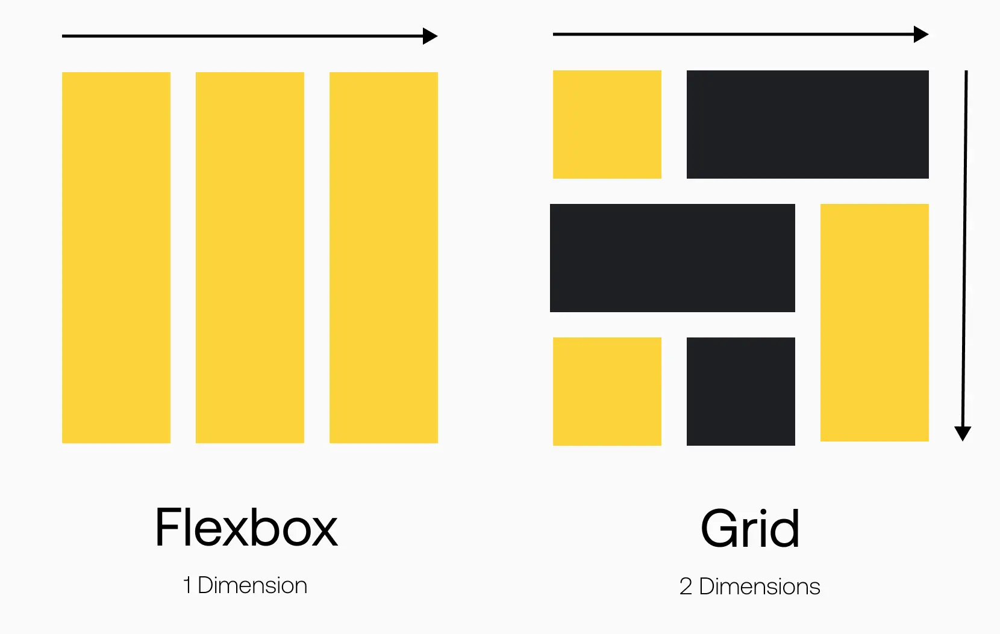
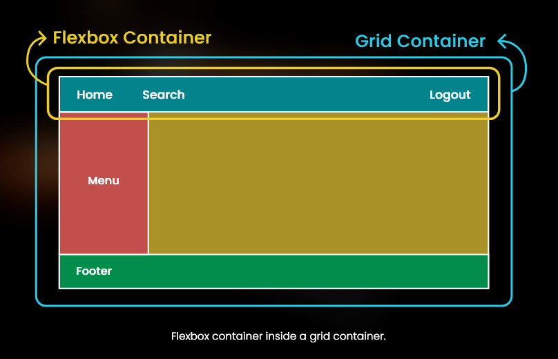
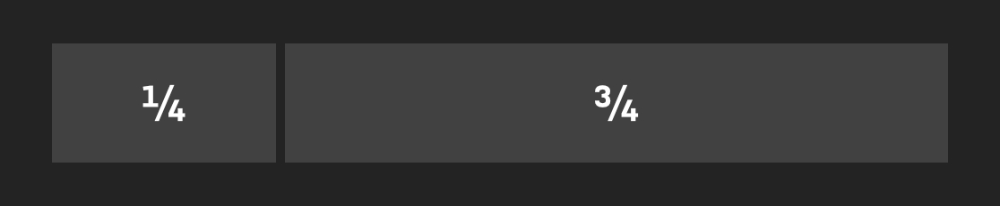
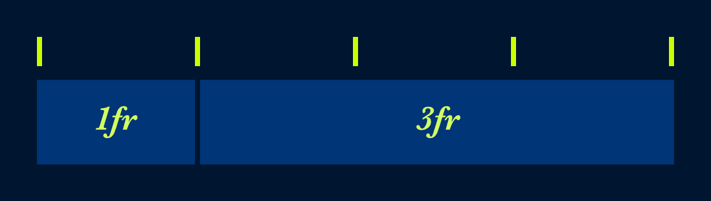
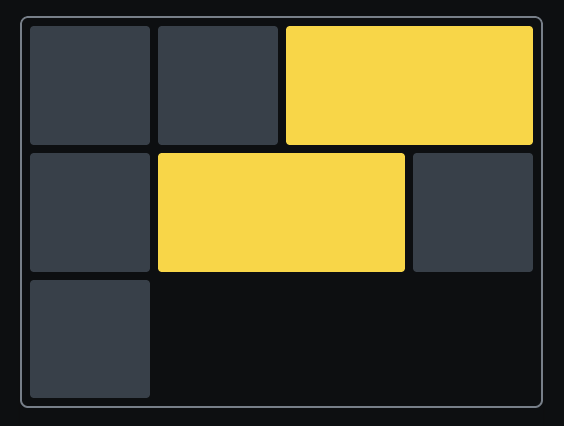
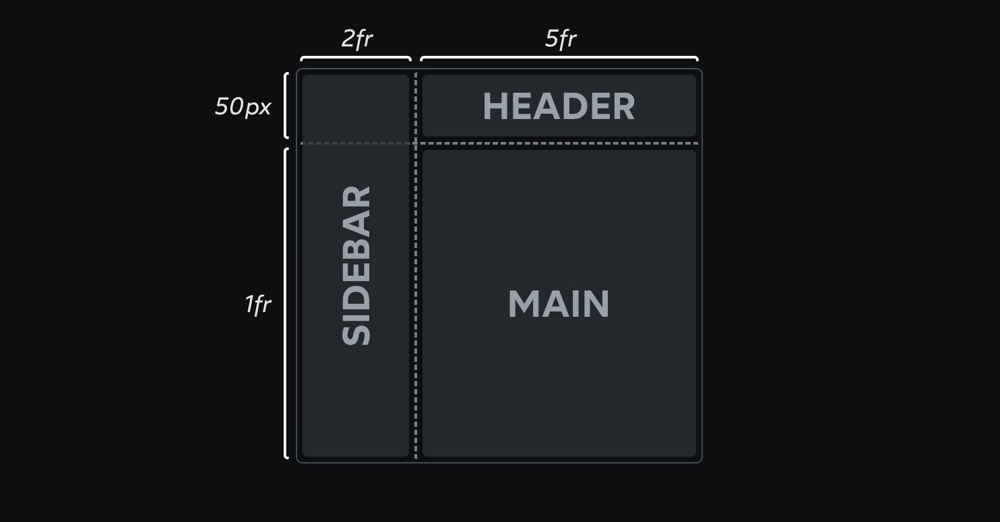
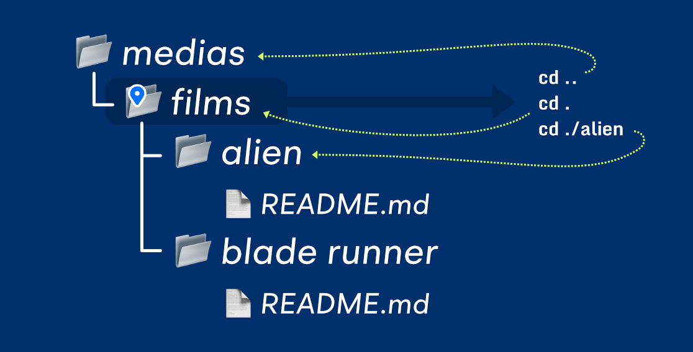

# Cours 1

*[CLI]: Command-Line Interface
*[pwd]: Print Working Directory
*[ls]: List
*[cd]: Change Directory
*[WSL]: Windows Subsystem for Linux
*[QoL]: Quality of Life
*[mkdir]: Make Directory
*[cat]: Concatenate
*[mv]: Move
*[cp]: Copy
*[rm]: Remove
 
<style>
  nav.md-nav--secondary > ul > li > nav > ul > li > nav {
    display: none;
  }
</style>

{.w-100}

## Introduction

Fini le développement Web rudimentaire qui consistait à coder tout manuellement. Cette session, on introduit des standards de l'industrie pour passer en mode professionnel. Nous apprendrons à&nbsp;: 

<div class="grid grid-1-4" markdown>
  {.aspect-4-3 .w-100}

  :octicons-terminal-16: Utiliser les lignes de commande (CLI)
</div> 

<div class="grid grid-1-4" markdown>
  {.aspect-4-3 .w-100}

  :material-robot: Automatiser le développement Web avec des composantes.
</div>

<div class="grid grid-1-4" markdown>
  {.aspect-4-3 .w-100}

  :material-cursor-default-click: Confectionner des interfaces animées et interactives
</div>

<!-- <div class="grid grid-1-4" markdown>
  {.aspect-4-3 .w-100}

  :material-server-network-outline: Mettre en ligne un site Web (_from scratch_)
</div> -->

## _Yet another_ intro sur l'intelligence artificielle 😅
    
En 2026, l'intelligence artificielle est indissociable du développement Web. Le _vibe coding_ devient plus populaire que jamais.

En fait, la programmation en chat n'est même plus tant utilisée. On est plus à l'ère des agents autonomes qui codent et exécutent des vagues d'actions complexes pour nous. On pense notamment à [Github Copilot](https://github.com/features/copilot/plans?locale=fr-fr), [Codex](https://openai.com/fr-FR/codex/) d'OpenAI ou [Claude Code](https://claude.com/fr/product/claude-code) d'Anthropic.

{data-zoom-image}
  
Ces modèles reposent sur l'usage de tokens et d'une large fenêtre de contexte. Plus il y a de contexte, plus l'IA « comprend » l'application globale. 

### C'est génial, non ?

Ouais. On sait que ça favorise la paresse intellectuelle, et alors ? Tant pis, tout le monde le fait 🤷

Partons de là, mais essayons de développer des compétences en chemin tout de même. 

Ça passe par l'attitude. On pourrait le voir de 2 manières. Soit on utilise l'IA comme : 

- tremplin pour accomplir en se développant (active le processus cognitif pour comprendre)
- raccourci pour accomplir en se débarrassant (sans exploiter le processus cognitif) 

[Github Copilot Educationnel](https://docs.github.com/fr/copilot/how-tos/copilot-on-github/set-up-copilot/enable-copilot/set-up-for-students)

## CSS Grid

{.w-100}

En Web 2, vous avez vu Flexbox. Il reste une dernière petite notion pour avoir fait le tour de la mise en page en CSS&nbsp;: le `display: grid;`.

Le [système de grille](https://css-tricks.com/complete-guide-css-grid-layout/)[^josh] permet d'organiser une page Web en lignes et colonnes, un peu comme un tableau invisible sur lequel on place des éléments.

[^josh]: [An Interactive Guide to CSS Grid](https://www.joshwcomeau.com/css/interactive-guide-to-grid/)

### `flexbox` vs. `grid`

<div class="grid" markdown>
{data-zoom-image}

{data-zoom-image}
</div>

**Usages de `flexbox`** : Une barre de navigation, une rangée de boutons, un groupe d'étiquettes<br>
**Usages de `grid`** : Le squelette d'une page, une galerie, un tableau de bord, tableau responsive.

### Activer Grid

Par défaut, une grille crée **une seule colonne** et **autant de rangées qu'il y a d'enfants**.

```html title="HTML"
<div class="grille">
  <div>E1</div>
  <div>E2</div>
  <div>E3</div>
  ...
</div>
```

<div class="gf-demo" data-gf>
  <div class="gf-panel">
    <p class="gf-title">Hauteur non spécifiée (automatique)</p>
    <div class="gf-code">.grille {
  display: grid;
}</div>
    <label class="gf-control"><span>Nombre d'enfants&nbsp;: <b class="gf-count">3</b></span><input type="range" min="1" max="5" value="3"></label>
  </div>
  <div class="gf-stage">
    <div class="gf-scene"><div class="gf-grid"></div></div>
    <label class="gf-check"><input type="checkbox" checked> Voir en perspective</label>
  </div>
</div>

<div class="gf-demo" data-gf data-fixed>
  <div class="gf-panel">
    <p class="gf-title">Hauteur spécifiée</p>
    <div class="gf-code">.grille {
  display: grid;
  height: 260px;
}</div>
    <label class="gf-control"><span>Nombre d'enfants&nbsp;: <b class="gf-count">3</b></span><input type="range" min="1" max="5" value="3"></label>
  </div>
  <div class="gf-stage">
    <div class="gf-scene"><div class="gf-grid"></div></div>
    <label class="gf-check"><input type="checkbox" checked> Voir en perspective</label>
  </div>
</div>

<style>
  .gf-demo {
    display: grid;
    grid-template-columns: minmax(300px, 360px) 1fr;
    gap: 1rem;
    margin: 1rem 0 1.5rem;
    padding: 1rem;
    border: 1px solid var(--md-default-fg-color--lightest, #ddd);
    border-radius: 8px;
  }
  @media screen and (max-width: 44.9em) {
    .gf-demo { grid-template-columns: 1fr; }
  }
  .gf-demo .gf-title {
    margin: 0 0 .6rem;
    font-size: .72rem;
    font-weight: 700;
    letter-spacing: .05em;
    text-transform: uppercase;
    opacity: .7;
  }
  .gf-demo .gf-control {
    margin-top: .7rem;
    display: block;
    font-family: var(--md-code-font-family, monospace);
    font-size: .7rem;
  }
  .gf-demo .gf-control > span { display: block; margin-bottom: .2rem; }
  .gf-demo input[type="range"] { width: 100%; }
  .gf-demo .gf-check {
    display: flex;
    margin-top: .7rem;
    gap: .4rem;
    align-items: center;
    font-family: var(--md-code-font-family, monospace);
    font-size: .7rem;
    cursor: pointer;
  }
  .gf-demo .gf-code {
    margin: .7rem 0 0;
    padding: .55rem .7rem;
    font-family: var(--md-code-font-family, monospace);
    font-size: .68rem;
    white-space: pre;
    background: var(--md-code-bg-color, #f5f5f5);
    border-radius: 4px;
  }

  .gf-demo .gf-stage {
    display: grid;
    min-height: 280px;
    padding: 20px;
    perspective: 900px;
    place-items: center;
  }
  .gf-demo .gf-scene {
    width: min(100%, 300px);
    transform-style: preserve-3d;
    transition: transform .55s ease;
  }
  .gf-demo.gf-3d .gf-scene { transform: rotateX(15deg) rotateY(-25deg) scale(.825); }
  .gf-demo .gf-grid {
    box-sizing: border-box;
    display: grid;
    gap: 1px;
    width: 100%;
    padding: 8px;
    background: var(--md-code-bg-color, #f5f5f5);
    border: 2px dashed var(--md-default-fg-color--light, #999);
    border-radius: 6px;
    transform-style: preserve-3d;
  }
  .gf-demo[data-fixed] .gf-grid { height: 260px; }
  .gf-demo .gf-cell {
    border: 1px dashed var(--md-default-fg-color--lighter, #bbb);
    border-radius: 4px;
  }
  .gf-demo .gf-item {
    display: grid;
    padding: .6rem;
    font: 700 .75rem var(--md-code-font-family, monospace);
    color: #0b1a2b;
    background: #8fb8e0;
    border-radius: 4px;
    place-items: center;
    transition: transform .55s ease;
  }
  .gf-demo.gf-3d .gf-item { transform: translateZ(32px); }

  .ga-hint {
    margin: .6rem 0 0;
    font-size: .72rem;
    line-height: 1.4;
    opacity: .75;
  }
  .ga-grid {
    position: relative;
    box-sizing: border-box;
    display: grid;
    grid-template-columns: repeat(var(--ga-cols), 1fr);
    grid-template-rows: repeat(var(--ga-rows), 46px);
    gap: 6px;
    width: 100%;
    max-width: 420px;
    padding: 8px;
    background: var(--md-code-bg-color, #f5f5f5);
    border: 2px dashed var(--md-default-fg-color--light, #999);
    border-radius: 6px;
    user-select: none;
    touch-action: none;
    cursor: crosshair;
  }
  .ga-grid .ga-cell {
    border: 1px dashed var(--md-default-fg-color--lighter, #bbb);
    border-radius: 4px;
  }
  .ga-grid .ga-cell.ga-hover {
    background: rgba(143, 184, 224, .35);
  }
  .ga-grid .ga-item {
    display: grid;
    place-items: center;
    font: 700 .78rem/1 var(--md-code-font-family, monospace);
    color: #0b1a2b;
    background: #8fb8e0;
    border-radius: 4px;
    pointer-events: none;
  }

  .ga-wrap {
    position: relative;
    width: 100%;
    max-width: 420px;
    padding: 18px 0 0 20px;
  }
  .ga-colnums, .ga-rownums {
    position: absolute;
    display: grid;
    pointer-events: none;
    transition: opacity .15s ease;
    font: 700 .62rem/1 var(--md-code-font-family, monospace);
    color: var(--md-default-fg-color--light, #888);
  }
  .ga-colnums {
    top: 10px;
    z-index: 10;
    left: 21px;
    right: 0;
    height: 18px;
    grid-template-columns: repeat(var(--ga-cols), 1fr);
    column-gap: 6px;
    padding: 0 10px;
  }
  .ga-rownums {
    top: 19px;
    z-index: 10;
    left: 10px;
    bottom: 0;
    width: 20px;
    grid-template-rows: repeat(var(--ga-rows), 46px);
    row-gap: 6px;
    padding: 10px 0;
  }
  .ga-numtoggle-off .ga-colnums,
  .ga-numtoggle-off .ga-rownums {
    opacity: 0;
  }
  .ga-numcell {
    position: relative;
  }
  .ga-linenum {
    position: absolute;
    display: flex;
    align-items: center;
    gap: 2px;
  }
  .ga-colnums .ga-linenum {
    left: 0;
    bottom: 0;
    flex-direction: column;
    transform: translateX(-50%);
  }
  .ga-colnums .ga-linenum-end {
    left: calc(100% - 1px);
  }
  .ga-rownums .ga-linenum {
    top: 0;
    right: 0;
    flex-direction: row;
    transform: translateY(-50%);
  }
  .ga-rownums .ga-linenum-end {
    top: calc(100% - 1px);
  }
  .ga-linenum .ga-tick {
    background: var(--md-default-fg-color--light, #999);
  }
  .ga-colnums .ga-linenum .ga-tick { width: 1px; height: 20px; }
  .ga-rownums .ga-linenum .ga-tick { width: 20px; height: 1px; }

  .gta-preview {
    display: grid;
    grid-template-columns: 2fr 5fr;
    grid-template-rows: 50px 1fr;
    grid-template-areas:
      "sidebar header"
      "sidebar main";
    gap: 6px;
    width: 100%;
    max-width: 340px;
    min-height: 200px;
    padding: 8px;
    background: var(--md-code-bg-color, #f5f5f5);
    border: 2px dashed var(--md-default-fg-color--light, #999);
    border-radius: 6px;
  }
  .gta-preview .gta-area {
    position: relative;
    display: grid;
    place-items: center;
    font: 700 .78rem/1 var(--md-code-font-family, monospace);
    border: 1px dashed var(--md-default-fg-color--lighter, #bbb);
    border-radius: 4px;
    cursor: pointer;
  }
  .gta-preview .gta-area.gta-active {
    color: #0b1a2b;
    background: #8fb8e0;
    border-color: transparent;
  }
  .gta-preview .gta-area .gta-child-badge {
    display: none;
    position: absolute;
    right: 6px;
    bottom: 4px;
    font-size: .6rem;
  }
  .gta-preview .gta-area.gta-active .gta-child-badge {
    display: block;
  }
</style>

<script>
  (function () {
    function buildGap(root) {
      if (root.dataset.ready) return;
      root.dataset.ready = "1";

      var grid = root.querySelector(".gf-grid");
      var persp = root.querySelector("input[type=checkbox]");
      var colSlider = root.querySelector(".gf-colgap-slider");
      var rowSlider = root.querySelector(".gf-rowgap-slider");
      var colOut = root.querySelector(".gf-colgap");
      var rowOut = root.querySelector(".gf-rowgap");
      var code = root.querySelector(".gf-code");

      grid.style.gridTemplateColumns = "1fr 1fr";
      grid.style.gridTemplateRows = "1fr 1fr";

      function render() {
        var colGap = Number(colSlider.value);
        var rowGap = Number(rowSlider.value);
        colOut.textContent = colGap;
        rowOut.textContent = rowGap;
        root.classList.toggle("gf-3d", persp.checked);

        grid.style.columnGap = colGap + "px";
        grid.style.rowGap = rowGap + "px";
        code.textContent = ".grille {\n  column-gap: " + colGap + "px;\n  row-gap: " + rowGap + "px;\n}";

        var html = "";
        for (var r = 1; r <= 2; r++) {
          for (var c = 1; c <= 2; c++) {
            html += '<div class="gf-cell" style="grid-row:' + r + ';grid-column:' + c + '"></div>';
          }
        }
        for (var j = 1; j <= 4; j++) {
          var col = ((j - 1) % 2) + 1;
          var row = Math.floor((j - 1) / 2) + 1;
          html += '<div class="gf-item" style="grid-row:' + row + ';grid-column:' + col + '">E' + j + '</div>';
        }
        grid.innerHTML = html;
      }

      colSlider.addEventListener("input", render);
      rowSlider.addEventListener("input", render);
      persp.addEventListener("change", render);
      render();
    }

    function build(root) {
      if (root.dataset.gfGap !== undefined) {
        buildGap(root);
        return;
      }
      if (root.dataset.ready) return;
      root.dataset.ready = "3";

      var grid = root.querySelector(".gf-grid");
      var slider = root.querySelector("input[type=range]");
      var persp = root.querySelector("input[type=checkbox]");
      var count = root.querySelector(".gf-count");

      function render() {
        var n = Number(slider.value);
        count.textContent = n;
        root.classList.toggle("gf-3d", persp.checked);

        var cols = root.dataset.gfColumns;
        var rows = root.dataset.gfRows;
        var numCols, numRows;

        if (rows) {
          // Pas de grid-template-columns : la grille reste sur 1 seule
          // colonne et ajoute des rangées implicites, comme en vrai CSS.
          numCols = 1;
          numRows = n;
          grid.style.gridTemplateRows = rows;
        } else {
          numCols = cols ? cols.trim().split(/\s+/).length : 1;
          numRows = Math.ceil(n / numCols);
          if (cols) {
            grid.style.gridTemplateColumns = cols;
          }
        }

        var html = "";
        for (var r = 1; r <= numRows; r++) {
          for (var c = 1; c <= numCols; c++) {
            html += '<div class="gf-cell" style="grid-row:' + r + ';grid-column:' + c + '"></div>';
          }
        }
        for (var j = 1; j <= n; j++) {
          var col = ((j - 1) % numCols) + 1;
          var row = Math.floor((j - 1) / numCols) + 1;
          html += '<div class="gf-item" style="grid-row:' + row + ';grid-column:' + col + '">E' + j + '</div>';
        }
        grid.innerHTML = html;
      }

      slider.addEventListener("input", render);
      persp.addEventListener("change", render);
      render();
    }

    function buildArea(root) {
      if (root.dataset.ready) return;
      root.dataset.ready = "1";

      var wrap = root.querySelector(".ga-wrap");
      var stage = root.querySelector(".ga-grid");
      var colnums = root.querySelector(".ga-colnums");
      var rownums = root.querySelector(".ga-rownums");
      var numToggle = root.querySelector(".ga-numtoggle");
      var code = root.querySelector(".gf-code");
      var cols = Number(stage.dataset.cols) || 4;
      var rows = Number(stage.dataset.rows) || 4;

      // Sur .ga-wrap (ancêtre commun) pour que .ga-colnums et .ga-rownums
      // héritent les mêmes pistes que .ga-grid, sans mesure en pixels.
      wrap.style.setProperty("--ga-cols", cols);
      wrap.style.setProperty("--ga-rows", rows);

      var cellsHtml = "";
      for (var r = 1; r <= rows; r++) {
        for (var c = 1; c <= cols; c++) {
          cellsHtml += '<div class="ga-cell" data-col="' + c + '" data-row="' + r + '" style="grid-column:' + c + ';grid-row:' + r + '"></div>';
        }
      }
      stage.innerHTML = cellsHtml;

      var item = document.createElement("div");
      item.className = "ga-item";
      item.textContent = " ";
      stage.appendChild(item);

      var cells = Array.prototype.slice.call(stage.querySelectorAll(".ga-cell"));
      var dragging = false;
      var start = null;

      function cellFromPoint(clientX, clientY) {
        var rect = stage.getBoundingClientRect();
        var col = Math.floor(((clientX - rect.left) / rect.width) * cols) + 1;
        var row = Math.floor(((clientY - rect.top) / rect.height) * rows) + 1;
        col = Math.min(Math.max(col, 1), cols);
        row = Math.min(Math.max(row, 1), rows);
        return { col: col, row: row };
      }

      function apply(c1, c2, r1, r2) {
        item.style.gridColumn = c1 + " / " + (c2 + 1);
        item.style.gridRow = r1 + " / " + (r2 + 1);
        cells.forEach(function (cell) {
          var c = Number(cell.dataset.col);
          var r = Number(cell.dataset.row);
          cell.classList.toggle("ga-hover", c >= c1 && c <= c2 && r >= r1 && r <= r2);
        });
        code.textContent = ".enfant {\n  grid-column: " + c1 + " / " + (c2 + 1) + ";\n  grid-row: " + r1 + " / " + (r2 + 1) + ";\n}";
      }

      function update(clientX, clientY) {
        var current = cellFromPoint(clientX, clientY);
        var c1 = Math.min(start.col, current.col);
        var c2 = Math.max(start.col, current.col);
        var r1 = Math.min(start.row, current.row);
        var r2 = Math.max(start.row, current.row);
        apply(c1, c2, r1, r2);
      }

      stage.addEventListener("pointerdown", function (e) {
        dragging = true;
        start = cellFromPoint(e.clientX, e.clientY);
        stage.setPointerCapture(e.pointerId);
        update(e.clientX, e.clientY);
        e.preventDefault();
      });
      stage.addEventListener("pointermove", function (e) {
        if (!dragging) return;
        update(e.clientX, e.clientY);
      });
      stage.addEventListener("pointerup", function () {
        dragging = false;
      });

      function buildLineNumbers() {
        // .ga-colnums / .ga-rownums répliquent les mêmes pistes que .ga-grid
        // (via --ga-cols / --ga-rows) : une "case" par colonne/rangée, dans
        // laquelle le numéro de ligne se positionne en absolute. La dernière
        // case reçoit en plus le numéro de la ligne finale (cols+1 / rows+1).
        var colHtml = "";
        for (var c = 1; c <= cols; c++) {
          colHtml += '<span class="ga-numcell" style="grid-column:' + c + '">';
          colHtml += '<span class="ga-linenum">' + c + '<span class="ga-tick"></span></span>';
          if (c === cols) {
            colHtml += '<span class="ga-linenum ga-linenum-end">' + (c + 1) + '<span class="ga-tick"></span></span>';
          }
          colHtml += '</span>';
        }
        colnums.innerHTML = colHtml;

        var rowHtml = "";
        for (var r = 1; r <= rows; r++) {
          rowHtml += '<span class="ga-numcell" style="grid-row:' + r + '">';
          rowHtml += '<span class="ga-linenum">' + r + '<span class="ga-tick"></span></span>';
          if (r === rows) {
            rowHtml += '<span class="ga-linenum ga-linenum-end">' + (r + 1) + '<span class="ga-tick"></span></span>';
          }
          rowHtml += '</span>';
        }
        rownums.innerHTML = rowHtml;
      }

      function syncNumToggle() {
        root.classList.toggle("ga-numtoggle-off", !numToggle.checked);
      }

      numToggle.addEventListener("change", syncNumToggle);

      apply(2, 3, 2, 3);
      buildLineNumbers();
      syncNumToggle();
    }

    function buildAreas(root) {
      if (root.dataset.ready) return;
      root.dataset.ready = "1";

      // La grille de zones est fixe (celle de l'exemple ci-dessus) : on ne
      // fait varier que le grid-area du .enfant, en cliquant une zone.
      var AREAS = ["sidebar", "header", "main"];

      var preview = root.querySelector(".gta-preview");
      var code = root.querySelector(".gf-code");
      var current = "sidebar";

      var previewHtml = "";
      AREAS.forEach(function (name) {
        previewHtml += '<div class="gta-area" data-area="' + name + '" style="grid-area:' + name + '">' + name + '<span class="gta-child-badge">.enfant</span></div>';
      });
      preview.innerHTML = previewHtml;

      var zones = Array.prototype.slice.call(preview.querySelectorAll(".gta-area"));

      function render() {
        zones.forEach(function (z) {
          z.classList.toggle("gta-active", z.dataset.area === current);
        });
        code.textContent = ".grille {\n  display: grid;\n  grid-template-columns: 2fr 5fr;\n  grid-template-rows: 50px 1fr;\n  grid-template-areas:\n    'sidebar header'\n    'sidebar main';\n}\n.enfant {\n  grid-area: " + current + ";\n}";
      }

      zones.forEach(function (z) {
        z.addEventListener("click", function () {
          current = z.dataset.area;
          render();
        });
      });

      render();
    }

    function initAll() {
      document.querySelectorAll("[data-gf]").forEach(build);
      document.querySelectorAll("[data-ga]").forEach(buildArea);
      document.querySelectorAll("[data-gta]").forEach(buildAreas);
    }

    if (window.document$ && window.document$.subscribe) {
      window.document$.subscribe(initAll);
    } else if (document.readyState !== "loading") {
      initAll();
    } else {
      document.addEventListener("DOMContentLoaded", initAll);
    }
  })();
</script>

<div class="grid grid-1-2" markdown>
  {.aspect-4-3}

  <small>Exercice - CSS</small><br>
  **[Grid | La base](./exercices/grid-a/index.md){.stretched-link .back}**
</div>

### Colonnes et lignes

Les propriétés [`grid-template-columns`](https://developer.mozilla.org/fr/docs/Web/CSS/grid-template-columns) et [`grid-template-rows`](https://developer.mozilla.org/fr/docs/Web/CSS/grid-template-rows) sont la base pour créer un quadrillage.

#### `grid-template-columns`

Pour définir des colonnes, on inscrit des largeurs séparées par des espaces. Les enfants de la grille occuperont ces dimensions.

```css
.grille {
  display: grid;
  grid-template-columns: 300px auto;
}

/*
Affiche 2 colonnes :
|-------------|---------------------------------|
     300px                   auto
*/
```

Bien que cet exemple soit assez fréquent, parfois on veut une structure un peu plus complexe et dynamique. On travaillera alors avec la notion de fraction.

<!-- {data-zoom-image .w-50} -->

Pour ce faire avec `grid`, nous utiliserons, non pas l'unité de pourcentage, mais plutôt l'unité de mesure de fraction : `fr`.

{data-zoom-image}


<div class="gf-demo" data-gf data-gf-columns="1fr 2fr 1fr">
  <div class="gf-panel">
    <p class="gf-title">Colonnes en fractions</p>
    <div class="gf-code">.grille {
  display: grid;
  grid-template-columns: 1fr 2fr 1fr;
}</div>
    <label class="gf-control"><span>Nombre d'enfants&nbsp;: <b class="gf-count">2</b></span><input type="range" min="1" max="8" value="2"></label>
  </div>
  <div class="gf-stage">
    <div class="gf-scene"><div class="gf-grid"></div></div>
    <label class="gf-check"><input type="checkbox" checked> Voir en perspective</label>
  </div>
</div>

!!! info "Les programmeurs sont paresseux"

    Admettons que je veuille faire une grille pour un calendrier. Ça me prend 7 colonnes pour chaque jour de la semaine. 
    
    Je pourrais faire : 

    ```css
    grid-template-columns: 1fr 1fr 1fr 1fr 1fr 1fr 1fr;
    ```

    mais la fonction `repeat` permet de faire ça plus proprement :

    ```css
    grid-template-columns: repeat(7, 1fr);
    ```

#### `grid-template-rows`

Définit la hauteur des rangées.

```css
.grille {
  display: grid;
  grid-template-rows: 100px auto 50px;
}

/*
Affiche 3 lignes :
- une de 100px de haut
- une qui s'adapte au contenu (auto)
- une de 50px de haut
*/
```

<div class="gf-demo" data-gf data-gf-rows="140px 70px">
  <div class="gf-panel">
    <p class="gf-title">Rangées</p>
    <div class="gf-code">.grille {
  display: grid;
  grid-template-rows: 140px 70px;
}</div>
    <label class="gf-control"><span>Nombre d'enfants&nbsp;: <b class="gf-count">3</b></span><input type="range" min="1" max="6" value="1"></label>
  </div>
  <div class="gf-stage">
    <div class="gf-scene"><div class="gf-grid"></div></div>
    <label class="gf-check"><input type="checkbox" checked> Voir en perspective</label>
  </div>
</div>

!!! note "Notez ceci"

    Quand on configure par exemple 2 lignes, le navigateur va déjà prévoir la hauteur, même si aucun enfant n'est présent.

### Espacements

{.w-50 data-zoom-image}

Propriétés :

* `column-gap` : espace entre les colonnes
* `row-gap` : espace entre les lignes
* `gap` : raccourci pour les deux

```css title="Exemple"
.grille {
  gap: 20px;              /* colonnes ET rangées */
  column-gap: 30px;       /* juste colonnes */
  row-gap: 10px;          /* juste rangées */
}
```

<div class="grid grid-1-2" markdown>
  {.aspect-4-3}

  <small>Exercice - CSS</small><br>
  **[Grid | Mise en page](./exercices/grid-b/index.md){.stretched-link .back}**
</div>

### Fusion de cellule

Ah là ça commence !

Maintenant qu'on a configuré la grille, on peut configurer les enfants et c'est là que ça devient vraiment intéressant ! Un enfant n'est pas contraint d'exister dans une cellule. Il peut s'étendre sur plusieurs.

Pour cela, on peut spécifier de où à où il doit aller, sur les colonnes comme sur les lignes.

```css title="Exemple"
.enfant {
  grid-column: 1 / 3; /* De la ligne 1 à la ligne 3 (2 colonnes) */
  grid-row: 1 / 2; /* De la ligne 1 à la ligne 2 (1 rangée) */
}
```

<div class="gf-demo" data-ga>
  <div class="gf-panel">
    <p class="gf-title">Fusionner des cellules</p>
    <div class="gf-code">.enfant {
  grid-column: 2 / 4;
  grid-row: 2 / 4;
}</div>
  </div>
  <div class="gf-stage">
    <div class="ga-wrap">
      <div class="ga-colnums"></div>
      <div class="ga-rownums"></div>
      <div class="ga-grid" data-cols="4" data-rows="4"></div>
    </div>
    <label class="gf-check"><input type="checkbox" class="ga-numtoggle" checked> Afficher les repères</label>
  </div>
</div>

#### Span

On peut aussi configurer le nombre de cases à occuper sans spécifier d'emplacement.

```css
.enfant-x { 
  grid-column: span 2;
  /* occupera 2 colonnes à partir de son emplacement */
}
```

{data-zoom-image .w-33}

<div class="grid grid-1-2" markdown>
  {.aspect-4-3}

  <small>Exercice - CSS</small><br>
  **[Grid | Spirale](./exercices/grid-c/index.md){.stretched-link .back}**
</div>

### Responsive

```css title="repeat + auto-fit = responsive !"
grid-template-columns: repeat(auto-fit, minmax(150px, 1fr));
```

| Config | Rôle |
| --- | --- |
| `minmax(150px, 1fr)` | Chaque colonne fait **au minimum 150px**, et **au maximum** une part de l'espace disponible |
| `auto-fit` | Le navigateur **calcule lui-même combien de colonnes entrent**, au lieu d'un nombre fixe |

Résultat&nbsp;: la galerie passe toute seule de 4 colonnes sur un écran large à 1 colonne sur un téléphone. Aucun point d'arrêt à écrire.

### Les valeurs négatives

Les lignes se comptent aussi **à partir de la fin**&nbsp;: `-1` est toujours la dernière ligne, peu importe le nombre de colonnes.

```css
.item {
  grid-column: 1 / -1; /* occupe TOUTE la largeur de la grille, du début à la fin */
}
```

### Régions

{data-zoom-image}

Tout ça pour en arriver aux régions (_areas_). 

Avec `grid-template-areas`, il est possible de concevoir le modèle de la grille avec des mots clés en css ! Ensuite, on assigne à l'enfant le mot clé avec la propriété `grid-area` et voilà, l'enfant va se positionner dans le layout.

```html
<div class="grille">
  <div class="enfant"></div>
  ...
</div>
```

<div class="gf-demo" data-gta>
  <div class="gf-panel">
    <div class="gf-code">.grille {
  display: grid;
  grid-template-columns: 2fr 5fr;
  grid-template-rows: 50px 1fr;
  grid-template-areas:
    'sidebar header'
    'sidebar main';
}
.enfant {
  grid-area: sidebar;
}</div>
  </div>
  <div class="gf-stage">
    <div class="gta-preview"></div>
  </div>
</div>

DONC, pour reproduire le layout, on aurait : 

```html
<div class="grille">
  <div class="enfant1"></div>
  <div class="enfant2"></div>
  <div class="enfant3"></div>
</div>
```

```css
.grille {
  display: grid;
  grid-template-columns: 2fr 5fr;
  grid-template-rows: 50px 1fr;
  grid-template-areas:
    'sidebar header'
    'sidebar main';
}
.enfant1 {
  grid-area: sidebar;
}
.enfant2 {
  grid-area: header;
}
.enfant3 {
  grid-area: main;
}
```

!!! note "Ordre des contenus et accessibilité"

    Notez qu'il est important que l'ordre des contenus dans le HTML reste logique.

    En effet, l'usage de `grid-template-areas` fonctionne avec n'importe quel ordre du contenu. Cependant, les liseuses vont lire le contenu HTML séquentiellement.

<div class="grid grid-1-2" markdown>
  {.aspect-4-3}

  <small>Exercice - CSS</small><br>
  **[Grid | Squelette](./exercices/grid-d/index.md){.stretched-link .back}**
</div>

### Alignement global du contenu

Les configurations d'alignement ressemblent beaucoup à celles de flexbox.

<div class="ga-demo" id="ga-demo">
  <div class="ga-panel">
    <p class="ga-legend">Sur le conteneur — la grille entière</p>
    <label>justify-content
      <select data-scope="grid" data-prop="justify-content">
        <option value="">normal (défaut)</option>
        <option>start</option><option>center</option><option>end</option>
        <option>space-between</option><option>space-around</option><option>space-evenly</option>
      </select>
    </label>
    <label>align-content
      <select data-scope="grid" data-prop="align-content">
        <option value="">normal (défaut)</option>
        <option>start</option><option>center</option><option>end</option>
        <option>space-between</option><option>space-around</option><option>space-evenly</option>
      </select>
    </label>

    <p class="ga-legend">Sur le conteneur — tous les items</p>
    <label>justify-items
      <select data-scope="grid" data-prop="justify-items">
        <option value="">stretch (défaut)</option>
        <option>start</option><option>center</option><option>end</option>
      </select>
    </label>
    <label>align-items
      <select data-scope="grid" data-prop="align-items">
        <option value="">stretch (défaut)</option>
        <option>start</option><option>center</option><option>end</option>
      </select>
    </label>

    <p class="ga-legend">Sur l'item 3 seulement</p>
    <label>justify-self
      <select data-scope="item" data-prop="justify-self">
        <option value="">auto (défaut)</option>
        <option>start</option><option>center</option><option>end</option><option>stretch</option>
      </select>
    </label>
    <label>align-self
      <select data-scope="item" data-prop="align-self">
        <option value="">auto (défaut)</option>
        <option>start</option><option>center</option><option>end</option><option>stretch</option>
      </select>
    </label>

    <button type="button" class="ga-reset">Tout remettre à zéro</button>
  </div>

  <div class="ga-right">
    <div class="ga-stage">
      <div class="ga-grid">
        <div>1</div><div>2</div><div class="ga-pick">3</div>
        <div>4</div><div>5</div><div>6</div>
      </div>
    </div>
    <pre class="ga-code"><code></code></pre>
  </div>
</div>

<style>
  .ga-demo {
    display: grid;
    grid-template-columns: minmax(200px, 260px) 1fr;
    gap: 1rem;
    margin: 1rem 0 1.5rem;
    padding: 1rem;
    border: 1px solid var(--md-default-fg-color--lightest, #ddd);
    border-radius: 8px;
  }
  @media screen and (max-width: 44.9em) {
    .ga-demo { grid-template-columns: 1fr; }
  }
  .ga-demo .ga-legend {
    margin: .9rem 0 .35rem;
    font-size: .62rem;
    font-weight: 700;
    letter-spacing: .06em;
    text-transform: uppercase;
    opacity: .65;
  }
  .ga-demo .ga-panel > .ga-legend:first-child { margin-top: 0; }
  .ga-demo label {
    display: grid;
    gap: .15rem;
    margin-bottom: .45rem;
    font-family: var(--md-code-font-family, monospace);
    font-size: .68rem;
  }
  .ga-demo select {
    width: 100%;
    padding: .3rem .4rem;
    font: inherit;
    color: inherit;
    background: var(--md-default-bg-color, #fff);
    border: 1px solid var(--md-default-fg-color--lighter, #ccc);
    border-radius: 4px;
  }
  .ga-demo .ga-reset {
    margin-top: .8rem;
    padding: .35rem .7rem;
    font-size: .7rem;
    color: inherit;
    cursor: pointer;
    background: var(--md-code-bg-color, #f5f5f5);
    border: 1px solid var(--md-default-fg-color--lighter, #ccc);
    border-radius: 4px;
  }
  .ga-demo .ga-stage { height: 260px; }
  .ga-demo .ga-grid {
    box-sizing: border-box;
    display: grid;
    grid-template-columns: repeat(3, 70px);
    grid-auto-rows: 58px;
    gap: 8px;
    width: 100%;
    height: 100%;
    padding: 10px;
    background: var(--md-code-bg-color, #f5f5f5);
    border: 2px dashed var(--md-default-fg-color--light, #999);
    border-radius: 6px;
  }
  .ga-demo .ga-grid > div {
    display: grid;
    min-width: 34px;
    min-height: 26px;
    padding: .3rem .5rem;
    font: 700 .8rem/1 var(--md-code-font-family, monospace);
    color: #0b1a2b;
    background: #8fb8e0;
    border-radius: 4px;
    place-items: center;
  }
  .ga-demo .ga-grid > .ga-pick {
    background: #f0a882;
    outline: 2px solid #c2410c;
  }
  .ga-demo .ga-code {
    margin: .8rem 0 0;
    font-size: .7rem;
  }
</style>

<script>
  (function () {
    function init() {
      var root = document.getElementById("ga-demo");
      if (!root || root.dataset.ready) return;
      root.dataset.ready = "1";

      var grid = root.querySelector(".ga-grid");
      var item = root.querySelector(".ga-pick");
      var out = root.querySelector(".ga-code code");
      var fields = root.querySelectorAll("select");

      function render() {
        var onGrid = [], onItem = [];
        fields.forEach(function (f) {
          var target = f.dataset.scope === "grid" ? grid : item;
          target.style.setProperty(f.dataset.prop, f.value);
          if (!f.value) return;
          (f.dataset.scope === "grid" ? onGrid : onItem)
            .push("  " + f.dataset.prop + ": " + f.value + ";");
        });

        var css = ".grille {\n  display: grid;\n  grid-template-columns: repeat(3, 70px);\n  gap: 8px;\n"
          + (onGrid.length ? onGrid.join("\n") + "\n" : "") + "}";
        if (onItem.length) {
          css += "\n\n.item-3 {\n" + onItem.join("\n") + "\n}";
        }
        out.textContent = css;
      }

      fields.forEach(function (f) { f.addEventListener("change", render); });
      root.querySelector(".ga-reset").addEventListener("click", function () {
        fields.forEach(function (f) { f.value = ""; });
        render();
      });
      render();
    }

    if (window.document$ && window.document$.subscribe) {
      window.document$.subscribe(init);
    } else if (document.readyState !== "loading") {
      init();
    } else {
      document.addEventListener("DOMContentLoaded", init);
    }
  })();
</script>


## Lignes de commande

{ .w-100 }

La [ligne de commande](https://fr.wikipedia.org/wiki/Commandes_Unix) est un outil qui permet d’interagir avec un ordinateur (en local ou à distance) en tapant des commandes textuelles.

On écrit ces commandes dans une interface textuelle (CLI) appelée « Terminal » ou « Console ».

<!-- Ça exécute un **Shell** (le programme qui interprète les commandes, comme Bash, Zsh ou PowerShell) 😅. -->

<!-- https://www.youtube.com/watch?v=ZDxLa6P6exc&t=510s -->

## Le terminal

<div class="grid" markdown>
<figure markdown>
{data-zoom-image}
<figcaption>Terminal sur Mac</figcaption>
</figure>

<figure markdown>
{data-zoom-image}
<figcaption>Terminal sur Windows</figcaption>
</figure>
</div>

Aucune installation n'est normalement requise. Un terminal existe déjà sur votre ordinateur.

* Sous **Windows**, utilisez l'application **PowerShell[^powershell]** (dans le cadre du cours, nous utiliserons plutôt Git Bash)
* Sous **macOS**, utilisez l'application **Terminal[^terminal_osx]**.
* Sous **Linux**, utilisez l'application **Terminal[^terminal_unix]**.

[^powershell]: [https://learn.microsoft.com/fr-ca/training/modules/introduction-to-powershell/](https://learn.microsoft.com/fr-ca/training/modules/introduction-to-powershell/)
[^terminal_osx]: [https://support.apple.com/fr-ca/guide/terminal/welcome/mac](https://support.apple.com/fr-ca/guide/terminal/welcome/mac)
[^terminal_unix]: [https://ubuntu.com/tutorials/command-line-for-beginners](https://ubuntu.com/tutorials/command-line-for-beginners)

!!! danger "Windows ..."

    Windows a ses propres lignes de commande.

    Le hic c'est que dans le monde du Web, la grande majorité des serveurs fonctionnent sous Linux et non sur Windows.
    
    Il est donc important d'apprendre les commandes Linux. Pour ce faire sous Windows, on utilise généralement une alternative à PowerShell (comme **Git Bash** ou **WSL**).

    Au Cégep, « **Git Bash** » est déjà installé 🙌. Si vous devez l'installer à la maison, consultez le [guide d'installation de « Git Bash »](./extra/git-bash.md).

!!! info "Plein d'alternatives"

    Il y a plusieurs autres accès pour communiquer en ligne de commande. Par exemple, VS Code a une interface de terminal. GitHub Desktop aussi.

## Commandes courantes

Lorsque vous naviguez dans Windows, vous utilisez une interface graphique. Vous cliquez sur des fenêtres et des dossiers pour vous déplacer sur votre ordinateur. En vrai, c'est juste une façade. En arrière-plan, le système exécute des commandes pour réaliser chacune des actions.

Nous allons maintenant apprendre à naviguer sur l’ordinateur uniquement à l’aide de la ligne de commande. 

Voici une petite introduction aux commandes de base `pwd`, `ls` et `cd` :

<iframe src="https://docs.google.com/presentation/d/e/2PACX-1vTQEFxLZyQ8RuiIhJKTtB9zumjvPRaKMiLIkDr9vmb7auj_YUNUE4jSJHzsNiRUdkcsAFkPWpdqUxQN/pubembed?start=false&loop=false&delayms=3000" frameborder="0" width="100%" height="360" allowfullscreen="true" mozallowfullscreen="true" webkitallowfullscreen="true"></iframe>

### Répertoire courant : `pwd`

La commande [pwd](https://www.w3schools.com/bash/bash_pwd.php) affiche le chemin complet du dossier dans lequel vous vous trouvez actuellement.

=== "Ligne de commande"

    ```ps
    pwd
    # /c/Users/jfcartier/OneDrive/Desktop
    ```

=== "Équivalent dans Windows"

    {data-zoom-image}

### Liste : `ls`

La commande [ls](https://www.w3schools.com/bash/bash_ls.php) est utilisée pour lister le contenu d'un répertoire.

=== "Ligne de commande"

    ```ps
    ls
    # mandarine.png
    # nofx.jpg
    # patate-pilee.html
    # un-dossier
    # v.jpg
    ```

=== "Équivalent dans Windows"

    {data-zoom-image}

### Se déplacer : `cd`

La commande [cd](https://www.w3schools.com/bash/bash_cd.php) est utilisée pour déplacer dans l'arborescence des dossiers.

Elle fait l'équivalent de double cliquer sur des dossiers dans l'Explorateur Windows.

=== "Ligne de commande"

    ```ps
    cd nom_du_dossier
    ```

=== "Windows"

    {data-zoom-image}

#### Chemins relatifs

Vous vous souvenez des chemins relatifs ? 

Chemin relatif : `./images/chat.jpg`<br>
Chemin absolu : `/c/Users/123456789/OneDrive/Desktop/mon-site-web/images/chat.jpg`

Le chemin relatif qui commence par un "." veut dire que le chemin commence par le répertoire courant.

{data-zoom-image}


### Nouveau dossier : `mkdir`

La commande [mkdir](https://www.w3schools.com/bash/bash_mkdir.php) est utilisée pour créer de nouveaux répertoires.

=== "Ligne de commande"

    ```ps
    mkdir nom_du_dossier
    ```

=== "Windows"

    {data-zoom-image}

### Lire un fichier : `cat` 😸

La commande [cat](https://www.w3schools.com/bash/bash_cat.php) est utilisée pour afficher le contenu des fichiers dans le terminal.

=== "Ligne de commande"

    ```ps
    cat README.md
    # Vite (French word for "quick", pronounced /viːt/, like "veet") is a build tool 
    # that aims to provide a faster and leaner development experience for modern web 
    # projects. It consists of two major parts...
    #
    # License
    # [MIT](LICENSE)
    # ...
    ```

=== "Équivalent dans Windows"

    {data-zoom-image}

### Dupliquer : `cp`

La commande [cp](https://www.w3schools.com/bash/bash_cp.php) est utilisée pour **copier** des fichiers ou des répertoires d'un emplacement à un autre.

```ps
cp allo.txt salut.txt
```

### Renommer / déplacer : `mv`

La commande [mv](https://www.w3schools.com/bash/bash_mv.php) est utilisée pour déplacer ou renommer des fichiers ou des répertoires.

```ps title="Renommer"
mv chien.jpg chat.jpg
```
<!-- # 🌄chien.jpg renommé pour 🌄chat.jpg -->

```ps title="Déplacer"
mv chat.jpg ./images/chat.jpg
```
<!-- # 🌄chat.jpg est déplacé dans 📁images -->

### Supprimer : `rm`

!!! warning "Les fichiers supprimés ne peuvent pas être récupérés."

La commande [rm](https://www.w3schools.com/bash/bash_rm.php) est utilisée pour supprimer des fichiers.

```ps
rm chat.jpg
```

#### Supprimer un répertoire

!!! danger "Soyez particulièrement prudent, car les répertoires supprimés ne peuvent pas être récupérés."

La commande [rm -r](https://www.w3schools.com/bash/bash_rm.php) est utilisée pour supprimer des répertoires. 

Sans le `-r`, la commande `rm` ne peut pas supprimer de répertoire.

=== "Ligne de commande"

    ```ps
    rm -r nom_du_dossier
    ```

=== "Équivalent dans Windows"

    {data-zoom-image}

### Nouveau fichier : `touch`

La commande [touch](https://www.w3schools.com/bash/bash_touch.php) est utilisée pour créer un fichier vide si celui-ci n'existe pas.

=== "Ligne de commande"

    ```bash
    touch nouveau.txt
    ```

=== "Équivalent dans Windows"

    {data-zoom-image}

### Écriture : `echo`

La commande [echo](https://www.w3schools.com/bash/bash_echo.php) peut ajouter du texte dans un fichier. Si le fichier n'existe pas, il le crée.

```ps
echo "Texte à ajouter" >> nom_du_fichier.txt
echo "Texte en deuxième ligne" >> nom_du_fichier.txt
echo "Texte en troisième ligne!" >> nom_du_fichier.txt
```

```ps
echo "Finalement, remplace tout par ceci" > nom_du_fichier.txt
```

#### Éditeur de texte

Si vous devez écrire un paragraphe ou modifier un fichier existant, il est préférable d'ouvrir un éditeur de texte dans le terminal. L'équivalent de ça c'est :material-microsoft-visual-studio-code: vscode.

```ps
nano nom_du_fichier.txt
```

!!! note "Important 😅"

    * Pour sauvegarder : ++ctrl+o++ puis ++enter++
    * Pour quitter : ++ctrl+x++

### Bon à savoir (QoL)

* ++tab++ permet de compléter une ligne de commande si la suite est évidente
* ++arrow-up++ et ++arrow-down++ permet de naviguer à travers l'historique des commandes
* ++ctrl+c++ permet d'annuler la commande en cours
* La commande `clear` permet de nettoyer le terminal

## Exercices

<div class="grid grid-1-2" markdown>
  

  <small>Exercice - CLI</small><br>
  **[Mandala](./exercices/cli-mandala.md){.stretched-link}**
</div>
