# Cours 1


<!-- **Savoirs :** #9 Positionnement selon les maquettes -->

*[CLI]: Command-Line Interface
*[pwd]: Print Working Directory
*[ls]: List
*[cd]: Change Directory
*[WSL]: Windows Subsystem for Linux
*[QoL]: Quality of Life
*[mkdir]: Make Directory
*[cat]: Concatenate
*[mv]: Move
*[cp]: Copy
*[rm]: Remove
 
<style>
  nav.md-nav--secondary > ul > li > nav > ul > li > nav {
    display: none;
  }
</style>

{.w-100}

## Introduction

Fini le développement Web rudimentaire qui consistait à coder tout manuellement. Cette session, on introduit des standards de l'industrie pour passer en mode professionnel. Nous apprendrons à&nbsp;: 

<div class="grid grid-1-4" markdown>
  {.aspect-4-3 .w-100}

  :octicons-terminal-16: Utiliser les lignes de commande (CLI)
</div> 

<div class="grid grid-1-4" markdown>
  {.aspect-4-3 .w-100}

  :material-robot: Automatiser le développement Web avec des composantes.
</div>

<div class="grid grid-1-4" markdown>
  {.aspect-4-3 .w-100}

  :material-cursor-default-click: Confectionner des interfaces animées et interactives
</div>

<!-- <div class="grid grid-1-4" markdown>
  {.aspect-4-3 .w-100}

  :material-server-network-outline: Mettre en ligne un site Web (_from scratch_)
</div> -->

## _Yet another_ intro sur l'intelligence artificielle 😅
    
En 2026, l'intelligence artificielle est indissociable du développement Web. Le _vibe coding_ devient plus populaire que jamais.

En fait, la programmation en chat n'est même plus tant utilisée. On est plus à l'ère des agents autonomes qui codent et exécutent des vagues d'actions complexes pour nous. On pense notamment à [Github Copilot](https://github.com/features/copilot/plans?locale=fr-fr), [Codex](https://openai.com/fr-FR/codex/) d'OpenAI ou [Claude Code](https://claude.com/fr/product/claude-code) d'Anthropic.

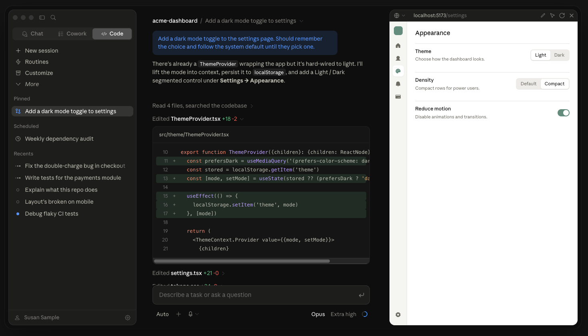{data-zoom-image}
  
Ces modèles reposent sur l'usage de tokens et d'une large fenêtre de contexte. Plus il y a de contexte, plus l'IA « comprend » l'application globale. [Github Copilot Educationnel](https://docs.github.com/fr/copilot/how-tos/copilot-on-github/set-up-copilot/enable-copilot/set-up-for-students)

### C'est génial, non ?

Le _vibe coding_ et l'_agentic coding_ favorisent malheureusement la paresse intellectuelle. Sans compréhension technique pour superviser l'agent, on troque la rigueur contre une perte de contrôle sur le code qu'on ne comprend plus.

> Prenez votre temps 🧘

Prenez le temps de **comprendre** le code généré, de **lire** les explications, de **remettre en question** les solutions proposées et de **valider** les décisions prises par l’agent.

<!-- La venue des calculatrices a démocratisé l'accès au calcul rapide, éliminé les erreurs humaines et transformé l'éducation. En automatisant les tâches répétitives, elle a permis de se concentrer sur l'analyse et la résolution de problèmes complexes. -->
    
## Plan de cours

[Plan de cours :material-download:](./assets/documents/plan-cours_web_3_A2026.pdf){ .md-button .md-button--primary }

## CSS Grid

{.w-100}

En Web 2, vous avez vu Flexbox. Il y a juste une dernière notion à connaitre pour avoir fait le tour du CSS, le `display: grid;`.

Le [système de grille](https://developer.mozilla.org/fr/docs/Web/CSS/Guides/Grid_layout) permet, pour sa part, d’organiser une page Web en lignes et colonnes, un peu comme un tableau invisible sur lequel on place des éléments.

Contrairement à Flexbox, qui aligne les éléments les uns après les autres dans un seul axe (horizontal OU vertical), Grid est pensé pour gérer les deux axes en même temps. Donc avec grid, il n'y a pas de principe d'orientation comme en flex.

[Guide css-tricks](https://css-tricks.com/snippets/css/complete-guide-grid/) (_[Cheatsheet](https://css-tricks.com/wp-content/uploads/2022/02/css-grid-poster.png)_)

### Quand l'utiliser ?

* Pour construire des layouts de page (header, nav, aside, main, footer).
* Pour des galeries d’images où les items doivent s’adapter automatiquement.
* Pour organiser du contenu sous forme de tableaux flexibles et responsives.

https://jfcmontmorency.github.io/css-grid-playground/

### Activer Grid

```html title="HTML"
<div class="grille">
  <div>A</div>
  <div>B</div>
  <div>C</div>
  <div>D</div>
  <div>E</div>
</div>
```

```css title="CSS"
.grille {
  display: grid;
}
```

<iframe height="300" style="width: 100%;" scrolling="no" title="Web Grid" src="https://codepen.io/tim-momo/embed/dPGyQzB?default-tab=result&editable=true&theme-id=50173" frameborder="no" loading="lazy" allowtransparency="true" allowfullscreen="true">
  See the Pen <a href="https://codepen.io/tim-momo/pen/dPGyQzB">
  Web Grid</a> by TIM Montmorency (<a href="https://codepen.io/tim-momo">@tim-momo</a>)
  on <a href="https://codepen.io">CodePen</a>.
</iframe>

Tous les enfants directs deviennent des items de la grille, mais pour que le comportement de grille se fasse voir, il faut spécifier les colonnes / lignes. Sinon on dirait de simples div normales.

### Colonnes et lignes

Les propriétés [`grid-template-columns`](https://developer.mozilla.org/fr/docs/Web/CSS/grid-template-columns) et [`grid-template-rows`](https://developer.mozilla.org/fr/docs/Web/CSS/grid-template-rows) sont la base pour créer un quadrillage précis.

#### `grid-template-columns`

Définit la largeur des colonnes de la grille.

```css
.grille {
  display: grid;
  grid-template-columns: 100px 1fr 100px;
}
```

Crée 3 colonnes :

* une fixe de 100px
* une fluide qui prend l’espace restant (1fr = 1 fraction)
* une fixe de 100px

<iframe height="300" style="width: 100%;" scrolling="no" title="Web Grid" src="https://codepen.io/tim-momo/embed/qEbBgbX?default-tab=result&editable=true&theme-id=50173" frameborder="no" loading="lazy" allowtransparency="true" allowfullscreen="true">
  See the Pen <a href="https://codepen.io/tim-momo/pen/qEbBgbX">
  Web Grid</a> by TIM Montmorency (<a href="https://codepen.io/tim-momo">@tim-momo</a>)
  on <a href="https://codepen.io">CodePen</a>.
</iframe>

#### `grid-template-rows`

Définit la hauteur des rangées.

```css
.grille {
  display: grid;
  grid-template-rows: 100px auto 50px;
}
```

Crée 3 lignes :

* une de 100px
* une qui s’adapte au contenu (auto)
* une de 50px

<iframe height="300" style="width: 100%;" scrolling="no" title="Web Grid template columns" src="https://codepen.io/tim-momo/embed/qEbBgNX?default-tab=result&editable=true&theme-id=50173" frameborder="no" loading="lazy" allowtransparency="true" allowfullscreen="true">
  See the Pen <a href="https://codepen.io/tim-momo/pen/qEbBgNX">
  Web Grid template columns</a> by TIM Montmorency (<a href="https://codepen.io/tim-momo">@tim-momo</a>)
  on <a href="https://codepen.io">CodePen</a>.
</iframe>

#### Raccourcis utiles

```css title="repeat()"
grid-template-columns: repeat(3, 1fr);
/* 
est identique à 
grid-template-columns: 1fr 1fr 1fr;
*/
```

<iframe height="300" style="width: 100%;" scrolling="no" title="Web Grid template rows" src="https://codepen.io/tim-momo/embed/PwZoVpV?default-tab=result&editable=true&theme-id=50173" frameborder="no" loading="lazy" allowtransparency="true" allowfullscreen="true">
  See the Pen <a href="https://codepen.io/tim-momo/pen/PwZoVpV">
  Web Grid template rows</a> by TIM Montmorency (<a href="https://codepen.io/tim-momo">@tim-momo</a>)
  on <a href="https://codepen.io">CodePen</a>.
</iframe>

```css title="repeat + auto-fit = responsive !"
/* 
Chaque colonne doit avoir au moins 150px,
mais peut grandir jusqu’à occuper une fraction de l’espace dispo.
*/
grid-template-columns: repeat(auto-fit, minmax(150px, 1fr));
```

<iframe height="300" style="width: 100%;" scrolling="no" title="Web Grid template columns repeat" src="https://codepen.io/tim-momo/embed/ogbNmWE?default-tab=result&editable=true&theme-id=50173" frameborder="no" loading="lazy" allowtransparency="true" allowfullscreen="true">
  See the Pen <a href="https://codepen.io/tim-momo/pen/ogbNmWE">
  Web Grid template columns repeat</a> by TIM Montmorency (<a href="https://codepen.io/tim-momo">@tim-momo</a>)
  on <a href="https://codepen.io">CodePen</a>.
</iframe>

!!! question "À vous de jouer"

    Avant de continuer, recréez une grille de 4 colonnes égales et 2 rangées de 100px chacune (`grid-template-columns` + `grid-template-rows`) directement dans un des CodePen ci-dessus.

### Zones

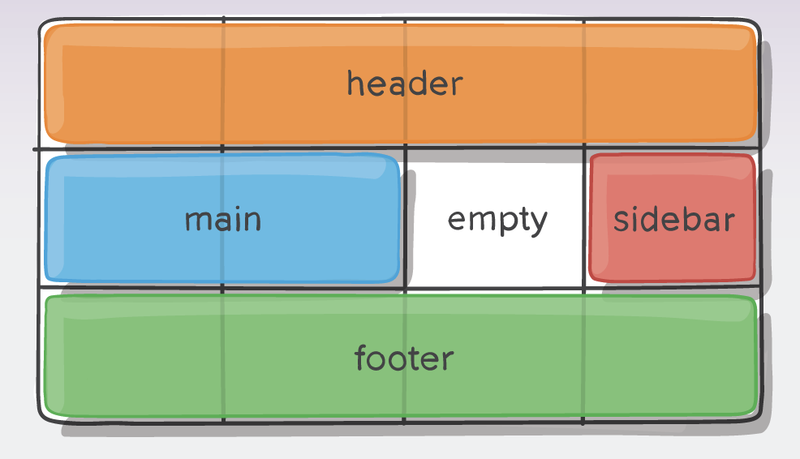{.w-50 data-zoom-image}

La propriété `grid-template-areas` donne un nom à des zones de la grille. Ça sert à être plus lisible et facile à maintenir.

```css title="Exemple"
.grille {
  display: grid;
  grid-template-columns: 30px 1fr 1fr;
  grid-template-rows: 60px 1fr;
  grid-template-areas:
    "allo allo allo"
    "bravo cadeau cadeau";
}
```

Puis on assigne chaque élément :

```css title="Exemple"
.div1 { grid-area: allo; }
.div2 { grid-area: bravo; }
.div3 { grid-area: cadeau; }
```

<iframe height="300" style="width: 100%;" scrolling="no" title="Web Grid - template-area" src="https://codepen.io/tim-momo/embed/wBMBYjZ?default-tab=result&editable=true&theme-id=50173" frameborder="no" loading="lazy" allowtransparency="true" allowfullscreen="true">
  See the Pen <a href="https://codepen.io/tim-momo/pen/wBMBYjZ">
  Web Grid - template-area</a> by TIM Montmorency (<a href="https://codepen.io/tim-momo">@tim-momo</a>)
  on <a href="https://codepen.io">CodePen</a>.
</iframe>

### Espacements

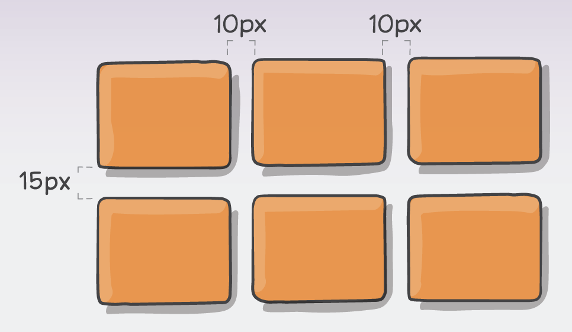{.w-50 data-zoom-image}

Propriétés :

* `column-gap` : espace entre les colonnes
* `row-gap` : espace entre les lignes
* `gap` : raccourci pour les deux

```css title="Exemple"
.grille {
  gap: 20px;              /* colonnes ET rangées */
  column-gap: 30px;       /* juste colonnes */
  row-gap: 10px;          /* juste rangées */
}
```

<iframe height="300" style="width: 100%;" scrolling="no" title="Web Grid - justify-content" src="https://codepen.io/tim-momo/embed/XJXJxqN?default-tab=result&editable=true&theme-id=50173" frameborder="no" loading="lazy" allowtransparency="true" allowfullscreen="true">
  See the Pen <a href="https://codepen.io/tim-momo/pen/XJXJxqN">
  Web Grid - justify-content</a> by TIM Montmorency (<a href="https://codepen.io/tim-momo">@tim-momo</a>)
  on <a href="https://codepen.io">CodePen</a>.
</iframe>

### Alignement global du contenu

Les propriétés `justify-content` et `align-content` gèrent l’alignement de l’ensemble de la grille, pas des items individuellement.

#### `justify-content`

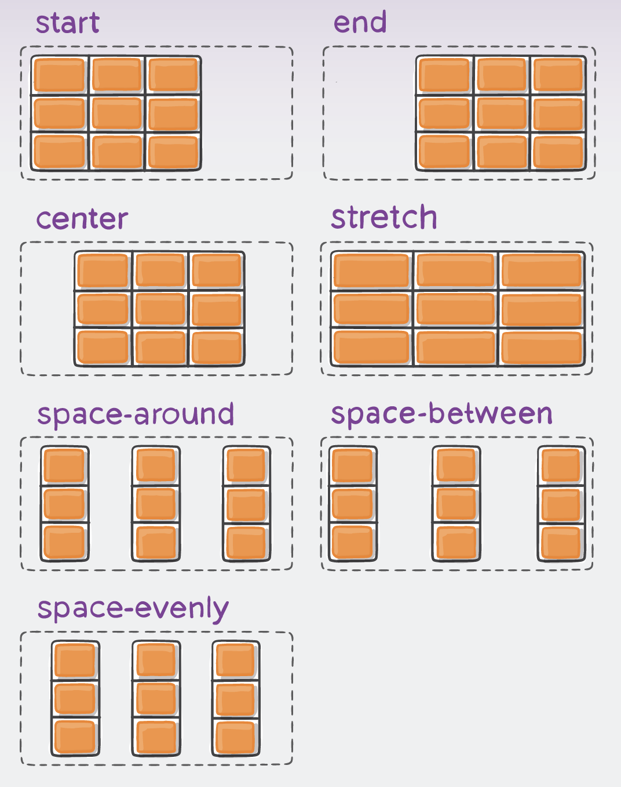{.w-50 data-zoom-image}

Aligne la grille entière horizontalement dans le conteneur, si celui-ci est plus large que la somme des colonnes.

```css title="Exemple"
.grille {
  justify-content: center;   /* centre la grille horizontalement */
}
```

<iframe height="300" style="width: 100%;" scrolling="no" title="Web Grid - align-content" src="https://codepen.io/tim-momo/embed/dPGPgmd?default-tab=result&editable=true&theme-id=50173" frameborder="no" loading="lazy" allowtransparency="true" allowfullscreen="true">
  See the Pen <a href="https://codepen.io/tim-momo/pen/dPGPgmd">
  Web Grid - align-content</a> by TIM Montmorency (<a href="https://codepen.io/tim-momo">@tim-momo</a>)
  on <a href="https://codepen.io">CodePen</a>.
</iframe>

#### `align-content`

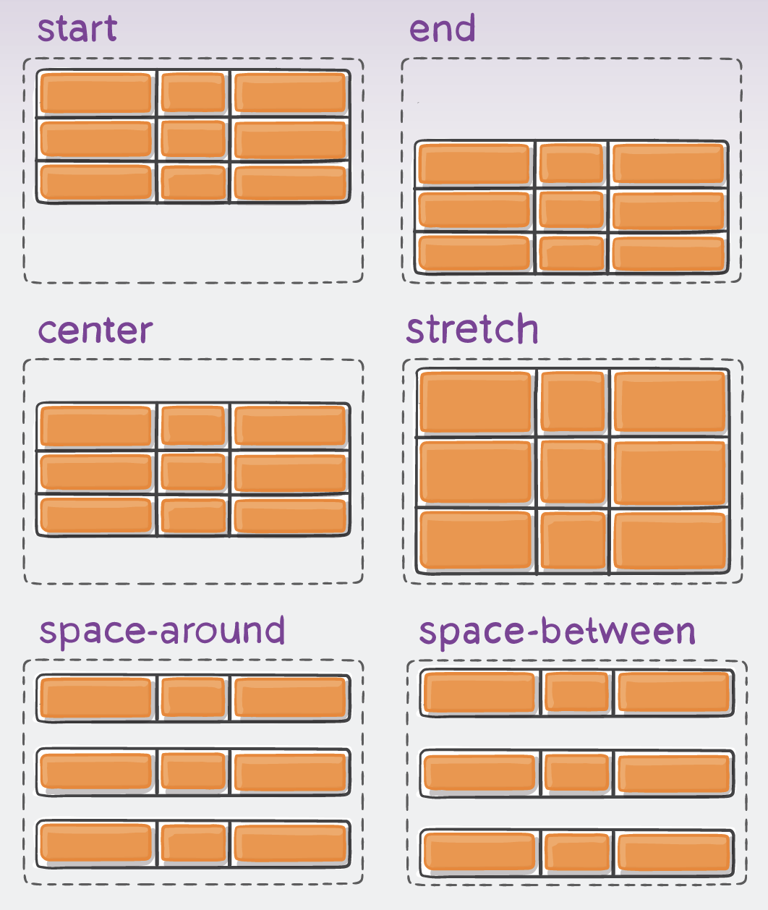{.w-50 data-zoom-image}

Aligne la grille entière verticalement, si la hauteur du conteneur est plus grande que celle des lignes.

```css title="Exemple"
.grille {
  align-content: space-between;
}
```

<iframe height="300" style="width: 100%;" scrolling="no" title="Web Grid - align-items / justify-items" src="https://codepen.io/tim-momo/embed/EaPadQW?default-tab=result&editable=true&theme-id=50173" frameborder="no" loading="lazy" allowtransparency="true" allowfullscreen="true">
  See the Pen <a href="https://codepen.io/tim-momo/pen/EaPadQW">
  Web Grid - align-items / justify-items</a> by TIM Montmorency (<a href="https://codepen.io/tim-momo">@tim-momo</a>)
  on <a href="https://codepen.io">CodePen</a>.
</iframe>

### Alignement des items dans les cellules

#### `align-items` / `justify-items`

<div class="grid" markdown>
<figure markdown>
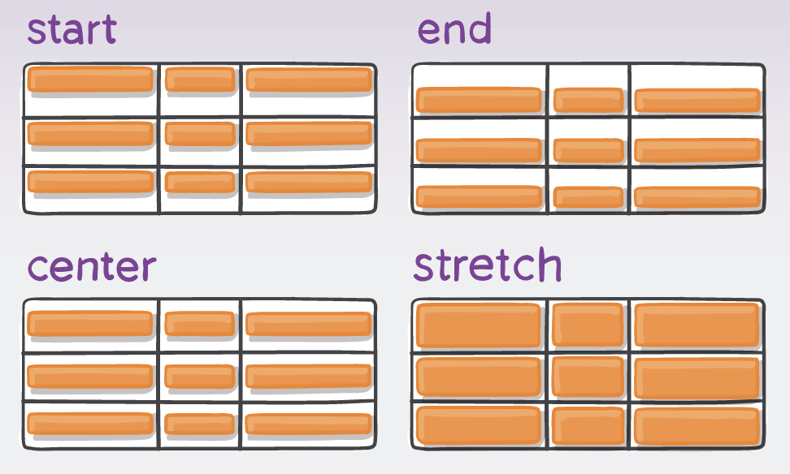{data-zoom-image}
<figcaption>align-items</figcaption>
</figure>
<figure markdown>
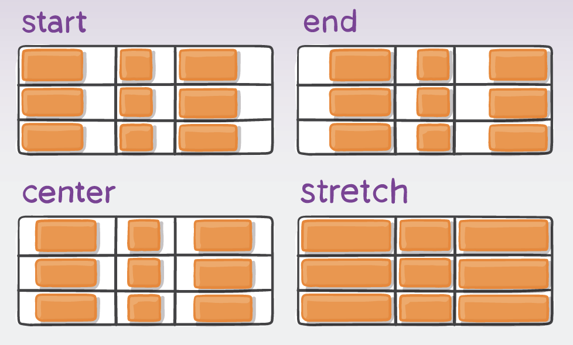{data-zoom-image}
<figcaption>justify-items</figcaption>
</figure>
</div>

Les propriétés `align-items` et `justify-items` contrôlent l’alignement par défaut des items dans leurs cellules.

```scss title="Exemple"
.grille {
  //...
  align-items: end;
  justify-items: center;
}
```

<iframe height="300" style="width: 100%;" scrolling="no" title="Web Grid - align-self / justify-self" src="https://codepen.io/tim-momo/embed/YPwPJEa?default-tab=result&editable=true&theme-id=50173" frameborder="no" loading="lazy" allowtransparency="true" allowfullscreen="true">
  See the Pen <a href="https://codepen.io/tim-momo/pen/YPwPJEa">
  Web Grid - align-self / justify-self</a> by TIM Montmorency (<a href="https://codepen.io/tim-momo">@tim-momo</a>)
  on <a href="https://codepen.io">CodePen</a>.
</iframe>

Tous les enfants s’aligneront ainsi, sauf si un item définit ses propres règles.

#### `align-self` / `justify-self`

<div class="grid" markdown>
<figure markdown>
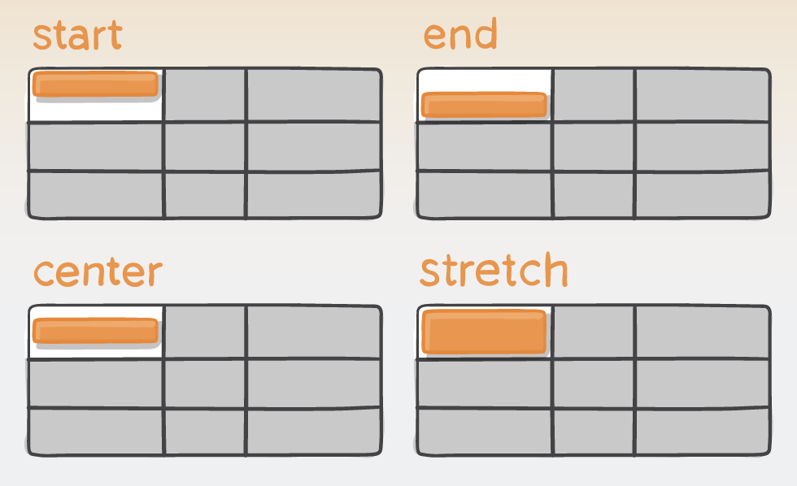{data-zoom-image}
<figcaption>align-self</figcaption>
</figure>
<figure markdown>
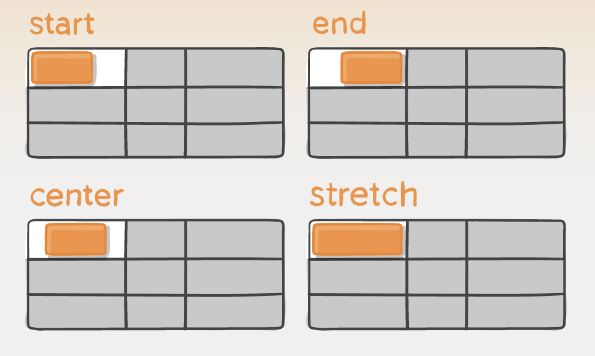{data-zoom-image}
<figcaption>justify-self</figcaption>
</figure>
</div>

Permettent d’aligner un item individuel dans sa cellule.

```scss title="Exemple"
.item {
  align-self: end;         
  justify-self: center;    
}
```

<iframe height="300" style="width: 100%;" scrolling="no" title="Web Grid testing" src="https://codepen.io/tim-momo/embed/XJXJxbm?default-tab=result&editable=true&theme-id=50173" frameborder="no" loading="lazy" allowtransparency="true" allowfullscreen="true">
  See the Pen <a href="https://codepen.io/tim-momo/pen/XJXJxbm">
  Web Grid testing</a> by TIM Montmorency (<a href="https://codepen.io/tim-momo">@tim-momo</a>)
  on <a href="https://codepen.io">CodePen</a>.
</iframe>

#### `place-items`

`place-items` est un raccourci pratique qui combine `align-items` (axe vertical) et `justify-items` (axe horizontal) en une seule propriété.

```css
.grille {
  /* équivalent à align-items: center; justify-items: center; */
  place-items: center;
}
```

Note : `place-items` s'applique au conteneur de la grille et définit l'alignement par défaut pour tous les items. Les propriétés individuelles `align-self` / `justify-self` peuvent toujours être utilisées pour surcharger l'alignement d'un item spécifique.

### Placement manuel

Les propriétés de positionnement permettent de définir précisément où commence et finit un élément dans la grille.

#### `grid-row-start` / `grid-row-end`

Définissent sur quelle ligne horizontale un item commence et finit :

```css
.item {
  grid-row-start: 1;    /* commence à la 1ère ligne horizontale */
  grid-row-end: 3;      /* finit avant la 3e ligne horizontale */
  /* L'item occupe donc les rangées 1 et 2 */
}
```

#### `grid-column-start` / `grid-column-end`

Définissent sur quelle ligne verticale un item commence et finit :

```css
.item {
  grid-column-start: 2;  /* commence à la 2e ligne verticale */
  grid-column-end: 5;    /* finit avant la 5e ligne verticale */
  /* L'item occupe donc les colonnes 2, 3 et 4 */
}
```

Note : Il est possible d'utiliser des valeurs négatives 🤪 Elles comptent à partir de la fin de la grille : `-1` correspond à la dernière ligne, peu importe le nombre de colonnes ou de rangées.

```css
.item {
  grid-column: 1 / -1; /* occupe TOUTE la largeur de la grille, du début à la fin */
}
```

#### Raccourcis `grid-column` / `grid-row`

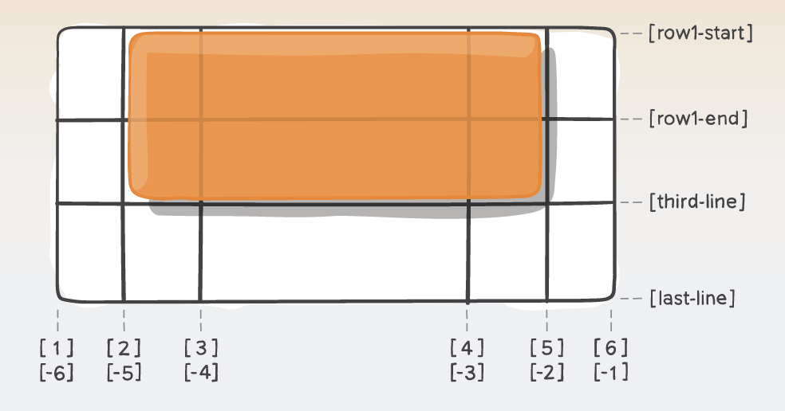{.w-50 data-zoom-image}

Les propriétés `grid-column` et `grid-row` permettent à un item d’occuper plusieurs cases de la grille.

```scss
.item {
  /* Raccourci pour grid-column-start: 2 et grid-column-end: 5 */
  grid-column: 2 / 5; 
    
  /* Raccourci pour grid-row-start: 1 et grid-row-end: 3 */
  grid-row: 1 / 3;    
}
```

Très utile pour créer des mises en page asymétriques (un bloc plus grand que les autres).

#### Raccourci des raccourcis `grid-area`

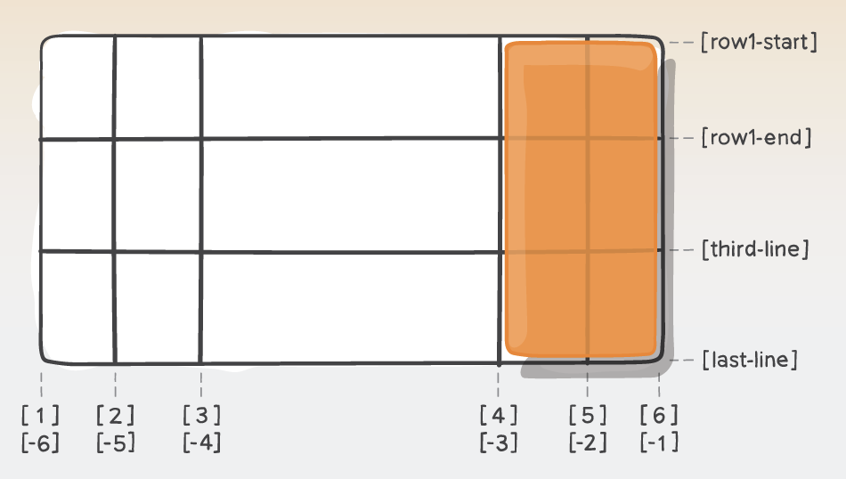{.w-50 data-zoom-image}

`grid-area` combine toutes les propriétés de positionnement en une seule ligne :

```scss
.item {
  grid-area: 1 / 5 / 4 / 6;

  // Équivalent à :
  //   grid-row-start: 1
  //   grid-column-start: 5  
  //   grid-row-end: 4
  //   grid-column-end: 6
}
```

L'ordre des valeurs est : `row-start / column-start / row-end / column-end`

##### Note sur le mot-clé `span`

Dans le système grid, `span` est un mot-clé utile pour indiquer qu'un item doit occuper un certain nombre de lignes ou colonnes sans préciser explicitement l'index de fin.

```css
/* 
Commence à la colonne 2 et s'étend sur 3 colonnes (2,3,4) 
Équivalent de : .item { grid-column: 2 / 5; }
*/
.item { grid-column: 2 / span 3; }
```

### En résumé : trois façons de positionner un item

| Propriété | Quand l'utiliser | Exemple |
|---|---|---|
| `grid-template-areas` + `grid-area: nom` | Mise en page nommée et facile à visualiser (header / nav / main / footer) | `grid-area: header;` |
| `grid-column` / `grid-row` | Placement rapide par numéros de lignes | `grid-column: 2 / 5;` |
| `grid-area: r1 / c1 / r2 / c2` | Positionnement précis en une seule déclaration | `grid-area: 1 / 5 / 4 / 6;` |

## Lignes de commande

{ .w-100 }

La [ligne de commande](https://fr.wikipedia.org/wiki/Commandes_Unix) est un outil qui permet d’interagir avec un ordinateur (en local ou à distance) en tapant des commandes textuelles.

On écrit ces commandes dans une interface textuelle (CLI) appelé « Terminal » ou « Console ».

<!-- Ça exécute un **Shell** (le programme qui interprète les commandes, comme Bash, Zsh ou PowerShell) 😅. -->

<!-- https://www.youtube.com/watch?v=ZDxLa6P6exc&t=510s -->

## Le terminal

<div class="grid" markdown>
<figure markdown>
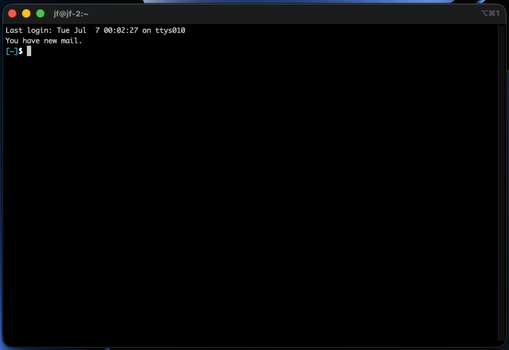{data-zoom-image}
<figcaption>Terminal sur Mac</figcaption>
</figure>

<figure markdown>
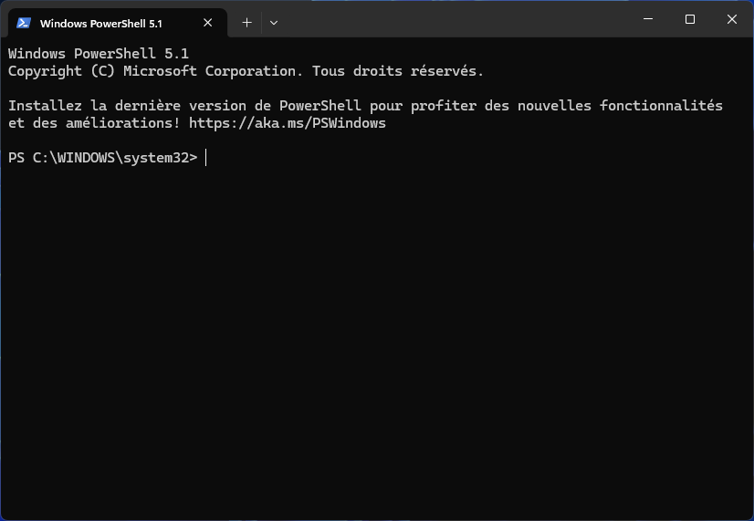{data-zoom-image}
<figcaption>Terminal sur Windows</figcaption>
</figure>
</div>

Aucune installation n'est normalement requise. Un terminal existe déjà sur votre ordinateur.

* Sous **Windows**, utilisez l'application **PowerShell[^powershell]** (dans le cadre du cours, nous utiliserons plutôt Git Bash)
* Sous **macOS**, utilisez l'application **Terminal[^terminal_osx]**.
* Sous **Linux**, utilisez l'application **Terminal[^terminal_unix]**.

[^powershell]: [https://learn.microsoft.com/fr-ca/training/modules/introduction-to-powershell/](https://learn.microsoft.com/fr-ca/training/modules/introduction-to-powershell/)
[^terminal_osx]: [https://support.apple.com/fr-ca/guide/terminal/welcome/mac](https://support.apple.com/fr-ca/guide/terminal/welcome/mac)
[^terminal_unix]: [https://ubuntu.com/tutorials/command-line-for-beginners](https://ubuntu.com/tutorials/command-line-for-beginners) (en anglais)

!!! danger "Sacré Windows 😤"

    C'est bien connu, Windows est très propriétaire dans son approche et ses lignes de commande lui sont propres.

    Le hic c'est que dans le monde du Web, la grande majorité des serveurs fonctionnent sous Linux et non sur Windows.
    
    Il est donc important d'apprendre les commandes Linux. Pour ce faire sous Windows, on utilise généralement une alternative à PowerShell (comme **Git Bash** ou **WSL**). C'est le moyen le plus simple d'exécuter des lignes de commande Linux sans changer de système.

    Au Cégep, « **Git Bash** » est déjà installé 🙌. Si vous devez l'installer à la maison, consulter le [guide d'installation de « Git Bash »](./extra/git-bash.md).

Il y a plusieurs autres accès pour communiquer en ligne de commande. Par exemple, vscode a une interface de terminal. Github desktop aussi.

## Commandes courantes

Lorsque vous naviguez dans Windows, vous utilisez une interface graphique. Vous cliquez sur des fenêtres et des dossiers pour vous déplacer sur votre ordinateur. En réalité, cette interface n’est qu’une façade. En arrière-plan, le système exécute des commandes pour réaliser chacune de vos actions.

Nous allons maintenant apprendre à naviguer sur l’ordinateur uniquement à l’aide de la ligne de commande. 

Voici une petite introduction aux commandes `pwd`, `ls` et `cd` (à consulter en plein écran) :

<iframe src="https://docs.google.com/presentation/d/e/2PACX-1vTQEFxLZyQ8RuiIhJKTtB9zumjvPRaKMiLIkDr9vmb7auj_YUNUE4jSJHzsNiRUdkcsAFkPWpdqUxQN/pubembed?start=false&loop=false&delayms=3000" frameborder="0" width="100%" height="360" allowfullscreen="true" mozallowfullscreen="true" webkitallowfullscreen="true"></iframe>

<!-- Voici une liste de commandes courantes que nous allons élaborer : 

* `pwd` : Affiche le répertoire courant
* `ls` : Liste le contenu du répertoire
* `cd` : Change le répertoire actuel
* `cat` : Concaténe et affiche le contenu d'un fichier
* `cp` : Copie le fichier
* `mv` : Déplace ou renomme de fichier
* `rm` : Supprime un fichier
* `touch` : Crée un fichier vide
* `mkdir` : Crée un nouveau dossier -->

### Répertoire courant : `pwd`

La commande [pwd](https://www.w3schools.com/bash/bash_pwd.php) affiche le chemin complet du dossier dans lequel vous vous trouvez actuellement.

=== "Ligne de commande"

    ```ps
    pwd
    # /c/Users/jfcartier/OneDrive/Desktop
    ```

=== "Équivalent dans Windows"

    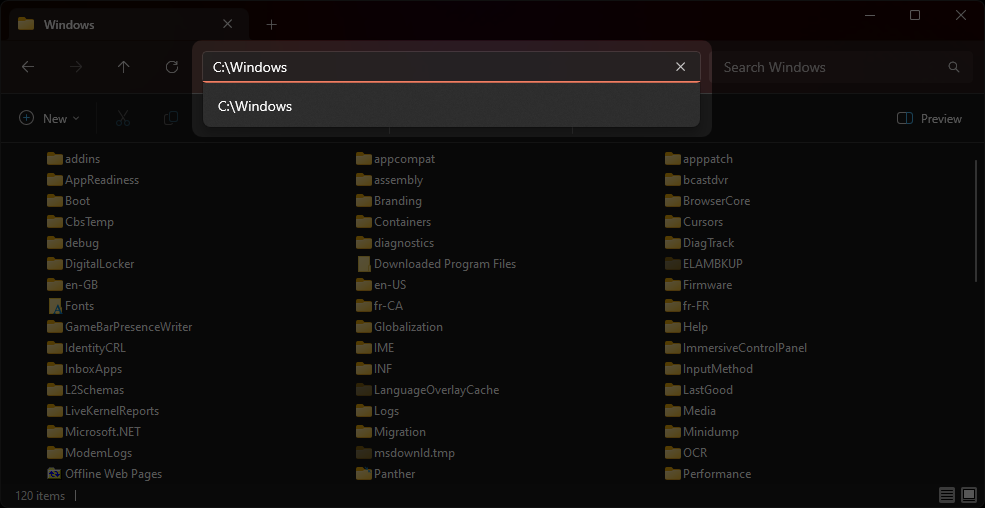{data-zoom-image}

### Liste : `ls`

La commande [ls](https://www.w3schools.com/bash/bash_ls.php) est utilisée pour lister le contenu d'un répertoire.

=== "Ligne de commande"

    ```ps
    ls
    # mandarine.png
    # nofx.jpg
    # patate-pilee.html
    # un-dossier
    # v.jpg
    ```

=== "Équivalent dans Windows"

    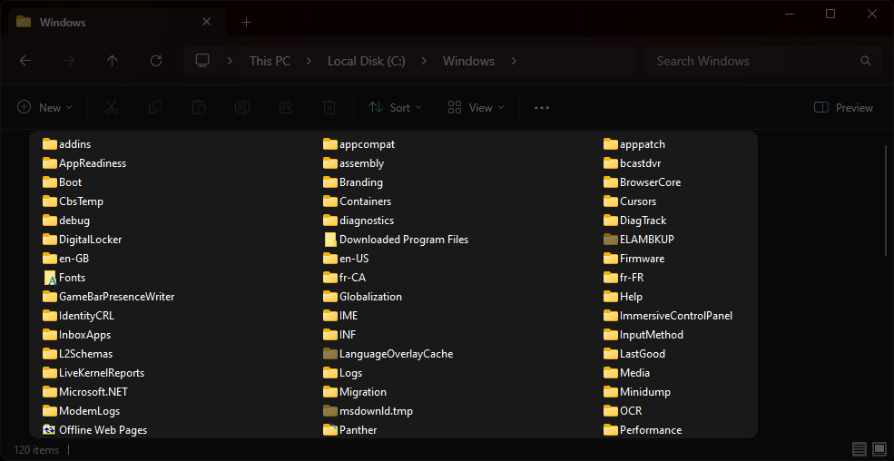{data-zoom-image}

### Se déplacer : `cd`

La commande [cd](https://www.w3schools.com/bash/bash_cd.php) est utilisée pour déplacer dans l'arborescence des dossiers.

Elle fait l'équivalent de double cliquer sur des dossiers dans l'Explorateur Windows.

=== "Ligne de commande"

    ```ps
    cd nom_du_dossier
    ```

=== "Windows"

    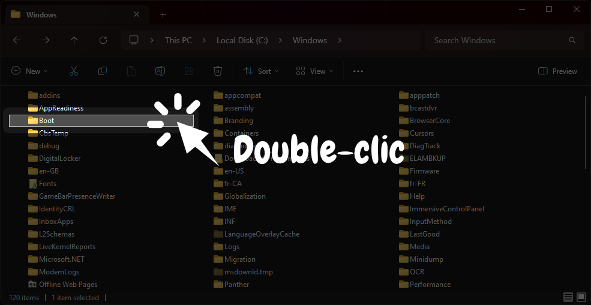{data-zoom-image}


#### Chemins relatifs

Vous vous souvenez des chemins relatifs ? 

Chemin relatif : `./images/chat.jpg`
Chemin absolu : `/c/Users/123456789/OneDrive/Desktop/mon-site-web/images/chat.jpg`

Le chemin relatif qui commence par un "." veut dire que le chemin commence par le répertoire courant.

Admettons qu'on se trouve dans le répertoire `mon-site-web`, le point est un raccourci pour écrire : `/c/Users/123456789/OneDrive/Desktop/mon-site-web`.

```ps
pwd
# /c/Users/123456789/OneDrive/Desktop/mon-site-web
cd images
pwd
# /c/Users/123456789/OneDrive/Desktop/mon-site-web/images
```

#### Parent

Si le simple point `.` représente le répertoire courant, le double point `..` représente le dossier parent.

```ps
pwd
# /c/Users/123456789/OneDrive/Desktop/mon-site-web
cd ..
pwd
# /c/Users/123456789/OneDrive/Desktop
```

### Nouveau dossier : `mkdir`

La commande [mkdir](https://www.w3schools.com/bash/bash_mkdir.php) est utilisée pour créer de nouveaux répertoires.

=== "Ligne de commande"

    ```ps
    mkdir nom_du_dossier
    ```

=== "Windows"

    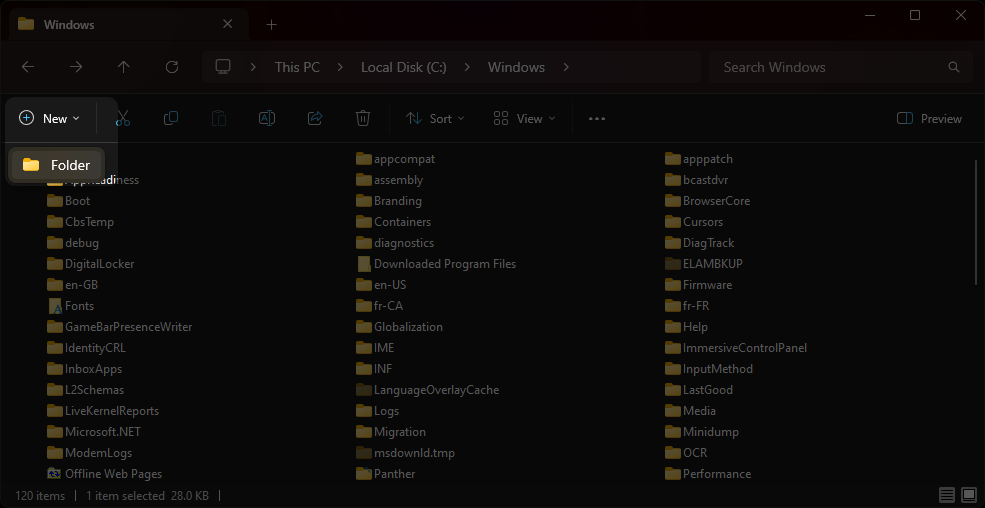{data-zoom-image}

### Lire un fichier : `cat` 😸

La commande [cat](https://www.w3schools.com/bash/bash_cat.php) est utilisée pour afficher le contenu des fichiers dans le terminal.

=== "Ligne de commande"

    ```ps
    cat README.md
    # Vite (French word for "quick", pronounced /viːt/, like "veet") is a build tool 
    # that aims to provide a faster and leaner development experience for modern web 
    # projects. It consists of two major parts...
    #
    # License
    # [MIT](LICENSE)
    # ...
    ```

=== "Équivalent dans Windows"

    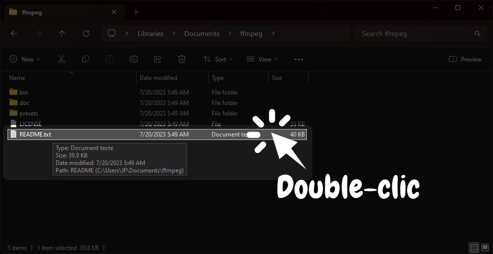{data-zoom-image}

### Dupliquer : `cp`

La commande [cp](https://www.w3schools.com/bash/bash_cp.php) est utilisée pour **copier** des fichiers ou des répertoires d'un emplacement à un autre.

```ps
cp allo.txt salut.txt
```

### Renommer / déplacer : `mv`

La commande [mv](https://www.w3schools.com/bash/bash_mv.php) est utilisée pour déplacer ou renommer des fichiers ou des répertoires.

```ps title="Renommer"
mv chien.jpg chat.jpg
```
<!-- # 🌄chien.jpg renommé pour 🌄chat.jpg -->

```ps title="Déplacer"
mv chat.jpg ./images/chat.jpg
```
<!-- # 🌄chat.jpg est déplacé dans 📁images -->

### Supprimer : `rm`

!!! warning "Les fichiers supprimés ne peuvent pas être récupérés."

La commande [rm](https://www.w3schools.com/bash/bash_rm.php) est utilisée pour supprimer des fichiers.

```ps
rm chat.jpg
```

#### Supprimer un répertoire

!!! danger "Soyez particulièrement prudent, car les répertoires supprimés ne peuvent pas être récupérés."

La commande [rm -r](https://www.w3schools.com/bash/bash_rm.php) est utilisée pour supprimer des répertoires. 

Sans le `-r`, la commande `rm` ne peut pas supprimer de répertoire.

=== "Ligne de commande"

    ```ps
    rm -r nom_du_dossier
    ```

=== "Équivalent dans Windows"

    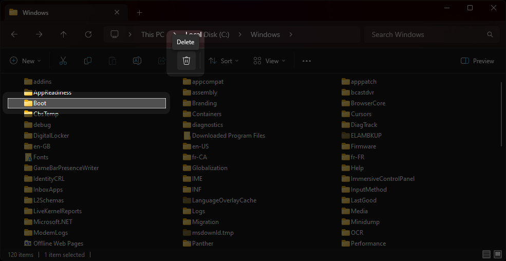{data-zoom-image}

### Nouveau fichier : `touch`

La commande [touch](https://www.w3schools.com/bash/bash_touch.php) est utilisée pour créer un fichier vide si celui-ci n'existe pas.

=== "Ligne de commande"

    ```bash
    touch nouveau.txt
    ```

=== "Équivalent dans Windows"

    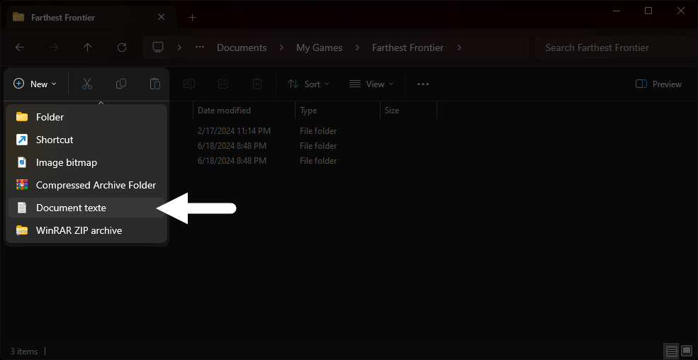{data-zoom-image}

### Écriture : `echo`

La commande [echo](https://www.w3schools.com/bash/bash_echo.php) peut ajouter du texte dans un fichier. Si le fichier n'existe pas, il le crée.

```ps
echo "Texte à ajouter" >> nom_du_fichier.txt
echo "Texte en deuxième ligne" >> nom_du_fichier.txt
echo "Texte en troisième ligne!" >> nom_du_fichier.txt
```

```ps
echo "Finalement, remplace tout par ceci" > nom_du_fichier.txt
```

#### Éditeur de texte

Si vous devez écrire un paragraphe ou modifier un fichier existant, il est préférable d'ouvrir un éditeur de texte dans le terminal. L'équivalent de ça c'est :material-microsoft-visual-studio-code: vscode.

```ps
nano nom_du_fichier.txt
```

!!! note "Important 😅"

    * Pour sauvegarder : ++ctrl+o++ puis ++enter++
    * Pour quitter : ++ctrl+x++

### Bon à savoir (QoL)

* ++tab++ permet de compléter une ligne de commande si la suite est évidente
* ++arrow-up++ et ++arrow-down++ permet de naviguer à travers l'historique des commandes
* ++ctrl+c++ permet d'annuler la commande en cours
* La commande `clear` permet de nettoyer le terminal

## Exercices

<div class="grid grid-1-2" markdown>
  

  <small>Exercice - grid</small><br>
  **[Spirale](./exercices/spirale/index.md){.stretched-link .back}**
</div>

https://gridcritters.com/

https://stephaniewalter.design/blog/fun-places-to-learn-css-layout-part-2-grid-layout/

<div class="grid grid-1-2" markdown>
  

  <small>Exercice - CLI</small><br>
  **[Mandala](./exercices/cli-mandala.md){.stretched-link}**
</div>
