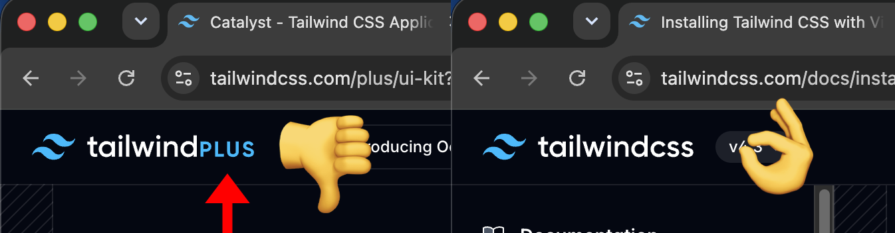
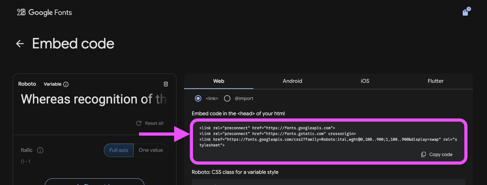
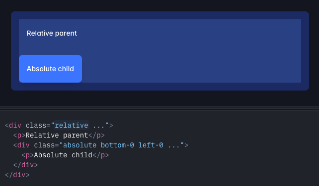
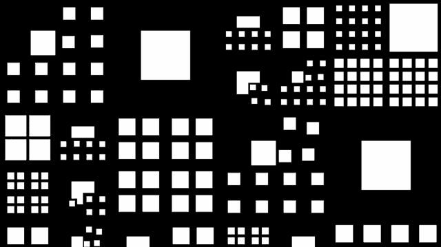

# Cours 2 | _Framework_ CSS

[STOP]

<!-- **Savoirs :** #5 Cadriciel facilitant l'intégration · #9 Positionnement · #17 Réactivité (media queries) -->

*[CLI]: Command-Line Interface
*[CDN]: Content Delivery Network
*[npm]: Node Package Manager
*[OKLCH]: OK👌 Lightness Chroma Hue

<!-- Au dernier cours, vous avez apprivoisé le **terminal**. Aujourd'hui, on s'en sert pour de vrai 🤓. -->

{.aspect-16-9 .w-100}

En Web 2, vous écriviez tout votre CSS **à la main**. 

Cette session, on découvre un pilier du développement moderne&nbsp;: les cadriciels CSS (ou _frameworks_ CSS). Un **_framework_ CSS**, c'est du CSS déjà préparé qu'on branche à une page Web pour la styler sans partir de zéro.

Il en existe une grande variété, mais **[Tailwind](https://tailwindcss.com/)** est aujourd'hui le plus utilisé. Toutefois, afin d'aténuer la courbe d'apprentissage de ce nouveau concept, nous commencerons avec un minuscule _framework_ nommé [**Milligram**](https://milligram.io/).

## Introduction au _frameworks CSS_


<div class="grid grid-1-2" markdown>
  {.aspect-4-3}

  <small>Exercice - Milligram</small><br>
  **[Mon premier _framework_](./activite/milligram/index.md){.stretched-link .back}**
</div>

## Tailwind


Tailwind est aussi un _framework CSS_, mais sa philosophie est différente.

Milligram fournit des classes **« sémantiques »** toutes faites&nbsp;: `.button`, `.row`, `.column`.

Tailwind fournit des classes **« utilitaires »**. Il donne des **micro-classes** qui font chacune une seule petite chose, qu'on **compose** soi-même. Le but de Tailwind est de ne plus jamais coder de CSS 😈

=== "Milligram"

    ```html
    <a href="#" class="button">
      Voir la bande annonce
    </a>
    ```

=== ":simple-tailwindcss: Tailwind"

    ```html
    <a href="#" class="px-6 py-2 bg-purple-600 text-white rounded font-bold uppercase">
      Voir la bande annonce
    </a>
    ```

### La documentation

Personne ne mémorise par coeur les classes de Tailwind. On utilise la [documentation](https://tailwindcss.com/docs) et l'autocomplétion de VS Code.

!!! warning "Tailwind CSS vs. Tailwind Plus" 

    Dans la doc, vous verrez peut-être Tailwind Plus. Ignorez cette partie, elle est payante.

    {data-zoom-image .w-50}

### Installation

{.w-100}

<div class="grid grid-1-2" markdown>
  {.aspect-4-3}

  <small>Exercice - Tailwind</small><br>
  **[Installation Tailwind en CDN](./activite/tailwind-install/index.md){.stretched-link .back}**
</div>

### Espacements

<!-- {.w-100} -->

Les classes d'espacement ([padding](https://tailwindcss.com/docs/padding) et [margin](https://tailwindcss.com/docs/margin)) se construisent avec ce motif :

```txt
<propriété><côté*>-<size>
```

<div class="grid cards" markdown>

| Propriété | |
| --- | --- |
| `m` | `margin` |
| `p` | `padding` |

| Coté (facultatif) | |
| --- | --- |
| `t` | `top` |
| `b` | `bottom` |
| `l` | `left` |
| `r` | `right` |
| `x` | `right` + `left` |
| `y` | `top` + `bottom` |

| Unité | |
| --- | --- |
| `0` | `0rem` |
| `1` | `0.25rem` |
| `2` | `0.5rem` |
| `3` | `0.75rem` |
| `4` | `1rem` |
| ... | |

</div>

<p class="aspect-1-1 codepen" data-theme-id="50173" data-height="300" data-pen-title="Tailwind4 Spacing Builder" data-version="2" data-default-tab="result" data-slug-hash="KwaxmeB" data-user="tim-momo" style="height: 300px; box-sizing: border-box; display: flex; align-items: center; justify-content: center; border: 2px solid; margin: 1em 0; padding: 1em;">
  <span>See the Pen <a href="https://codepen.io/editor/tim-momo/pen/019f90bb-8006-7a5a-8b63-ff33d6f6ef04">
  Tailwind4 Spacing Builder</a> by TIM Montmorency (<a href="https://codepen.io/tim-momo">@tim-momo</a>)
  on <a href="https://codepen.io">CodePen</a>.</span>
</p>
<script async src="https://public.codepenassets.com/embed/index.js"></script>

On pourra alors utiliser ce type de classe dans le HTML. Voici un exemple : 

<p class="aspect-6-1 codepen" data-theme-id="50173" data-height="300" data-pen-title="Tailwind4 Premier pas" data-version="2" data-default-tab="html,result" data-slug-hash="JoEmOeb" data-user="tim-momo" style="height: 300px; box-sizing: border-box; display: flex; align-items: center; justify-content: center; border: 2px solid; margin: 1em 0; padding: 1em;">
  <span>See the Pen <a href="https://codepen.io/editor/tim-momo/pen/019fa47b-527e-78a4-ac8d-e11aa07a9cd0">
  Tailwind4 Premier pas</a> by TIM Montmorency (<a href="https://codepen.io/tim-momo">@tim-momo</a>)
  on <a href="https://codepen.io">CodePen</a>.</span>
</p>
<script async src="https://public.codepenassets.com/embed/index.js"></script>


### Couleurs


Les classes de [couleur](https://tailwindcss.com/docs/colors) se construisent généralement avec ce motif :

```txt
<propriété>-<couleur>-<tinte>/<transparence>
```

Plusieurs propriétés peuvent être colorées. Ici on peut voir trois classiques : [couleur de fond](https://tailwindcss.com/docs/background-color), [texte](https://tailwindcss.com/docs/color) et [bordure](https://tailwindcss.com/docs/border-color).

<p class="aspect-4-3 codepen" data-theme-id="50173" data-height="300" data-pen-title="Tailwind4 Color Builder" data-version="2" data-default-tab="result" data-slug-hash="xbgajvQ" data-user="tim-momo" style="height: 300px; box-sizing: border-box; display: flex; align-items: center; justify-content: center; border: 2px solid; margin: 1em 0; padding: 1em;">
  <span>See the Pen <a href="https://codepen.io/editor/tim-momo/pen/019f947a-8ba9-7e36-9437-57ba13d5b7c7">
  Tailwind4 Color Builder</a> by TIM Montmorency (<a href="https://codepen.io/tim-momo">@tim-momo</a>)
  on <a href="https://codepen.io">CodePen</a>.</span>
</p>
<script async src="https://public.codepenassets.com/embed/index.js"></script>

!!! note "Notez qu'il n'est pas possible de changer la tinte d'une couleur définitive comme le blanc, le noir et la transparence."

<!-- 
#### Au sujet des nuances

Tailwind utilise une échelle numérique de 11 niveaux de nuances pour chaque couleur. La valeur 500 représente la couleur de base.

<p class="codepen" data-theme-id="50173" data-height="300" data-pen-title="Tailwind4 Color Palette" data-version="2" data-default-tab="result" data-slug-hash="bNgxKYr" data-user="tim-momo" style="height: 300px; box-sizing: border-box; display: flex; align-items: center; justify-content: center; border: 2px solid; margin: 1em 0; padding: 1em;">
  <span>See the Pen <a href="https://codepen.io/editor/tim-momo/pen/019f94a9-a91a-77a3-9b39-d8088f0f9841">
  Tailwind4 Color Palette</a> by TIM Montmorency (<a href="https://codepen.io/tim-momo">@tim-momo</a>)
  on <a href="https://codepen.io">CodePen</a>.</span>
</p>
<script async src="https://public.codepenassets.com/embed/index.js"></script>

Pour ajouter une nuance, c'est assez simple, voici un exemple : 

```html
<style type="text/tailwindcss">
@theme {
    --color-pink-925: oklch(0.346 0.131 3.170); 
}
</style>
```

Ensuite la classe `.bg-pink-925` ou encore `.text-pink-925` sera disponible. Ce qui veut dire qu'on pourra faire ça :

```html
<h1 class="text-pink-925">Allo</h1>
```

#### OKLCH ?

Oui, OKLCH, ah et bienvenue au 21e siècle soit dit en passant !

> Si on vous proposait une palette de couleurs de 16.7 millions de possibilités, vous diriez que c'est clairement pas assez ! Right ?<br>
> 

La technologie sRGB, ce sur quoi repose l'hexadécimal (ex. : `#ff3388`), fut conçue pour les écrans des années 90 👵

`oklch` n'a pas de limite théorique du nombre de couleurs. C'est d'ailleurs sur quoi sont basées les couleurs dans Tailwind

<https://oklch.net/> -->

### Typograpie

{.w-100}

<p class="aspect-1-1 codepen" data-theme-id="50173" data-height="300" data-pen-title="Tailwind4 Typography Builder" data-version="2" data-default-tab="result" data-slug-hash="ogBaxEv" data-user="tim-momo" style="height: 300px; box-sizing: border-box; display: flex; align-items: center; justify-content: center; border: 2px solid; margin: 1em 0; padding: 1em;">
  <span>See the Pen <a href="https://codepen.io/editor/tim-momo/pen/019f9fd4-5df0-76ec-a45a-2cbe17ce64c2">
  Tailwind4 Typography Builder</a> by TIM Montmorency (<a href="https://codepen.io/tim-momo">@tim-momo</a>)
  on <a href="https://codepen.io">CodePen</a>.</span>
</p>
<script async src="https://public.codepenassets.com/embed/index.js"></script>

```html
<style type="text/tailwindcss">
@theme {
    --font-sans: 'Inter', sans-serif;
    --font-serif: 'Merriweather', serif;
    --font-mono: 'Fira Code', monospace;
}
</style>
```

😜 Évidemment, il ne faut pas oublier de lier les GoogleFonts dans le HTML avec leur script d'importation.

{data-zoom-image .w-25}

### Bordures

Les configurations [radius](https://tailwindcss.com/docs/border-radius), [width](https://tailwindcss.com/docs/border-width), [color](https://tailwindcss.com/docs/border-color) et [style](https://tailwindcss.com/docs/border-style) sont gérées pour les propriétés `border` et les `outline`. La syntaxe est la suivante : 

```
rounded-<size>
border-<size>
border-<style>
border-<couleur>-<tinte>
```

<p class="aspect-4-3 codepen" data-theme-id="50173" data-height="300" data-pen-title="Tailwind4 Border Builder" data-version="2" data-default-tab="result" data-slug-hash="pvRxWVa" data-user="tim-momo" style="height: 300px; box-sizing: border-box; display: flex; align-items: center; justify-content: center; border: 2px solid; margin: 1em 0; padding: 1em;">
  <span>See the Pen <a href="https://codepen.io/editor/tim-momo/pen/019fa424-7fa7-754e-9c73-8b3703f02580">
  Tailwind4 Border Builder</a> by TIM Montmorency (<a href="https://codepen.io/tim-momo">@tim-momo</a>)
  on <a href="https://codepen.io">CodePen</a>.</span>
</p>
<script async src="https://public.codepenassets.com/embed/index.js"></script>

---

<div class="grid grid-1-2" markdown>
  {.aspect-4-3}

  <small>Exercice - Tailwind</small><br>
  **[Intro à Tailwind | Les bases](./activite/tailwind-intro/base.md){.stretched-link .back}**
</div>

### Grandeurs (_sizing_)

Les dimensions comme le [`width`](https://tailwindcss.com/docs/width) et le [`height`](https://tailwindcss.com/docs/height) suivent la même syntaxe : 

```txt
<w>-<value>
<h>-<value>
```

Les valeurs peuvent être : 

* une fraction (ex.: `1/4`, `2/3`, ...)
* une valeur fixe (ex.: `4`, `10`, ...)
* un conteneur (`xs`, `sm`, `md`, `lg`, `xl`, `2xl`, `3xl` ...).

On peut aussi utiliser le mot `screen` pour signifier la largeur de la fenêtre du navigateur (ex.: `w-screen` équivaut à `width: 100vw;`). Si vous avez besoin de vous rafaichir la mémoire sur les unités relatives au _viewport_, consultez la page [Viewport units sur web.dev](https://web.dev/blog/viewport-units?hl=fr).

Enfin, si on veut ajouter un `min-width` ou `max-width`, on peut le faire avec cette syntaxe : 

```txt
min-<w>-<value>
max-<w>-<value>
```

<p class="aspect-4-3 codepen" data-theme-id="50173" data-height="300" data-pen-title="Tailwind4 Sizing Builder" data-version="2" data-default-tab="result" data-slug-hash="YPNJgPq" data-user="tim-momo" style="height: 300px; box-sizing: border-box; display: flex; align-items: center; justify-content: center; border: 2px solid; margin: 1em 0; padding: 1em;">
  <span>See the Pen <a href="https://codepen.io/editor/tim-momo/pen/019fa96c-2019-7042-a6bf-cacf1e8cd8a7">
  Tailwind4 Sizing Builder</a> by TIM Montmorency (<a href="https://codepen.io/tim-momo">@tim-momo</a>)
  on <a href="https://codepen.io">CodePen</a>.</span>
</p>
<!-- <script async src="https://public.codepenassets.com/embed/index.js"></script> -->

[Codepen](https://es-d-75839172920260731-019fa96c-2019-7042-a6bf-cacf1e8cd8a7.codepen.dev/)

!!! info "Valeur arbitraire"

    Il est également possible de spécifier une [valeur arbitraire](https://tailwindcss.com/docs/adding-custom-styles#using-arbitrary-values) en l'inscrivant entre crochets. 

    ```html title="Exemple"
    <div class="w-[5px]">
        ...
    </div>
    ```

#### Conteneurs Tailwind

Les conteneurs Tailwind c'est juste des dimentions normalisées qu'on peut appliquer sur certaines classes. L'important ici est juste de savoir que ça existe.

| Taille | rem |
| :--- | :--- |
| **xs** | `20rem` |
| **sm** | `24rem` |
| **md** | `28rem` |
| **lg** | `32rem` |
| **xl** | `36rem` |
| **2xl** | `42rem` |
| ... |  |

<!-- ### Position

{data-zoom-image}

Tailwind a déjà toutes les classes nécessaires pour gérer les [positions](https://tailwindcss.com/docs/position#relatively-positioning-elements) (ex.: `relative`, `absolute`) et les [positionnements](https://tailwindcss.com/docs/top-right-bottom-left) (ex.: `top`, `left`, `z`).


- Aspect-ratio
- Display
- Float
- object-fit
- Position
- z-index -->

### Effets

Les effets CSS comme [box-shadow](https://tailwindcss.com/docs/box-shadow), [opacity](https://tailwindcss.com/docs/opacity) ou les [filtres](https://tailwindcss.com/docs/filter-blur) sont faciles à utiliser, mais demandent de bien comprendre leur fonctionnement. C'est pourquoi il sera recommandé ici de consulter la documentation officielle pour maîtriser leur syntaxe.

<p class="aspect-4-3 codepen" data-theme-id="50173" data-height="300" data-pen-title="Tailwind4 Effect Builder" data-version="2" data-default-tab="result" data-slug-hash="myRzBor" data-user="tim-momo" style="height: 300px; box-sizing: border-box; display: flex; align-items: center; justify-content: center; border: 2px solid; margin: 1em 0; padding: 1em;">
  <span>See the Pen <a href="https://codepen.io/editor/tim-momo/pen/019fa438-98cf-79bd-a38c-8ce021ca9b1f">
  Tailwind4 Effect Builder</a> by TIM Montmorency (<a href="https://codepen.io/tim-momo">@tim-momo</a>)
  on <a href="https://codepen.io">CodePen</a>.</span>
</p>
<script async src="https://public.codepenassets.com/embed/index.js"></script>

### Display

<!-- {.w-100} -->

| Classe Tailwind | Équivalent CSS |
| :--- | :--- |
| `block` | `display: block;` |
| `inline-block` | `display: inline-block;` |
| `inline` | `display: inline;` |
| `flex` | `display: flex;` |
| `inline-flex` | `display: inline-flex;` |
| `grid` | `display: grid;` |
| `hidden` | `display: none;` |

#### Flexbox

Le mode flex s'active avec la classe `flex` sur le **parent**. On configure ensuite la disposition des enfants avec ces classes :

| Classe (parent) | Effet |
| :--- | :--- |
| [`flex-row`](https://tailwindcss.com/docs/flex-direction) / `flex-col` | Enfants en ligne ou en colonne |
| [`flex-wrap`](https://tailwindcss.com/docs/flex-wrap) | Les enfants retournent à la ligne si l'espace manque |
| [`justify-<value>`](https://tailwindcss.com/docs/justify-content) | Alignement sur l'axe **principal** |
| [`items-<value>`](https://tailwindcss.com/docs/align-items) | Alignement sur l'axe **secondaire** |
| [`gap-<size>`](https://tailwindcss.com/docs/gap) | Espace entre les enfants |

<p class="aspect-1-1 codepen" data-theme-id="50173" data-height="300" data-pen-title="Tailwind4 Flexbox Builder" data-version="2" data-default-tab="result" data-slug-hash="gbgddXN" data-user="tim-momo" style="height: 300px; box-sizing: border-box; display: flex; align-items: center; justify-content: center; border: 2px solid; margin: 1em 0; padding: 1em;">
  <span>See the Pen <a href="https://codepen.io/editor/tim-momo/pen/019f9582-b6c0-708a-a0d6-8fb1b75f7471">
  Tailwind4 Flexbox Builder</a> by TIM Montmorency (<a href="https://codepen.io/tim-momo">@tim-momo</a>)
  on <a href="https://codepen.io">CodePen</a>.</span>
</p>
<script async src="https://public.codepenassets.com/embed/index.js"></script>

Chaque **enfant** peut aussi être configuré individuellement :

| Classe (enfant) | Effet |
| :--- | :--- |
| [`flex-1`](https://tailwindcss.com/docs/flex) / `grow` | L'enfant grandit pour occuper l'espace disponible |
| [`shrink-0`](https://tailwindcss.com/docs/flex-shrink) | L'enfant ne rétrécit pas |
| [`basis-<size>`](https://tailwindcss.com/docs/flex-basis) | Taille de départ de l'enfant avant distribution de l'espace |
| [`self-start/center/end`](https://tailwindcss.com/docs/align-self) | Aligne cet enfant seul, différemment des autres |
| [`order-<n>`](https://tailwindcss.com/docs/order) | Change l'ordre visuel sans toucher au HTML |

#### Grid

Le mode grid s'active avec la classe `grid` sur le **parent**. On définit ensuite le nombre de colonnes/rangées avec ces classes :

| Classe (parent) | Effet |
| :--- | :--- |
| [`grid-cols-<n>`](https://tailwindcss.com/docs/grid-template-columns) | Nombre de colonnes |
| [`grid-rows-<n>`](https://tailwindcss.com/docs/grid-template-rows) | Nombre de rangées |
| [`gap-<size>`](https://tailwindcss.com/docs/gap) | Espace entre les cellules (aussi `gap-x-`/`gap-y-`) |

<p class="aspect-1-1 codepen" data-theme-id="50173" data-height="300" data-pen-title="Tailwind4 Grid Builder" data-version="2" data-default-tab="result" data-slug-hash="ZYLMqEr" data-user="tim-momo" style="height: 300px; box-sizing: border-box; display: flex; align-items: center; justify-content: center; border: 2px solid; margin: 1em 0; padding: 1em;">
  <span>See the Pen <a href="https://codepen.io/editor/tim-momo/pen/019f95c6-a3da-7b9e-b0f6-31dd36b5a6da">
  Tailwind4 Grid Builder</a> by TIM Montmorency (<a href="https://codepen.io/tim-momo">@tim-momo</a>)
  on <a href="https://codepen.io">CodePen</a>.</span>
</p>

Chaque **enfant** peut ensuite occuper plusieurs cellules :

| Classe (enfant) | Effet |
| :--- | :--- |
| [`col-span-<n>`](https://tailwindcss.com/docs/grid-column) | Occupe `n` colonnes |
| [`row-span-<n>`](https://tailwindcss.com/docs/grid-row) | Occupe `n` rangées |
| [`col-start-<n>`](https://tailwindcss.com/docs/grid-column) / `col-end-<n>` | Position précise de début/fin (colonne) |
| [`row-start-<n>`](https://tailwindcss.com/docs/grid-row) / `row-end-<n>` | Position précise de début/fin (rangée) |
<script async src="https://public.codepenassets.com/embed/index.js"></script>

https://www.tailwindgen.com/ (choisir le format HTML et non JSX)

<div class="grid grid-1-2" markdown>
  {.aspect-4-3}

  <small>Exercice - Tailwind</small><br>
  **[Intro à Tailwind | Layout](./activite/tailwind-intro/layout.md){.stretched-link .back}**
</div>

### Responsive

{.w-100}

Pour spécifier une classe à un breakpoint donné, il faut ajouter le préfixe du breakpoint à une classe Tailwind : 

```txt title="Syntaxe"
<prefixe>:<classe>
```

```txt title="Exemple"
md:bg-red-100
```

Les différents [breakpoints](https://tailwindcss.com/docs/responsive-design) sont les suivants : 

| Préfixe | Largeur minimale |
| :--- | :--- |
| `sm` | 40rem |
| `md` | 48rem |
| `lg` | 64rem |
| `xl` | 80rem |
| `2xl` | 96rem |

<p class="aspect-4-3 codepen" data-theme-id="50173" data-height="300" data-pen-title="Tailwind4 Responsive" data-version="2" data-default-tab="result" data-slug-hash="EaZedyO" data-user="tim-momo" style="height: 300px; box-sizing: border-box; display: flex; align-items: center; justify-content: center; border: 2px solid; margin: 1em 0; padding: 1em;">
  <span>See the Pen <a href="https://codepen.io/editor/tim-momo/pen/019f95e1-5d6c-7eba-bb88-c0bc2d1b1c36">
  Tailwind4 Responsive</a> by TIM Montmorency (<a href="https://codepen.io/tim-momo">@tim-momo</a>)
  on <a href="https://codepen.io">CodePen</a>.</span>
</p>
<script async src="https://public.codepenassets.com/embed/index.js"></script>

[Codepen](https://es-d-68836318620260729-019f95e1-5d6c-7eba-bb88-c0bc2d1b1c36.codepen.dev/)

<div class="grid grid-1-2" markdown>
  {.aspect-4-3}

  <small>Exercice - Tailwind</small><br>
  **[Intro à Tailwind | Responsive](./activite/tailwind-intro/responsive.md){.stretched-link .back}**
</div>

### Interactivité

Les [pseudo-classes](https://tailwindcss.com/docs/hover-focus-and-other-states) comme `:hover` ou `:focus` sont configurables de la même façon que les breakpoints.

```txt
hover:<classe tailwind>
focus:<classe tailwind>
```

<p class="codepen" data-theme-id="50173" data-height="300" data-pen-title="Tailwind4 hover" data-version="2" data-default-tab="result" data-slug-hash="jEyezme" data-user="tim-momo" style="height: 300px; box-sizing: border-box; display: flex; align-items: center; justify-content: center; border: 2px solid; margin: 1em 0; padding: 1em;">
  <span>See the Pen <a href="https://codepen.io/editor/tim-momo/pen/019fa585-e18b-7c63-893e-60579635652e">
  Tailwind4 hover</a> by TIM Montmorency (<a href="https://codepen.io/tim-momo">@tim-momo</a>)
  on <a href="https://codepen.io">CodePen</a>.</span>
</p>
<script async src="https://public.codepenassets.com/embed/index.js"></script>

### Mode sombre (_darkmode_)

{.w-100}

Tailwind vient nativement avec le concept de [_dark mode_](https://tailwindcss.com/docs/dark-mode). Pour en faire usage, il existe quelques méthodes.

#### Méthode automatique (`prefers-color-scheme`)

Selon la préférence du navigateur. C'est la plus simple. Pour ce faire, il ne suffit que de spécifier l'état en darkmode avec `dark:`

```txt title="syntaxe"
dark:<classe tailwind>
```

```html title="exemple"
<div class="bg-white dark:bg-black">
    Fond en blanc par défaut, mais en noir si le OS est configuré en darkmode.
</div>
```

#### Méthode manuelle

On doit d'abord indiquer à Tailwind une règle spéciale via sa balise `<style>`.
Ainsi, si la classe `dark` est présente dans le HTML, cette partie sera forcée en _darkmode_.

```html
<head>
    ...
    <script src="https://cdn.jsdelivr.net/npm/@tailwindcss/browser@4"></script>
    <style type="text/tailwindcss">
        @custom-variant dark (&:where(.dark, .dark *));
    </style>
</head>
```

<p class="aspect-1-1 codepen" data-theme-id="50173" data-height="300" data-pen-title="Untitled" data-version="2" data-default-tab="result" data-slug-hash="bNgmvvx" data-user="tim-momo" style="height: 300px; box-sizing: border-box; display: flex; align-items: center; justify-content: center; border: 2px solid; margin: 1em 0; padding: 1em;">
  <span>See the Pen <a href="https://codepen.io/editor/tim-momo/pen/019fa5a1-112e-7f64-bb0a-1a573a8bd51f">
  Untitled</a> by TIM Montmorency (<a href="https://codepen.io/tim-momo">@tim-momo</a>)
  on <a href="https://codepen.io">CodePen</a>.</span>
</p>
<script async src="https://public.codepenassets.com/embed/index.js"></script>

```html title="Partie javascript du bouton"
<button id="darkmode-toggle">Passer en mode clair</button>
...
<script>
    // Ajoute/retire la classe "dark" sur la balise <html>
    document.getElementById("darkmode-toggle").addEventListener("click", function() {
        document.documentElement.classList.toggle('dark');
    });
</script>
```

### Transform

<p class="aspect-4-3 codepen" data-theme-id="50173" data-height="300" data-pen-title="Tailwind4 Transform Builder" data-version="2" data-default-tab="result" data-slug-hash="myRzXdN" data-user="tim-momo" style="height: 300px; box-sizing: border-box; display: flex; align-items: center; justify-content: center; border: 2px solid; margin: 1em 0; padding: 1em;">
  <span>See the Pen <a href="https://codepen.io/editor/tim-momo/pen/019fa4e7-3175-7963-bd26-d643dca0008b">
  Tailwind4 Transform Builder</a> by TIM Montmorency (<a href="https://codepen.io/tim-momo">@tim-momo</a>)
  on <a href="https://codepen.io">CodePen</a>.</span>
</p>
<script async src="https://public.codepenassets.com/embed/index.js"></script>

La [translation](https://tailwindcss.com/docs/translate) peut se faire en pourcentage avec des fractions (ex.: `1/4`) ou des valeurs fixes (ex.: `4`). Un axe (`x`, `y`) peut être spécifié. La valeur `full` représente une translation de `100%`.

```txt
translate-<value>
translate-<axe>-<value>
```

La [rotation](https://tailwindcss.com/docs/rotate) se fait simplement en degrés. Un axe (`x`, `y` ou `z`) peut être spécifié.

```txt
rotate-<value>
rotate-<axe>-<value>
```

L'[échelle](https://tailwindcss.com/docs/scale) (_scale_) se fait normalement en pourcentage (ex. `110` pour 110%). Un axe (`x`, `y` ou `z`) peut être spécifié.

```txt
scale-<value>
scale-<axe>-<value>
```

!!! note "Une valeur négative peut être spécifié en appliquant un «-» avant la classe. (ex.: `-scale-10`)"

## Exercices 


<div class="grid grid-1-2" markdown>
  {.aspect-4-3}

  <small>Exercice - Tailwind</small><br>
  **[Gratuit](./activite/gratuit/index.md){.stretched-link .back}**
</div>