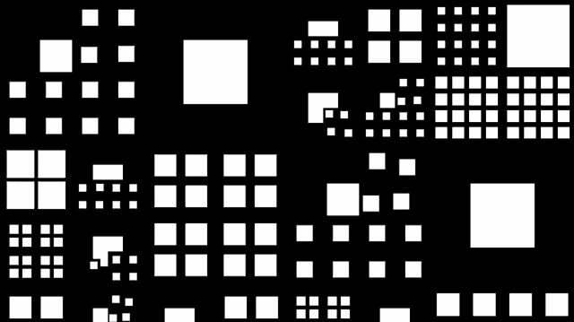
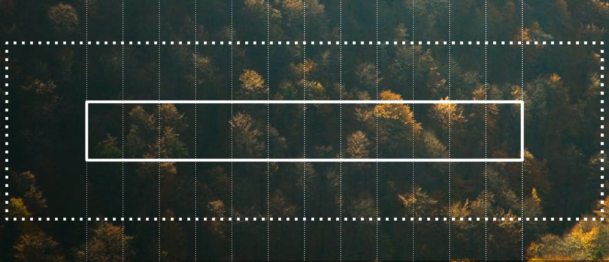
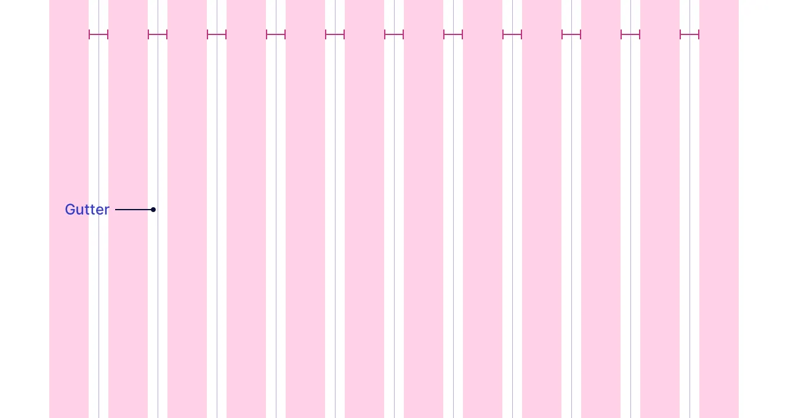
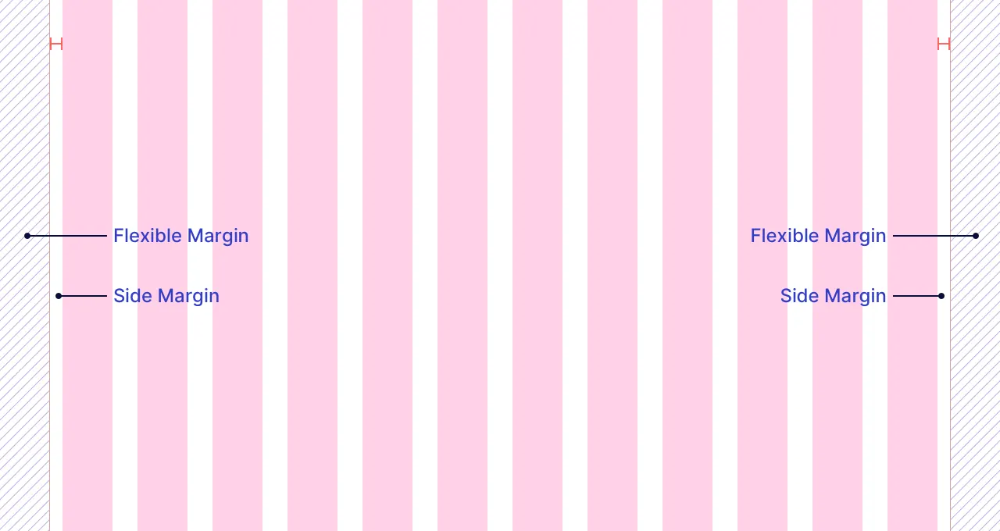
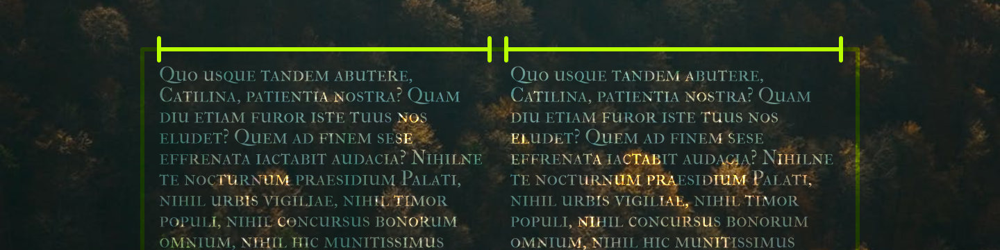
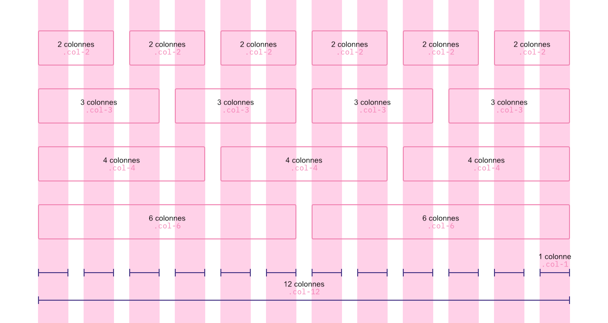
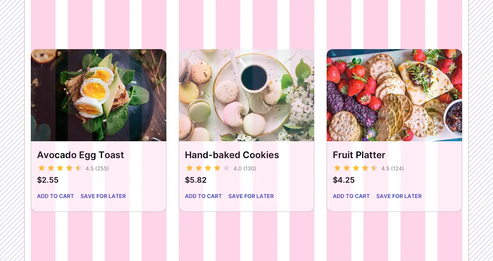
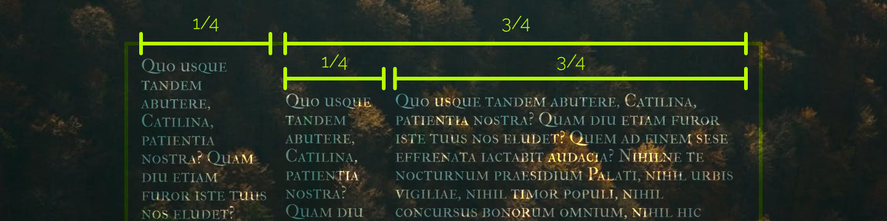

# Cours 3 | Bootstrap 1/2

*[CDN]: Content Delivery Network

## Annonces

### Tutorat

[Calendrier du centre d'aide en intégration multimédia](https://www.cmontmorency.qc.ca/etudiants/services-aux-etudiants/aide-a-la-reussite/aide-techniques/centre-aide-integration-multimedia/)

### Recensement de la population étudiante

[Sondage](https://sondage-spec.com/sondage/c443a486fa27e5e3058ef15920ad37a8){ .md-button .md-button--primary }

## Bootstrap


Bootstrap est un cadriciel (*framework*) front-end qui offre une structure de styles et de mise en page permettant aux développeurs de ne pas réinventer la roue à chaque projet. Il fournit une [collection de composantes](https://getbootstrap.com/docs/5.3/examples/cheatsheet/) (*components*) ainsi que plusieurs classes CSS facilitant la création de sites Web réactifs (*responsive*).

Exemple :

<iframe class="aspect-16-9" height="300" style="width: 100%;" scrolling="no" title="Bootstrap - Formulaire" src="https://codepen.io/tim-momo/embed/XWLmrqZ?default-tab=result&theme-id=50173" frameborder="no" loading="lazy" allowtransparency="true" allowfullscreen="true">
  See the Pen <a href="https://codepen.io/tim-momo/pen/XWLmrqZ">
  Bootstrap - Formulaire</a> by TIM Montmorency (<a href="https://codepen.io/tim-momo">@tim-momo</a>)
  on <a href="https://codepen.io">CodePen</a>.
</iframe>

## Installation

Bootstrap a deux fichiers d'installation. Un fichier CSS et un JavaScript pour les composantes dynamiques. Pour commencer, nous utiliserons seulement la partie CSS.

Pour installer Bootstrap, il y a trois différentes méthodes :

* **La méthode classique** (fichiers locaux) : On télécharge les fichiers CSS et JS depuis le site officiel de Bootstrap, puis on les place dans le projet.
* **La méthode via un [CDN](https://getbootstrap.com/docs/5.3/getting-started/download/#cdn-via-jsdelivr)** : On ne télécharge rien. On utilise une adresse fournie par un serveur externe qui héberge Bootstrap.
* **La méthode contemporaine** : On installe Bootstrap via un gestionnaire de paquets (ex: npm) et on l’importe dans le projet avec un _bundler_ (ex: Vite, Webpack ou Parcel).

La manière la plus rapide ⚡️ est la méthode via un CDN. Il suffit de lier le CSS de Bootstrap dans la partie `<head>` de votre site :

<!-- ```html title="CSS de Bootstrap"
<link href="https://cdn.jsdelivr.net/npm/bootstrap@5.3.8/dist/css/bootstrap.min.css" rel="stylesheet" integrity="sha384-sRIl4kxILFvY47J16cr9ZwB07vP4J8+LH7qKQnuqkuIAvNWLzeN8tE5YBujZqJLB" crossorigin="anonymous">
``` -->

<!-- !!! question "integrity & crossorigin 🤔"

    integrity est une empreinte cryptographique pour éviter une attaque « man-in-the-middle » qui remplacerait le fichier par du code dangereux.

    crossorigin : relatif au concept de CORS (Cross-Origin Resource Sharing) -->

<!-- Voici un aperçu du HTML de départ. -->

```html hl_lines="5" title="CSS Bootstrap"
<!DOCTYPE html>
<html lang="fr">
<head>
    <title>Bootstrap</title>
    <link href="https://cdn.jsdelivr.net/npm/bootstrap@5.3.8/dist/css/bootstrap.min.css" rel="stylesheet" integrity="sha384-sRIl4kxILFvY47J16cr9ZwB07vP4J8+LH7qKQnuqkuIAvNWLzeN8tE5YBujZqJLB" crossorigin="anonymous">
</head>
<body>
    
</body>
</html>
```

## Système de grille



<!--  -->

Bootstrap repose sur un [système de grille](https://getbootstrap.com/docs/5.3/layout/grid/) (_grid system_) basé sur flexbox en CSS. Il permet de créer des mises en page _responsives_ en découpant l’espace en 12 colonnes.

<!-- Source : https://medium.com/@nitishkmrk/responsive-grid-design-ultimate-guide-7aa41ca7892 -->

<!-- <div class="grid grid-1-3" markdown>
{data-zoom-image}

Séparations de type flexbox (gutter)
</div>

<div class="grid grid-1-3" markdown>
{data-zoom-image}

Marges
</div> -->

### Conteneur

{data-zoom-image}

Un [conteneur](https://getbootstrap.com/docs/5.3/layout/containers/) en Bootstrap c'est simplement une classe CSS qui définit la largeur maximale du contenu et qui gère les marges latérales.

```html
<div class="container">
  Contenu de ma page
</div>
```

Exemple :

<iframe height="300" style="width: 100%;" scrolling="no" title="Bootstrap - Conteneurs" src="https://codepen.io/tim-momo/embed/OPyqbgv/84d4a17ddb986f34dc2112acfd02edf7?default-tab=result&theme-id=50173" frameborder="no" loading="lazy" allowtransparency="true" allowfullscreen="true">
  See the Pen <a href="https://codepen.io/tim-momo/pen/OPyqbgv/84d4a17ddb986f34dc2112acfd02edf7">
  Bootstrap - Conteneurs</a> by TIM Montmorency (<a href="https://codepen.io/tim-momo">@tim-momo</a>)
  on <a href="https://codepen.io">CodePen</a>.
</iframe>

<!-- 
Il y a certaines configurations possibles. Voici les trois variantes de classe CSS :

* `.container` : largeur fixe, adaptée au breakpoint
* `.container-fluid` : largeur toujours à 100%
* `.container-{breakpoint}` : largeur fixe à partir du [breakpoint](https://getbootstrap.com/docs/5.3/layout/breakpoints/#available-breakpoints) indiqué

```html
<div class="container">
  Conteneur classique
</div>

<div class="container-fluid">
  Conteneur fluide (100%)
</div>

<div class="container-md">
  Conteneur fluide en petit écran, fixe à partir du breakpoint md
</div>
```

[:simple-codepen: Exemple responsive](https://codepen.io/tim-momo/live/YzoXmxE/d9ea04613092a1049bb7433e3331269a) -->

### Colonnes

{data-zoom-image}

La grille fonctionne avec 2 niveaux obligatoires :

* `.row` : une rangée
* `.col` : une colonne à l’intérieur d’une rangée

```html
<div class="container">
  <div class="row">
    <div class="col">Colonne 1</div>
    <div class="col">Colonne 2</div>
  </div>
</div>
```

### Fractions

{data-zoom-image}

On peut contrôler combien de colonnes (sur 12) un élément occupe.

```html
<div class="row">
  <div class="col-3">Colonne 25% (Occupe 3 colonnes sur 12)</div>
  <div class="col-9">Colonne 75% (Occupe 9 colonnes sur 12)</div>
</div>
```

:fontawesome-solid-circle-info: Si on ne précise pas de taille (ex.: `.col`), Bootstrap répartit automatiquement l’espace.

<div class="grid grid-1-3" markdown>
{data-zoom-image}

Système à 12 colonnes
</div>

<div class="grid grid-1-3" markdown>
{data-zoom-image}

Exemple
</div>

### Offset

{data-zoom-image}

On peut “pousser” une colonne vers la droite.

```html
<div class="row">
  <div class="col-9 offset-3">Décalée de 3 colonnes</div>
</div>
```

### Imbriqué

{data-zoom-image}

On peut placer une rangée (.row) à l’intérieur d’une colonne.

```html
<div class="row">

  <div class="col-3">Colonne de gauche</div>

  <div class="col-9">
    Colonne de droite
    <div class="row">
      <div class="col-3">Sous-colonne 1</div>
      <div class="col-9">Sous-colonne 2</div>
    </div>
  </div>

</div>
```

## Typographie & couleurs

{.w-100}

Bootstrap fournit un ensemble de classes utilitaires pour styliser le texte, gérer les titres, l’alignement et appliquer une palette de couleurs uniforme.

### Titres

Bon d'abord il faut savoir Bootstrap applique un thème aux titres dits natifs ( `<h1>` à `<h6>`), mais Bootstrap offre aussi des classes pour afficher n'importe quel texte comme un titre. Les classes [`.h1` à `.h6`](https://getbootstrap.com/docs/5.3/content/typography/#headings) permettent d’appliquer la taille d’un titre sans changer la balise.

```html
<p class="h1">Paragraphe affiché comme un titre h1 !</p>
```

Les classes `.display-*` affichent de [très gros titres](https://getbootstrap.com/docs/5.3/content/typography/#display-headings).

```html
<h1 class="display-1">Titre énorme</h1>
<h1 class="display-4">Titre un peu plus petit</h1>
```

### Paragraphes

La classe [`.lead`](https://getbootstrap.com/docs/5.3/content/typography/#lead) donne un style « introduction ». Ça le rend un peu plus gros que le texte normal.

Pour l'inverse, il y a la classe [`.small`](https://getbootstrap.com/docs/5.3/content/typography/#inline-text-elements) qui réduit la taille du texte.

```html
<p class="lead">Ceci est un texte d’intro.</p>
<p>Ceci est un texte normal.</p>
<p class="small">Ceci est un petit texte.</p>
```

### Utilitaires de texte

* [Taille de la police](https://getbootstrap.com/docs/5.3/utilities/text/#font-size) : `.fs-1` à `fs-6`
* [Alignement](https://getbootstrap.com/docs/5.3/utilities/text/#text-alignment) : `.text-start`, `.text-center`, `.text-end`
* [Transformation](https://getbootstrap.com/docs/5.3/utilities/text/#text-transform) : `.text-lowercase`, `.text-uppercase`, `.text-capitalize`
* [Gras et italic](https://getbootstrap.com/docs/5.3/utilities/text/#font-weight-and-italics) : `.fw-bold`, `.fst-italic`
* [Interlignage](https://getbootstrap.com/docs/5.3/utilities/text/#line-height) : `.lh-1`, `lh-base`, `lh-lg`

### Couleurs

Bootstrap propose une liste de mots réservés afin de créer une palette de couleur contextuelle. En voici quelques uns :

<iframe class="aspect-16-9" height="300" style="width: 100%;" scrolling="no" title="Couleur - Primary" src="https://codepen.io/tim-momo/embed/poXJXaO?default-tab=result&theme-id=50173" frameborder="no" loading="lazy" allowtransparency="true" allowfullscreen="true">
  See the Pen <a href="https://codepen.io/tim-momo/pen/poXJXaO">
  Couleur - Primary</a> by TIM Montmorency (<a href="https://codepen.io/tim-momo">@tim-momo</a>)
  on <a href="https://codepen.io">CodePen</a>.
</iframe>

La raison pour laquelle Bootstrap s'est dotté de mots réservés de la sorte est pour un usage sémantique des classes.

Il y a plusieurs classes de [couleur de texte](https://getbootstrap.com/docs/5.3/utilities/colors/#colors) et d'autres pour les [couleur de fond](https://getbootstrap.com/docs/5.3/utilities/background/#background-color).

<div class="grid">
```scss title="Couleur de texte"
.text-primary
.text-secondary
.text-dark
```

```scss title="Couleur de fond"
.bg-primary
.bg-secondary
.bg-dark
```
</div>

### Classes magiques 🪄

Les classes de couleur « [hybrid](https://getbootstrap.com/docs/5.3/helpers/color-background/) » permettent de spécifier en une seule classe, la couleur de fond ainsi que la couleur du texte approprié. La couleur du texte est déterminée dynamiquement !

<iframe class="aspect-4-1" height="300" style="width: 100%;" scrolling="no" title="Bootstrap - Couleurs" src="https://codepen.io/tim-momo/embed/dPYrvYL?default-tab=html%2Cresult&theme-id=50173" frameborder="no" loading="lazy" allowtransparency="true" allowfullscreen="true">
  See the Pen <a href="https://codepen.io/tim-momo/pen/dPYrvYL">
  Bootstrap - Couleurs</a> by TIM Montmorency (<a href="https://codepen.io/tim-momo">@tim-momo</a>)
  on <a href="https://codepen.io">CodePen</a>.
</iframe>

## Boutons

Les [boutons](https://getbootstrap.com/docs/5.3/components/buttons/) Bootstrap utilisent tous la classe `.btn`.

Le style de bouton est concu pour être utilisées avec l’élément `<button>`. Cependant, vous pouvez aussi les appliquer aux éléments `<a>` ou `<input>` (même si certains navigateurs peuvent produire un rendu légèrement différent).

```html title="Syntaxe"
<button class="btn btn-primary">Primary</button>
<button class="btn btn-primary btn-sm">Petit primary</button>
<button class="btn btn-outline-primary">Contour</button>
<button class="btn btn-primary btn-block" disabled>Désactivé</button>
```

<iframe class="aspect-4-3" height="300" style="width: 100%;" scrolling="no" title="Bootstrap - Boutons" src="https://codepen.io/tim-momo/embed/abgOzzm?default-tab=result&editable=true&theme-id=50173" frameborder="no" loading="lazy" allowtransparency="true" allowfullscreen="true">
  See the Pen <a href="https://codepen.io/tim-momo/pen/abgOzzm">
  Bootstrap - Boutons</a> by TIM Montmorency (<a href="https://codepen.io/tim-momo">@tim-momo</a>)
  on <a href="https://codepen.io">CodePen</a>.
</iframe>

### Groupes de boutons

Pour afficher un [groupe de boutons](https://getbootstrap.com/docs/5.3/components/button-group/#basic-example), enveloppez les dans un div avec la classe `.btn-group`.

```html
<div class="btn-group">
  <button class="btn btn-primary">Gauche</button>
  <button class="btn btn-primary">Centre</button>
  <button class="btn btn-primary">Droite</button>
</div>
```

## Image

La classe CSS `.img-fluid` est utilisée pour rendre les images réactives (responsive). Cette classe applique les styles nécessaires pour que l’image s’adapte automatiquement à la largeur de son conteneur, tout en conservant son ratio original.

```html title="Utilisation"

```

<iframe class="aspect-4-3" height="300" style="width: 100%;" scrolling="no" title="Form" src="https://codepen.io/tim-momo/embed/dyBYbqr?default-tab=result&theme-id=50210" frameborder="no" loading="lazy" allowtransparency="true" allowfullscreen="true">
  See the Pen <a href="https://codepen.io/tim-momo/pen/dyBYbqr">
  Form</a> by TIM Montmorency (<a href="https://codepen.io/tim-momo">@tim-momo</a>)
  on <a href="https://codepen.io">CodePen</a>.
</iframe>

## Espacement

{.w-100}

La gestion des espacements en Bootstrap est beaucoup plus simple qu'il n'y parait. Il suffit de connaitre la syntaxe.

Les classes CSS sont construites de la façon suivante : `.{propriété}{côté}-{taille}`.

<div class="grid cards" markdown>

- **Propriété**

    `m` = margin<br>
    `p` = padding

- **Côté**

    `t` = top<br>
    `b` = bottom<br>
    `s` = left (start)<br>
    `e` = right (end)<br>
    `x` = l'axe des x<br>
    `y` = l'axe des y

- **Taille**

    `0` = 0<br>
    `1` = 0.25rem<br>
    `2` = 0.5rem<br>
    `3` = 1rem<br>
    `4` = 1.5rem<br>
    `5` = 3rem<br>
    `auto`

</div>

```css title="Exemples de classes d'espacement"
.m-0     .my-4
.p-1     .ps-2
```

<iframe class="aspect-4-1" height="300" style="width: 100%;" scrolling="no" title="Image fluid" src="https://codepen.io/tim-momo/embed/jOjbNdm?default-tab=html%2Cresult&theme-id=50173&editable=true" frameborder="no" loading="lazy" allowtransparency="true" allowfullscreen="true">
  See the Pen <a href="https://codepen.io/tim-momo/pen/jOjbNdm">
  Image fluid</a> by TIM Montmorency (<a href="https://codepen.io/tim-momo">@tim-momo</a>)
  on <a href="https://codepen.io">CodePen</a>.
</iframe>

## Display

{.w-100}

Les classes CSS de type [display](https://getbootstrap.com/docs/5.3/utilities/display) sont construites de la façon suivante : `d-{affichage}`

| Valeur CSS      | Classe Bootstrap      |
|-----------------|-----------------------|
| `none`          | `.d-none`             |
| `inline`        | `.d-inline`           |
| `inline-block`  | `.d-inline-block`     |
| `block`         | `.d-block`            |
| `grid`          | `.d-grid`             |
| `inline-grid`   | `.d-inline-grid`      |
| `table`         | `.d-table`            |
| `table-cell`    | `.d-table-cell`       |
| `table-row`     | `.d-table-row`        |
| `flex`          | `.d-flex`             |
| `inline-flex`   | `.d-inline-flex`      |

### Display flex


En temps normal, le système de grille flex de Boostrap devrait convenir à 95% des cas. Toutefois, si on a besoin de construire sa propre structure, on le faire avec [.d-flex](https://getbootstrap.com/docs/5.3/utilities/flex/).

#### Justification

```html
<div class="d-flex justify-content-start">...</div>
<div class="d-flex justify-content-end">...</div>
<div class="d-flex justify-content-center">...</div>
<div class="d-flex justify-content-between">...</div>
<div class="d-flex justify-content-around">...</div>
<div class="d-flex justify-content-evenly">...</div>
```

<iframe class="aspect-3-2" height="300" style="width: 100%;" scrolling="no" title="Card" src="https://codepen.io/tim-momo/embed/PorgjoK?default-tab=&theme-id=50173" frameborder="no" loading="lazy" allowtransparency="true" allowfullscreen="true">
  See the Pen <a href="https://codepen.io/tim-momo/pen/PorgjoK">
  Card</a> by TIM Montmorency (<a href="https://codepen.io/tim-momo">@tim-momo</a>)
  on <a href="https://codepen.io">CodePen</a>.
</iframe>

#### Alignement

```html
<div class="d-flex align-items-start">...</div>
<div class="d-flex align-items-end">...</div>
<div class="d-flex align-items-center">...</div>
<div class="d-flex align-items-baseline">...</div>
<div class="d-flex align-items-stretch">...</div>
```

<iframe class="aspect-1-1" height="300" style="width: 100%;" scrolling="no" title="Display Flex - justify-content" src="https://codepen.io/tim-momo/embed/jOjRwbv?default-tab=&theme-id=50173" frameborder="no" loading="lazy" allowtransparency="true" allowfullscreen="true">
  See the Pen <a href="https://codepen.io/tim-momo/pen/jOjRwbv">
  Display Flex - justify-content</a> by TIM Montmorency (<a href="https://codepen.io/tim-momo">@tim-momo</a>)
  on <a href="https://codepen.io">CodePen</a>.
</iframe>

#### Order

L'[ordre](https://getbootstrap.com/docs/5.3/utilities/flex/#order) des div peut être changé en CSS. Merci au système flexbox 😜

```html
<div class="d-flex">
    <div class="order-3 p-2">Premier item flex</div>
    <div class="order-2 p-2">Deuxième item flex</div>
    <div class="order-1 p-2">Troisième item flex</div>
  </div>
```

<iframe class="aspect-4-1" height="300" style="width: 100%;" scrolling="no" title="Bootstrap - Order" src="https://codepen.io/tim-momo/embed/bNVZRdJ?default-tab=result&theme-id=50173" frameborder="no" loading="lazy" allowtransparency="true" allowfullscreen="true">
  See the Pen <a href="https://codepen.io/tim-momo/pen/bNVZRdJ">
  Bootstrap - Order</a> by TIM Montmorency (<a href="https://codepen.io/tim-momo">@tim-momo</a>)
  on <a href="https://codepen.io">CodePen</a>.
</iframe>

## Mode sombre (darkmode)

{.w-50}

Pour activer le mode sombre, il suffit d’ajouter l'attribut `data-bs-theme="dark"` à l'élément `<html>` ou `<body>` de votre page :

```html
<html data-bs-theme="dark">
```

Les valeurs possibles sont `dark`, `light` et `auto`.

Notez que lorsque le _darkmode_ est actif, les couleurs s'ajustent en fonction de cette nouvelle réalité.

## Breakpoints

Voici les [breakpoints](https://getbootstrap.com/docs/5.3/layout/breakpoints/) par défaut :

| Breakpoint        | Dimensions | Équivalence CSS                   |
|-------------------|------------|-----------------------------------|
| xs                | < 576px    | `@media (max-width: 575.98px) {}` |
| sm                | ≥ 576px    | `@media (min-width: 576px) {}`    |
| md                | ≥ 768px    | `@media (min-width: 768px) {}`    |
| lg                | ≥ 992px    | `@media (min-width: 992px) {}`    |
| xl                | ≥ 1200px   | `@media (min-width: 1200px) {}`   |
| xxl               | ≥ 1400px   | `@media (min-width: 1400px) {}`   |

Bootstrap est _[mobile-first](https://developer.mozilla.org/en-US/docs/Glossary/Mobile_First)_. C'est à dire qu'il est pensé entièrement responsive. En fait, la plupart des classes utilitaires ont une variante responsive afin de spécifier au style à quel moment il doit être actif.

### Conteneurs

Lorsqu'on applique la notion de breakpoint aux conteneurs, on spécifie à quel « moment » le conteneur commence à en être un.

| Classe                  | sm         | md         | lg         | xl         | xxl        |
|-------------------------|------------|------------|------------|------------|------------|
| `.container`            | ✅ `540px` | ✅ `720px` | ✅ `960px` | ✅ `1140px`| ✅ `1320px`|
| `.container-sm`         | ✅ `540px` | ✅ `720px` | ✅ `960px` | ✅ `1140px`| ✅ `1320px`|
| `.container-md`         | ❌ `100%`  | ✅ `720px` | ✅ `960px` | ✅ `1140px`| ✅ `1320px`|
| `.container-lg`         | ❌ `100%`  | ❌ `100%`  | ✅ `960px` | ✅ `1140px`| ✅ `1320px`|
| `.container-xl`         | ❌ `100%`  | ❌ `100%`  | ❌ `100%`  | ✅ `1140px`| ✅ `1320px`|
| `.container-xxl`        | ❌ `100%`  | ❌ `100%`  | ❌ `100%`  | ❌ `100%`  | ✅ `1320px`|
| `.container-fluid`      | ❌ `100%`  | ❌ `100%`  | ❌ `100%`  | `❌ 100%`  | ❌ `100%`  |

<iframe height="300" style="width: 100%;" scrolling="no" title="Bootstrap - Conteneurs" src="https://codepen.io/tim-momo/embed/preview/YzoXmxE/d9ea04613092a1049bb7433e3331269a?default-tab=result&editable=true&theme-id=50173" frameborder="no" loading="lazy" allowtransparency="true" allowfullscreen="true">
  See the Pen <a href="https://codepen.io/tim-momo/pen/YzoXmxE/d9ea04613092a1049bb7433e3331269a">
  Bootstrap - Conteneurs</a> by TIM Montmorency (<a href="https://codepen.io/tim-momo">@tim-momo</a>)
  on <a href="https://codepen.io">CodePen</a>.
</iframe>

### Système de grille

Les classes responsives sont construites de la façon suivante :  `.col-{breakpoint}-{colonnes}`.

Lorsqu'on applique la notion de breakpoint aux colonnes, on spécifie à quel « moment » la colonne affiche la propotion spécifiée.

|                         | sm         | md         | lg         | xl         | xxl         |
|-------------------------|------------|------------|------------|------------|-------------|
| Exemple responsive de `.col-6`                 | `.col-6`    | `.col-sm-6` | `.col-lg-6` | `.col-xl-6` | `.col-xxl-6` |

<iframe height="300" style="width: 100%;" scrolling="no" title="Bootstrap - Colonnes responsive" src="https://codepen.io/tim-momo/embed/preview/PwPLmVB/eb283c2f8a2463245aba46249be25a66?default-tab=result&editable=true&theme-id=50173" frameborder="no" loading="lazy" allowtransparency="true" allowfullscreen="true">
  See the Pen <a href="https://codepen.io/tim-momo/pen/PwPLmVB/eb283c2f8a2463245aba46249be25a66">
  Bootstrap - Colonnes responsive</a> by TIM Montmorency (<a href="https://codepen.io/tim-momo">@tim-momo</a>)
  on <a href="https://codepen.io">CodePen</a>.
</iframe>

### Espacement

Les classes responsives sont construites de la façon suivante : `.{propriété}{côté}-{breakpoint}-{taille}`

```css title="Exemples de classes d'espacement"
.m-md-0     .my-lg-4
.p-xxl-1    .ps-sm-2
```

### Display

Les classes responsives sont construites de la façon suivante : `.d-{breakpoint}-{value}`

On utilise souvent ces classes afin de déterminer ce qui doit être affiché sur certains breakpoints.

| Taille d'écran                                              | Classe                                |
|-------------------------------------------------------------|---------------------------------------|
| :material-eye-off:{.text-danger} Caché sur tous             | `.d-none`                             |
| :material-eye-off:{.text-danger} Caché uniquement sur xs    | `.d-none` `.d-sm-block`               |
| :material-eye-off:{.text-danger} Caché uniquement sur sm    | `.d-sm-none` `.d-md-block`            |
| :material-eye-off:{.text-danger} Caché uniquement sur md    | `.d-md-none` `.d-lg-block`            |
| :material-eye-off:{.text-danger} Caché uniquement sur lg    | `.d-lg-none` `.d-xl-block`            |
| :material-eye-off:{.text-danger} Caché uniquement sur xl    | `.d-xl-none` `.d-xxl-block`           |
| :material-eye-off:{.text-danger} Caché uniquement sur xxl   | `.d-xxl-none`                         |
| :material-eye:{.text-success} Visible partout               | `.d-block`                            |
| :material-eye:{.text-success} Visible uniquement sur xs     | `.d-block` `.d-sm-none`               |
| :material-eye:{.text-success} Visible uniquement sur sm     | `.d-none` `.d-sm-block` `.d-md-none`  |
| :material-eye:{.text-success} Visible uniquement sur md     | `.d-none` `.d-md-block` `.d-lg-none`  |
| :material-eye:{.text-success} Visible uniquement sur lg     | `.d-none` `.d-lg-block` `.d-xl-none`  |
| :material-eye:{.text-success} Visible uniquement sur xl     | `.d-none` `.d-xl-block` `.d-xxl-none` |
| :material-eye:{.text-success} Visible uniquement sur xxl    | `.d-none` `.d-xxl-block`              |

<iframe height="300" style="width: 100%;" scrolling="no" title="Bootstrap - Display responsive" src="https://codepen.io/tim-momo/embed/preview/OJeyJqz?default-tab=result&editable=true&theme-id=50173" frameborder="no" loading="lazy" allowtransparency="true" allowfullscreen="true">
  See the Pen <a href="https://codepen.io/tim-momo/pen/OJeyJqz">
  Bootstrap - Display responsive</a> by TIM Montmorency (<a href="https://codepen.io/tim-momo">@tim-momo</a>)
  on <a href="https://codepen.io">CodePen</a>.
</iframe>

## Exercices

<div class="grid grid-1-2" markdown>
  

  <small>Exercice - JavaScript & Bootstrap</small><br>
  **[Dark Vador](exercices/bs-darkmode.md){.stretched-link .back}**
</div>

<div class="grid grid-1-2" markdown>
  

  <small>Exercice - JavaScript & Bootstrap</small><br>
  **[Peinture à classe](exercices/bs-imagecachee.md){.stretched-link .back}**
</div>

<div class="grid grid-1-2" markdown>
  

  <small>Exercice - HTML & Bootstrap</small><br>
  **[Casse-grille](exercices/bs-casse-tete.md){.stretched-link .back}**
</div>

## Devoir

Ce devoir doit être remis au **prochain cours**. La correction et la rétroaction seront données **pendant ce même cours**.

<div class="grid grid-1-2" markdown>
  

  <small>Devoir - HTML & Bootstrap</small><br>
  **[Tarte aux pommes](./devoir/bs-devoir1/index.md){.stretched-link .back}**
</div>
