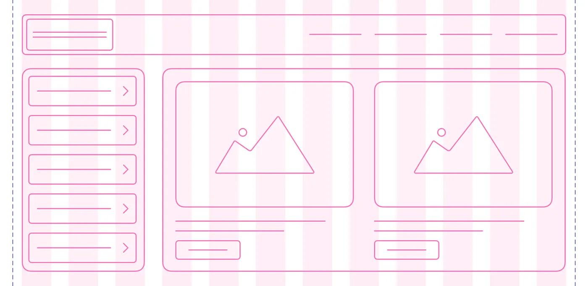
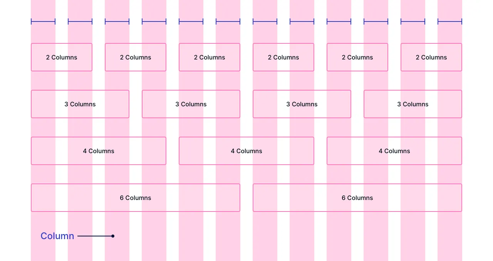

# Cours 3 | Bootstrap 1/2

*[CDN]: Content Delivery Network

## Recensement de la population étudiante

{.w-100}

[Sondage](https://sondage-spec.com/sondage/c443a486fa27e5e3058ef15920ad37a8){ .md-button .md-button--primary }

## Bootstrap


Bootstrap est un cadriciel (*framework*) front-end qui offre une structure de styles et de mise en page permettant aux développeurs de ne pas réinventer la roue à chaque projet. Il fournit une [collection de composantes](https://getbootstrap.com/docs/5.3/examples/cheatsheet/) (*components*) ainsi que plusieurs classes CSS facilitant la création de sites Web réactifs (*responsive*).

## Installation

Bootstrap a deux fichiers d'installation. Un fichier CSS et un JavaScript pour les composantes dynamiques. Pour commencer, nous utiliserons seulement la partie CSS.

Pour installer Bootstrap, il y a trois différentes méthodes :

* **La méthode classique** (fichiers locaux) : On télécharge les fichiers CSS et JS depuis le site officiel de Bootstrap, puis on les place dans le projet.
* **La méthode via un [CDN](https://getbootstrap.com/docs/5.3/getting-started/download/#cdn-via-jsdelivr)** : On ne télécharge rien. On utilise une adresse fournie par un serveur externe qui héberge Bootstrap.
* **La méthode contemporaine** : On installe Bootstrap via un gestionnaire de paquets (ex: npm) et on l’importe dans le projet avec un _bundler_ (ex: Vite, Webpack ou Parcel).

La manière la plus rapide ⚡️ est la méthode via un CDN. Il suffit de lier le CSS de Bootstrap dans la partie `<head>` de votre site :

<!-- ```html title="CSS de Bootstrap"
<link href="https://cdn.jsdelivr.net/npm/bootstrap@5.3.8/dist/css/bootstrap.min.css" rel="stylesheet" integrity="sha384-sRIl4kxILFvY47J16cr9ZwB07vP4J8+LH7qKQnuqkuIAvNWLzeN8tE5YBujZqJLB" crossorigin="anonymous">
``` -->

<!-- !!! question "integrity & crossorigin 🤔"

    integrity est une empreinte cryptographique pour éviter une attaque « man-in-the-middle » qui remplacerait le fichier par du code dangereux.

    crossorigin : relatif au concept de CORS (Cross-Origin Resource Sharing) -->

<!-- Voici un aperçu du HTML de départ. -->

```html hl_lines="5" title="CSS Bootstrap"
<!DOCTYPE html>
<html lang="fr">
<head>
    <title>Bootstrap</title>
    <link href="https://cdn.jsdelivr.net/npm/bootstrap@5.3.8/dist/css/bootstrap.min.css" rel="stylesheet" integrity="sha384-sRIl4kxILFvY47J16cr9ZwB07vP4J8+LH7qKQnuqkuIAvNWLzeN8tE5YBujZqJLB" crossorigin="anonymous">
</head>
<body>
    
</body>
</html>
```

## Système de grille


Bootstrap repose sur un [système de grille](https://getbootstrap.com/docs/5.3/layout/grid/) (_grid system_) basé sur flexbox en CSS. Il permet de créer des mises en page _responsives_ en découpant l’espace en 12 colonnes.

<!-- Source : https://medium.com/@nitishkmrk/responsive-grid-design-ultimate-guide-7aa41ca7892 -->

<div class="grid grid-1-3" markdown>
{data-zoom-image}

Concept
</div>

<div class="grid grid-1-3" markdown>
{data-zoom-image}

Système à 12 colonnes
</div>

<div class="grid grid-1-3" markdown>
{data-zoom-image}

Séparations de type flexbox (gutter)
</div>

<div class="grid grid-1-3" markdown>
{data-zoom-image}

Marges
</div>

<div class="grid grid-1-3" markdown>
{data-zoom-image}

Exemple
</div>

### Conteneur


Un conteneur en Bootstrap c'est simplement une classe CSS qui définit la largeur maximale du contenu et qui gère les marges latérales. Il y a trois variantes :

* `.container` : largeur fixe, adaptée au breakpoint
* `.container-fluid` : largeur toujours à 100%
* `.container-{breakpoint}` : largeur fixe à partir du [breakpoint](https://getbootstrap.com/docs/5.3/layout/breakpoints/#available-breakpoints) indiqué

```html
<div class="container">
  Conteneur classique
</div>

<div class="container-fluid">
  Conteneur fluide (100%)
</div>

<div class="container-md">
  Conteneur fluide en petit écran, fixe à partir du breakpoint md
</div>
```

[:material-test-tube: Exemple](https://codepen.io/tim-momo/live/YzoXmxE/d9ea04613092a1049bb7433e3331269a){ .md-button .md-button--primary }

### Colonnes


La grille fonctionne avec 2 niveaux obligatoires :

* `.row` : une rangée
* `.col` : une colonne à l’intérieur d’une rangée

```html
<div class="container">
  <div class="row">
    <div class="col">Colonne 1</div>
    <div class="col">Colonne 2</div>
    <div class="col">Colonne 3</div>
  </div>
</div>
```

### Fractions


On peut contrôler combien de colonnes (sur 12) un élément occupe.

```html
<div class="row">
  <div class="col-4">Colonne 1 (Occupe 4 colonnes sur 12)</div>
  <div class="col-8">Colonne 2 (Occupe 8 colonnes sur 12)</div>
</div>
```

:fontawesome-solid-info-circle: Si on ne précise pas de taille (ex.: `.col`), Bootstrap répartit automatiquement l’espace.

### Offset


### Imbriqué


### Breakpoints responsives

Bootstrap est _[mobile-first](https://developer.mozilla.org/en-US/docs/Glossary/Mobile_First)_.

On commence par la taille mobile (sans suffixe), puis on précise le comportement à chaque breakpoint :

| Breakpoint        | Dimensions | Équivalence CSS                   |
|-------------------|------------|-----------------------------------|
| xs                | < 576px    | `@media (max-width: 575.98px) {}` |
| sm                | ≥ 576px    | `@media (min-width: 576px) {}`    |
| md                | ≥ 768px    | `@media (min-width: 768px) {}`    |
| lg                | ≥ 992px    | `@media (min-width: 992px) {}`    |
| xl                | ≥ 1200px   | `@media (min-width: 1200px) {}`   |
| xxl               | ≥ 1400px   | `@media (min-width: 1400px) {}`   |


## Couleurs

<div class="grid" markdown>
  <div markdown>
  Les [couleurs bootstrap](https://getbootstrap.com/docs/5.3/customize/color/) sont représentées par des **identifiants** auxquels sont assignées des couleurs prédéfinies.

  Voici la liste des **identifiants** associés à leur couleur respective.
  </div>

  <iframe class="aspect-1-1" height="300" style="width: 100%;" scrolling="no" title="Couleur - Primary" src="https://codepen.io/tim-momo/embed/poXJXaO?default-tab=result&theme-id=50173" frameborder="no" loading="lazy" allowtransparency="true" allowfullscreen="true">
    See the Pen <a href="https://codepen.io/tim-momo/pen/poXJXaO">
    Couleur - Primary</a> by TIM Montmorency (<a href="https://codepen.io/tim-momo">@tim-momo</a>)
    on <a href="https://codepen.io">CodePen</a>.
  </iframe>
</div>

### Variables

Ces **identifiants** (primary, secondary, light, dark, etc.) sont utilisés dans des variables CSS, ce qui permet de personnaliser facilement les couleurs de Bootstrap.

Par exemple, si on souhaite changer la couleur associée à `primary`, on peut tout simplement réécrire les variables concernées :

```css
:root {
  --bs-primary: #6610f2;
  --bs-primary-rgb: 102, 16, 242;
}
```

<iframe class="aspect-4-1" height="300" style="width: 100%;" scrolling="no" title="Couleurs" src="https://codepen.io/tim-momo/embed/WNqvqKJ?default-tab=result&theme-id=50173" frameborder="no" loading="lazy" allowtransparency="true" allowfullscreen="true">
  See the Pen <a href="https://codepen.io/tim-momo/pen/WNqvqKJ">
  Couleurs</a> by TIM Montmorency (<a href="https://codepen.io/tim-momo">@tim-momo</a>)
  on <a href="https://codepen.io">CodePen</a>.
</iframe>

!!! info "Préfix des variables"
    Afin de ne pas interférer avec d'autres variables potentielles d'un projet, Bootstrap permet d'ajouter un préfix aux variables. Par défaut, le préfix est `bs-`.

Pour connaitre le nom des variables Bootstrap, il suffit de consulter la [documentation officielle](https://getbootstrap.com/docs/5.3/customize/css-variables/) ou encore, consulter l'inspecteur du navigateur.

{data-zoom-image}

### Classes

Bootstrap fournit un vaste ensemble de classes CSS prêtes à l’emploi.

Par exemple, pour appliquer différents styles associés à la couleurs `danger`, voici quelques classes CSS disponibles.

```scss
.text-danger           // Couleur de texte
.bg-danger             // Couleur de fond
.border-danger         // Couleur de bordure
.btn-danger            // Couleur de bouton
.btn-outline-danger    // Couleur de bouton
.alert-danger          // Couleur de message
.badge-danger          // Couleur de pastille
.table-danger          // Couleur de tableau
.link-danger           // Couleur de lien
```

Dans l'exemple ci-dessous, on voit l'effet des classes CSS Bootstrap sur du code HTML.

<iframe class="aspect-3-2" height="300" style="width: 100%;" scrolling="no" title="Couleur - Danger" src="https://codepen.io/tim-momo/embed/MWMwYeY?default-tab=html%2Cresult&editable=true&theme-id=50173" frameborder="no" loading="lazy" allowtransparency="true" allowfullscreen="true">
  See the Pen <a href="https://codepen.io/tim-momo/pen/MWMwYeY">
  Couleur - Danger</a> by TIM Montmorency (<a href="https://codepen.io/tim-momo">@tim-momo</a>)
  on <a href="https://codepen.io">CodePen</a>.
</iframe>

!!! example "Exercice rapide"
    Change le nom des classes CSS avec différents identifiants Bootstrap.
    Par exemple, remplace les mentions `danger` par `primary` ou `warning` et observe le résultat.

### Mode sombre (darkmode)


Pour activer le mode sombre, il suffit d’ajouter l'attribut `data-bs-theme="dark"` à l'élément `<html>` ou `<body>` de votre page :

```html
<html data-bs-theme="dark">
```

## Points d'arrêt

{.invert} [^breakpoint]

[^breakpoint]: Illustration breakpoint : https://webandcrafts.com/blog/beginners-guide-to-responsive-web-design

Un point d'arrêt, point de rupture ou en anglais, [breakpoint](https://blog.froont.com/9-basic-principles-of-responsive-web-design/), est une condition où la mise en page du site Web change pour s’adapter à différentes tailles d’écran.

Le breakpoint est une notion importante des « [media queries](https://tim-montmorency.com/timdoc/582-211MO/css/media-queries/) » en CSS.

Voici un exemple traditionnel de gestion de breakpoint :

```scss
.col {
  width: 50%;
}

@media (max-width: 992px) { // 👈 Breakpoint
  .col {
    width: 100%;
  }
}
```

En Bootstrap, plusieurs points de rupture (breakpoints) sont prédéfinis !

Portez une attention particulière à la colonne des suffixes. Nous y reviendrons 😜.

| Point de rupture  | Suffixe de classe | Dimensions | CSS                               |
|-------------------|-------------------|------------|-----------------------------------|
| Extra petit       | `xs`              | `<576px`   | `@media (max-width: 575.98px) {}` |
| Petit             | `sm`              | `≥576px`   | `@media (min-width: 576px) {}`    |
| Moyen             | `md`              | `≥768px`   | `@media (min-width: 768px) {}`    |
| Large             | `lg`              | `≥992px`   | `@media (min-width: 992px) {}`    |
| Extra large       | `xl`              | `≥1200px`  | `@media (min-width: 1200px) {}`   |
| Extra extra large | `xxl`             | `≥1400px`  | `@media (min-width: 1400px) {}`   |

!!! info "Navigateur de breakpoint 😱"
    [Responsively App Downloads](https://responsively.app/download) est un outil intéressant pour visionner en un coup d'oeil le site sur plusiers appareils.

## Conteneurs

Un conteneur Bootstrap c'est simplement une classe CSS qu'on assigne à un `<div>` dans le but de définir sa largeur.

```html
<div class="container">
  ...
</div>
```

Les tailles des conteneurs selon les différents points de rupture de la page.

| CSS                     | sm      | md      | lg      | xl      | xxl     |
|-------------------------|---------|---------|---------|---------|---------|
| `.container` :fontawesome-regular-hand-point-left:{ .horizontal-anim .valign-bottom }           | `540px` | `720px` | `960px` | `1140px`| `1320px`|
| `.container-sm`         | `540px` | `720px` | `960px` | `1140px`| `1320px`|
| `.container-md`         | `100%`  | `720px` | `960px` | `1140px`| `1320px`|
| `.container-lg`         | `100%`  | `100%`  | `960px` | `1140px`| `1320px`|
| `.container-xl`         | `100%`  | `100%`  | `100%`  | `1140px`| `1320px`|
| `.container-xxl`        | `100%`  | `100%`  | `100%`  | `100%`  | `1320px`|
| `.container-fluid` :fontawesome-regular-hand-point-left:{ .horizontal-anim .valign-bottom }      | `100%`  | `100%`  | `100%`  | `100%`  | `100%`  |

Démonstration

<iframe class="aspect-16-9" height="300" style="width: 100%;" scrolling="no" title="Container" src="https://codepen.io/tim-momo/embed/YzoXmxE/d9ea04613092a1049bb7433e3331269a?default-tab=result&editable=true&theme-id=50173" frameborder="no" loading="lazy" allowtransparency="true" allowfullscreen="true">
  See the Pen <a href="https://codepen.io/tim-momo/pen/YzoXmxE/d9ea04613092a1049bb7433e3331269a">
  Container</a> by TIM Montmorency (<a href="https://codepen.io/tim-momo">@tim-momo</a>)
  on <a href="https://codepen.io">CodePen</a>.
</iframe>

## Système de grille (grid system)

<iframe class="aspect-4-1" height="300" style="width: 100%;" scrolling="no" title="Grille" src="https://codepen.io/tim-momo/embed/LYKVwKQ?default-tab=&editable=true&theme-id=50173" frameborder="no" loading="lazy" allowtransparency="true" allowfullscreen="true">
  See the Pen <a href="https://codepen.io/tim-momo/pen/LYKVwKQ">
  Grille</a> by TIM Montmorency (<a href="https://codepen.io/tim-momo">@tim-momo</a>)
  on <a href="https://codepen.io">CodePen</a>.
</iframe>

[Documentation officielle](https://getbootstrap.com/docs/5.3/layout/grid/)

Bootstrap vient avec un système de grille à 12 colonnes. Il nous permet d'ajouter facilement des colonnes sans avoir à écrire une seule ligne de CSS. Voici la syntaxe :

```html
<div class="container">
  <div class="row">
    <div class="col">Colonne 1</div>
    <div class="col">Colonne 2</div>
    <div class="col">Colonne 3</div>
    <div class="col">etc.</div>
  </div>
</div>
```

Lorsqu'on veut spécifier une taille de colonne, on doit ajuster la classe CSS `.col` et lui spécifier une proportion sur 12 colonnes. Voici un exemple :

<iframe class="aspect-16-9" height="300" style="width: 100%;" scrolling="no" title="Grille CSS" src="https://codepen.io/tim-momo/embed/wvLKwWv?default-tab=result&editable=true&theme-id=50173" frameborder="no" loading="lazy" allowtransparency="true" allowfullscreen="true">
  See the Pen <a href="https://codepen.io/tim-momo/pen/wvLKwWv">
  Grille CSS</a> by TIM Montmorency (<a href="https://codepen.io/tim-momo">@tim-momo</a>)
  on <a href="https://codepen.io">CodePen</a>.
</iframe>

On peut également utiliser les suffixes de point de rupture. Ainsi nos colonnes deviennent *responsive*!

<iframe class="aspect-16-9" height="300" style="width: 100%;" scrolling="no" title="Grille Tailles" src="https://codepen.io/tim-momo/embed/wvLKwea?default-tab=result&editable=true&theme-id=50173" frameborder="no" loading="lazy" allowtransparency="true" allowfullscreen="true">
  See the Pen <a href="https://codepen.io/tim-momo/pen/wvLKwea">
  Grille Tailles</a> by TIM Montmorency (<a href="https://codepen.io/tim-momo">@tim-momo</a>)
  on <a href="https://codepen.io">CodePen</a>.
</iframe>

Enfin, la notion d'[offset](https://getbootstrap.com/docs/5.3/layout/columns/#offsetting-columns) permet d'espacer les colonnes par la gauche.

## Ordre CSS

[Bootstrap, flex et order](https://getbootstrap.com/docs/5.3/utilities/flex/#order)

## Espacement

La gestion des espacements en Bootstrap est beaucoup plus simple qu'il n'y parait. Il suffit de connaitre la syntaxe.

Les classes CSS sont construites de la façon suivante : `{propriété}{côté}-{taille}` et `{propriété}{côté}-{breakpoint}-{taille}`

<div class="grid cards" markdown>

-   **Propriété**

    ---

    `m` = margin<br>
    `p` = padding

-   **Côté**

    ---

    `t` = top<br>
    `b` = bottom<br>
    `s` = left (start)<br>
    `e` = right (end)<br>
    `x` = l'axe des x<br>
    `y` = l'axe des y

-   **Taille**

    ---

    `0` = 0<br>
    `1` = 0.25rem<br>
    `2` - 0.5rem<br>
    `3` - 1rem<br>
    `4` - 1.5rem<br>
    `5` - 3rem<br>
    `auto`

</div>

```css title="Exemples de classes d'espacement"
.m-0     .my-4     .mt-md-5
.p-1     .ps-2     .px-xxl-51
```

<iframe class="aspect-4-1" height="300" style="width: 100%;" scrolling="no" title="Image fluid" src="https://codepen.io/tim-momo/embed/jOjbNdm?default-tab=html%2Cresult&theme-id=50173&editable=true" frameborder="no" loading="lazy" allowtransparency="true" allowfullscreen="true">
  See the Pen <a href="https://codepen.io/tim-momo/pen/jOjbNdm">
  Image fluid</a> by TIM Montmorency (<a href="https://codepen.io/tim-momo">@tim-momo</a>)
  on <a href="https://codepen.io">CodePen</a>.
</iframe>

## Typographie

[Styles de titre](https://getbootstrap.com/docs/5.3/content/typography/)

```html
<p class="h1">h1. Bootstrap heading</p>
<p class="h2">h2. Bootstrap heading</p>
<p class="h3">h3. Bootstrap heading</p>
<p class="h4">h4. Bootstrap heading</p>
<p class="h5">h5. Bootstrap heading</p>
<p class="h6">h6. Bootstrap heading</p>
```

[Styles de titre extra gros](https://getbootstrap.com/docs/5.3/content/typography/#display-headings)

```html
<h1 class="display-1">Display 1</h1>
<h1 class="display-2">Display 2</h1>
<h1 class="display-3">Display 3</h1>
<h1 class="display-4">Display 4</h1>
<h1 class="display-5">Display 5</h1>
<h1 class="display-6">Display 6</h1>
```

[Emphase de paragraph](https://getbootstrap.com/docs/5.3/content/typography/#lead) (plus gros)

```html
<p class="lead">
  This is a lead paragraph. It stands out from regular paragraphs.
</p>
```

[Alignement du texte](https://getbootstrap.com/docs/5.3/utilities/text/#text-alignment)

```css
.text-start
.text-center
.text-end
```

## Exercices

<div class="grid grid-1-2" markdown>
  

  <small>Exercice - JavaScript & Bootstrap</small><br>
  **[Changer le thème du site en JavaScript](exercices/bs-darkmode.md){.stretched-link}**
</div>

<div class="grid grid-1-2" markdown>
  

  <small>Exercice - JavaScript & Bootstrap</small><br>
  **[Peinture à classe](exercices/bs-imagecachee.md){.stretched-link}**
</div>

<div class="grid grid-1-2" markdown>
  

  <small>Exercice - HTML & Bootstrap</small><br>
  **[Casse-grille](exercices/bs-casse-tete.md){.stretched-link}**
</div>

## Devoir

Devoir 1 formatif - remise 12 septembre minuit

<div class="grid grid-1-2" markdown>
  

  <small>Devoir - HTML & Bootstrap</small><br>
  **[Tarte aux pommes](devoir/bs-devoir1.md){.stretched-link}**
</div>

<!-- ## PS1 - Remise 3 octobre minuit -->
