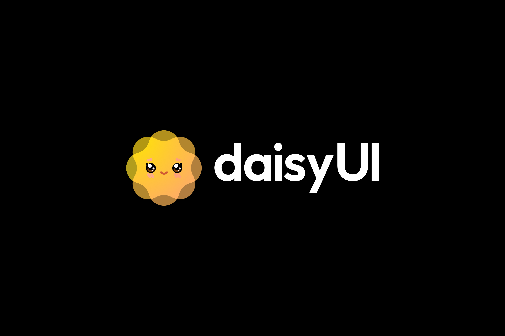

# Cours 3 | DaisyUI

<!-- **Savoirs :** #5 Cadriciel facilitant l'intégration · #6 Réutilisation de composantes -->

{.w-100}

- Installation de DaisyUI par-dessus Tailwind.
- Composantes de base : `btn`, `card`, `navbar`, `modal`, `menu`, `badge`, `alert`.
- Système de thèmes (thèmes prédéfinis, variables de couleurs sémantiques).

<!-- 
/// Introduire vitejs (https://medium.com/@implicitknowledge/vite-without-a-template-2532d6658608)
/// -- retarder ce quil faut retirer avant de commencer.
/// -- Réinstaller milligram
/// -- Trouver un truc qui va faire comprendre pourquoi vitejs est intéressant
///    -- Permet de segmenter un long code en plusieurs petits bouts réutilisables (composantes)
///    -- Environnement de dev et prod (avec le build optimisé)
///    -- Gestion des erreurs dans le developpement
///    -- Hot reload (comme le go live)
/// plugger tailwind
/// faire l'exercice. -->


<!-- 

### :material-numeric-4-box: Installer Milligram sans CDN

Le CDN, c'est du code **hébergé ailleurs**. C'est parfait pour tester, mais c'est pas viable à long terme. On dépend d'un serveur externe et ça devient difficile de gérer les versions par la suite.

Non, la façon contemporaine d'ajouter du code externe est via un _package manager_ comme **npm**.

!!! note "npm est déjà installé au Cégep. Il s'installe **automatiquement** avec [Node.js](https://nodejs.org/fr/download)."

!!! question "Cool cool, mais c'est quoi un _package manager_ ?"

    C'est un **:fontawesome-brands-app-store: App Store**, mais pour développeurs. 

    Au lieu d'aller sur plein de sites différents, de télécharger des fichiers de code, de les copier dans tes dossiers et de gérer les mises à jour toi-même, un _package manager_ le fait pour toi.
    

- [ ] Retirez les `<link>` CDN de `normalize` et `milligram`, mais gardez la ligne de la Google Font.

- [ ] Dans le dossier « Digger », en ligne de commande, exécutez&nbsp;:

    ```bash
    npm install milligram
    ```

    et

    ```bash
    npm install normalize.css
    ```

Trois nouveautés apparaissent dans le projet&nbsp;:

* :material-file-code:**`package.json`**<br>Carte d'identité du projet. Contient la liste de ses librairies installées par `npm`
* :material-file-code:**`package-lock.json`**<br>Versions exactes installées
* :file_folder:**`node_modules/`**<br>Code des librairies téléchargées

### :material-numeric-5-box: Lier les fichiers téléchargés

Le code de Milligram est maintenant **dans notre projet**, sous `node_modules`.

- [ ] Liez au HTML les fichiers téléchargés :

    ```html title="exemple"
    <link rel="stylesheet" href="./node_modules/normalize.css/normalize.css">
    <link rel="stylesheet" href="./node_modules/milligram/dist/milligram.min.css">
    ```

- [ ] Rechargez la page. Vous devriez voir le même résultat qu'avec le CDN.

!!! warning "Un peu fastidieux quand même !"

    Lier chaque fichier à la main depuis `node_modules` ce n'est pas idéal. D'ailleurs, personne fait ça 😆
    
    N'ayez crainte, on ne fera pas ça très longtemps. Un outil comme :simple-vite: **Vite** va bientôt automatiser tout ça.
 -->
